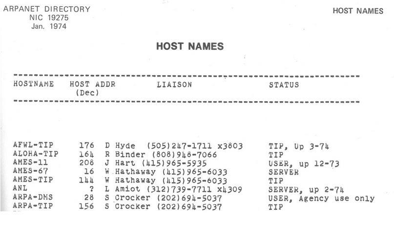
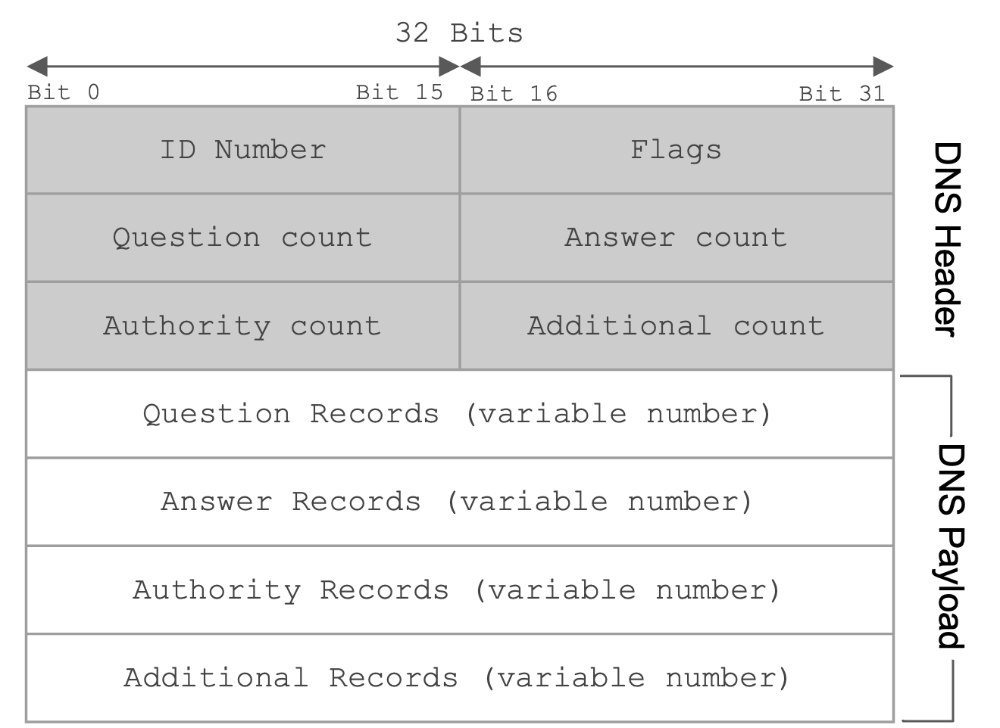
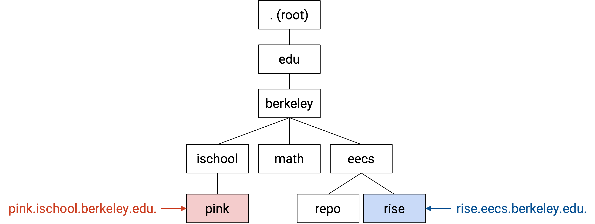
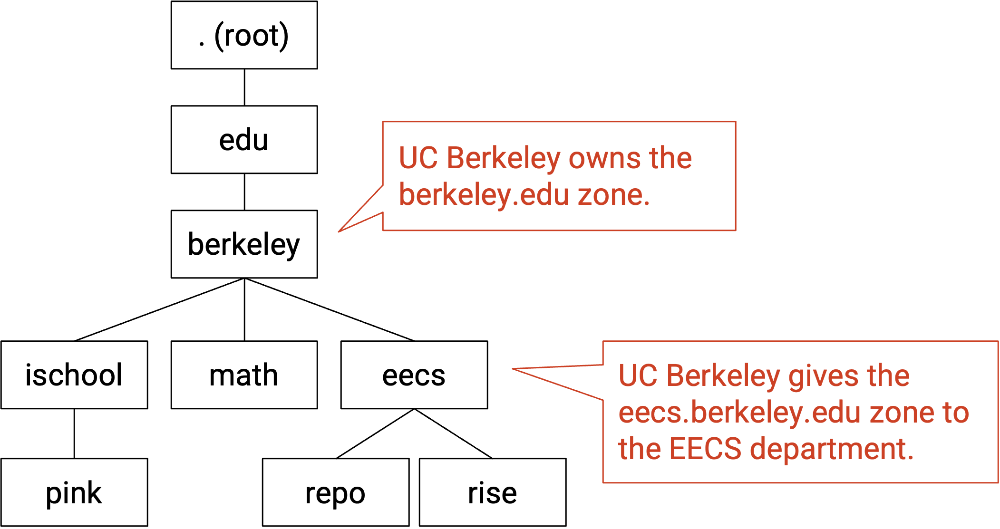
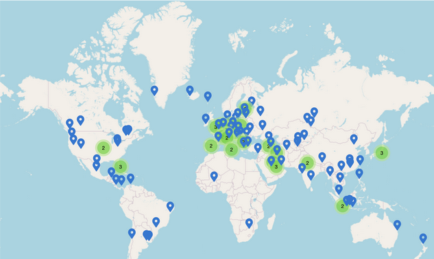

# DNS

## DNS 用来做什么？

在这一节中，我们会介绍几个常见的应用（Layer 7），它们运行在我们目前已经构建出的各层之上。


我们首先要看的应用是 DNS。DNS 是运行在这些层（Layer 1-4）之上的一个 protocol，用来提供 name resolution 这一重要的网络功能。

Internet 通常以两种不同方式建立索引。人类用 `google.com` 和 `eecs.berkeley.edu` 这样的人类可读名称来指代网站，而计算机用 `172.217.4.174` 和 `23.195.69.108` 这样的 IP 地址来指代网站。**DNS**，也就是 **Domain Name System**，就是在两者之间进行转换的 protocol。


## DNS 简史

为了理解 DNS 为什么被设计成现在这样，回顾它的发展历史会很有帮助。

在最初的 Internet 及其前身 ARPANET 上，有三个关键应用。当时还没有 World Wide Web 和 web browser，大多数应用都在命令行中运行。

Remote terminal（telnet）允许用户远程连接到另一台机器，并在那台远程计算机上运行命令。你可能听说过 SSH，它是这个 protocol 的现代安全版本。

File transfer 允许用户在本地计算机和远程计算机之间传输文件。你可能听说过 FTP，它是用于文件传输的 application-level protocol。

Email 允许用户彼此交换消息。现代 email 在浏览器中有 web client，但最初，用户必须在终端中输入类似 `mail alice@46.0.1.2` 的命令，其中 46.0.1.2 是 recipient 的 IP 地址，alice 是那台机器上的 recipient 用户。

在这三种情况下，执行操作都需要指定一台 remote host。但是，正如我们提到的，记住 remote host 的 IP 地址很困难，也不够用户友好。

解决这个问题的第一次尝试，是给每个 IP 地址分配一个 **hostname**。每台计算机都会有一个名为 `hosts.txt` 的文件，把每个 hostname 映射到它的 IP 地址。例如，我们可以把 hostname `ucb-arpa` 映射到 10.0.0.78，并把 `mail mosher@10.0.0.78` 改写成 `mail mosher@ucb-arpa`。

这个概念今天实际上仍然存在。如果你曾经在自己的计算机上启动过 server，它很可能有 IP 地址 127.0.0.1，以及 hostname `localhost`。在浏览器中输入任意一个，都会得到相同结果。

我们必须确保不同计算机上的 `hosts.txt` 是相同的。如果你换到另一台计算机并输入 `mail mosher@ucb-arpa`，你大概仍然应该把邮件发给同一个人。hosts file 最初由一个人（Elizabeth Feinler）维护，并通过实际复制纸质文档的方式在用户之间传递。

最初的纸质 hosts file 是人类可读的。它把 hostname 映射到 address，同时还包含用户全名、他们运行的 protocol（例如 TCP、FTP），甚至电话号码等信息。



所有人都同意（如 1973 年 RFC606 所提到的），这是一种荒谬的状况。如果你拿到这个文件的纸质副本，就必须手动把它输入计算机。另外，这个文件通过纸张传来传去，因此你手中的文件可能已经过期。

第一个改进是把这个列表变成机器可读。这样，我们至少可以不用纸质副本，而是用 FTP 之类的 protocol 来共享这个文件。但这仍然不可扩展。我们不能要求一个人永远维护这个文件。而且，随着文件越来越大，下载文件可能变得很慢；如果网络连接中断，你还可能得到一个不完整的文件。

DNS 最早在 1983 年（RFC882）被提出，用来解决这些问题。之后它经历了一些修改，但基础系统直到今天仍在使用。

趣闻：第一个用于在 Unix 上运行 DNS server 的软件是 BIND（1984，UC Berkeley），它今天仍然相当常见。


## DNS 设计目标

这段简史提示了 DNS 的一些设计目标，我们应该把它们记在心里。

DNS 必须可扩展。Internet 有极大量的 host，每秒都会执行极大量 lookup。host 也会频繁增加和移除。

DNS 必须高可用、轻量、快速。几乎每个 Internet connection 都以一次 DNS lookup 开始，把 host name 转换成 IP 地址。因此，DNS 应该极快，否则每个 connection 都会被拖慢。另外，DNS 不应该有 single point of failure，否则一旦发生故障，Internet 就会停止工作。


## Name Server

如果有一台单一的中心 server，存储每个 domain 到每个 IP 地址的 mapping，并且所有人都可以查询它，那当然很好。但遗憾的是，没有哪台 server 既大到足以存储 Internet 上每个 domain 的 IP 地址，又快到足以处理全世界产生的 DNS request 数量。因此，DNS 使用许多 **name server** 的集合，也就是专门用来回复 DNS request 的 server。

每个 name server 负责某个特定的 domain zone，这样就没有任何单个 server 需要存储 Internet 上的每个 domain。例如，负责 `.com` zone 的 name server 只需要回答以 `.com` 结尾的 domain 查询。这个 name server 不需要存储任何与 `wikipedia.org` 相关的 DNS 信息。同样，负责 `berkeley.edu` zone 的 name server 不需要存储任何与 `stanford.edu` 相关的 DNS 信息。

尽管 name server 有特殊用途（响应 DNS request），但它就像 Internet 上任何其他可以联系的 server 一样：每个 name server 都有一个人类可读的 domain name（例如 `a.edu-servers.net`）和一个计算机可读的 IP 地址（例如 `192.5.6.30`）。注意不要把 domain name 和 zone 混淆。例如，这个 name server 的 domain 中有 `.net`，但它响应的是 `.edu` domain 的 DNS request。


## Name Server 层次结构

你可能会注意到这个设计有两个问题。第一，`.com` zone 虽然比整个 Internet 小，但让一个 name server 存储所有以 `.com` 结尾的 domain 仍然不现实。第二，如果有许多 name server，你的计算机怎么知道该联系哪一个？

DNS 通过引入一个新思想解决这两个问题：当你查询一个 name server 时，name server 不一定总是返回你查询的 domain 的 IP 地址，它也可以把你引导到另一个 name server 去寻找答案。这允许拥有大 zone 的 name server（例如 `.edu`）把你的查询重定向到拥有更小 zone 的其他 name server（例如 `berkeley.edu`）。现在，`.edu` zone 的 name server 不需要存储关于 `eecs.berkeley.edu`、`math.berkeley.edu` 等的任何信息。相反，`.edu` name server 存储关于 `berkeley.edu` name server 的信息，并把对 `eecs.berkeley.edu`、`math.berkeley.edu` 等的请求重定向到某个 `berkeley.edu` name server。

DNS 根据 zone 把所有 name server 组织成一棵树状层次结构：


树顶层的 **root server** 把所有 domain 都放在自己的 zone 中（这个 zone 通常写作 `.`）。树中较低层的 name server 拥有更小、更具体的 zone。


## DNS Lookup（概念）

DNS query 总是从 root 开始。root 会把你的 query 引导到它的某个子 name server。然后你向这个子 name server 发起 query，它又会把你重定向到自己的某个子节点。这个过程会一直重复，直到你查询到知道答案的 name server，它会返回你的 domain 对应的 IP 地址。

为了把你重定向到一个子 name server，父 name server 必须提供这个子节点的 zone、人类可读 domain name 和 IP 地址，这样你才能联系这个子 name server 获取更多信息。

举个例子，对 `eecs.berkeley.edu` 的 DNS query 可能包含以下步骤。（这个 query 的漫画版可以在 [howdns.works](https://howdns.works/) 查看。）


1. 你对 root name server 说：请告诉我 `eecs.berkeley.edu` 的 IP 地址。
2. Root server 对你说：我不知道，但我可以把你重定向到另一个有更多信息的 name server。这个 name server 负责 `.edu` zone。它的人类可读 domain name 是 `a.edu-servers.net`，IP 地址是 `192.5.6.30`。
3. 你对 `.edu` name server 说：请告诉我 `eecs.berkeley.edu` 的 IP 地址。
4. `.edu` name server 对你说：我不知道，但我可以把你重定向到另一个有更多信息的 name server。这个 name server 负责 `berkeley.edu` zone。它的人类可读 domain name 是 `adns1.berkeley.edu`，IP 地址是 `128.32.136.3`。
5. 你对 `berkeley.edu` name server 说：请告诉我 `eecs.berkeley.edu` 的 IP 地址。
6. `berkeley.edu` name server 对你说：好的，`eecs.berkeley.edu` 的 IP 地址是 `23.185.0.1`。

得到答案后，我们可以把它存进 cache，这样如果之后还需要这个 record，就不必再次询问。


## Stub Resolver 和 Recursive Resolver

最初，end host（例如你的计算机）会自己执行 DNS lookup，逐个联系 name server。

今天，你的本地计算机通常会把 DNS lookup 任务委托给 **DNS Recursive Resolver**，由它替你查询 name server。执行 lookup 时，你计算机上的 **DNS Stub Resolver** 会向 recursive resolver 发送 query，让 resolver 完成所有工作，并从 resolver 接收 response。


我们怎样知道 resolver 的 IP 地址？当你第一次连接到 Internet 时，某人可以告诉你 resolver 地址。你也可以手动输入自己想使用的 resolver 地址。

Internet 上一些知名 resolver 包括 1.1.1.1（由 Cloudflare 运行）和 8.8.8.8（由 Google 运行）。它们通常有容易记住的 IP 地址，因此我们不需要用名字来指代它们。否则，我们还得先做一次 DNS lookup 来找到它们的 IP 地址，而这些 server 的目的正是替我们做 DNS lookup。

除了科技公司，ISP 也会运营 resolver，作为它们销售给客户的 Internet service 的一部分。（如果你付费购买了 Internet service，却必须在 web browser 里输入 IP 地址，那会很糟糕。）

你家里的 router 也可以充当 resolver。如果使用一台物理上离你很近的 router，DNS query 可能会更快（你和 router 之间的 delay 更小）。

resolver 的一个主要好处是更好的 caching。resolver 会处理来自许多不同 end host 的 query（不只是你自己的计算机），因此它会建立一个大得多的 cache。如果你向 resolver 查询 `eecs.berkeley.edu`，而在你之前有人最近问过 resolver 同样的问题，resolver 就可以不联系任何额外的 name server，直接给你答案。

注意，尽管 recursive resolver 存储更大的 cache，stub resolver 仍然可以维护自己单独的 cache。有些 query 甚至不用询问 recursive resolver，就可以由 stub resolver 的 cache 回答。


## Redundancy

到目前为止，我们一直在说「`berkeley.edu` name server」，但现实中，每个 zone 都有多个 name server。一个 zone 的所有 name server 在功能上都是相同的，每个 name server 都可以回答该 zone 中的任何 query。

这保证了该 zone 的 availability；如果一个 name server 宕机，其他 name server 仍然可以继续回答该 zone 的 query。按照惯例，zone 被要求拥有两个 name server，尽管实践中大多数 zone 至少会有三个。

通常，其中一个 name server 会被指定为 primary server，真正负责管理该 zone。其余 server 是 secondary mirror server，只存储并提供 primary server 上信息的一份副本。

现在，在 DNS lookup 中，name server 可能会这样回复你：「我不知道，但你应该去问 `.edu` zone。这个 zone 有 13 个 name server。下面是它们各自的 domain 和 IP 地址。」然后，你可以选择接下来联系哪个 name server。


## DNS API

现在我们有了 DNS 的概念图，接下来看看它实际上是如何实现的。

首先，程序员如何使用 DNS 执行 lookup？

执行 DNS lookup 有一些相对简单、常见且稳定的 API。不同语言中的 API 相当类似。

在标准 C library 中，`gethostbyname("foo.com")` 可以用来查找 `foo.com` 对应的 IP 地址。不过，这个函数仅限 IPv4，因此现在已经 deprecated（尽管你仍然会看到它被使用）。

更新后的版本同样位于标准 C library 中，是 `getaddrinfo("example.com", NULL, NULL, &result)`，它会查找 `example.com` 的 IP 地址，并把答案存储在 `result` struct 中。不需要太担心具体细节或额外参数（这里设为 null）。这个替代 API 支持 IPv4 之外的内容（例如 IPv6）。

作为程序员，你不需要担心 recursive resolver 或具体 name server 这类 DNS 复杂性。你只需要调用标准库函数。这些函数通常会向操作系统中的 stub resolver 发起请求。


## DNS 使用 UDP，而不是 TCP

从根本上说，DNS 是一个 client-server protocol。一个人（client）发送问题，另一个人（server）发送答案。client 通常是用户 host 或 recursive resolver，而 server 通常是 name server。client 和 server 应该如何格式化它们的消息？

DNS 使用 UDP（best-effort packet，没有 TCP handshake）来保持轻量和快速。我们不必等待 3-way TCP handshake 完成。我们也不关心 packet 是否按顺序到达，因为 query 和 response 通常都能放进单个 UDP packet。

使用 UDP 时，server 不需要为每个 connection 保持状态（对比 TCP，server 必须维护 buffer）。每个 packet 都可以独立处理。这也帮助 DNS 保持轻量，因为 name server 会收到大量 request，如果每个 request 都打开一个新 connection，代价会很高。

如何处理 UDP 不可靠、packet 可能被丢弃的问题？我们可以用简单的 retry 机制解决。如果在某个时间限制内没有收到 reply，就再次发送 query。timeout 在不同操作系统中有所不同，不过可能相当慢。

UDP 不可靠且 timeout 较慢，正是为什么拥有一个距离近且可靠可联系的 resolver 很重要。例如，家里 router 上的 resolver 离你很近，而且大概相当可靠（家庭网络中不会有太多 congestion）。你也可以通过拥有多个 backup resolver 来提高可靠性（例如家庭 router 和 8.8.8.8）。

正如我们提到的，DNS query 和 response 通常能放进单个 packet。一个值得注意的例外，是在 primary name server 和 secondary name server 之间传输 zone 时。secondary name server 必须说：把你的所有 record 给我，这样我才能帮助你提供服务。response 可能会非常大，因此这些 transfer 通常通过 TCP 完成。

DNS 的近年发展加入了安全功能（例如阻止攻击者在传输途中修改 record），这也可能要求从 UDP 切换到 TCP。

回忆一下，UDP 实现了 port，以支持同一台 server 上的多个应用。按照惯例，所有 name server 都在 UDP port 53 上监听 DNS query。这个 port number 是 well-known 且固定的，因此所有人都能联系到 name server 上正确的 port。


## DNS Message Format



第一个 field 是 16 bit 的 **identification field**，它针对每个 query 随机选择，用来把 request 与 response 匹配起来。发送 DNS query 时，ID field 会填入随机 bit。由于 UDP 是 stateless 的，DNS response 必须在 ID field 中发回相同的 bit，这样原始 query sender 才知道这个 response 对应哪一个 DNS query。

接下来的 16 bit 保留给 flag。QR bit 指定这条 message 是 query（bit 为 0）还是 response（bit 为 1）。RD bit 表示你希望 resolver 执行 recursive lookup，还是只返回 name server 所说的内容（即使它说「我不知道」）。

理论上，你可以在 flag 中指定 query type，不过 `IQUERY` type 已经过时，`STATUS` type 也没有真正定义，因此 `QUERY` type 基本用于所有情况。

flag 还可以指定 query 是否成功（例如，如果 query 成功，reply 中会设置 `NOERROR` flag；如果 query 询问了一个不存在的名字，reply 中会设置 `NXDOMAIN` flag）。

下一个 field 指定问题数量（实践中总是 1）。之后的三个 field 用于 response message，指定 message 中包含的 **resource record**（RR）数量。我们稍后会深入描述这些 RR 类别。

message 的其余部分包含 DNS query/response 的实际内容。这些内容始终组织为一组 RR，每个 RR 都是带有相关 type 的 key-value pair。

为了完整性，DNS record key 形式上定义为一个 3-tuple `<Name, Class, Type>`，其中 `Name` 是实际 key data，`Class` 对 Internet 总是 `IN`（除了用于获取 DNS 本身信息的特殊 query），`Type` 指定 record type。DNS record value 包含 `<TTL, Value>`，其中 `TTL` 是 time-to-live（record 可以被 cache 的时间，单位为秒），`Value` 是实际 value data。

DNS 中有三种主要 record 类型。**A type record** 把 domain 映射到 IPv4 地址。key 是 domain，value 是 IP 地址。类似地，`AAAA type records` 把 domain 映射到 IPv6 地址。**NS type record** 把 zone 映射到 domain。key 是 zone，value 是 domain。

你有时可能会遇到 `CNAME` type record，它用于 aliasing 或 redirecting。name 和 value 都是 domain，这个 record 表示这两个 domain 拥有相同的 IP 地址。

本节重要结论：每个 DNS packet 都有一个 16-bit random ID field、一些 metadata，以及一组 resource record。每个 record 属于四个类别之一（question、answer、authority、additional），并且每个 record 包含 type、key 和 value。存在 A type record 和 NS type record。


## DNS Lookup（实现）

现在，我们来走一遍真实的 DNS query，查询 `eecs.berkeley.edu` 的 IP 地址。你可以在家用 [`dig` utility](https://en.wikipedia.org/wiki/Dig_(command)) 试试这个过程。记得设置 `+norecurse` flag，这样你才能自己展开 recursion。

每个 DNS query 都从 root server 开始。root server 的名字和 IP 地址通常以 root hints file 的形式硬编码在 resolver 中。如果你好奇，这里有一个 root hints file：[https://www.internic.net/domain/named.root](https://www.internic.net/domain/named.root)。

第一个 root server 的 domain 是 `a.root-servers.net`，IP 地址是 `198.41.0.4`。我们可以用 `dig` 向这个地址发送 DNS request，询问 `eecs.berkeley.edu` 的 IP 地址。

```
$ dig +norecurse eecs.berkeley.edu @198.41.0.4

;; Got answer:
;; ->>HEADER<<- opcode: QUERY, status: NOERROR, id: 26114
;; flags: qr; QUERY: 1, ANSWER: 0, AUTHORITY: 13, ADDITIONAL: 27

;; QUESTION SECTION:
;eecs.berkeley.edu.          IN   A

;; AUTHORITY SECTION:
edu.                172800   IN   NS   a.edu-servers.net.
edu.                172800   IN   NS   b.edu-servers.net.
edu.                172800   IN   NS   c.edu-servers.net.
...

;; ADDITIONAL SECTION:
a.edu-servers.net.  172800   IN   A    192.5.6.30
b.edu-servers.net.  172800   IN   A    192.33.14.30
c.edu-servers.net.  172800   IN   A    192.26.92.30
...
```

在 answer 的第一部分中，我们可以看到 header information，包括 ID field（`26114`）、返回 flag（`NOERROR`），以及每个 section 中返回的 record 数量。

**question section** 包含 1 条 record（你可以通过 header 中的 `QUERY: 1` 验证）。它的 key 是 `eecs.berkeley.edu`，type 是 `A`，value 为空。这表示我们查询的 domain（value 为空，因为我们还不知道对应的 IP 地址）。

**answer section** 为空（header 中 `ANSWER: 0`），因为 root server 没有直接回答我们的 query。

**authority section** 包含 13 条 record。第一条的 key 是 `.edu`，type 是 `NS`，value 是 `a.edu-servers.net`。这是 root server 在告诉我们下一个可以联系的 name server 的 zone 和 domain name。这个 section 中的每条 record 都对应一个我们接下来可以询问的潜在 name server。

注：通常，名字最靠前（按字母或数字排序）的 server 是 primary server（这里是 `a.edu-servers.net`），其余是 mirror。另外，注意多条 record 拥有相同 name（`.edu`）是没问题的。这只是告诉我们有多个 name server 都能回答这个 zone 的 query。

**additional section** 包含 27 条 record。第一条的 key 是 `a.edu-servers.net`，type 是 `A`，value 是 `192.5.6.30`。这是 root server 通过把 authority section 中的一个 domain 映射到 IP 地址，告诉我们下一个 name server 的 IP 地址。

authority section 和 additional section 合在一起，给出了下一个 name server 的 zone、domain name 和 IP 地址。这些信息分散在两个 section 中，是为了保持 DNS message 的 key-value 结构。

为了完整性：`172800` 是每条 record 的 TTL（time-to-live），这里设置为 172,800 秒，也就是 48 小时。`IN` 是 Internet class，基本可以忽略。有时你会看到 type 为 `AAAA` 的 record，它们对应 IPv6 地址（常见的 `A` type record 对应 IPv4 地址）。

Sanity check：我们接下来查询哪个 name server？我们怎么知道那个 name server 位于哪里？我们向那个 name server 查询什么？\footnote{查询 `a.edu-servers.net`，我们通过 additional section 中的 record 知道它的位置。和之前一样，查询 `eecs.berkeley.edu` 的 IP 地址。}

```
$ dig +norecurse eecs.berkeley.edu @192.5.6.30

;; Got answer:
;; ->>HEADER<<- opcode: QUERY, status: NOERROR, id: 36257
;; flags: qr; QUERY: 1, ANSWER: 0, AUTHORITY: 3, ADDITIONAL: 5

;; QUESTION SECTION:
;eecs.berkeley.edu.           IN   A

;; AUTHORITY SECTION:
berkeley.edu.        172800   IN   NS   adns1.berkeley.edu.
berkeley.edu.        172800   IN   NS   adns2.berkeley.edu.
berkeley.edu.        172800   IN   NS   adns3.berkeley.edu.

;; ADDITIONAL SECTION:
adns1.berkeley.edu.  172800   IN   A    128.32.136.3
adns2.berkeley.edu.  172800   IN   A    128.32.136.14
adns3.berkeley.edu.  172800   IN   A    192.107.102.142
...
```

下一次 query 的 answer section 同样为空；authority section 中的 `NS` record 和 additional section 中的 `A` record 给出了负责 `berkeley.edu` zone 的 name server 的 domain 和 IP 地址。

```
$ dig +norecurse eecs.berkeley.edu @128.32.136.3

;; Got answer:
;; ->>HEADER<<- opcode: QUERY, status: NOERROR, id: 52788
;; flags: qr aa; QUERY: 1, ANSWER: 1, AUTHORITY: 0, ADDITIONAL: 1

;; QUESTION SECTION:
;eecs.berkeley.edu.         IN   A

;; ANSWER SECTION:
eecs.berkeley.edu.  86400   IN   A   23.185.0.1
```

最后，最后一次 query 以 answer section 中一条 `A` type record 的形式，给出了 `eecs.berkeley.edu` 对应的 IP 地址。

实践中，由于 recursive resolver 会尽可能 cache 许多答案，大多数 query 可以跳过前几个步骤，使用 cached record，而不是每次都询问 root server 和 `.edu` 这类高层 name server。Caching 帮助 DNS 加速，因为把 domain name 转换成 IP 地址所需发送的 network packet 更少了。Caching 也帮助减少最高层 name server 上的 request load。

现在我们已经知道 DNS 如何实现 query 支持，接下来可以看看 DNS 在实践中实际上如何工作，并探索 DNS 在现实世界中的商业侧面。


## DNS Authority Hierarchy

我们画出的树状层次结构实际上代表了 DNS 中三种不同的层次性。

正如我们已经看到的，DNS name 是层次化的。这就是为什么我们的 domain name（例如 `eecs.berkeley.edu`）是用点分隔的多个单词。



我们也看到，DNS infrastructure 是层次化的。我们可以把 name server 组织成树状层次结构，其中每个 name server 只知道树中属于自己的一部分。



我们要介绍的第三种层次是 authority。它告诉我们谁定义了树中存在的 name。例如，运营 `.edu` name server 的组织负责 `.edu` zone 中的所有 domain。`.edu` 组织随后可以把自己 zone 中某些部分的 authority 委托给树中的下级。

例如，`.edu` 组织可以说：`berkeley.edu`（以及所有 subdomain）在我的 zone 中，但我会把我这个 zone 中这一部分的控制权转交给 UC Berkeley 组织。现在，我们创建了一个由 UC Berkeley 拥有的新 zone，而 `.edu` 组织不需要了解这个新 `berkeley.edu` zone 中的更新。UC Berkeley 有 authority 在自己的 zone 中创建新 domain，或者进一步把自己 zone 的某些部分委托给下级组织。


当我们带着这三种层次结构来画这棵树时，可以更精确地说，每个 node 代表一个 zone。zone 在形式上定义为负责层次结构中某一部分的 administrative authority。

从 naming 的角度看，每个 zone 包含一个或多个 name-IP mapping，其中 name 是该 zone 的 subdomain。`eecs.berkeley.edu` zone 可以包含 name `eecs.berkeley.edu` 或 name `iris.eecs.berkeley.edu`，但不能包含 name `math.berkeley.edu`。

从 infrastructure 的角度看，这个 zone 由一个或多个 name server 支持，它们回答关于该 zone 中 domain 的 query。

从 authority 的角度看，这个 zone 由某个组织控制，该组织从其 parent 获得管理该 zone 中 name 的 authority。例如，控制 `berkeley.edu` zone 的 UC Berkeley 可以把 `eecs.berkeley.edu` zone 委托给 EECS department。


## 实践中的 DNS Zone

现实生活中，这些组织是谁？


root zone 由 ICANN（Internet Corporation for Assigned Names and Numbers）控制。它们负责把 root zone（代表整个 Internet）的部分委托给特定的 top-level domain。

树中 root 下面的所有 zone 都是 **top-level domain（TLD）**。Internet 最初在美国发展，因此最早的 TLD 按用途把 Internet 划分为不同 zone，例如 .com（commercial）、.gov（government）、.edu（education）和 .mil（military）。后来，国家 TLD 被创建出来，例如 .fr（France）和 .jp（Japan）。

历史上，TLD 数量相对较少。更近一些，ICANN 开始以 \$150,000 的注册价格（外加持续维护成本）出售新的 TLD，这导致新 TLD 数量爆炸式增长。截至 2024 年，TLD 已超过 1,500 个，包括 .google 这类公司专属 TLD，以及 .travel 或 .pizza 这类更奇特的 TLD。

每个 TLD 都由某个组织运行，该组织可以决定如何进一步划分这个 TLD 的结构。例如，.uk TLD 由 Nominet 管理，它们决定按用途划分 .uk zone，创建了 .co.uk（commercial）、.ac.uk（academia）等 zone。

树中更低层的 zone 可以按深度来称呼。example.com 是 second-level domain，blog.example.com 是 third-level domain。这些 zone 通常由各种组织和公司控制，它们从 parent zone 购买这些 zone。当你购买一个 zone 时，还需要告诉 parent zone 你使用的 name server。这样 parent zone 才能把用户重定向到你的 name server。

树中更低层的 name server 通常由 domain name registrar 运行。registrar 是拥有特定 zone 的公司，并允许用户在该 zone 中的特定 domain 上托管服务。例如，我可以每月付费，把自己的网站托管在 `blog.foo.com` 上。registrar 通常会提出把对应的 domain-to-IP mapping 添加到它的 name server 中。

除了 registrar，Google 这样的公司也可能为自己的应用运行自己的 name server（例如提供 `maps.google.com` 的 record）。Amazon Web Services 也有一个名为 Route 53 的 name server，用户可以在其中添加要提供的 record。


## 用 Anycast 保证 Root Server 可用性

如果 root server 不可用，会非常糟糕。cache 为空的人将无法发起任何 DNS request。最终，随着 TTL 过期，所有人的 cache 都会清空，Internet 会停止工作。

为了 redundancy，全球分布着 13 个 root server。我们可以查到这些 root server 的 [IP 地址](https://www.iana.org/domains/root/servers)，它们是公开且 well-known 的。

考虑到整个 Internet 都依赖它们，13 个听起来仍然有点少。为了提供极高的 availability，实际上的 root server 远不止 13 个，但列表中只包含 13 个 IP 地址，这是因为一个聪明技巧：anycast。

在 **anycast** 技巧中，我们部署一个 root server 的许多 mirror，并让它们全部使用同一个 IP 地址。如果你联系 domain `k.root-servers.net` 或它对应的 IP 地址，你可能正在和它的任意一个 mirror 通信。

13 个 root server 中的每一个实际上都由一组 mirror 组成。例如，`f.root-servers.net` 有超过 3,000 个 instance。这些 mirror 可以由不同 network operator 运行（例如 Google 和 Cloudflare 可能会帮助运行 root mirror）。

为了实现 anycast，在 routing protocol 期间，每个 mirror 都 announce 同一个 IP 地址。其余 routing protocol 仍然照常工作。你可能听到许多到 `k.root-servers.net` 的 route announcement，并且可以接受其中任意一个，最终你会把 packet route 到某个 mirror。如果其中一个 mirror 宕机，其余 mirror 仍然在发送 announcement，你可以接受另一条 route 来维持 availability。

anycast 也意味着即使 mirror 被增加或移除，root IP 也很少改变。因此，root hints file 中 root name server 的 record 拥有非常长的 TTL（42 天）。



这里是一张 `k.root-servers.net` 所有 mirror 的地图。它们都 advertise 同一个 IP 地址，而你的 router 大概率会选择和最近的 mirror 通信。`k.root-servers.net` 由 RIPE（欧洲）运营，这也许解释了为什么欧洲有这么多 mirror。

像 Google 的 8.8.8.8 这样的 public resolver 也可以通过 anycast 获得高 availability。


## Email 中的 DNS

DNS 可以存储和提供的不只是 domain-to-IP mapping。例如，如果你想向 `evanbot@berkeley.edu` 这样的地址发送 email，你的计算机仍然需要知道该把 packet 发到哪里。

为了把 email address 转换成 mail server，我们可以使用 `MX` type record。这些 record 把 `berkeley.edu` 这样的 domain 映射到 `aspmx.l.google.com` 这样的 mail server。注意，mail server 位于不同 zone 是没问题的（例如这里，UC Berkeley 的 mail server 由 Google 运营）。

历史上，一个 email address 对应某台特定机器上的用户，因此 mail server 就是那台机器。如今，你大概希望能从任何地方访问自己的 email。这就是为什么 MX record 会映射到 `aspmx.l.google.com` 这样的 mail server：它们接收你的邮件，并让你能从任意计算机访问邮件。

MX record 的一个关键区别是，value 中还包含 priority。如果你收到多个 MX record，它们都把同一个 domain 映射到不同 mail server，那么你应该先尝试 priority 最高（数字最小）的 mail server。


## 用 DNS 做 Load Balancing

我们在演示中看到，最终的 name server 返回了一条 `A` type record，但实际上可能收到多条 `A` type record，把同一个 domain 映射到多个 IP 地址。这些 record 没有顺序，server 也可能在返回前打乱顺序。它们中的任何一个都是有效的，client 可以选择其中任意一个（通常是第一个）。提供多个 IP 地址对 load-balancing 和 redundancy 很有用。

name server 也可以根据 query 的发送者以及 query 从哪里发来，返回不同的 `A` type record。如果我们想把 `www.google.com` 这样热门 domain 的 load 分散到多台 server 上，这会很有用。例如，我们可以尝试把用户发送到最近的 server。

name server 现在需要额外的（可能是 proprietary 的）逻辑，来决定在 reply 中发送哪些 record。name server 可以检查 recursive resolver 是谁。它也可以检查 end client 是谁，不过这需要扩展 DNS，让 resolver 的 query 包含 client address。它甚至可以检查 end user 的地理位置，不过这需要某种 IP 地址到物理位置的 mapping。MaxMind 这样的 commercial database 可以把 IP 地址映射到物理位置。

基于用户地理位置的 load balancing 并不完美。即使我们知道 server 的物理位置和用户的物理位置，也必须猜测从网络角度看哪个 server 最近。我们也不知道用户和不同 server 之间的性能（例如 network bandwidth）。


下面是一个实验，用来观察 Google 的 geographic load balancing 表现如何。我们在 San Francisco 和 Oregon 查询 `www.google.com`，得到了两个不同的 IP 地址。

然后，我们做 reverse lookup，把每个 IP 地址匹配到具体的 server name（每台 server 不同，不是 `www.google.com`）。结果是一个 `PTR` type record，它把 IP 地址映射到 name（与 `A` type record 相反）。我们可以看到，Google 在 San Francisco 给我们的 IP 地址映射到某台名为 `sfo03s25` 的 server。假设 `sfo` 代表 San Francisco，这相当不错！

如果看 latency，从 San Francisco 计算机连接到提供给 San Francisco 的 IP 地址需要 20 ms，而从 San Francisco 计算机连接到提供给 Oregon 的 IP 地址需要 35 seconds。Google 很好地给 San Francisco 计算机分配了一台更近的 server！
