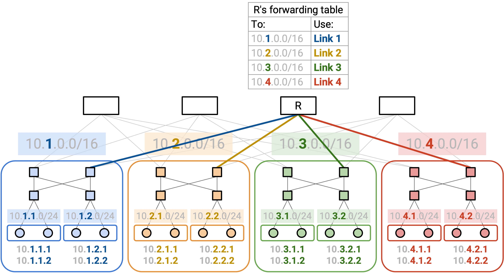

# Datacenter Addressing

## 为什么 Datacenter 不同？

在上一节中，我们看到，可以修改 distance-vector 和 link-state routing protocol，让它们计算穿过 datacenter network 的所有 path。

不过，这些 protocol 在 datacenter 中可能扩展性很差。在 distance-vector protocol 中，我们必须为每个 destination 做 announcement，这意味着需要通告 100,000+ 个 destination。在 link-state protocol 中，我们必须沿每条 link flood advertisement，而在拥有大量 link 的 Clos network 中，这种做法扩展性很差。另外，回忆一下，datacenter topology 通常使用便宜的 commodity switch，它们的内存和 CPU 资源有限（例如 forwarding table 不能太大）。

在通用网络中，我们通过引入 hierarchical IP addressing 解决了这些扩展性问题。更高层级的组织（例如国家级组织）可以把地址范围分配给更小的组织（例如大学）。Datacenter 并没有可以用来组织地址的地理和组织层级。

不过，在 datacenter 中，我们可以利用 operator 控制网络物理 topology 这一事实，根据 server 在建筑中的位置分配地址。我们也可以利用 topology 具有某种规则结构这一事实（例如我们大概率会把 server 组织成一排排，而不是随机塞进建筑里）。

## Topology-Aware Addressing

在这个特定 topology 中，rack 在建筑里被物理组织成不同 pod。一种自然的方法，是给每个 pod 分配一个地址范围。然后，每个 pod 可以给 pod 内的每个 rack 分配子范围。最后，每个 rack 可以给每台 server 分配一个单独的 IP address。

Operator 知道每个 rack 中有多少 server，以及每个 pod 中有多少 rack，因此我们可以用这些信息分配大小合适的地址范围。例如，一个 rack 可以收到一个 /24 range，为它的 server 提供 256 个地址。

这种分配方法让我们可以 aggregate route，并在 forwarding table 中存储更少 entry。例如，考虑图顶部的一个 spine router。这个 router 不需要记住每一台 server 的 path。相反，forwarding table 只需要 4 个 entry，每个 pod 一个。当 packet 到达时，router 检查前 16 bit，把 packet 转发到对应的 pod。

Route aggregation 还会带来更高稳定性。如果某个具体 rack 内添加或移除 host，spine router 不需要知道。只要我们维持相同的 addressing scheme，现有 forwarding table 不做任何修改仍然正确。因此，routing update 通常在 link 和 switch failure 时发生，而不是在 host failure 时发生。

根据 datacenter topology 分配地址有利于扩展，但也有一些限制。特别是，如果我们把一台 server 移到另一个位置，就必须改变它的地址。
