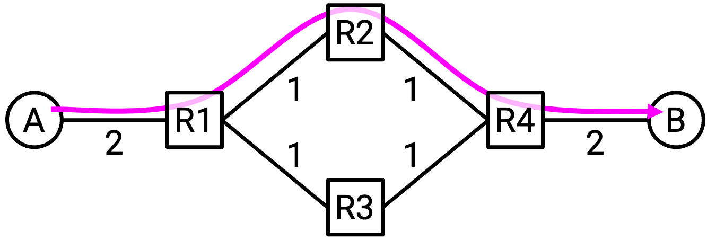
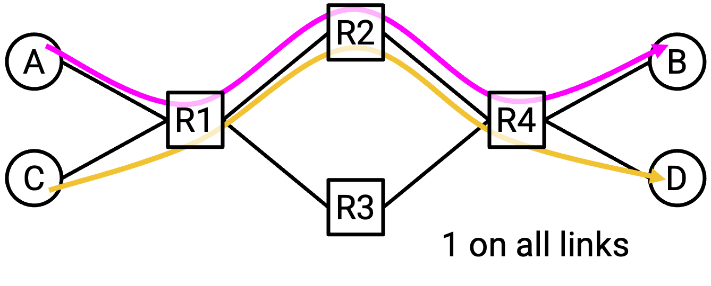
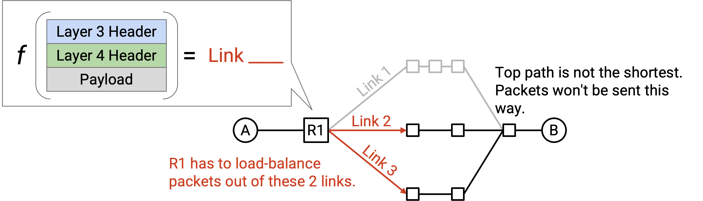
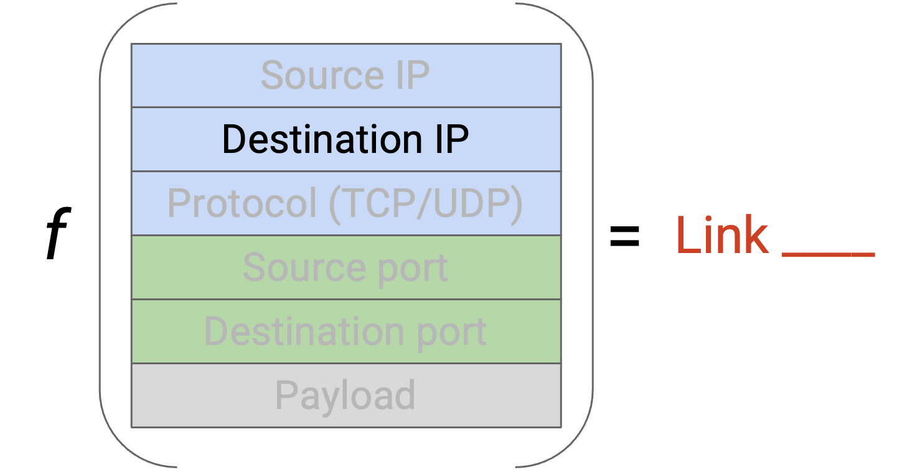
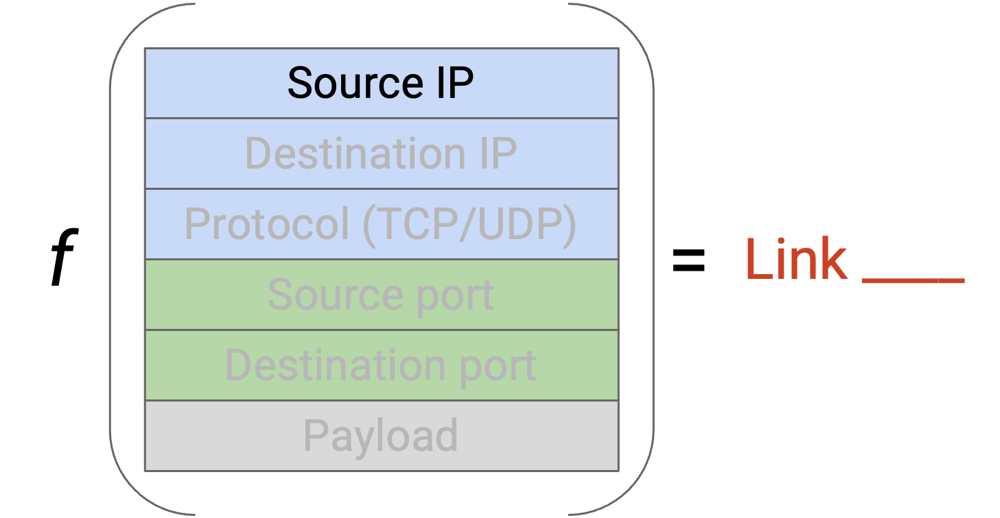
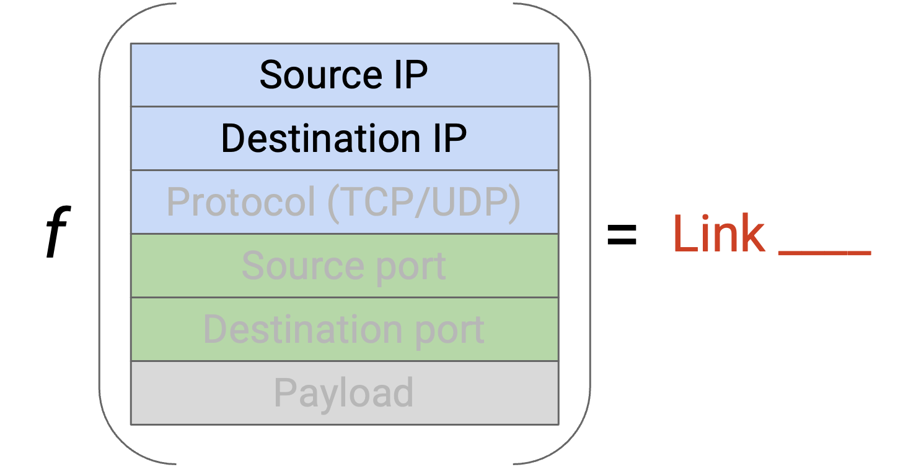
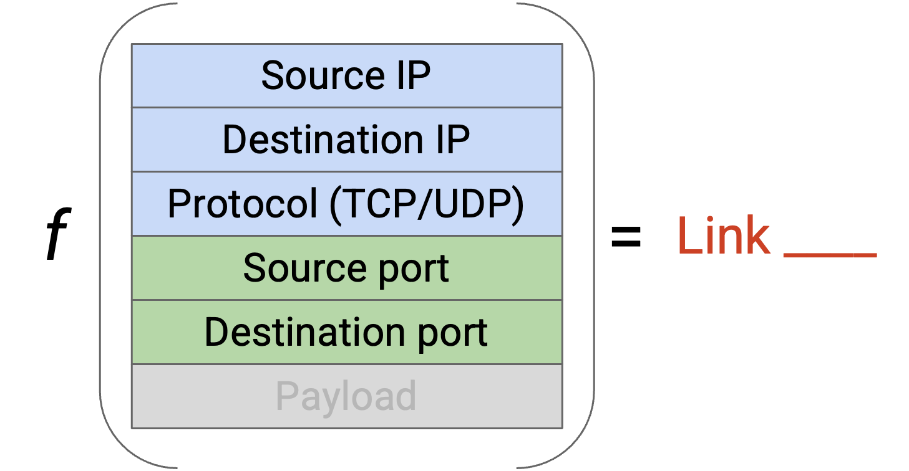
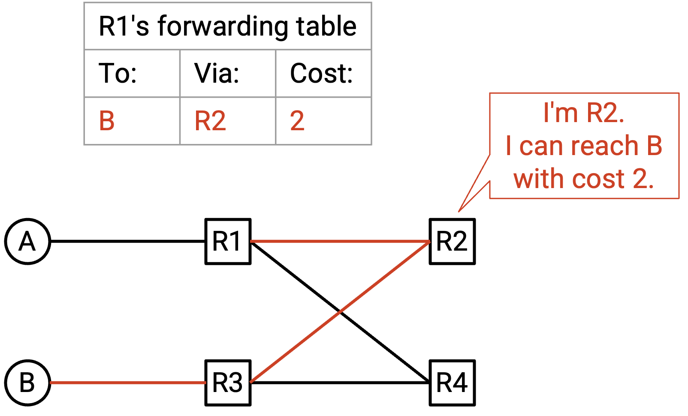
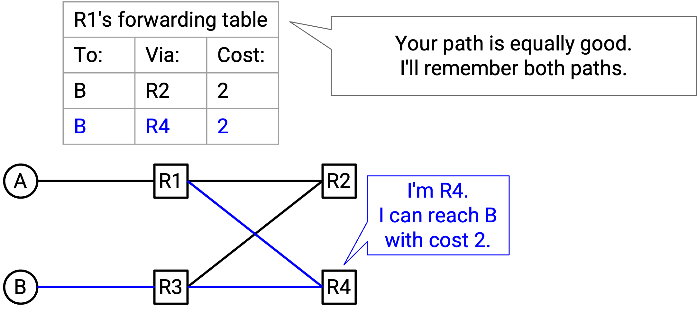

# Datacenter Routing

## 为什么 Datacenter 不同？

在上一节中，我们设计了 Clos network，它在 server 之间创建了许多 path。Server 可以通过使用网络中的不同 path，以高 bandwidth 同时通信。

如果把我们的标准 routing algorithm 应用到这些 network topology 上，会出现什么问题？

到目前为止，我们的 routing protocol 会在 source 和 destination 之间选择一条 path。如果所有 traffic 都使用同一条 path，我们就没有利用 Clos network 中额外的 link。理想情况下，我们希望修改 routing protocol，让一个 packet 可以在相同 endpoint 之间使用多条 path。

假设 A 和 B 有 200 Gbps 的 uplink bandwidth，而 switch-to-switch link 有 100 Gbps 的 bandwidth。如果 A 和 B 之间的所有 traffic 都被迫走绿色 path，我们就让红色 path 闲置了。如果允许 packet 走不同 path，我们本来可以用 full rate 发送数据。

另外，如果同时有多个 connection，我们希望这些 connection 使用不同 path，以最大化 bandwidth。

假设所有 link 都有 100 Gbps bandwidth。在这个例子中，多个 connection 正在竞争 bandwidth。如果 A-B 和 C-D connection 都选择同一条 path，R1-R2 和 R2-R4 link 就会被过度使用（在 100 Gbps 容量上承载 200 Gbps）。如果 A-B 和 C-D 使用不同 path，我们本来可以用 full rate 发送数据。

## Equal Cost Multi-Path（ECMP）Routing

在 **equal cost multi-path（ECMP，等价多路径）** routing 中，我们的目标是找出所有 shortest path（具有相同 cost），并在这些 path 之间对 packet 做 load-balance。

如果一个 packet 到达 router，但存在多个 outgoing link，它们都是有效的 shortest path，router 应该选择哪条 link？Router 需要某个函数（可以把它想成一段代码），它接收一个 packet，并输出一个 link 选择。这个函数应该能够把 traffic 正确地 load-balance 到这些 equal-cost path 上。

一种可能策略是 round-robin。如果有两条 shortest-path outgoing link，我们的函数可以规定：所有奇数 packet 走 Link 1，所有偶数 packet 走 Link 2。

这种方法有什么问题？Equal-cost path 不一定意味着所有 path 都有相同 latency。（记住，cost 是由 operator 用自己喜欢的任意 metric 定义的。）如果把所有奇数 packet 发到慢 link，把所有偶数 packet 发到快 link，那么 TCP recipient 可能会先收到所有偶数 packet，再收到奇数 packet。TCP 关心 packet reordering，所以 recipient 会被迫 buffer 这些偶数 packet，直到缺失的奇数 packet 到达，导致性能变差。

更聪明的策略是查看一些 packet header field，并用这些 field 做出某种确定性的 link 选择。我们可以查看哪些 field？

我们可以使用 destination IP 在 shortest link 之间选择。（反正 routing 本来就已经在使用 destination IP。）但是，如果很多 source 都向同一个 destination 发送 packet，会怎样？所有 packet 都有相同的 destination IP，因此都会映射到同一条 shortest link。这样就没有把 packet load-balance 到多条 shortest link 上。

如果用 source IP 在 shortest link 之间选择呢？如果一个 source 正在向很多 destination 发送 packet，也会有类似问题。所有 packet 都有相同 source，所以它们都会映射到同一条 shortest link。

我们可以不只看一个 field，而是同时查看 source IP 和 destination IP。为了在 shortest link 之间 load-balance，我们可以对 source 和 destination IP 做 hash，并把得到的 hash 映射到一条 link（类似 hash table 的工作方式）。Source 和 destination IP 合在一起包含足够的 entropy，可以避免前面的问题：许多具有相同 source 或相同 destination 的 connection 被映射到同一条 link。

我们还有一个问题：如果同一个 source 和 destination 之间有多个大型 connection，会怎样？我们不希望所有这些 connection 都映射到同一条 link。为了解决这个问题，我们还可以查看 TCP 或 UDP header 中的 source port 和 destination port。

更一般地说，我们描述的所有问题（TCP connection 中的 reordering、太多 connection 落在同一条 link 上）都可以通过把每个 connection 放到单独 link 上来解决。为了唯一标识一个 connection，我们需要一个 5-tuple：`(source IP, destination IP, protocol, source port, destination port)`。注意，我们需要 protocol 来区分使用相同 IP/port 的 TCP 和 UDP connection。两个 packet 属于同一个 connection，当且仅当它们具有相同的 5-tuple。

通过对全部 5 个值做 hash，我们可以确保同一个 connection 中的 packet 使用同一条 path（避免 reordering 问题），并且可以把 connection load-balance 到不同 path 上。这种方法有时称为 **per-flow load balancing（按 flow 负载均衡）**。现代 commodity router 通常内置支持读取这 5 个值。

Per-flow load balancing 确保每条 link 被大致相同数量的 connection 使用，不过它不会考虑 connection 大小不同。考虑 connection size 在技术上是可能的，但代价更高（router 必须做更多工作），收益却不大（per-flow 已经能很好地平衡不同大小的 connection），因此实践中通常不会这么做。

## Multi-Path Distance-Vector Protocol

为了最大化 bandwidth，我们应该沿不同 path 发送 packet，即使它们去往相同 destination（例如这些 packet 属于不同 connection）。这意味着我们必须修改 routing protocol，让 router 学到所有 shortest path，而不只是一条。

在标准 distance-vector protocol 中，如果我们收到一条新 path 的 advertisement，而它的 cost 等于已知最佳 cost，我们不会接受这条新 path。但是，为了记住所有 least-cost path，我们实际上应该接受这条 equal-cost path，并把两条 path 都存到 forwarding table 中。在 forwarding table 中，一个 destination 现在可以映射到多个 next hop，只要它们都具有相同的最小 cost。

在这个例子中，R1 同时收到来自 R4 和 R3 的 advertisement，两者都宣称自己可以用 2 hop 到达 B。我们的 forwarding table 会把 R4 和 R3 都存为可能的 next hop，二者都有相同的最小 cost 3。

转发 packet 时，router 对 5-tuple 做 hash，把大约一半 connection 转发给 R3，另一半转发给 R2。

## Multi-Path Link-State Protocol

在 link-state protocol 中，我们会 flood advertisement，让每个人都有完整的网络图。通常，每个 node 会计算到每个 destination 的一条 shortest path，用来填充 forwarding table。为了支持多条 path，我们需要让每个 node 改为计算到每个 destination 的所有 shortest path。

和修改后的 distance-vector protocol 一样，forwarding table 现在可以为给定 destination 包含多个 next-hop。
