# Datacenter Topology

## What is a Datacenter?

到目前为止，在我们的 Internet 模型中，我们展示的是 end host 彼此发送 packet。end host 可能是一台 client machine（例如你的本地计算机），也可能是一台 server（例如 YouTube）。但是，YouTube 真的是 Internet 上一台单独的机器，在为全世界提供视频服务吗？

现实中，YouTube 是一整栋由互联机器组成的建筑，这些机器协同工作，为 client 提供视频服务。所有这些机器都在同一个本地网络中，可以相互通信以完成请求（例如，你请求的视频可能存储在不同机器上）。

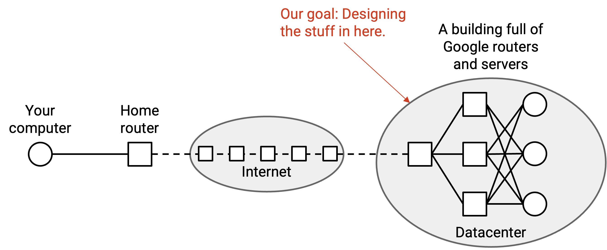

回忆一下，在 Internet 的 network-of-networks 模型中，每个 operator 都可以自由管理自己的本地网络。在本节中，我们会关注一种专门用于连接 datacenter 内 server 的本地网络（而不是连接你的个人计算机这类用户设备）。我们会讨论这些本地网络独有的挑战，以及专门设计来在 datacenter 场景中良好运作的网络问题解决方案（例如 congestion control 和 routing）。

在现实中，datacenter 位于一个物理地点，通常建在专门的场地上。除了计算基础设施（例如 server），datacenter 还需要冷却系统、电力供应等支撑基础设施，不过这里我们会聚焦于连接 server 的本地网络。

Datacenter 为 application 提供服务（例如 YouTube 视频、Google 搜索结果等）。这是你可能想要通信的 end host 所在的基础设施。注意，这不同于我们之前见过的 Internet 基础设施。前面我们见过 carrier hotel，它们是许多网络（由不同公司拥有）用高性能 router 互联的建筑。这类基础设施负责让 router 把你的 packet 转发到各个 destination，但 application 通常并不托管在 carrier hotel 中。

一个 datacenter 通常由单个组织拥有（例如 Google、Amazon），而这个组织可以在同一个 datacenter 中托管许多不同 application（例如 Gmail、YouTube 等）。这意味着该组织可以控制 datacenter 本地网络内的所有网络基础设施。

我们的重点是现代 hyperscale datacenter，也就是由 Google 和 Amazon 这类科技巨头运营的大规模 datacenter。巨大的规模会带来一些独特挑战，不过我们看到的概念也适用于更小的规模。

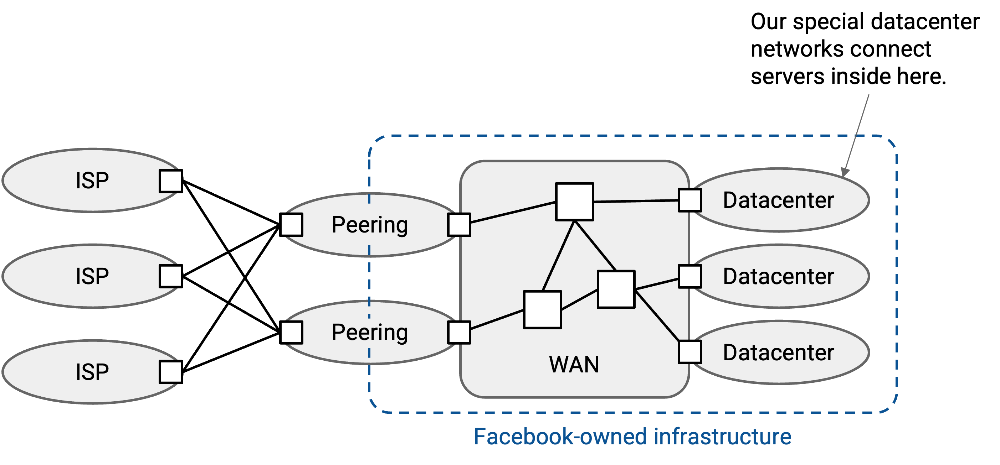

这张地图展示了像 Google 这样的科技巨头所拥有的所有网络构成的 wide area network (WAN)。

Peering location 把 Google 连接到 Internet 的其他部分。它们主要由 Google 运营的 router 组成，这些 router 连接到其他 autonomous system。

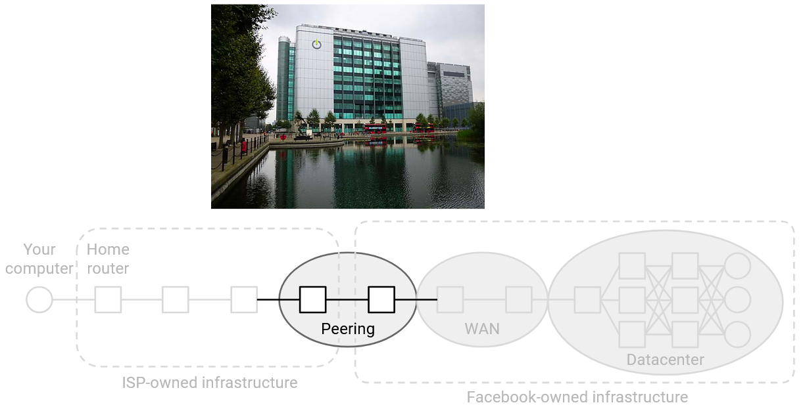

除了 peering location，Google 还运营许多 datacenter。datacenter 中的 application 可以通过 peering location 与 Internet 的其他部分通信。datacenter 和 peering location 都通过 Google 自己管理的 router 和 link 连接在 Google 的 wide area network 中。

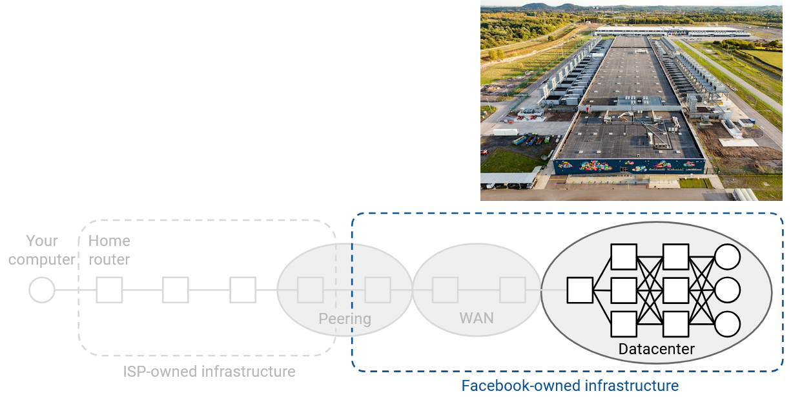

Datacenter 和 peering location 优化的性能目标不同，因此它们通常位于不同的物理地点。

Peering location 关心的是在物理上靠近其他公司和网络。因此，carrier hotel 通常位于城市中，以便在物理上更接近客户和其他公司。

相比之下，datacenter 不那么关心靠近其他公司，而是优先考虑物理空间、电力和冷却等需求。因此，datacenter 往往位于人口较少的地区，有时会靠近河流（用于冷却）或发电站（datacenter 可能需要比 peering location 多数百倍的电力）。

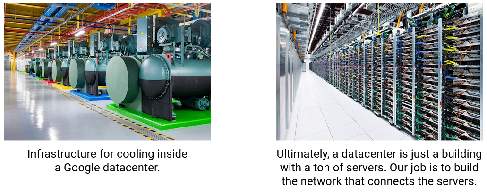

## Why is the Datacenter Different?

datacenter 的本地网络与 Internet 其他部分的通用（wide area）网络有什么不同？

datacenter network 由单个组织运营，这让我们能更好地控制网络和 host。不同于通用 Internet，在 datacenter 中我们可以运行自己的定制硬件或软件，也可以强制每台机器遵循同一套定制 protocol。

datacenter 通常是同质化的：每台 server 和 switch 的构建与运营方式完全相同。不同于通用 Internet，我们不需要考虑有些 link 是无线的、有些 link 是有线的。在通用 Internet 中，有些计算机可能比其他计算机更新；但在 datacenter 中，每台计算机通常属于同一代硬件，并且整个 datacenter 会同时升级。

datacenter network 位于单个物理地点，所以我们不需要考虑海底光缆这类长距离 link。在这个单一地点内部，我们必须支持极高的 bandwidth。

## Datacenter Traffic Patterns

当你向一个 datacenter application 发出请求时，你的 packet 会穿过通用 Internet 中的 router，最终到达 Google 运营的某个 router。这个 router 会把你的 packet 转发到 datacenter 的某个 edge router，然后再转发到 datacenter 中的某台具体 server。

这一台 server 很可能并不拥有处理你请求所需的全部信息。例如，如果你请求 Facebook feed，不同 server 可能需要协同工作，把广告、照片、帖子等内容组合起来。如果每台 server 都必须自己了解 Facebook 的全部内容才能处理请求，那并不现实。

为了让不同 server 协调工作，第一台 server 会触发许多 backend request，用来收集处理你的请求所需的所有信息。一个单独的用户请求可能会在响应返回给用户之前触发数百个 backend request（根据一篇 2013 年 Facebook paper，平均为 521 个）。一般来说，server 之间的 backend traffic 显著更多，而与用户之间的外部 traffic 相比非常小。

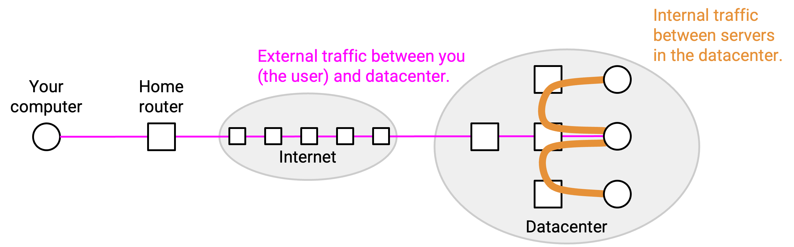

大多数现代 application 都以内部分布在机器之间的 traffic 为主。例如，如果你运行 mapreduce 这样的分布式程序，不同 server 需要彼此通信，才能共同解决你的大型查询。有些 application 甚至可能完全没有面向用户的 network traffic。例如，Google 可能会运行周期性备份，这需要 server 之间通信，但不会为 end user 产生任何可见结果。

离开网络的连接（例如到 end user 或其他 datacenter）被称为 **north-south** traffic。相反，网络内部机器之间的连接被称为 **east-west** traffic。east-west traffic 比 north-south traffic 大好几个数量级，并且近年来 east-west traffic 的规模还在增长（例如随着 machine learning 的发展）。

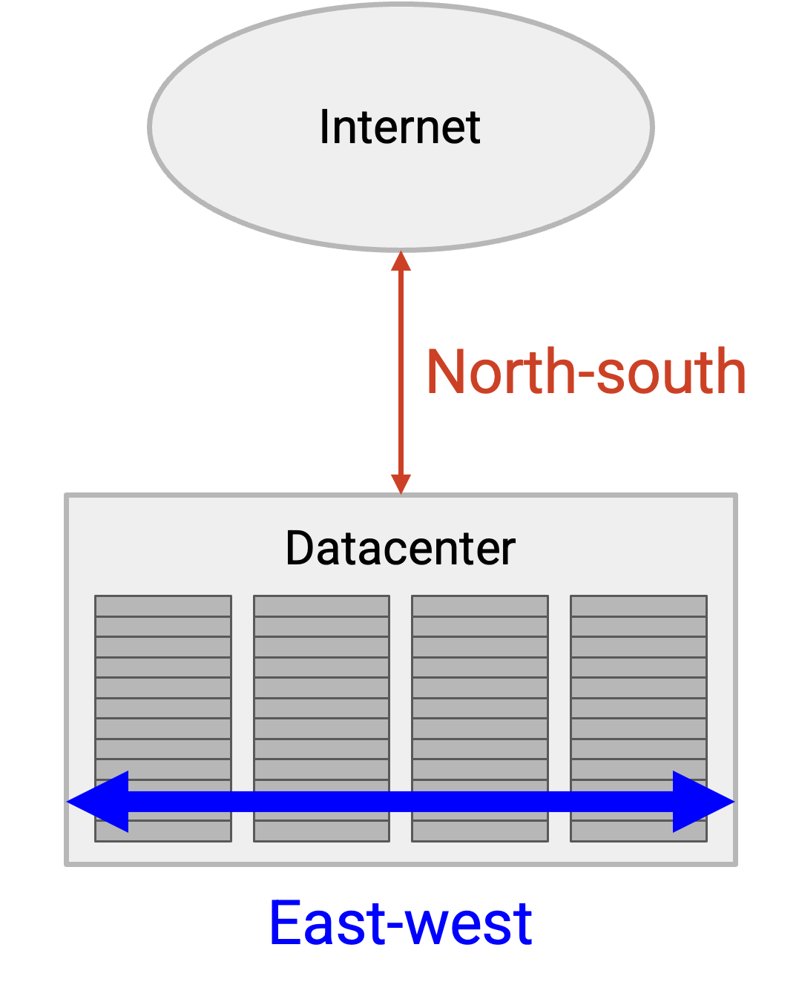

## Racks

datacenter 从根本上说由许多 server 组成。server 被组织在物理 rack 中，每个 rack 有 40 到 48 个 rack unit（槽位），每个 rack unit 可以容纳 1 到 2 台 server。

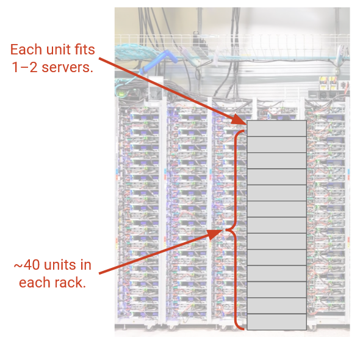

我们希望 datacenter 中的所有 server 都能彼此通信，因此需要构建一个网络把它们全部连接起来。这个网络应该长什么样？我们怎样高效地安装 link 和 switch，以满足这些需求？

首先，我们可以连接同一个 rack 内的所有 server。每个 rack 有一个 switch，称为 **top-of-rack (TOR) switch**，rack 中的每台 server 都有一条 link（称为 **access link** 或 **uplink**）连接到这个 switch。TOR 是相对较小的 router，带有一个 forwarding chip，并通过物理 port 连接 rack 上的所有 server。每条 server uplink 通常有约 100 Gbps 的容量。

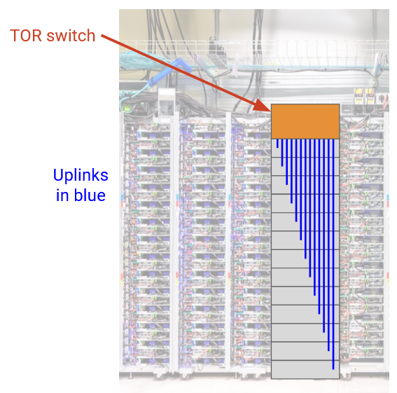

接下来，我们必须考虑如何把 rack 彼此连接起来。理想情况下，我们希望每台 server 都能以完整 line rate（也就是使用整条 uplink bandwidth）与任意其他 server 通信。

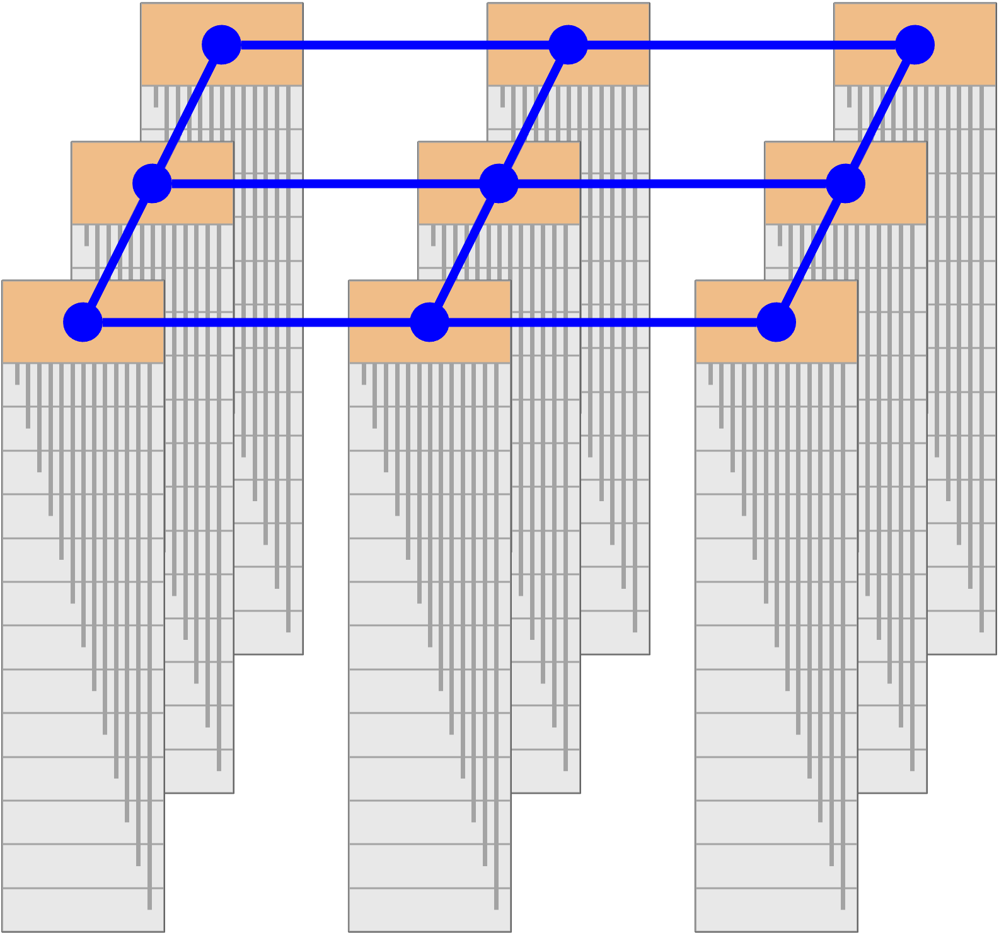

## Bisection Bandwidth

在思考如何连接 rack 之前，我们先定义一个指标，用来衡量一组计算机连接得有多充分。

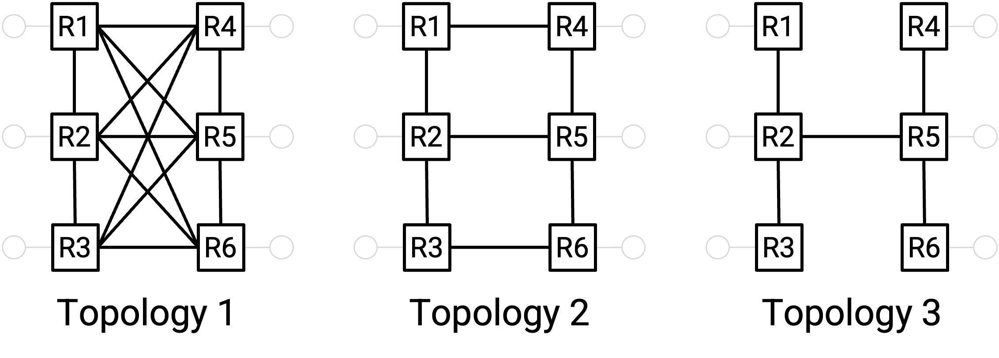

直觉上，虽然这三个网络都是连通的，但左边的网络连接最充分，中间的网络连接弱一些，右边的网络连接最弱。例如，左边和中间的网络可以支持 1-4 和 3-6 同时以完整 line rate 通信，而右边的网络做不到。

一种说明左边网络连接更充分的方式是：我们必须切断更多 link 才能让网络断开。这说明网络中有许多冗余 link，因此可以运行许多同时发生的高 bandwidth 连接。类似地，一种说明右边网络连接较弱的方式是：我们只需要切断 2-5 这条 link 就能让网络断开，这说明存在一个会阻止同时高 bandwidth 连接的 bottleneck。

**Bisection bandwidth** 是量化网络连接充分程度的一种方式。计算 bisection bandwidth 时，我们计算为了把网络划分成两个大小相等且互不连通的部分，需要移除多少条 link。bisection bandwidth 就是这些被切断 link 的 bandwidth 总和。

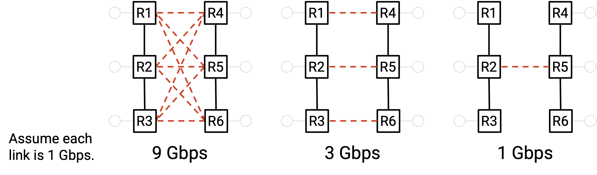

在最右边的结构中，我们只需要移除一条 link 就能划分网络，因此 bisection bandwidth 就是这一条 link 的 bandwidth。相比之下，在最左边的结构中，我们需要移除 9 条 link 才能划分网络，因此 bisection bandwidth 是这 9 条 link 的 bandwidth 总和。

定义 bisection bandwidth 的等价方式是：我们把网络分成两半，一半中的每个 node 都想同时向另一半中对应的 node 发送数据。在所有可能的 node 划分方式中，这些 node 合计能够发送的最小 bandwidth 是多少？考虑最坏情况（最小 bandwidth）会迫使我们关注 bottleneck。

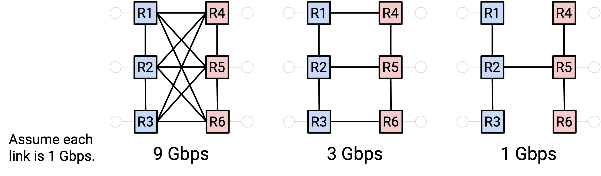

连接最充分的网络具有 full bisection bandwidth。这意味着网络中没有 bottleneck，并且无论怎样把 node 分配到两个 partition，一边 partition 中的所有 node 都能同时以完整速率与另一边 partition 中的所有 node 通信。如果有 N 个 node，并且左侧 partition 中的全部 N/2 个 node 都以完整速率 R 发送数据，那么 full bisection bandwidth 就是 N/2 乘以 R。

**Oversubscription** 衡量的是我们距离 full bisection bandwidth 有多远，或者等价地说，网络的 bottleneck 部分过载了多少。它是 bisection bandwidth 与 full bisection bandwidth（所有 host 都以完整速率发送时所需的 bandwidth）之间的比值。

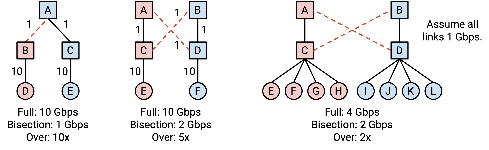

在最右边的例子中，假设所有 link 都是 1 Gbps，那么 bisection bandwidth 是 2 Gbps（用于把左边四个 host 和右边四个 host 分开）。当左边四个 host 同时发送数据时，full bisection bandwidth 是 4 Gbps。因此，2/4 这个比值告诉我们，host 只能以完整速率的 50% 发送。换句话说，我们的网络是 2x oversubscribed，因为如果所有 host 都以完整速率发送，bottleneck link 就会过载 2x（4 Gbps 的流量压在 2 Gbps 的 link 上）。

## Datacenter Topology

我们现在已经定义了 bisection bandwidth，它是一种由 network topology 决定的连接性指标。在 datacenter 中，我们可以选择自己的 topology（例如选择在哪里安装 cable）。那么，我们应该构建什么 topology，才能最大化 bisection bandwidth？

一种可能的方法是把每个 rack 都连接到一个巨大的 cross-bar switch。左侧所有 rack 可以同时以完整速率把数据发送进 switch，switch 再以完整速率把所有数据转发到右侧。这可以让我们达到 full bisection bandwidth。

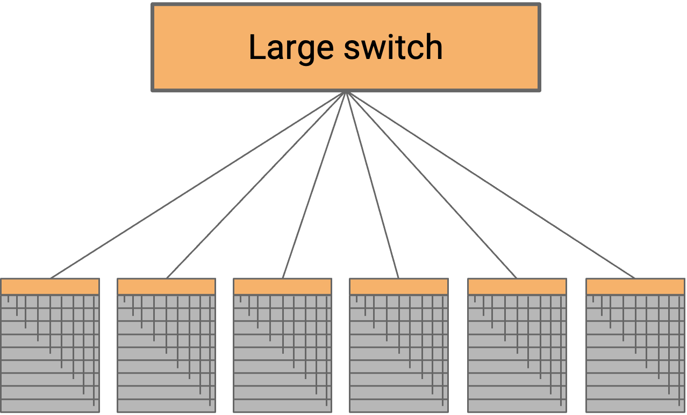

这种方法有什么问题？这个 switch 需要为每个 rack 提供一个物理 port（可能多达 2500 个 port）。我们有时把外部 port 的数量称为 switch 的 **radix**，所以这个 switch 需要非常大的 radix。此外，这个 switch 还需要拥有巨大的容量（可能达到每秒 petabit 级别），才能支持所有 rack。毫不意外，这样的 switch 不现实（即使能造出来，也会贵到难以接受）。

趣闻：在 2000 年代，Google 曾经请求 switch 供应商制造一个 10,000-port switch。供应商拒绝了，说这东西不可能造出来；即使能造出来，除了你们也没有人要买（所以造它没有利润）。

另一个问题是，这个 switch 是 single point of failure。如果这个 switch 坏了，整个 datacenter network 都会停止工作。

另一种可能的方法是把 switch 排成 tree topology。这可以帮助我们降低每条 link 的 radix 和 bandwidth 要求。

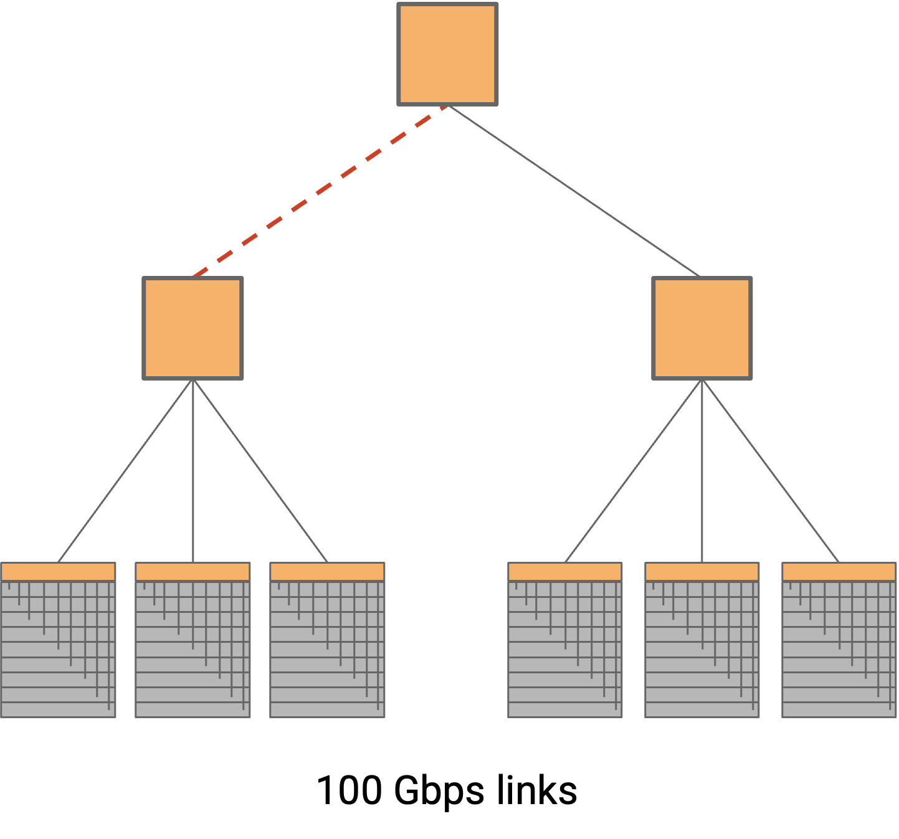

这种方法有什么问题？bisection bandwidth 更低。树的两半之间只有一条 link，是 bottleneck。

为了提高 bisection bandwidth，我们可以在更高层安装更高 bandwidth 的 link。

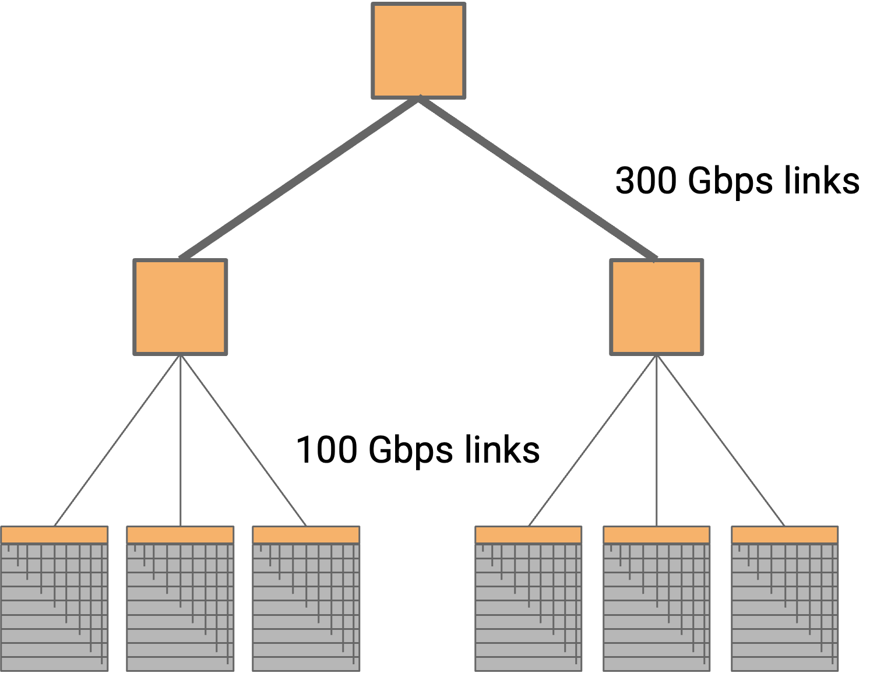

在这种情况下，如果下面四条 link 是 100 Gbps，上面两条 link 是 300 Gbps，那么我们就移除了 bottleneck，并恢复了 full bisection bandwidth。

这种 topology 可以使用，不过我们仍然没有解决顶部 switch 昂贵且扩展性差的问题。

## Clos Networks

到目前为止，我们尝试用定制 switch 构建网络，这些 switch 可能拥有非常高的 bandwidth 或 radix。但这些 switch 仍然很昂贵。我们能否设计一种 topology，用便宜的 commodity component 提供高 bisection bandwidth？特别地，我们希望使用大量廉价的现成 switch，其中所有 switch 的 port 数相同、每个 switch 的 port 数较低，并且所有 link speed 相同。

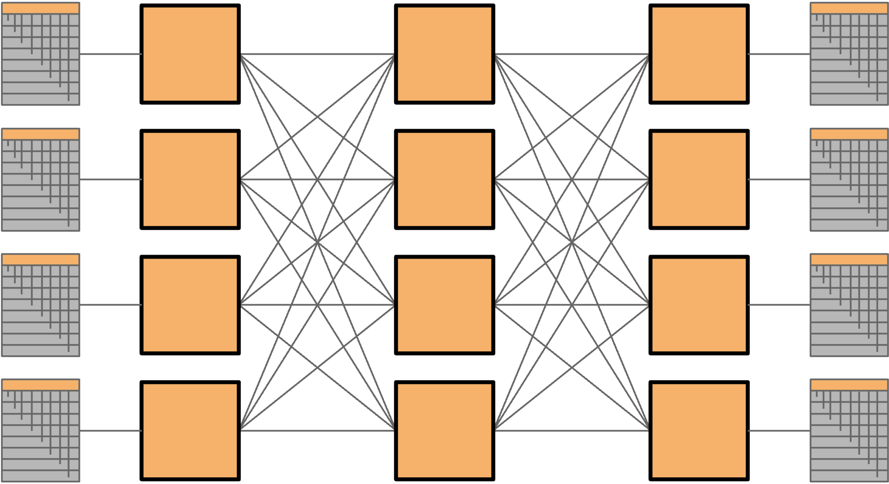

**Clos network** 通过在网络中的 node 之间引入大量 path，用 commodity part 实现高 bandwidth。由于网络中存在很多 link 和 path，我们可以让每个 node 沿不同 path 发送数据，从而实现高 bisection bandwidth。

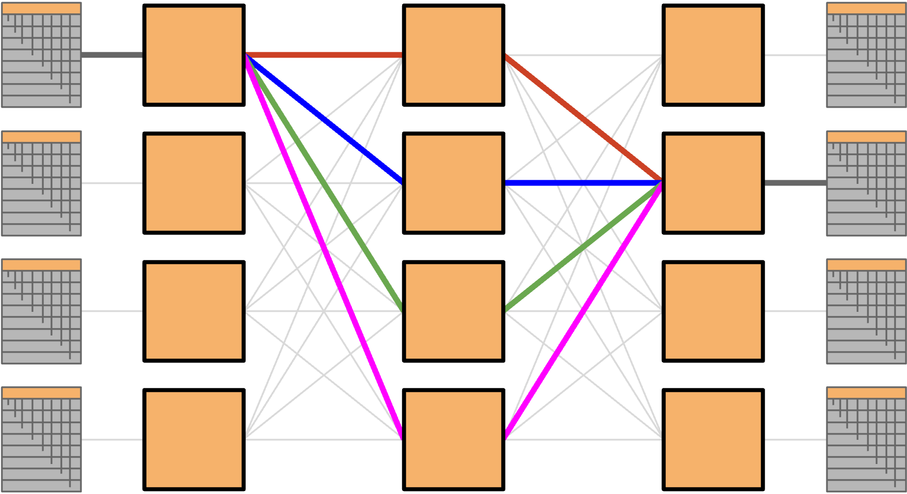

不同于定制 switch 通过制造更大的 switch 来扩展网络，我们可以通过简单地增加更多相同的 switch 来扩展 Clos network。这个方案既经济又可扩展。

Clos network 也被用于其他 application，并以其发明者 Charles Clos（1952）命名。

在经典 Clos network 中，所有左侧 rack 会把数据发送给右侧 rack。在 datacenter 中，rack 既可以发送数据，也可以接收数据，所以我们不再使用分离的 sender 层和 recipient 层，而是使用一个包含所有 rack 的单层（每个 rack 既可以作为 sender，也可以作为 recipient）。然后，数据沿许多 path 中的一条进入网络更深处，再返回出来到达 recipient。这个结果称为 **folded Clos network**，因为我们把 sender 层和 recipient 层「折叠」成了一层。

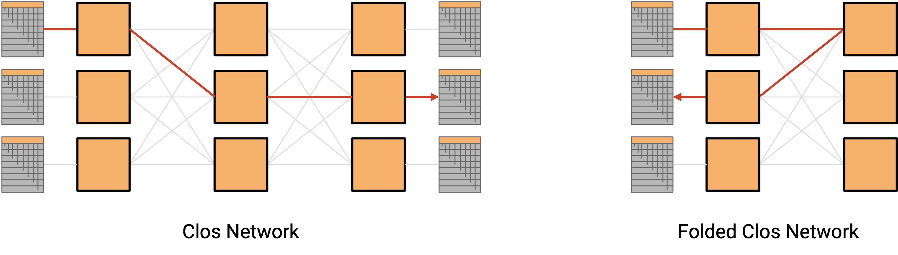

## Fat-Tree Clos Topology

fat-tree topology 的每个 switch radix 较低，并且可以实现 full bisection bandwidth。然而，树顶端的 switch 昂贵、扩展性差，而且仍然是 single point of failure。

Clos topology 让我们可以用 commodity switch 扩展网络。如果把 Clos topology 与 fat-tree topology 结合起来，我们就能用 commodity switch 构建一种可扩展 topology。

这里展示的 topology 来自 2008 年 SIGCOMM paper「A Scalable, Commodity Data Center Network Architecture」（Mohammad Al-Fares, Alexander Loukissas, Amin Vahdat）。

在 k-ary fat tree 中，我们创建 k 个 pod。每个 pod 有 k 个 switch。

在一个 pod 内，k/2 个 switch 位于上方的 aggregation layer，另外 k/2 个 switch 位于下方的 edge layer。

（注意：这个 topology 针对偶数 k 定义，这样才能把 switch 均匀分到 aggregation layer 和 edge layer。）

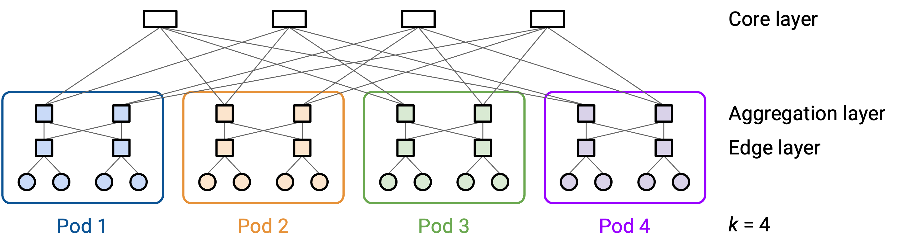

pod 中的每个 switch 都有 k 条 link。其中一半 link（k/2）向上连接，另一半 link（k/2）向下连接。

考虑上方 aggregation layer 中的一个 switch。它一半（k/2）的 link 向上连接到 core layer（core layer 用于连接 pod，后面会讨论），另一半（k/2）的 link 向下连接到 edge layer 中的 k/2 个 switch。

类似地，考虑下方 edge layer 中的一个 switch。它一半（k/2）的 link 向上连接到 aggregation layer 中的 k/2 个 switch，另一半（k/2）的 link 向下连接到这个 pod 中的 k/2 台 host。

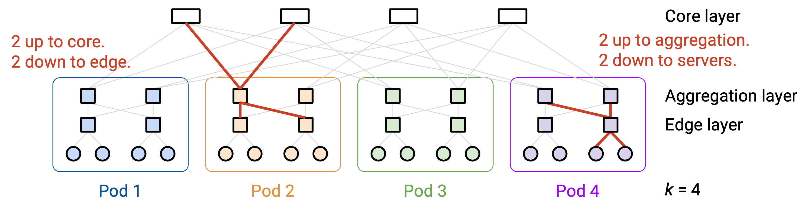

接下来，我们看连接各个 pod 的 core layer。每个 core switch 有 k 条 link，分别连接到 k 个 pod 中的每一个。

core switch 的数量是 $$(k/2)^2$$。这个数量是怎样推导出来的？一共有 k 个 pod，每个 pod 在上方 aggregation layer 中有 k/2 个 switch，因此 aggregation layer 中共有 $$k^2/2$$ 个 switch。每个 aggregation-layer switch 有 k/2 条向上的 link，因此向上的 link 总数是 $$k^2/2 \times k/2 = k^3/4$$。这意味着 core layer 也需要总共 $$k^3/4$$ 条向下的 link，才能匹配 aggregation layer 向上的 link 数量。

每个 core layer switch 有 k 条向下的 link，因此我们需要 $$k^2/4$$ 个 core layer switch（每个有 k 条 link）来产生 $$k^3/4$$ 条向下的 link。这样，从 aggregation layer 向上的 link 数量就能与从 core layer 向下的 link 数量匹配。

我们还可以计算出，在这个 topology 中，每个 pod 有 $$(k/2)^2$$ 台 host。这个数量是怎样推导出来的？每个 pod 的 edge layer 中有 k/2 个 switch。每个 edge-layer switch 有 k/2 条向下连接 host 的 link，因此每个 pod 的 host 总数是 $$k/2 \times k/2 = (k/2)^2$$。注意，每台 host 只连接到一个 edge-layer switch（在这个 topology 中，一台 host 不会连接到多个 switch）。因为一共有 k 个 pod，所以还可以推出整个 topology 中共有 $$(k/2)^2 \times k$$ 台 host。

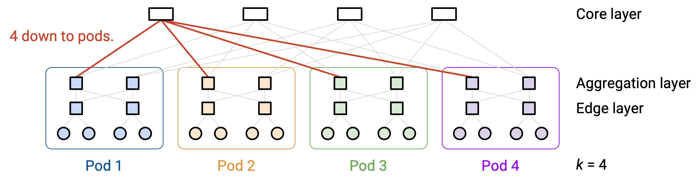

k = 4 是最小的例子，但它有点容易让人困惑，因为有些数值会巧合地相同（例如 $$(k/2)^2 = k = 4$$）。为了更清楚，我们可以看 k = 6 的例子。

每个 pod 有 k = 6 个 switch。k/2 = 3 个 switch 位于上方 aggregation layer，k/2 = 3 个 switch 位于下方 edge layer。

一个 edge layer switch 有 k/2 = 3 条向下的 link 连接到 3 台 host，并有 k/2 = 3 条向上的 link 连接到同一 pod 中的 3 个 aggregation switch。

一个 aggregation layer switch 有 k/2 = 3 条向上的 link 连接到 core layer（具体来说，连接到 3 个不同的 core layer switch），并有 k/2 = 3 条向下的 link 连接到同一 pod 中的 3 个 edge layer switch。

每个 pod 有 k/2 = 3 个 edge switch，每个 edge switch 连接到 k/2 = 3 台 host，因此每个 pod 共有 $$(k/2)^2 = 9$$ 台 host。整个 topology 一共有 k 个 pod，因此总共有 $$k \times (k/2)^2 = 54$$ 台 host。

在 core layer 中，我们有 $$(k/2)^2 = 9$$ 个 core switch。每个 switch 有 k = 6 条 link，向下连接到 k = 6 个 pod 中的每一个。

总的来说，core layer 有 $$(k/2)^2 \times k$$ 条向下的 link（core switch 数量乘以每个 switch 的 link 数）。aggregation layer 有 $$k \times (k/2) \times (k/2)$$ 条向上的 link（pod 数量乘以每个 pod 的 aggregation switch 数量，再乘以每个 aggregation switch 的向上 link 数）。这两个表达式相等（在 k = 6 时都等于 54），因此 core layer 可以与 aggregation layer 完全连接。

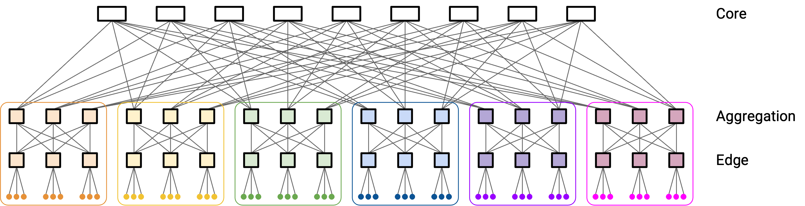

这个 topology 实现了 full bisection bandwidth。如果你把 pod 分成两半（例如左半和右半），那么左半中的每台 host 都有一条专用 path 通往右半中对应的一台 host。这让所有 host 可以配对（一台在左半，一台在右半），并让每一对 host 沿一条专用 path 通信，且没有 bottleneck。

此外，请注意这个 topology 可以用 commodity switch 构建。无论 switch 位于哪一层，每个 switch 的 radix 都是 k 条 link。同时，每条 link 都可以有相同的 bandwidth（例如 1 Gbps），其可扩展性来自我们在任意 host 对之间创建了专用 path。

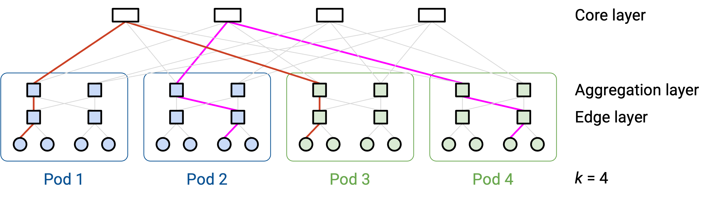

另一种理解 full bisection bandwidth 的方式是：不断删除 link，直到网络被划分成两半（左半 pod 和右半 pod）。

每个 core layer switch 有 k 条 link，每条 link 连接到一个 pod。这也意味着每个 core layer switch 有 k/2 条 link 连接到左侧，另有 k/2 条 link 连接到右侧。

为了完全隔离其中一侧（例如完全隔离左侧），对每个 core switch，我们都必须切断通往左侧的 k/2 条 link。core switch 一共有 $$(k/2)^2$$ 个，并且每个 switch 都要切断 k/2 条 link，因此总共需要切断 $$(k/2)^3$$ 条 link。这意味着 bisection bandwidth 是 $$(k/2)^3$$ 条 link（假设每条 link 的 bandwidth 相同）。

每个 pod 有 $$(k/2)^2$$ 台 host，左侧有 k/2 个 pod，因此左侧总共有 $$(k/2)^3$$ 台 host。右侧同样有 $$(k/2)^3$$ 台 host。如果左侧每台 host 都想和右侧每台对应 host 通信，那么就需要 $$(k/2)^3$$ 条 link 的 bandwidth。我们的 bisection bandwidth 正好匹配这个数值，因此实现了 full bisection bandwidth。

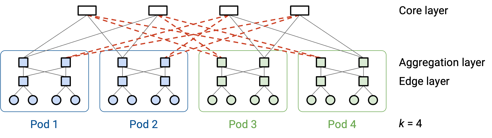

这个 Clos fat-tree topology 与前面 rack 和 top-of-rack switch 的概念有什么关系？

对于某些合适的 k 值，我们可以把一个 pod 中的 host 和 switch 安排到不同 rack 中，并把这些 rack 彼此连接起来。

例如，考虑 k = 48，这是原始 paper 中使用的示例值。这意味着在一个 pod 内，有 k/2 = 24 个 aggregation layer switch、k/2 = 24 个 edge layer switch，以及 $$(k/2)^2 = 576$$ 台 host。

我们可以这样安排 switch 和 host：把全部 48 个 switch 放在一个 rack 中，并把这个 rack 放在中间。然后，用 12 个 rack 围绕它，每个 rack 放 48 台 host。这帮助我们把所有 switch 和 host 都放进尺寸相同的 rack 中（每个 rack 48 台机器）。把 switch 放在中间 rack 也减少了构建这个 topology 所需的物理布线量。

中间 rack 有 k = 48 个 switch。每个 switch 有 k = 48 个 port，因此这个 rack 中共有 $$48^2 = 2304$$ 个 port。

在这 $$k^2 = 2304$$ 个 port 中，一半（$$k^2/2 = 1152$$）用于把 rack 内部的 switch 彼此连接起来。我们怎样推导出 $$k^2/2$$？可以回看前面的概念图。k/2 个 aggregation layer switch 中的每一个都有 k/2 条向下的 link，因此使用了 $$(k/2)^2$$ 个 port。类似地，k/2 个 edge layer switch 中的每一个都有 k/2 条向上的 link，因此也使用了 $$(k/2)^2$$ 个 port。合起来就是 $$2 \times (k/2)^2 = k^2/2$$ 个 port。

注意，aggregation switch 和 edge switch 之间的 link 连接的是同一个 rack 内部的 switch。因此，每条 link 需要两个 port（一个来自 aggregation switch，一个来自 edge switch），这就是我们把 $$(k/2)^2$$ 加倍的原因（或者等价地说，在 aggregation layer 和 edge layer 两侧都把这个值计入了一次）。

在 $$k^2 = 2304$$ 个 port 中，另有四分之一（$$k^2/4 = 576$$）用于连接同一 pod 内的 switch 和 host。这个数量是怎样推导出来的？记住，一个 pod 内有 $$(k/2)^2$$ 台 host，并且每台 host 都只连接到一个 switch。因此，我们需要 $$(k/2)^2 = k^2/4$$ 个 switch port 来连接 host。

最后，在 $$k^2 = 2304$$ 个 port 中，剩下的四分之一（$$k^2/4 = 576$$）用于把这个 pod 连接到 core layer。这个数量是怎样推导出来的？记住，core switch 有 $$(k/2)^2$$ 个，并且每个 core switch 都有一条 link 连接到每个 pod。换句话说，一个 pod 会各用一条 link 连接到 $$(k/2)^2$$ 个 core switch 中的每一个。因此，我们需要 $$(k/2)^2 = k^2/4$$ 个 switch port 来连接 core switch。

总结一下：在 $$k^2$$ 个总 port 中，一半用于互连同一 pod 内的 aggregation/edge switch（这些连接完全发生在中间 rack 内）。另一个四分之一用于把 edge switch 连接到 pod 内的 host（连接发生在中间 rack 和周围 12 个 host rack 之间）。最后一个四分之一用于把 aggregation switch 连接到 core layer（连接发生在中间 rack 和其他 core-layer rack 之间）。

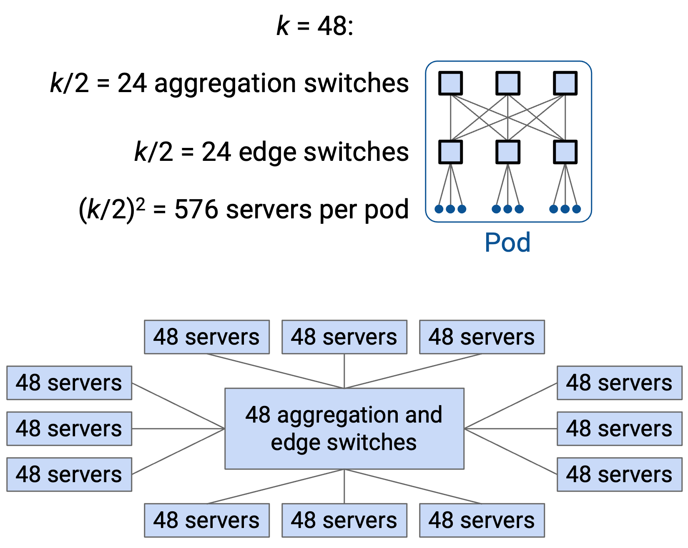

## Real-World Topologies

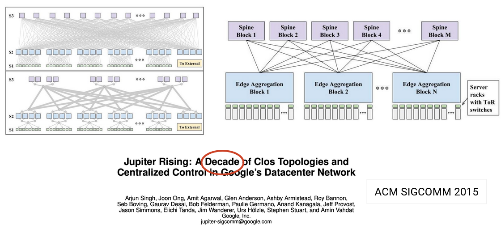

在这个例子（2008 年）中，任意两个 end host 之间都有许多不同 path。

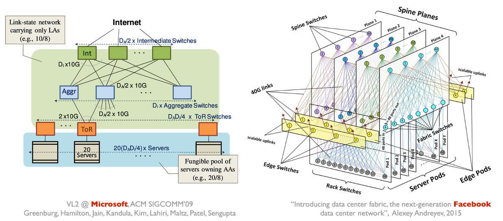

在这篇 paper（2015 年）中，作者探索了多种 topology。

现实中存在许多具体变体（2009 年、2015 年），但它们都共享同一个目标：在任意两台 server 之间实现高 bandwidth。
