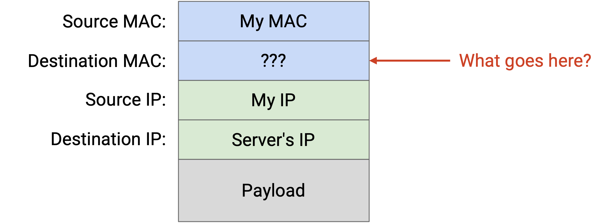
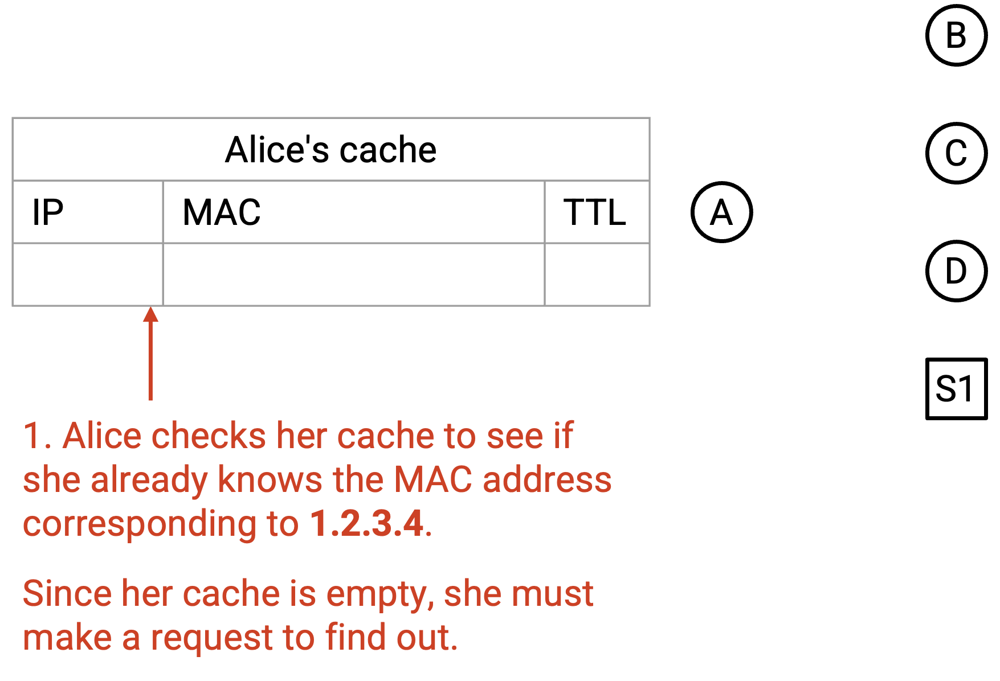
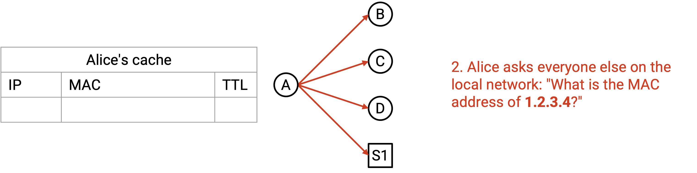
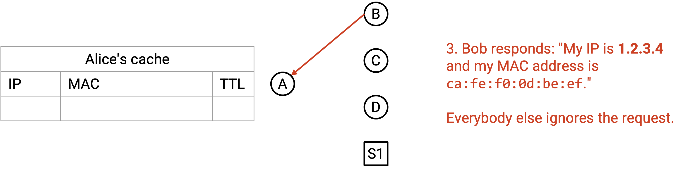
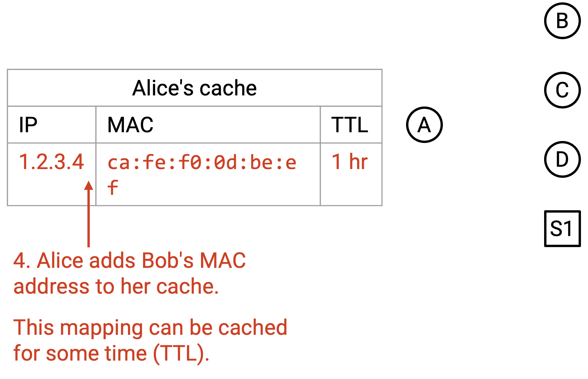
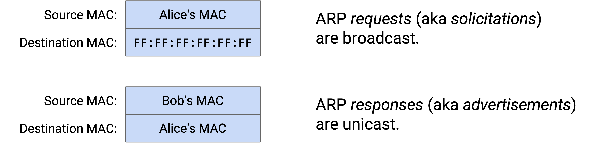
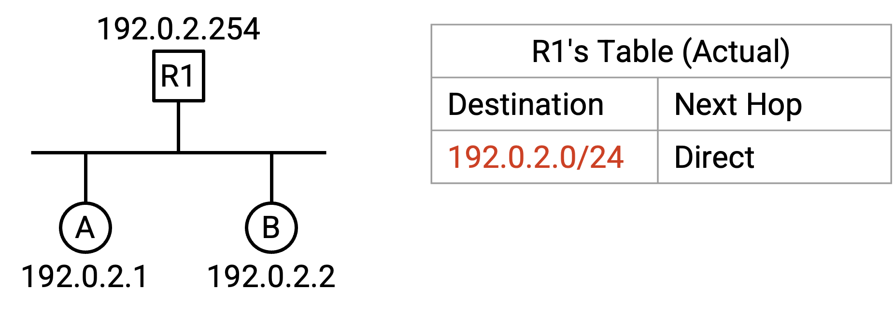
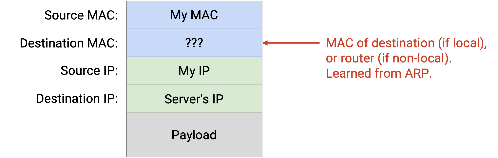
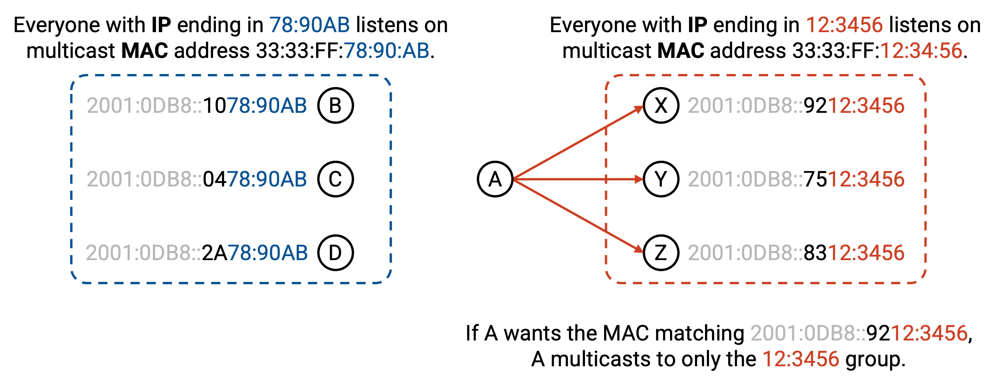

# ARP：连接 Layer 2 和 Layer 3

## 连接 Layer 2 和 Layer 3

回忆一下，packet 沿协议栈向下移动到更低层时，会被不断包上一层新的 header。要发送一个 IP packet，我们首先在 Layer 3 填入它的目的 IP。然后，我们把这个 packet 交给 Layer 2，在那里必须添加 MAC 地址，才能沿着 link 发送 packet。我们应该添加哪个 MAC 地址？

首先，我们需要检查目的 IP 是本地网络中的某台机器，还是另一个本地网络中的机器。为了判断这一点，sender 的 forwarding table 中会有一条 entry，指出本地 IP 地址的范围，有时也称为我们的 **subnet（子网）**。例如，这条 entry 可能写着 192.0.2.0/24 是 direct，这意味着 192.0.2.0 到 192.0.2.255 之间的所有地址都在同一个本地网络中。表中还会有一条 default route，表示其他所有非本地目的地都应该转发给 router。

如果目的 IP 在我们的 subnet 中，就需要某种方法把目的 IP 地址转换成那台机器对应的 MAC 地址。如果目的地在 subnet 之外，就需要某种方法把 router 的 IP 地址（来自 forwarding table）转换成对应的 MAC 地址，这样我们才能把 packet 发给 router。

一个朴素的方案是广播每一个 packet，这样目的主机或 router 一定会收到并处理它。不过，这种方法效率很低。它迫使所有人解析每个 packet（例如读取 Layer 3 header），检查这个 packet 是否发给自己。另外，如果 Layer 2 network 有多条 link，Layer 2 的 switch 还必须把 packet flood 到所有 link 上。

更好的方法是把目的 IP 地址转换成对应的 MAC 地址（如果目的地是本地的），或者转换成 router 的 MAC 地址（如果目的地不是本地的），然后在 Layer 2 用 unicast 发送 packet。

## ARP：Address Resolution Protocol

**ARP（Address Resolution Protocol，地址解析协议）** 允许机器把 IP 地址转换成对应的 MAC 地址。

为了请求一次转换，机器可以广播一条 solicitation message：「我的 MAC 地址是 `f8:ff:c2:2b:36:16`。IP 为 192.0.2.1 的机器的 MAC 地址是什么？」

所有不是这个 IP 地址的机器都会忽略这条消息。拥有这个 IP 地址的用户会向 sender 的 MAC 地址 unicast 一条回复，说：「我是 192.0.2.1，我的 MAC 地址是 `a2:ff:28:02:f2:10`。」

机器也可以把自己的 IP-to-MAC mapping 广播给所有人，即使没有人询问。

当你收到一个 IP-to-MAC mapping 时，可以把它添加到本地的 **ARP Table** 中，缓存这些 mapping 供之后使用。表中还会包含每个 entry 的过期时间，因为 IP 地址并不是永久分配给某台计算机的。另一台计算机可能被分配到同一个 IP 地址，同一台计算机也可能更换 IP 地址。（TODO：interfaces？）

第 1 步：

第 2 步：

第 3 步：

第 4 步：

注意，ARP 直接运行在 Layer 2 上，因此所有 packet 都通过 Ethernet 发送和接收，而不是通过 IP。

## 连接 ARP 和 Forwarding Table

回忆一下，在 router 的 forwarding table 中，我们有时会加入一条 entry，表示某台 host 直接连接到这个 router。

实际上，router 的 forwarding table 会包含一条单独的 entry，把整个 subnet 的 IP 地址范围映射为 direct。如果 router 收到一个目的地在这个本地范围内的 packet，router 就会运行 ARP 来找到对应的 MAC 地址，并使用 Layer 2 把 packet 发送给 link 上正确的 host。

这也能帮助我们处理同一条 link 上连接了多台 host 的情况。在概念图中，我们会说 Host A 直接连接在 Port 1 上。但那条 link 上可能有多台 host，因此通过 ARP，我们可以创建一个 Layer 2 packet，只把它 unicast 给 Host A，而不是发给 link 上的其他计算机。

给定一条把 192.0.2.0/24 这样的 subnet 映射为 direct 的 forwarding entry，我们怎样判断某个 IP 地址是否落在这个范围内？这时，用 netmask 而不是 slash notation 来写范围会很有用。回忆一下，要把这个范围写成 netmask，我们把所有固定 bit 设为 1，把所有不固定 bit 设为 0，得到 255.255.255.0。于是这个范围可以表示为 192.0.2.0，netmask 为 255.255.255.0。

现在，要检查某个地址是否在这个范围内，我们对这个地址和 netmask 做 bitwise AND。这会把所有不固定的低位 bit 清零，只保留固定的高位 bit。然后，我们检查结果是否等于 192.0.2.0（范围中的第一个地址，其中所有不固定 bit 都是 0）。

注意，当 packet 跨 hop 转发时，Layer 2 的目的地址会变成 next hop 的 MAC 地址，这样 packet 才能跨 link 前进。但是，Layer 3 的目的地址在每个 hop 上都保持不变。

## IPv6 中的 Neighbor Discovery

ARP 把 IPv4 地址转换成 MAC 地址。要把 IPv6 地址转换成 MAC 地址，我们使用一个类似的协议，称为 **neighbor discovery**。

neighbor discovery 不会广播 IP-to-MAC 转换请求，而是把请求 multicast 到某个特定 group；每台计算机会根据自己的 IP 地址监听某个特定 group。例如，所有 IP 地址以 12:3456 结尾的用户可能监听 group MAC address 33:33:FF:12:34:56，而所有 IP 地址以 78:90AB 结尾的用户可能监听 group MAC address 33:33:FF:78:90:AB。

如果我想知道 IPv6 地址以 12:3456 结尾的用户对应的 MAC 地址，就可以把这些 IPv6 bit 填入 group MAC address，得到 33:33:FF:12:34:56，并且我知道拥有该 IP 地址的用户一定在监听这个 group MAC address。

补充一些术语：在 neighbor discovery protocol 中，请求 mapping 的消息称为 Neighbor Solicitation，包含 mapping 的回复称为 Neighbor Advertisement。
