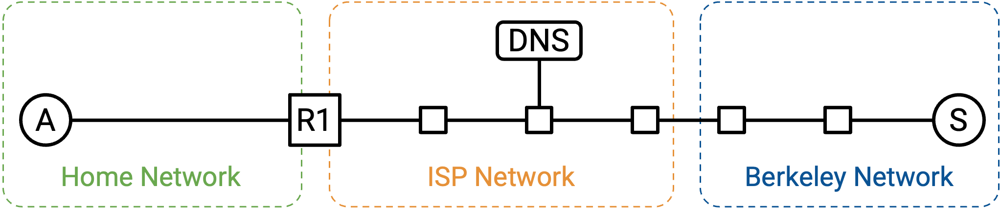
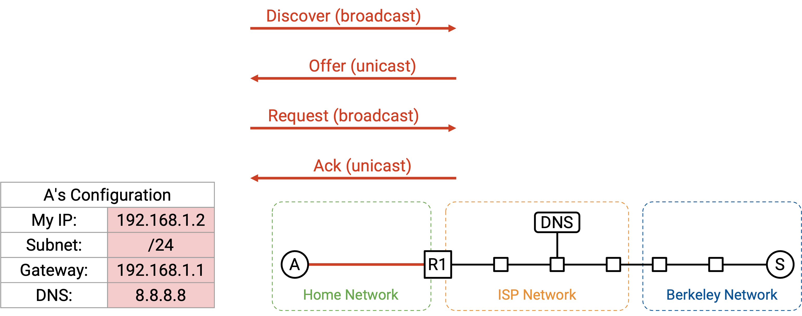
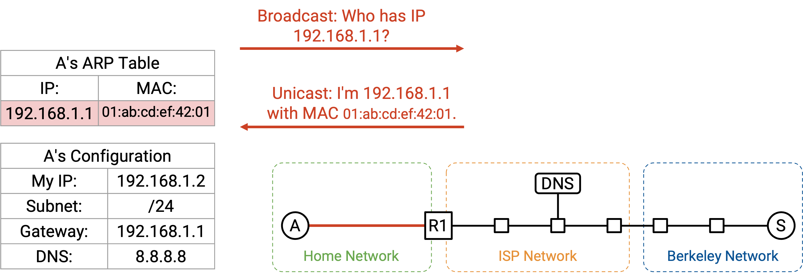
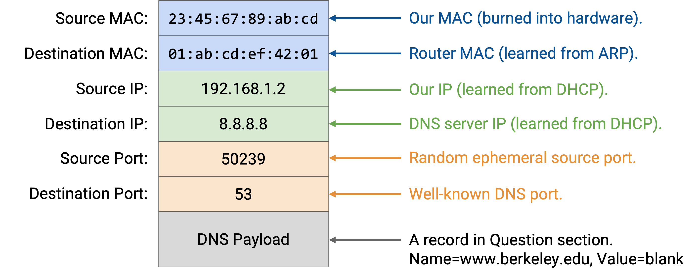
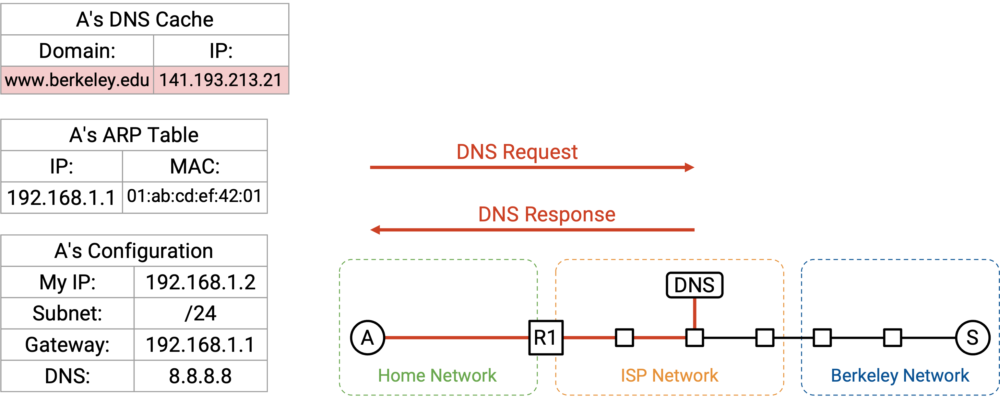
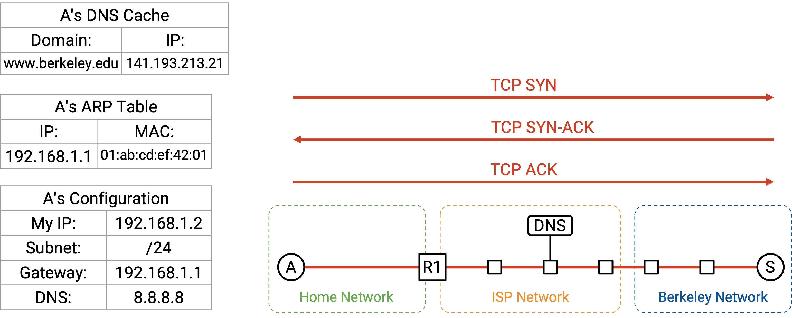
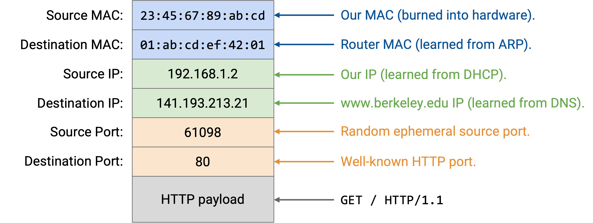
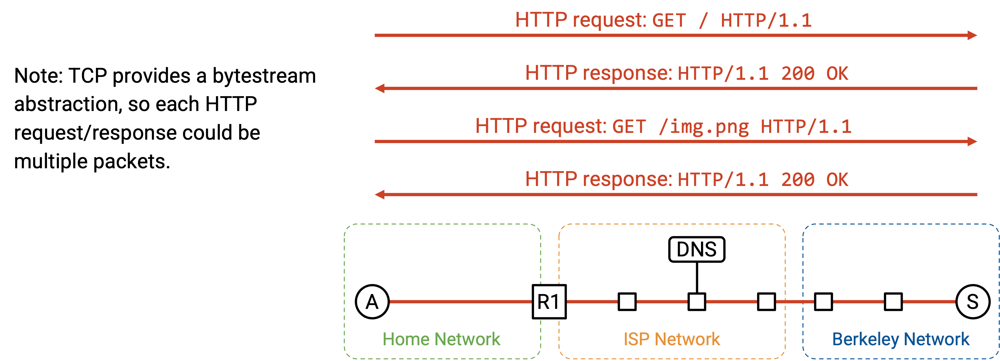
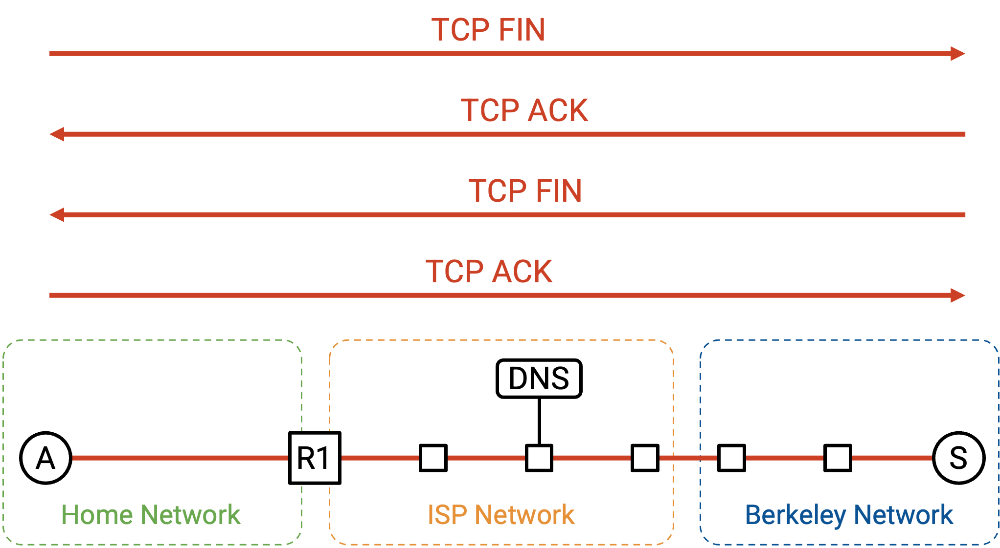
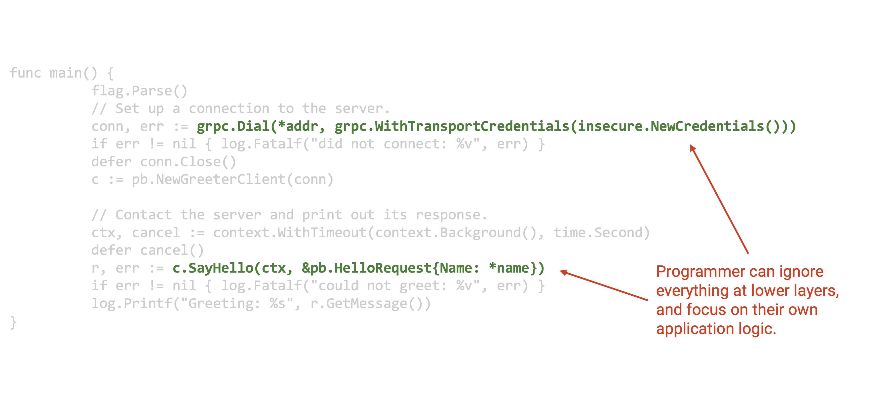

# End-to-End Connectivity

## 动机

在这一节中，我们会一步一步走完整个过程：打开计算机、把它接入 Ethernet network，并在 web browser 中输入 `www.berkeley.edu`。在这个过程中，我们会看到网络中所有不同组件如何协同工作，处理用户的 request。

我们假设不需要从零启动整个 Internet。例如，router 已经在积极运行 routing protocol，并相应地填好了自己的 forwarding table。

## Step 1：DHCP

我们打开计算机，并把它接入 Ethernet network。我们还没有任何关于这个网络的信息，所以会广播一个 DHCP request。

我们假设家庭 router 就是 DHCP server，这在家庭网络中很常见。router/server 会把一个 offer unicast 回给我们。这个 offer 包含网络相关信息：subnet mask、default gateway 的 IP 地址，以及 DNS server 的 IP 地址。offer 还会给我们一个可以使用的 IP 地址。

为了完成 DHCP protocol，我们发送 request message，确认自己想使用这个 offer 中的配置；随后 router/server 返回一个 acknowledgement。

## Step 2：在 Layer 2 找到 Router

通过 DHCP，我们学到了 router 的 IP 地址；我们的 forwarding table 现在也表示，所有非本地 packet 都应该转发给这个 router。我们将要向 DNS server 发送一些 packet（用来查找 `www.berkeley.edu` 的 IP 地址），也会向 Berkeley server 本身发送 packet，而它们都可能是非本地的。

不过，在把 IP packet 转发给 router 之前，我们需要先弄清 router 的 Layer 2 MAC address，这样才能在 local network 内把 packet 发给 router。

首先，我们可以验证 router 的 IP 地址 192.168.1.1 属于本地 subnet 192.168.1.2/24。这告诉我们 router 位于 local network 中；只要向 router 的 MAC address 发送 Ethernet packet，就能到达 router。

为了找到 router 的 MAC address，我们广播一个 ARP request，询问 192.168.1.1（router 的 IP 地址）的 MAC address。router 听到这个 request 后回复：「我是 192.168.1.1，我的 MAC address 是 01:ab:cd:ef:42:01。」

现在，我们可以 cache 这个 IP-to-MAC mapping，并且知道了 router 的 MAC address。只要这个 entry 还留在 cache 中，我们就不必再次发起相同的 ARP request。之后所有发往外部 Internet 的 request 都可以转发到 router 的 MAC address。

## Step 3：DNS Lookup

接下来，我们需要查找 `www.berkeley.edu` 的 IP 地址。这全部由操作系统完成；browser 代码会调用类似 `getaddrinfo` 的函数来触发 DNS lookup。

通过 DHCP，我们学到了 DNS server 的 IP 地址 8.8.8.8。我们也知道自己位于 subnet 192.168.1.2/24。DNS server 不在我们的 local network 中，所以需要把 DNS packet 转发给 router。

现在，我们可以自顶向下构造 DNS request packet。

Layer 7：在 Question section 中，我们添加一条 DNS record，请求包含 `www.berkeley.edu` IP 地址的 A record。我们还添加 DNS header，其中包含 ID、record 数量等。

Layer 4：DNS 运行在 UDP 之上。因为我们是 client，所以可以选择任意随机 source port。destination port 选择 Port 53，因为 resolver 和 name server 会在这个 port 上监听 DNS query。

Layer 3：source IP 是我们自己的 IP，由 DHCP 分配。destination IP 是 8.8.8.8，也就是我们从 DHCP 学到的 DNS server 的 IP 地址。

Layer 2：source MAC 是我们自己的 MAC address，它写在硬件中。destination MAC 是 router（next hop）的 MAC address，我们通过 ARP 学到了它。

packet 完整构造好之后，我们就可以沿着 wire 发送 bit（Layer 1）。

当 packet 到达 router 时，如果网络使用 NAT，router 可能会重写 UDP/IP header，把我们的 private IP address 转换成 public IP address。不过，作为 end host，我们不必担心 NAT。router 应该替我们完成所有转换，给我们一种可以使用自己 IP 地址（来自 DHCP）的幻觉。

当我们的 packet 到达 8.8.8.8 上的 recursive resolver 时，如果 resolver 还没有 cache 我们的答案，它可能需要执行一些额外 lookup，并向 authoritative name server 请求 record。最终，recursive resolver 找到答案，并把 A record 发回给我们。现在，我们拥有了 `www.berkeley.edu` 的 IP 地址。

## Step 4：连接网站

现在我们有了 `www.berkeley.edu` 的 IP 地址，可以向 Berkeley 发送 packet。我们正在使用 web browser，所以目标是向这个 server 发起一个 HTTP request。

HTTP 运行在 TCP 之上，因此我们首先必须进行 TCP handshake，打开与 Berkeley server 的 connection。browser 会在某个 socket 上调用类似 `connect` 的函数来打开这个 connection，而操作系统（TCP 在那里运行）会执行 handshake，并在 browser 和网络之间传递 packet。

TCP handshake 被执行：我们发送 SYN，Berkeley 发送 SYN-ACK，然后我们发送 ACK。现在，我们的计算机和 Berkeley server 之间有了一个 bytestream。

现在，我们可以自顶向下构造 HTTP packet。

Layer 7：HTTP method 是 GET。我们想要的 resource 是 `/`（homepage）。version 是 HTTP/1.1。

Layer 4：HTTP 运行在 TCP 之上。browser 可以选择任意 source port，因为它是 client。一般来说，这个 port 可以由 application 手动指定，或者 application 可以指定「Port 0」，这是一种简写，表示请求操作系统选择一个当前未使用的随机 ephemeral port。（顺便联系 NAT 来看，允许 application 手动指定 port 正是两个用户可能选择相同 source port 的原因。）destination port 是 80，也就是 HTTP 的固定 port number。

Layer 3：source IP 是我们自己的 IP，由 DHCP 分配。destination IP 是 141.193.213.21，也就是前面 DNS query 返回的 `www.berkeley.edu` 的 IP 地址。

Layer 2：这与前面的 DNS packet 相同。source MAC 是我们自己的（写在硬件中），destination MAC 是 router 的（通过 ARP 发现并 cache）。

HTTP response 返回 status code 200 OK，response 的 content 中包含网站的 HTML code。browser 在 socket 上调用 `read`，读取 HTTP payload 的 byte，包括 status code 和 response，并相应地处理它们。

在 bytestream 中，HTTP 可以添加某种 delimiter，比如换行字符，用来表示 request 或 response 的结束。另外，Content-Length 这样的 HTTP header 可以指定 payload 的长度。这也允许 browser 分配足够内存来接收 response。

返回的 HTTP response 可能触发更多 request。如果 response 中的 HTML 有类似 `` 的语法，这会告诉 browser 发起另一个 HTTP request 来获取 `/logo.png` resource。或者，用户可能点击网站上的一个 link，比如 `www.berkeley.edu/about.html`，这也会触发向同一个 server 发起另一个 HTTP request。

回忆一下，为了提高效率，发往同一个 server 的多个 HTTP request 可以在同一个 TCP connection 上 pipelined，因此我们可以保持 TCP connection 打开，并继续用它处理后续 HTTP request 和 response。

最终，在一些 pipelining 之后，client 或 server 选择关闭 connection。正常的 teardown handshake 会发生：每一方都发送一个 FIN，并且两个 FIN packet 都被 ack。到此结束！

注意，HTTP request/response 不一定包含在单个 packet 中。HTTP 构建在 TCP bytestream 之上，因此单个 HTTP request 或 response 可能被拆分到多个 TCP/IP packet 中；每个 packet 在 Layer 1-3 有相同 header，而 Layer 4 header 的 sequence number 不同。即使 request/response 被拆分到多个 packet 中，整个 HTTP request/response 也只有一个 header。使用 HTTP 时，一个 request/response 和一个 packet 之间不再有一一对应关系。

## Socket

如果你只是一个在 browser 中访问网站的用户，就不需要写任何代码来通过 Internet 运行 application（HTTP）。不过，如果你是正在编写自己 application 的程序员，大概需要写一些代码来与网络交互。

**socket** 抽象为程序员提供了一种方便的网络交互方式。socket 抽象完全存在于软件中，程序员可以运行五种基本操作：

我们可以 **create** 一个新的 socket，对应一个新的 connection。在 Java 这样的面向对象语言中，这可能是一次 constructor call。

我们可以调用 **connect**，它会发起到某台 remote machine 的 TCP connection。如果我们是 client-server connection 中的 client，这会很有用。

我们可以在某个特定 port 上调用 **listen**。这不会启动 connection，但允许其他人通过指定 port 主动和我们建立 connection。

connection 打开后，我们可以调用 **write**，在 connection 上发送一些 byte。我们也可以调用 **read**，它接受一个参数 N，用来从 connection 中读取 N 个 byte。

这个 socket 抽象让程序员可以编写 application，而不必思考 TCP、IP 或 Ethernet 这样的更低层抽象。

从操作系统的角度看，每个 socket 都关联一个 Layer 4 port number。进出单个 socket 的所有 packet 都有相同 port number，操作系统可以使用 port number 做 demultiplex，并把 packet 发送给正确的 socket。

## OS 中的 Layer

在硬件中，Layer 1 和 Layer 2 实现在你计算机硬件上的 Network Interface Card（NIC）中。Layer 3 和 Layer 4 实现在操作系统的 networking stack 中。Layer 7 application 则实现在软件中。把 Layer 3 和 Layer 4 放在 OS 中的好处是，application 不必每次都重新实现它们。

有了这种分工，application 只需要思考 data。NIC 只需要思考 packet。OS 中的 network stack 负责在 connection 和 packet 之间转换。

## 查看 Packet

如果你想查看网络中正在发送的 packet，可以使用 tshark 和 wireshark 之类的工具。当你调试代码的网络部分时，这些工具很有用。

在 browser 中，你也可以使用 inspect element console 的 Network tab 来查看正在发送和接收的数据。

如果你真的查看网络中发送的原始 packet，会看到一些我们在 end-to-end walkthrough 中没有覆盖的现实复杂性。例如，packet 可能被加密并通过 TLS 发送。另外，如果我们使用 HTTP/3.0，packet 可能通过 QUIC（针对 HTTP 优化的 UDP variant）而不是 TCP 发送。

## 重新审视 Layering

完整的 end-to-end 图景让我们看到，为什么 layering 是构建网络的有用原则。我们能够在单个 layer 解决特定问题，而不必同时思考所有 layer。

事实上，本课程完全没有讨论 Layer 1。我们没有讨论沿 wire 发送 signal 所需的 electrical engineering 或 physics。然而，即使不知道 Layer 1 究竟如何工作，我们仍然能够在 Layer 1 之上构建其他 layer。

在本课程中，我们讨论过 HTTP 作为主要的 Layer 7 protocol，但 HTTP 是一个相对简单的 protocol。多个 application 可能想在 HTTP 之上构建相同的复杂功能，但它们不想各自独立编写这些功能的代码。为了支持这一点，我们实际上可以在 HTTP 之上继续构建 protocol，这样程序员就不总是必须从 HTTP 开始白手起家。

Layer 7 之上的一个 protocol 示例是 remote procedure call（RPC）library。它允许程序员写一些代码，其中某些 function 实际上会在网络中另一台计算机上执行。如果每个人都必须从零开始在 HTTP 之上编写 RPC，那会很麻烦；因此，Apache Thrift 和 gRPC 这样的 library 存在，用来向程序员抽象掉更多细节。

这里是程序员可能编写的一些网络代码示例。它会让一个 client 向某个 remote server 问好。

注意，我们讨论过的所有 network protocol 都完全隐藏在两行 networking library call 后面。程序员不必思考 HTTP、TCP、IP、Ethernet、ARP、DHCP 或任何其他更低层 protocol。如果这些 protocol 出问题，了解它们仍然有用；理解这些 protocol 也可以帮助你针对特定 protocol 优化代码。但归根结底，layering 是一种非常强大的抽象工具。
