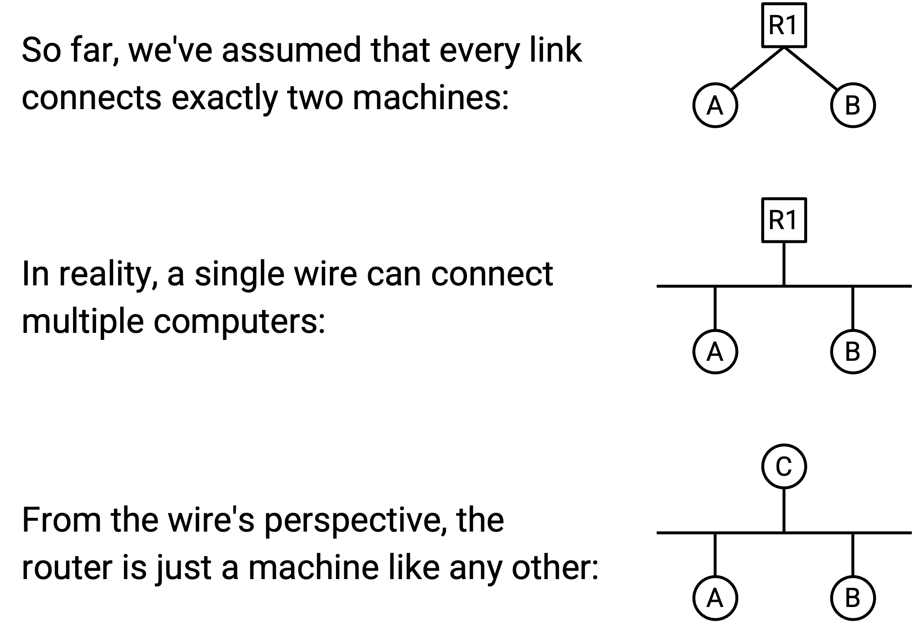
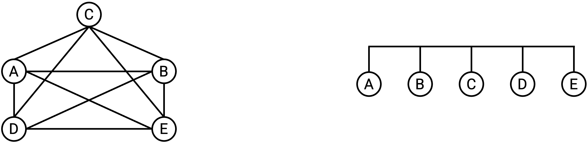
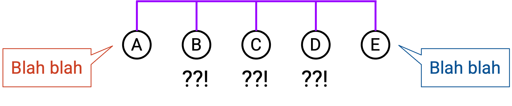
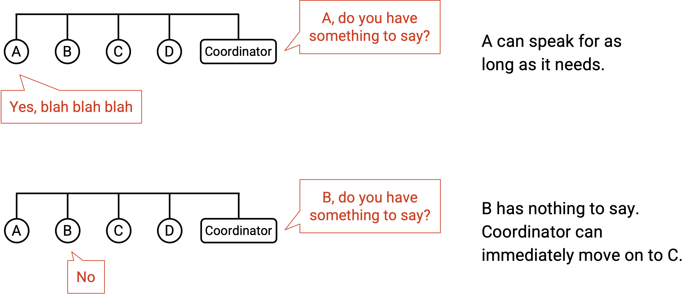
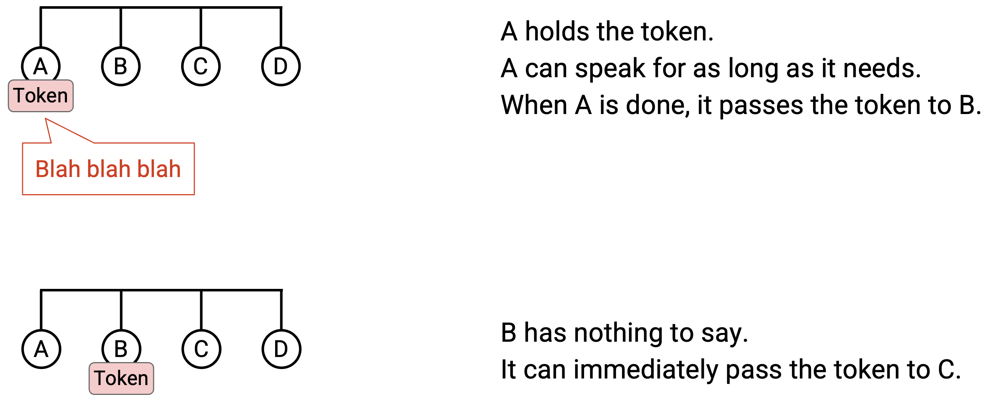
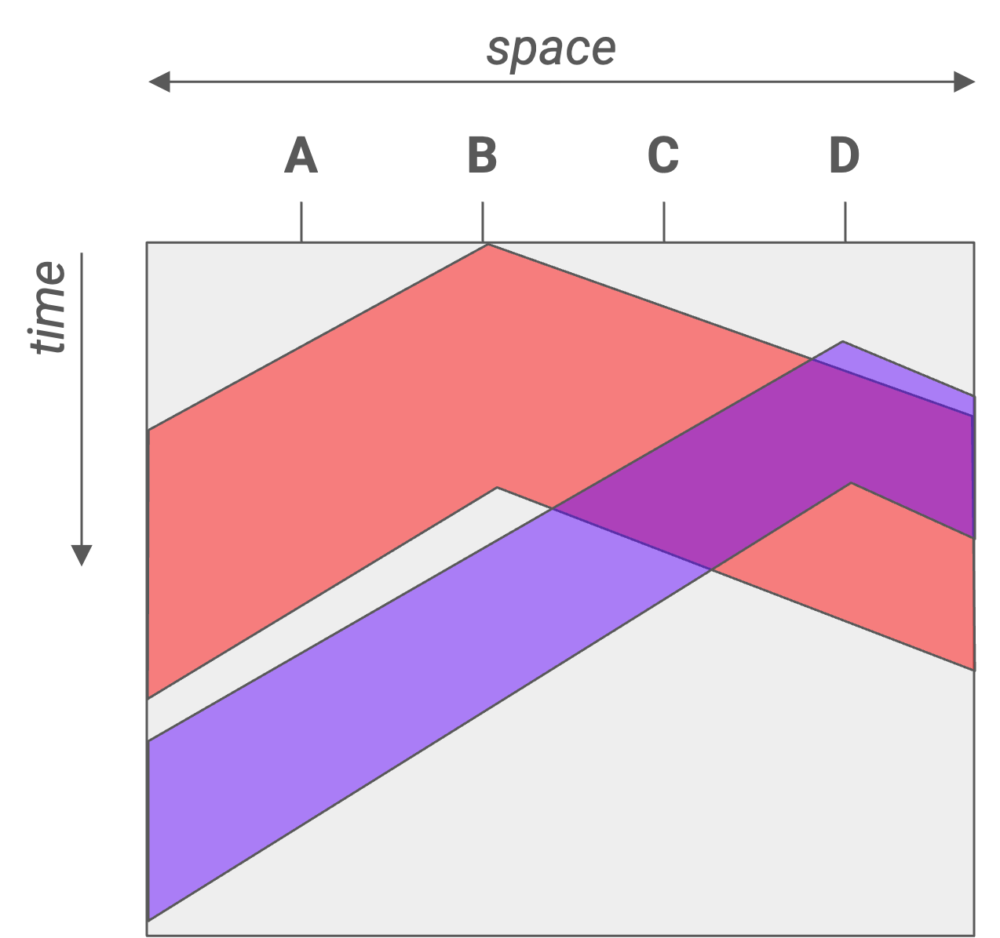
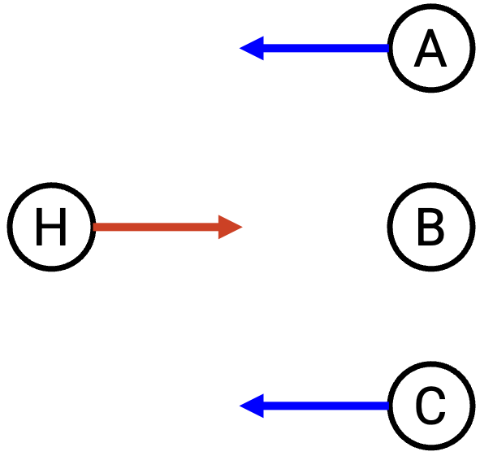
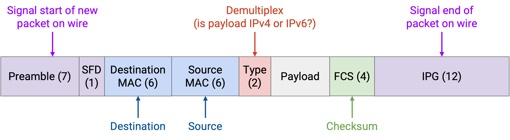

# Ethernet

## Local Network

在这一节中，我们关注 local area network 内部发生的事情，例如你家里由你的计算机和家庭 router 组成的网络。这与前面一直看到的 wide-area network 形成对比，后者跨越更长的距离。

具体来说，我们会研究 Layer 2 的 forwarding 和 addressing。我们必须定义 packet 如何从本地 host 转发到 router。我们还会看到，同一个 local network 中的 host 如何在 Layer 2 交换消息，而完全不需要联系 router。Layer 2 中占主导地位的 protocol 是 Ethernet。

## 连接本地 Host

到目前为止，我们画出的 link 都恰好连接两台机器。在 local network 中，我们画了一条线把每台 host 连接到 router。

现实中，一根 wire 可能被用来连接多台机器。在 local network 中，host 和 router 可以全都位于同一根 wire 上。我们甚至可以进一步抽象：在 Layer 2，router 实际上也只是和其他机器一样的一台机器（只不过它碰巧在更高层运行 routing protocol）。归根结底，wire 并不关心连接在上面的机器如何使用它们交换的数据。

在 local network 中，连接计算机的最佳布线方式是什么？之前第一次介绍 routing 时，我们考虑过用 mesh topology 连接全世界每一对计算机。我们也考虑过用一根 wire 连接所有计算机。最终，我们认为对于全球网络，这两种方法都不实际，因此需要引入 router。

我们可以在 local network 中重新考虑这些 topology。mesh topology 仍然非常不实际。如果一台新的 host 加入，我们就必须增加 wire，把它连接到其他每一台 host。不过，**bus** topology，也就是把所有计算机沿着同一根 wire 连接起来，在 local network 中相当常见且实用。

单根 wire 的 bus topology 引入了 **shared media（共享介质）** 的概念。以前我们画 link 连接两台机器时，只有那两台计算机使用这条 link 通信。现在，从 A 到 C 的一个 packet，以及从 B 到 D 的一个 packet，可能同时出现在 wire 上，而这根 wire 上的电信号无法同时承载这两个 packet。

类比一下，想象多人在一次群组通话中共享同一条电话线：任意两个人都可以互相说话，但不能有两组人同时对话，否则谁也听不清对方在说什么。

为了简化，我们把 link 画成带有电信号的 wire，但现实中的 link 技术也可能使用其他 shared media。例如，在无线 link 技术中，由这条 link 连接的所有 host 会共享电磁频谱中的同一部分。

## 通过 Shared Media 通信：协调式方法

在使用 shared medium 的网络中，不同 node 的 transmission 可能相互干扰或发生 collision。如果两台计算机同时尝试传输数据，它们的信号会重叠并相互干扰。recipient 可能无法解码信号，也无法判断信号是谁发送的。为了解决这个问题，我们需要一个 **multiple access protocol**，确保多台计算机可以共享 link 并在其上传输。

一类可能的方法是给 link 上的每个 node 分配固定的一部分资源。我们可以考虑用两种方式划分资源。在 **frequency-division multiplexing** 中，我们给每台计算机分配不同的频率片段。（可以类比 AM/FM 广播或电视广播，它们把频率划分成不同 channel。）在 **time-division multiplexing** 中，我们把时间划分成固定 slot，并给每个连接的 node 分配一个 slot。

固定分配资源有一些缺点。可分配的 frequency/time 数量有限。另外，并不是所有人时时刻刻都有话要说，因此我们分配的 frequency/time 大多数时间可能闲置。这种方法很浪费，因为它把计算机限制在自己被分配的片段中，即使其他片段可能没有被使用。

除了固定分配，另一类方法基于 node 轮流使用资源，而没有任何固定分配。在这一类方法中，我们动态地按时间划分资源，让 node 在自己的轮次中只使用所需时间，不浪费时间。我们可以考虑两种让 node 轮流发言的方式。

在 **polling protocol** 中，一个中心 coordinator 决定每个连接的 node 何时可以发言。coordinator 逐个询问每个 node 是否有话要说。如果 node 说有，coordinator 就允许它发言一段时间。如果 node 说没有，coordinator 会立刻移动到下一个 node，这个 node 也不会浪费任何资源。Bluetooth 是现实中使用这一思想的 protocol。

另一种让 node 轮流发言的方法是 **token passing**。我们不使用中心 coordinator，而是使用一个可以在 node 之间传递的虚拟 token，只有持有 token 的 node 才允许发言。如果某个 node 有话要说，它会在传输期间持有 token，然后把 token 传给下一个 node。如果某个 node 此刻没有话要说，它会立刻把 token 传给下一个 node。IBM Token Ring 和 FDDI 是现实中使用这一思想的 protocol 示例。

这些基于轮次的方法有一个缺点：复杂。我们必须实现某种 node 间通信，而这可能变得很复杂。在 token passing 中，我们可能需要某个专用 frequency channel，让 node 能可靠地彼此传递 token。我们还可能需要处理一些复杂情况，例如两个 node 都认为自己拥有 token，从而导致 collision。在 polling protocol 中，我们需要指定一个中心 coordinator 与 node 通信，并实现 coordinator 与 node 对话的方式。在 Bluetooth 中，你的智能手机可以作为中心 coordinator 与辅助设备通信，但在其他网络中，谁来做 coordinator 可能并不明显。

## 通过 Shared Media 通信：Random Access 方法

除了固定分配和轮流使用之外，第三类方法是 **random access**。在这种方法中，我们允许 node 在有话要说时随时发言，并在 collision 发生后处理它们。node 之间不做协调，只要有数据要发送就直接发送。

random access protocol 的一个主要好处是简单。与基于轮次的方法不同，我们不需要实现 node 间通信。

当 recipient 收到 packet 时，会回复一个 ack。如果两个 node 同时发送数据，collision 会导致它们的 packet 损坏，因此不会发送 ack。如果 sender 没有看到 ack，它会等待一段随机时间后重新发送。等待一段随机时间而不是立刻重发，可以帮助我们在 packet 重发时避免再次 collision。

朴素的 random access protocol 有点「粗鲁」，因为 node 想说话就开始说，之后再处理 collision。这个 protocol 的一个更「礼貌」的变体称为 **Carrier Sense Multiple Access（CSMA）**。node 会先监听 shared medium，看看是否有人正在发言，只有在安静时才开始发言。这里的「listen」指的是感知 wire 上是否有信号。

注意，CSMA 不能帮助我们避免所有 collision。如果信号能瞬间传播到整根 wire 的每个位置，CSMA 中就不会有 collision。然而，propagation delay 会引入问题。假设 wire 一端的 node A 听到安静，于是开始传输。这个信号可能还没有传播到 wire 另一端的 node B。node B 也听到安静，于是也开始传输，从而导致 collision。

这张 2D 图展示了 propagation delay 如何造成冲突。水平截面显示某个时刻的 wire，让我们看到信号在该时刻已经沿 wire 传播了多远。垂直截面显示 wire 上某个位置随时间的变化，让我们看到该位置何时看到 transmission 的第一个和最后一个 bit。H2 和 H4 在开始传输前都听到安静，但它们的信号仍然发生 collision。

为了缓解这个问题，我们可以使用 **CSMA/CD**（Carrier Sense Multiple Access with **Collision Detection**），它扩展了 CSMA 的思想。除了说话前先监听，我们还在说话时继续监听。如果你在传输时开始听到别的东西，就立刻停止。注意，CSMA/CD 仍然不能消除 collision 问题，但它允许我们更早检测到 collision。

如果只有一个 speaker，就不会有 collision，我们所有 random access scheme 都应该能正常工作。如果只有少数 speaker，可能偶尔会有 collision，但我们的 scheme 都能处理它们。然而，如果许多 sender 想同时发言，可能会出现反复 collision，而等待随机时间再重发也无济于事。

为了处理反复 collision，CSMA/CD 使用 **binary exponential backoff**。每当我们在一次重传尝试中检测到 collision，就在下一次重传前最多等待两倍长的时间。注意，我们仍然随机选择 retransmission time，但每次检测到 collision 时，随机数会从一个上限翻倍的范围中选择。例如，如果我们在 [0, 4] 范围内选择了一个随机时间并检测到 collision，下一次选择的随机时间就在 [0, 8] 范围内。

binary exponential backoff 在两种场景下都运行良好。当只有少数 node 发言时，反复 collision 并不常见，所以我们可以在短暂等待后重传。当有许多 node 发言时，会发生许多反复 collision，因此 delay 会指数增长，直到没有 collision 为止（例如足够多的 node 被延后到未来，当前竞争的 node 变少）。这种方法确保只有在许多 node 想发言时才放慢速度，而在只有少数 node 想发言时保持快速传输。

## Layer 2 简史：ALOHANet

1968 年，Norman Abramson 在 University of Hawaii 遇到了一个问题。University of Hawaii 有一台中心计算机，他需要一种方式，让其他岛上的计算机访问这台中心计算机。最终得到的设计对现代 Layer 2 protocol 设计产生了很大影响。

这个 protocol 称为 ALOHANet（Additive Links On-line Hawaii Area），它允许其他岛屿通过无线方式与中心计算机通信。ALOHANet 是无线的，并使用 shared medium，所有人都在同一条 link 上发送数据。

由于它的非对称设置，ALOHANet 使用了固定分配和 random access 的组合。中心计算机（hub）使用自己的专用频率发送 outgoing message，所有 remote node 都监听这个频率以接收消息。由于专用频率上只有一个 sender，因此不存在 collision 风险。

相比之下，所有 remote node 都在另一个 shared frequency 上传输，hub 监听这个频率。hub 不会和 remote node collision，因为它们使用不同频率，但 remote node 之间可能 collision。

这种非对称设计很适合 ALOHANet，因为 hub 可能比 remote node 有更多内容要发送。

ALOHANet 是最早使用 random access protocol 处理 collision 的系统之一，而这种方法后来被用于 Ethernet。ALOHANet 使用了朴素而「粗鲁」的 random access 方法。后来的 protocol，比如 Ethernet，使用了更礼貌的 CSMA/CD：在传输前和传输中监听 collision，并在发生 collision 时指数退避。

## LAN 通信：MAC Address

由于多台计算机可以连接在同一条 Ethernet link 上，我们实际上可以使用 Layer 2 protocol 在同一条 link 上的本地计算机之间发送消息，而完全不使用任何 Layer 3 protocol（例如没有 router 转发 packet）。在邮政系统类比中，同一个房间里的两个人可以直接互相递信，而不需要把信寄到邮局。

通过 shared media 发送消息有一个问题：当我们传输消息时，link 上的每个人都会收到这条消息，而不只是预期 recipient。为了只把消息发给一个人，我们需要 Layer 2 的 addressing system，识别这条消息是发给哪台机器的。在邮政系统类比中，如果我在一个房间里说话，每个人都会听到。要和某个特定的人说话，我需要用名字称呼对方。

在 Layer 2，每台计算机都有一个 **MAC address**（Media Access Control）。MAC address 长 48 bit，通常用十六进制书写，并用冒号每 2 个 hex digit（8 bit）分隔一次，例如 `f8:ff:c2:2b:36:16`。MAC address 有时也称为 ether address 或 link address。

MAC address 通常永久硬编码（「burned in」）在设备上（例如你计算机中的 NIC）。大多数 OS 允许你在软件中覆盖 MAC address，但每台设备出厂时已经带有一个 MAC address。MAC address 按制造硬件的厂商分配。前两个 bit 是 flag，接下来的 22 bit 标识制造商，最后 24 bit 标识该制造商地址空间中的具体机器。

为什么不直接使用 IP addressing？一条 link 上的 host 可能想交换消息，但从未连接到 Internet（也就是说它们完全没有 IP 地址）。

这种永久 addressing scheme 与 IP 不同：IP 是你第一次加入网络时收到的地址，并且地址取决于你的地理位置。MAC address 通常应该是全局唯一的，因为你可能把计算机插入任意 local network；如果一条 link 上有两台计算机拥有相同 MAC address，就会很糟糕。

## LAN 通信类型和 Ethernet Packet 结构

Layer 2 packet 中可能有不同类型的目的地。在 **unicast** 中，packet 发送给单个 recipient。在 **broadcast** 中，packet 发送给 local network 上的所有机器。在 **multicast** 中，packet 发送给 local network 中属于某个特定 group 的所有机器。机器可以选择加入某些 group，以接收发给该 group 的 packet。Ethernet 支持 unicast、multicast 和 broadcast。

注意，broadcast 有时被看作 multicast 的特殊情况，其中每个人都会自动属于 broadcast group。

这种 unicast/broadcast/multicast 模型也扩展到其他 layer。例如，我们在 Layer 3 中见过 anycast，其目标是发送给某个 group 中任意一个成员（即具有相同 IP 地址的任意一台 server）。

## Ethernet Packet 结构

Ethernet 中的数据 packet 称为 **frame**。许多 field 看起来和 IP header field 相似，不过也有一些差异。

Ethernet packet 以 7-byte preamble 开始，用来表示 packet 的开始。这有助于在 wire 上传输信号时区分 packet。

接着是 destination 和 source MAC address，类似于 IP header 中的 destination 和 source field。还有一个 2-byte type field，允许我们在 IPv4 或 IPv6 之间做 demultiplex，并把 packet payload 交给正确的下一个 protocol。这类似于 IP header 中的 protocol field，或 TCP/UDP header 中的 port field。我们也有 checksum，不过与 IP 不同，这里的 checksum 覆盖整个 packet，因此不需要依赖更高层（例如这个 packet 可能根本不是 TCP/IP）。

要 unicast 一条消息，我们把 destination MAC address 设置为某台具体机器的 MAC address。shared medium 上的每个人都会收到这个 packet，所以每个人都需要检查 destination MAC，看看这个 packet 是否发给自己。如果 destination MAC address 与你的地址不匹配，你就应该忽略这个 packet。

要 broadcast 一条消息，我们把 destination MAC 设置为特殊地址 `FF:FF:FF:FF:FF:FF`（全 1）。和 unicast 一样，shared medium 上的每个人都会收到这个 packet，但这一次，因为 destination MAC address 是 broadcast address，每个人都知道应该读取这个 packet。注意，这个全 1 的 broadcast address 在每个 Ethernet network 中都是相同的。

要 multicast 一条消息，我们把 destination MAC 设置为该 group 的地址。回忆一下，MAC address 的前两个 bit 是 flag。分配给机器的普通地址总是把第一个 bit 设为 0，而 group 地址总是把第一个 bit 设为 1。和 unicast 与 broadcast 一样，每个人仍然会收到这条消息。任何属于某个 group 的机器都需要确保自己正在监听该 group 的地址，才能接收 multicast 给该 group 的 packet。还需要额外 protocol 来控制谁属于哪些 group，这里不再讨论。

## 使用 Ethernet 的 Layer 2 Network

到目前为止，我们把 Layer 2 protocol 展示为运行在一条连接多台计算机的单一 link 上，但我们也可以引入多条 link，完全使用 Layer 2 构建一个 network。packet 可以被转发，机器甚至可以运行 routing protocol，而这一切都只使用 Layer 2 MAC address。

我们在 IP layer 运行的 routing protocol 也可以在 Layer 2 工作，不过一个缺点是我们无法聚合 MAC address。IP 地址根据地理位置分配，但 MAC address 根据制造商分配，因此没有明确方法可以聚合它们。这个缺点解释了为什么我们不能只用 Layer 2 构建全球 Internet。

如果一个 local network 中有多条 link，就必须确保当某人 broadcast 一条消息时，Layer 2 的任何 switch 都会把这个 packet 从所有 outgoing port 转发出去。

在具有多条 link 的 Layer 2 network 中，multicast 会变得更加复杂。需要额外的 protocol，但这里不再进一步讨论。

Bonjour/mDNS 是 multicast 在 LAN 中有用的一个例子，这是 Apple 开发的 protocol。在这个 protocol 中，所有 Apple 设备（例如 iPhone、iPad、Apple TV）都被硬编码为加入 local network 上的某个特殊 group。如果你的 iPhone 想寻找附近可以播放音乐的设备（例如 Apple TV、Apple speaker、HomePod 或 Apple 当时给它取的任何名字），iPhone 可以向这个 group multicast 一条消息，询问是否有人能播放音乐。group 中的设备也可以 multicast response，说：「我是 Apple TV，我可以播放音乐。」有意思的是，这个 protocol 实际上也在 multicast group 中使用 DNS 来发送 SRV record，把每台机器映射到它的能力。

历史注记：在现代 Internet 中，我们说过术语「router」和「switch」可以互换。现在我们有了 Layer 2 network 的概念，可以说 switch 只运行在 Layer 1 和 Layer 2，而 router 运行在 Layer 1、Layer 2 和 Layer 3。

如果回到我们那张包裹和解包 header 的图，我们之前假设每个 router 都会把 packet 解析到 Layer 3，并通过 IP 把 packet 转发给下一个 router。然而，如果我们有一个包含多条 link 的 Layer 2 network，switch 只需要把 packet 交到 Layer 2，并通过 Ethernet 把 packet 转发给下一个 switch。

今天，几乎所有 switch 也都实现了 Layer 3，这就是我们会把这两个术语互换使用的原因。历史上，Ethernet 早于 Internet 出现，这就是 switch 和 router 曾经有区分的原因。
