# Layer 2 Routing（STP）

## 使用 Ethernet 的 Layer 2 Network

到目前为止，我们把 Layer 2 protocol 展示为运行在一条连接多台计算机的单一 link 上，但我们也可以引入多条 link，完全使用 Layer 2 构建一个 network。packet 可以被转发，机器甚至可以运行 routing protocol，而这一切都只使用 Layer 2 MAC address。

我们在 IP layer 运行的 routing protocol 也可以在 Layer 2 工作，不过一个缺点是我们无法聚合 MAC address。IP 地址根据地理位置分配，但 MAC address 根据制造商分配，因此没有明确方法可以聚合它们。这个缺点解释了为什么我们不能只用 Layer 2 构建全球 Internet。

如果一个 local network 中有多条 link，就必须确保当某人 broadcast 一条消息时，Layer 2 的任何 switch 都会把这个 packet 从所有 outgoing port 转发出去。

在具有多条 link 的 Layer 2 network 中，multicast 会变得更加复杂。需要额外的 protocol，后面会讨论（在 Special Topics 部分）。

Bonjour/mDNS 是 multicast 在 LAN 中有用的一个例子，这是 Apple 开发的 protocol。在这个 protocol 中，所有 Apple 设备（例如 iPhone、iPad、Apple TV）都被硬编码为加入 local network 上的某个特殊 group。如果你的 iPhone 想寻找附近可以播放音乐的设备（例如 Apple TV、Apple speaker、HomePod 或 Apple 当时给它取的任何名字），iPhone 可以向这个 group multicast 一条消息，询问是否有人能播放音乐。group 中的设备也可以 multicast response，说：「我是 Apple TV，我可以播放音乐。」有意思的是，这个 protocol 实际上也在 multicast group 中使用 DNS 来发送 SRV record，把每台机器映射到它的能力。

历史注记：在现代 Internet 中，我们说过术语「router」和「switch」可以互换。现在我们有了 Layer 2 network 的概念，可以说 switch 只运行在 Layer 1 和 Layer 2，而 router 运行在 Layer 1、Layer 2 和 Layer 3。

如果回到我们那张包裹和解包 header 的图，我们之前假设每个 router 都会把 packet 解析到 Layer 3，并通过 IP 把 packet 转发给下一个 router。然而，如果我们有一个包含多条 link 的 Layer 2 network，switch 只需要把 packet 交到 Layer 2，并通过 Ethernet 把 packet 转发给下一个 switch。

今天，几乎所有 switch 也都实现了 Layer 3，这就是我们会把这两个术语互换使用的原因。历史上，Ethernet 早于 Internet 出现，这就是 switch 和 router 曾经有区分的原因。

## Layer 2 Network Topology

就像我们在 routing 单元中看到的，local network 中可以用许多不同 topology 来连接计算机。

我们可以用一条 single link 连接所有计算机，但这很低效。我们只有一条 link 的 bandwidth 可用。另外，每个人都必须等待自己的轮次才能发送 message；如果两台计算机同时发送 message，就可能发生 collision。

我们也可以使用 full mesh，它给每一对 host 一条专用 link，但很难扩展。

就像在 Layer 3 中一样，我们可以引入 switch，让它们通过某个 topology 把 packet 转发到最终目的地。但也和 Layer 3 一样，这会引入 routing problem：switch 需要决定应该把 packet 转发到哪里。

在这一节中，我们会探索一些专门为本地 Layer 2 network 设计的 routing protocol。我们也会看到一些挑战，这些挑战阻止了这些 protocol 被扩展并用于全球 Layer 3 network。

## 使用 Flooding 转发

最朴素的 forwarding 方法是 flood 你收到的每个 packet。当 switch 收到 packet 时，它会把这个 packet 从每个 port 发出去。

作为一个小优化，我们不需要把 packet 从收到它的那个 port 再发回去。

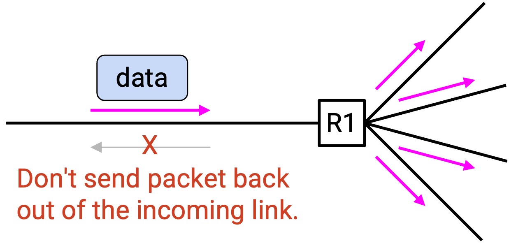

这种朴素方法有两个主要问题：

1. 它浪费 bandwidth。packet 的副本会被不必要地发送到并不需要这个 packet 的 switch 和 host。

2. Flooding 可能导致 packet 形成 loop，并压垮网络。

## Learning Switch

我们先从第一个问题开始：flooding packet 会浪费 bandwidth。

为了解决这个问题，我们希望填充 switch 的 forwarding table，让它们能够直接把 packet 朝目的地转发，而不是把 packet 副本向所有方向 flood。

我们可以运行 routing algorithm 来填充 forwarding table，但更简单的方法是使用 **learning switch**。

假设你是 router R2。你不知道完整 network topology 的任何信息，而且 forwarding table 是空的。你有朝北、朝南、朝东和朝西的 port。

你看到一个 packet 从西侧 port 进来。这个 packet 写着：「From A, To B。」从这个 packet 中，你可以推断 A 一定在你的西侧。

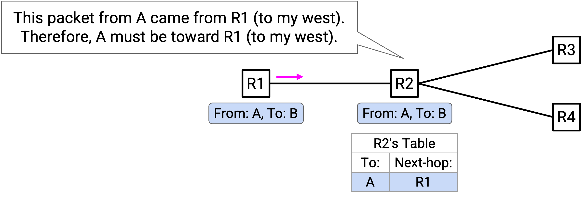

现在，你可以向 forwarding table 添加一条 entry：发往 A 的 packet 应该向西转发。

这就是 learning switch 背后的关键思想。当你收到 incoming packet 时，你会得到关于 *sender* 在哪里的一条线索。你可以用这条信息为 *sender* 填充 forwarding entry。

注意，incoming packet 不会告诉你 recipient 在哪里。在上面的例子中，当你从西侧 port 收到「From A, To B」时，这并不会告诉你 B（recipient）在哪里。相反，你会为 A 填充 forwarding table，这样之后发往 A 的 packet 就可以向西转发。

随着你收到更多 incoming packet，你可以开始在 forwarding table 中填入更多 entry。如果你收到一个目的地不在 forwarding table 中的 packet，仍然可以通过把它 flood 到所有 port（除了 incoming port）来转发这个 packet。

例如，当你从西侧 port 收到「From A, To B」时，你还没有 B 的 forwarding table entry。因此，你应该把这个 packet 从所有 port（除了西侧 port）发出去。

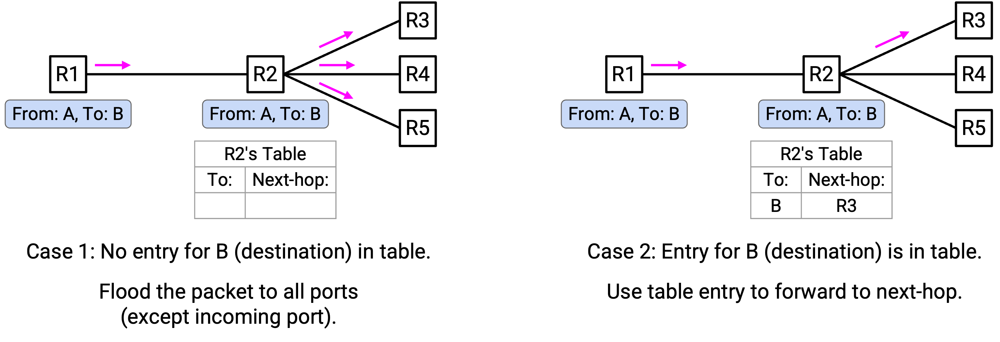

注意：不需要把 packet 从 incoming port（例如西侧）发回去，因为前一个 switch/host（例如你西侧的设备）已经拥有这个 packet 的副本并转发了它（这就是它到达你的方式）。如果你把 packet 再发回去，前一个 switch/host 只会再次做出相同 forwarding decision（要么再次 flooding，要么再次转发回你），而这种重复转发并不能帮助 packet 到达目的地。

总结一下，learning switch 遵循两条规则：

1. 当你收到 incoming packet 时，更新 forwarding table，把 sender 和 incoming port 关联起来。

2. 如果 destination 在 forwarding table 中，就把 packet 转发到正确的 next-hop。否则，把 packet flood 到除 incoming port 之外的所有 port。

下面是 learning switch 运行的一个例子。考虑这个 network topology。所有 switch 都是 learning switch，并且它们的 forwarding table 最初都是空的。

A 向 B 发送 packet。A 把 packet 转发给 R1。

R1 看到 packet「From A, To B」从 Port 1 进入。因此，A 一定在 Port 1 的方向。R1 把这个 mapping 添加到 forwarding table。

R1 不知道 B 在哪里，所以 R1 把这个 packet flood 到所有 port（除了 incoming port）。

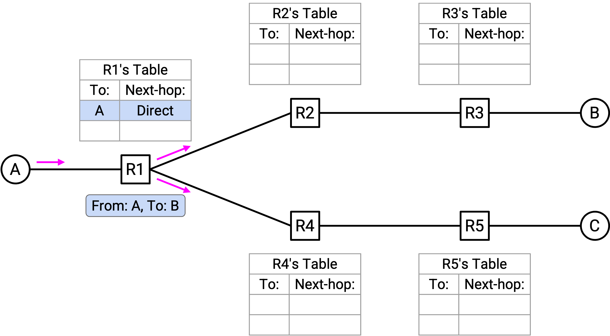

R2 和 R4 都收到「From A, to B」packet。它们现在都有了关于 A 在哪里的线索，并把 A 的 mapping 添加到 forwarding table。它们都不知道 B 在哪里，所以把 packet flood 到所有 port（除了 incoming port）。

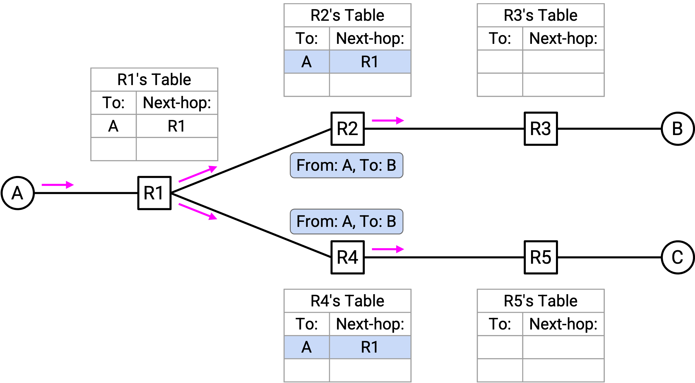

R3 和 R5 都收到「From A, to B」packet。它们现在都有了关于 A 在哪里的线索，并把 A 的 mapping 添加到 forwarding table。它们都不知道 B 在哪里，所以把 packet flood 到所有 port（除了 incoming port）。

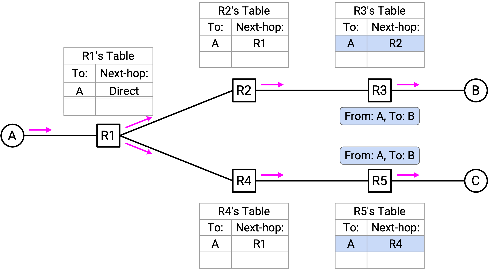

C 收到「From A, to B」packet。C 检查 header，意识到自己不是这个 packet 的预期 recipient，于是丢弃这个 packet。

B 收到「From A, to B」packet。B 检查 header，意识到自己就是 recipient，于是成功接收并处理这个 packet。

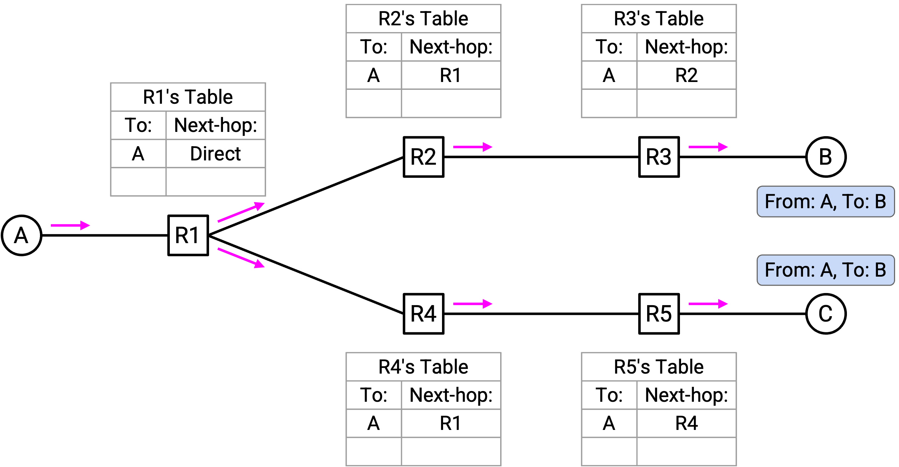

接下来，假设 B 向 A 发送 packet。首先，B 把 packet 转发给 R3。

R3 收到「From B, to A」packet。这给了 R3 关于 B 在哪里的线索，所以 R3 把 B 的 mapping 添加到 forwarding table。另外，R3 注意到 A 已经在 forwarding table 中，因此 R3 可以沿着到 A 的 next-hop 转发 packet（而不是 flooding packet）。

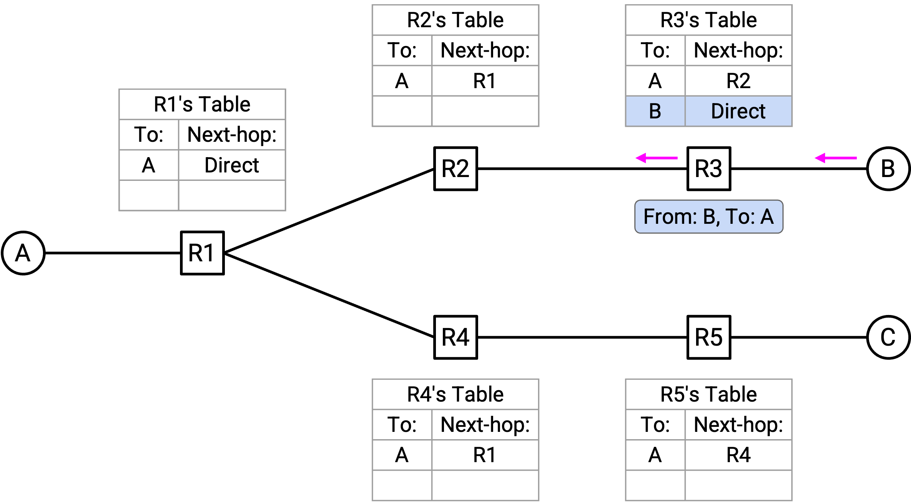

R2 收到「From B, to A」packet。这允许 R2 把 B 的 mapping 添加到 forwarding table。R2 查看 forwarding table，看到 A 的 entry，于是沿着到 A 的 next-hop 转发 packet。

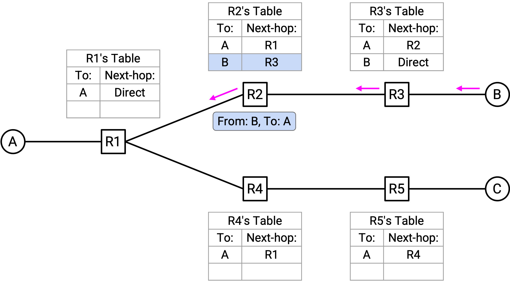

R1 收到「From B, to A」packet。这允许 R1 把 B 的 mapping 添加到 forwarding table。R1 查看 forwarding table，看到 A 的 entry，于是沿着到 A 的 next-hop 转发 packet。

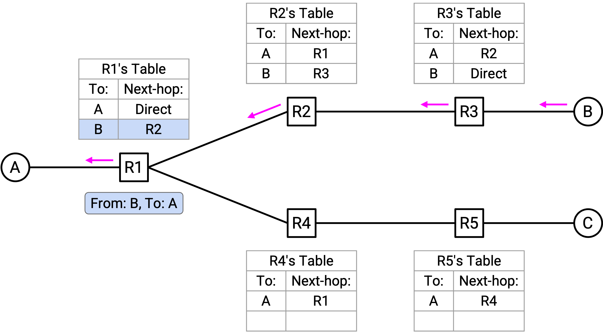

随着发送的 packet 越来越多，forwarding table 中添加的 entry 越来越多，flooding 也会越来越少。

我们还需要添加最后一个特性：当一个 forwarding table entry 被安装时，我们给它分配一个 TTL。如果 TTL 过期，这条 entry 就会被删除。这允许坏掉的 route（例如由于 link、host 或 switch 宕机）过期。例如，如果上面例子中的 B 离开网络，TTL 会确保所有关于 B 的 forwarding table entry 最终都会过期。

## STP 动机：Loop

回忆一下，flooding 有两个问题：它浪费 bandwidth，而且 loop 可能压垮网络。Learning switch 解决了第一个问题，但没有解决 loop 问题。

要理解原因，考虑这个带有 loop 的 topology。假设所有 switch 都是 learning switch，并且所有 forwarding table 一开始都是空的。A 试图向 B 发送 packet，并把 packet 转发给 R1。

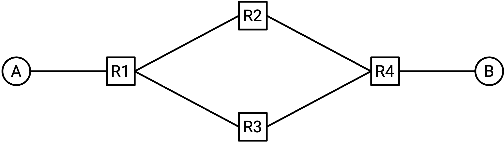

R1 没有 B 的 entry，所以把 packet flood 给 R2（以及 R3）。

R2 没有 B 的 entry，所以把 packet flood 给 R4。

R4 没有 B 的 entry，所以把 packet flood 给 R3。

R3 没有 B 的 entry，所以把 packet flood 给 R1。

R1 仍然没有 B 的 entry，所以把 packet flood 给 R2，cycle 继续。

与此同时，packet 的一个副本也在另一个方向的 loop 中传播：R1 一开始 flood 给 R3，R3 随后 flood 给 R4，R4 再 flood 给 R2，R2 再 flood 给 R1，R1 再 flood 给 R3，cycle 继续。

在整个过程中，switch 会为 A 安装 forwarding entry，但它们永远得不到 B 的 entry，所以 infinite loop 永远无法解决。没有人拥有 B 的 forwarding entry，因此每个人收到 packet 时都会 flood。

这个问题有时称为 broadcast storm，因为网络正被 broadcast traffic 压垮。

我们如何解决这个问题？理想情况下，我们希望「删除」redundant link，让 topology 没有 loop。这样，learning switch 方法就可以正常工作，不会出现 broadcast storm。

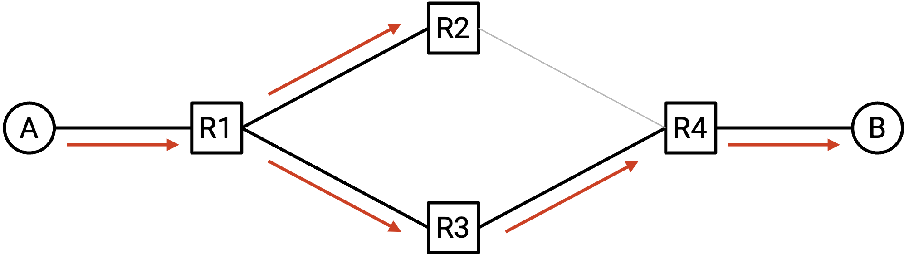

注意：另一种方案可能是在每个 packet 中添加 TTL field，让 packet 在被转发太多次后过期。遗憾的是，Ethernet header 没有 TTL field，所以这个方案无法实现。

注意：另一种方案可能是，如果你之前见过某个 packet，就丢弃它。这需要给每个 packet 附加某种 timestamp 或 unique ID。同样，Ethernet header 没有这样的 header field，所以这个方案也无法实现。

## STP：选举 Root

**Spanning Tree Protocol（STP）** 帮助我们 disable link，使得到的 topology 没有 loop。这会帮助我们避免 broadcast storm。

注意，host 不参与这个 protocol。router 会协同工作，disable link 并从 topology 中移除 loop。因此，描述这个 protocol 时我们会忽略 host。

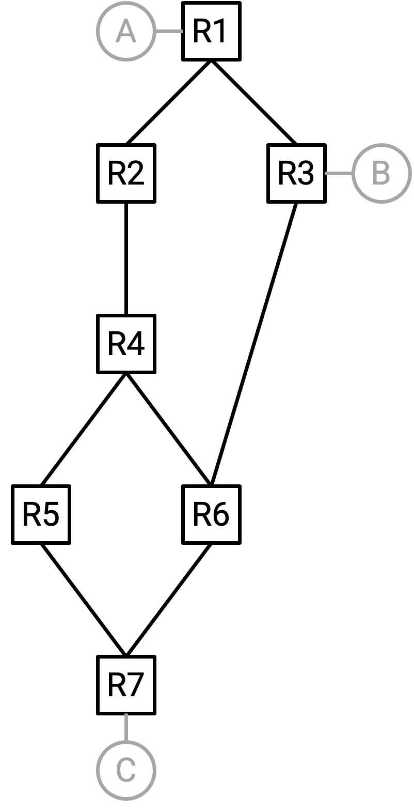

STP 如何决定 disable 哪些 link？我们先用 network 的 global view 来解决这个问题。然后，再思考 switch 如何在没有 global view 的情况下交换 message 来实现这一点。

STP 的第一步是选举一个 **root switch**，方式如下：

每个 switch 会被分配一个 ID，由 priority value（由 network operator 手动设置）和 switch 的 MAC address 组成。

比较两个 switch 时，priority 更低的 switch 拥有更低 ID。如果 priority 相同，那么 MAC address 更低的 switch 拥有更低 ID。

root switch 是 ID 最低的 switch。

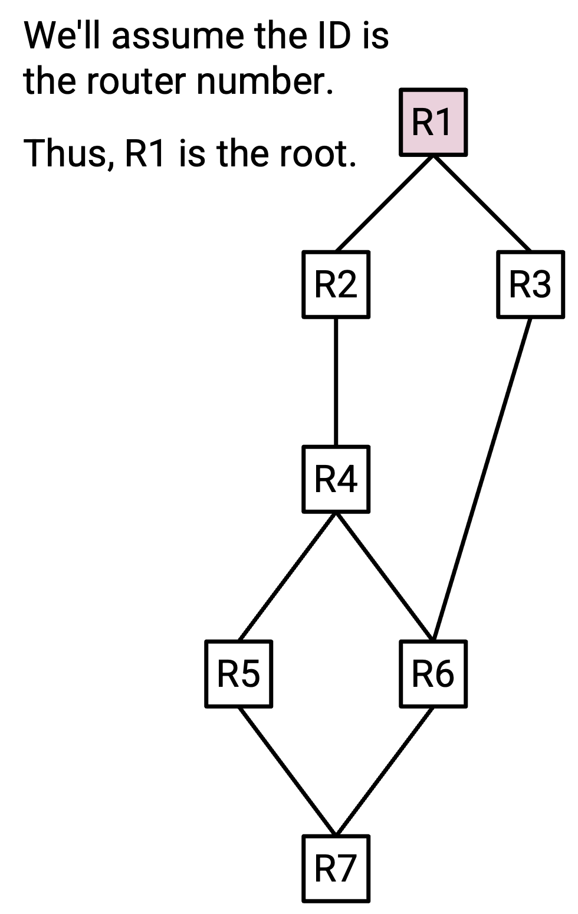

如果 network operator 想选择某个特定 root，可以手动设置不同 switch 的 priority。或者，operator 可以让所有 switch priority 保持默认值，这会导致 MAC address 最低的 switch 被选为 root。在这些讲义中，我们不讨论哪个 root 最好；重要的是，有且只有一个 router 被明确选为 root。

## STP：Port State

现在我们有了 root switch，接下来把每个 switch 上的每个 port 分成三种 state：

1. **Designated Port：** 这些 port 指向远离 root 的方向（也就是它们通向离 root 更远的地方）。

2. **Root Port：** 有一个或多个 port 指向 root 的方向（也就是它们通向离 root 更近的地方）。在这些 port 中，沿 least-cost path 到达 root 的那个 port 是 root port。

3. **Blocked Port：** 所有指向 root、但不是 root port（到达 root 的最佳方式）的 port，都是 blocked port。

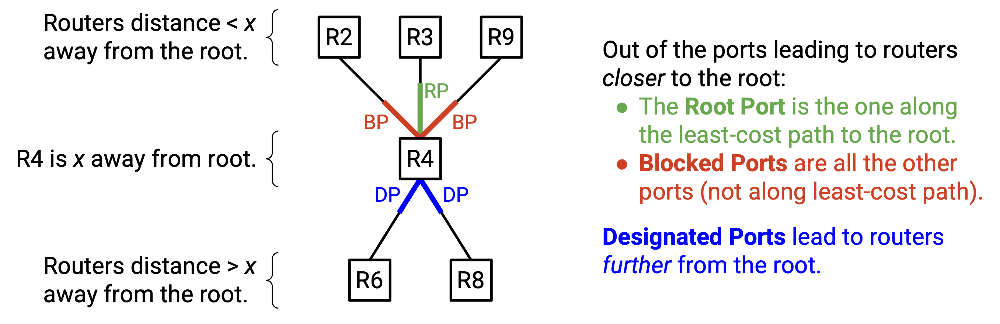

下面是一些 port state 的例子。假设 ID 按 router label 排序。这意味着 R1 拥有最低 ID，因此它被选为 root switch。

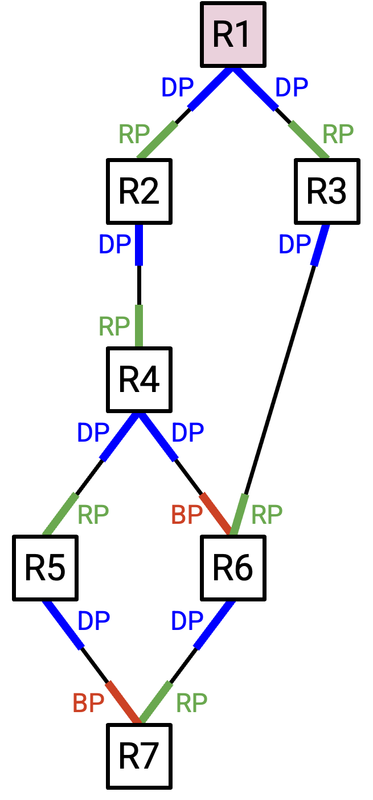

root switch（R1）上的所有 port 都指向远离 root 的方向，所以它们全都是 designated port。

R2 有两个 port。其中只有一个指向 root，所以它一定是到 root 的最佳路径。因此，R2 朝上的 port 被标记为 root port。

R2 的另一个 port 指向远离 root 的方向，所以 R2 朝下的 port 被标记为 designated port。

R6 有三个 port。朝下的 port 指向远离 root 的方向，所以它是 designated port。

在 R6 上，通往 R4 和 R3 的 port 都指向 root。然而，通往 R3 的 port 提供到 root 的 least-cost path（cost 2），而通往 R4 的 port 提供更差的路径（cost 3）。因此，我们把通往 R3 的 port 标记为 root port（到 root 的最佳方式），把通往 R4 的 port 标记为 blocked port（指向 root，但不是最佳路径）。

有时会出现 tie，也就是有两条到 root 的最佳路径。

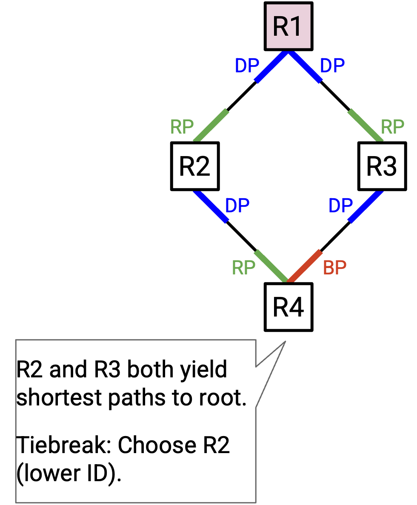

例如，在 R4 上，通往 R2 和 R3 的 port 都指向 root，并且它们都提供 cost-2 的到 root 路径。遇到 tie 时，我们会说 next-hop ID 更低的路径是到 root 的更好路径。这使得通往 R2 的 port 成为 root port，而通往 R3 的 port 成为 blocked port。

有时，我们会遇到一条 link 通向一个距离 root 同样远的地方。

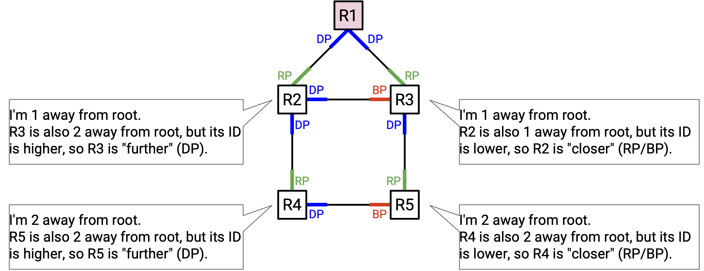

例如，R4 距离 root 为 2，并且它有一条 link 通向 R5，而 R5 距离 root 也是 2。这里我们再次使用 router ID 作为 tiebreaker。如果 link 通向 ID 更高的 router，我们会说这条 link 指向远离 root 的方向。如果 link 通向 ID 更低的 router，我们会说这条 link 指向 root。在这个例子中，R4 朝右的 port 指向远离 root 的方向（通向同样距离但 ID 更高的地方），所以它是 designated port。另一方面，R5 朝左的 port 指向 root（通向同样距离但 ID 更低的地方），所以它要么是 root port，要么是 blocked port。

## STP：Disable Link

现在，每个 port 都已经被分配了 state（designated port、root port 或 blocked port），我们可以开始从 network topology 中移除 loop。

要移除 loop，每个 switch 只需要假装自己的 blocked port 不存在。换句话说，不从这个 port 发送任何 user data，也不从这个 port 接收任何 user data。

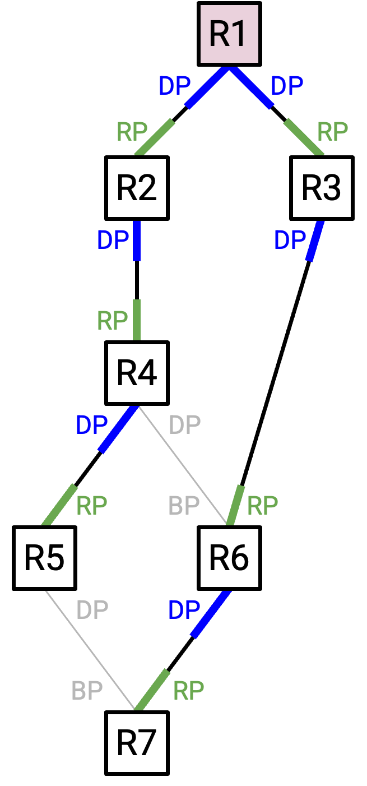

（注意：这里指定 user data，是因为 STP packet 仍然可以从 blocked port 发送和接收。这会允许 STP 在 topology 改变时重新启用 blocked port。）

如果我们停止沿 blocked port 发送 user data，那么任何带有 blocked port 的 link 最终都会被 disable。

为什么这能工作？从某个特定 switch 的角度来思考。你的 root port 是你到达 root 的最佳方式。你的 blocked port 也指向 root，但它们不是到 root 的最佳路径。这意味着 blocked port 实际上创建了一条 redundant（但更差）的到 root 路径，所以我们应该 disable 这条 link。

你可能有一个担心：如果你 block 了一个 port，但其他人需要使用这条被 disabled 的 link，在前往 root 的路上向你转发 packet，怎么办？幸运的是，这永远不会发生。记住，你的 blocked port 指向 root（也就是说，你更远，而另一侧比你更靠近 root）。因此，如果另一侧（更近）的 switch 向你（更远）转发 packet，它们是在把 packet 远离 root 的方向转发。这意味着我们可以安全地 block 这个 port 并 disable 这条 link，而不用担心其他 switch 试图把这条 link 用作自己通往 root 路径的一部分。

相比之下，designated link 不能安全地 disable，因为它们通向远离 root 的方向（也就是 link 另一侧的 switch 比你离 root 更远）。另一侧的 switch 可能确实想向你转发 packet，因为你位于它们到 root 的最佳路径上。幸运的是，这也不是问题。虽然你不能安全地 disable 这条 link，但可以依赖另一侧的 switch：如果它不需要这条 link，它会 disable 这条 link。另一侧比你更远，所以如果这条 link 是它到 root 的最佳路径（即 root port），它会保留这条 link；如果不是它到 root 的最佳路径（即 blocked port），它会 disable 这条 link。

使用这种策略，每条 link 只会被一侧 disable。更远的那一侧会问这个问题：我是否把这条 link 用作到 root 的最佳路径？如果是，这条 link 的 port 是 root port。如果不是，这条 link 的 port 是 blocked port。

更近的那一侧总是把这条 link 的 port 设为 designated port。这样做的效果是，把 disable 的决定留给更远的一侧。这很好，因为更近的一侧并不知道更远的一侧是否会把这条 link 用作到 root 的最佳路径。

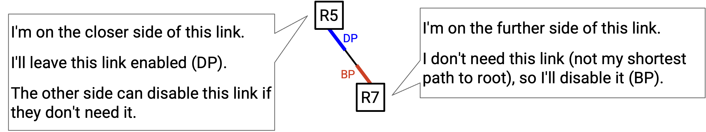

## STP：Designated Port

旁注：为什么称它们为 designated port？到目前为止，我们画的 network 中每条 link 都连接两台机器，但记住，有时 link 可以连接多台计算机。

假设连接两个 switch 的一条 link 上还连接了许多 host。如果这些 host 想发送或接收 data，它们会把 data 发送到 designated port，而不是 blocked port。（blocked port 不会接收任何 user data。）这确保它们的 data 只沿一条路径到达 destination。如果 data 被同时发往 designated port 和 blocked port，data 可能会沿两条路径到达 destination，从而产生 loop。

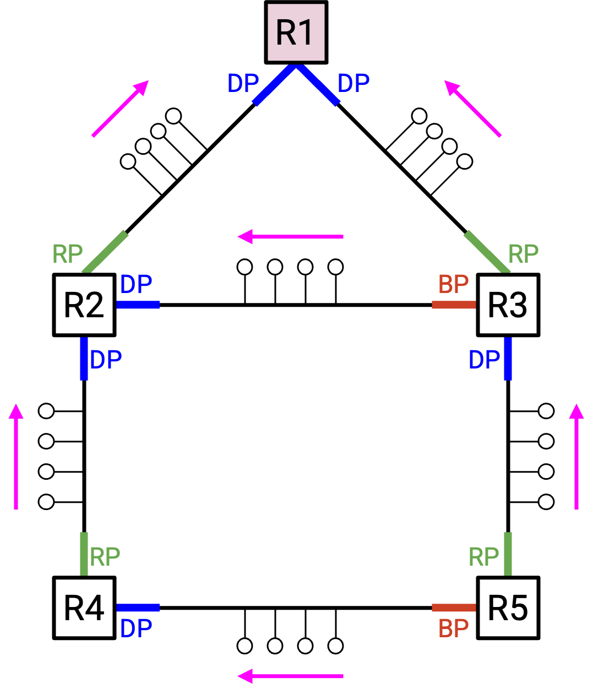

带着这个理解，designated port 的另一个等价解释是：link 上的 host 应该把 data 发送到 designated port，以到达 root（或 spanning tree 上的任何其他地方）。从 switch 的角度看，designated port 指向远离 root 的方向。从 host 的角度看，发送到 designated port 会让它们更接近 root（或 spanning tree 上的任何其他地方）。

## STP：BPDU 交换

我们现在知道如何使用 STP disable link，并从 network topology 中移除 loop。然而，目前为止我们的 protocol 假设拥有 network 的 global knowledge。你需要 global view 来识别 root，并决定 port 是指向 root 还是远离 root。

为了让 switch 学到给自己的 port 打标签所需的信息，switch 会交换称为 **Bridge Protocol Data Units（BPDUs）** 的 message。它们基本上和我们在其他 routing protocol 中交换的 control-plane routing message 是同一种东西，只是名字更花哨。注意，这些 control-plane message 不同于 data-plane user packet（也就是我们实际转发的数据）。

当 protocol 开始时，每个 switch 都认为 root 是自己，并且到 root（自己）的 cost 是 0。

随着 protocol 运行，每个 switch 会跟踪自己认为 root 是谁，以及到这个 root 的 best-known path（和这条 path 的 cost）。

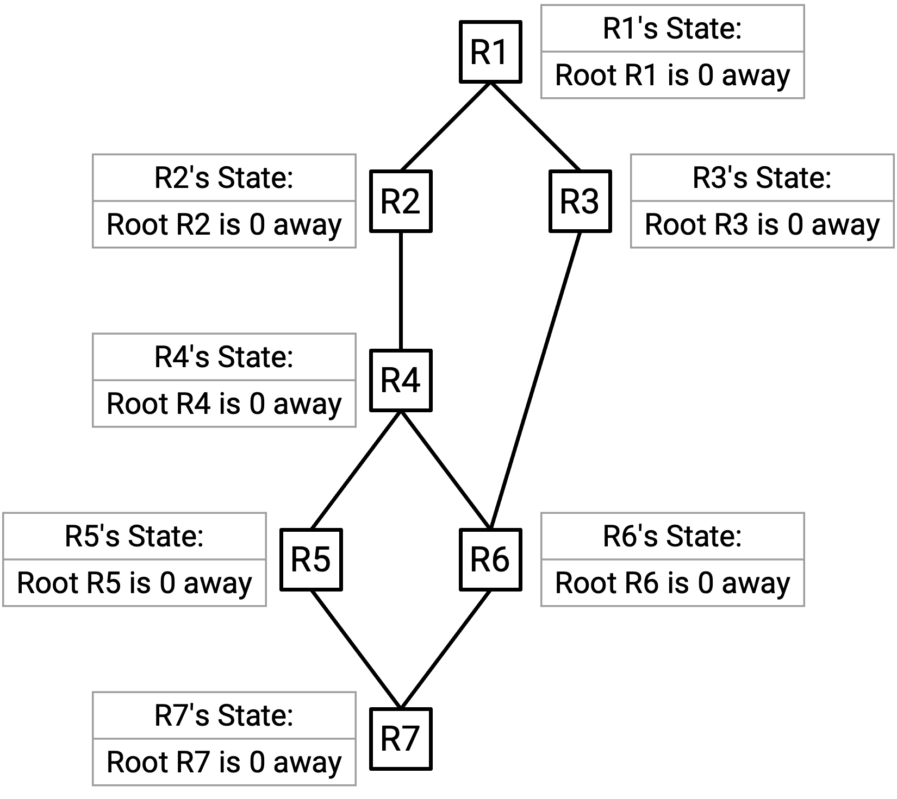

发送 BPDU 时，你会包含两部分信息：你认为 root 是谁，以及你距离 root 多远。例如，一条 BPDU 可能说：「root 是 R2，我可以用 cost 7 到达 R2。」

收到 BPDU 时，你会检查它是否包含任何「更好」的信息。BPDU 可能因为两个原因而更好：

1. BPDU 中的 root 拥有更低 ID。这意味着你发现了一个更好的 root。你应该放弃当前 root 和 cost，改为采用新的 root 以及到新 root 的 path。

2. BPDU 中的 root 相同，但 BPDU 提供了到 root 的更好路径。你应该采用这条到 root 的新 path。

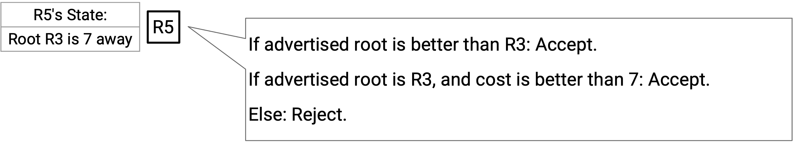

到 root 的 cost 计算方式和 distance-vector protocol 中一样。例如，假设你的 neighbor 告诉你：「root 是 R2，我可以用 cost 7 到达 R2。」那么你到 root 的 cost 就是你到 neighbor 的直接 link cost，加上 neighbor 到 root 的 cost（如 advertisement 中所指定）。

当你更新自己的 state（你认为 root 是谁，或到 root 的 best-known cost）时，应该向 neighbor 发送 BPDU，通知它们你的新 state。

一旦 protocol convergence，这个 state 会给每个 switch 足够的信息来标记自己的所有 port。你知道到 root 的最佳路径，所以可以把相应 port 标记为 root port。

你的 neighbor 也都告诉了你它们距离 root 多远。如果某个 neighbor 说它更远，那么你可以把对应 port 标记为 designated port。如果某个 neighbor 说它更近（但它不在你到 root 的最佳路径上），那么你可以把对应 port 标记为 blocked port。

BPDU 会定期交换，这样如果 network topology 发生变化，protocol 就可以适应，并为新的 topology 找到一棵 spanning tree（也就是 disable link）。

## STP：BPDU 交换示例

router 会并行发送和接收 BPDU exchange，因此并不存在某个特定 router 发送第一条 BPDU。在这个例子中，我们展示会被发送的一部分 BPDU。

R3 的初始 state 写着：Root R3 is 0 away。R3 的第一条 advertisement 会把这个 state 发送给 neighbor。

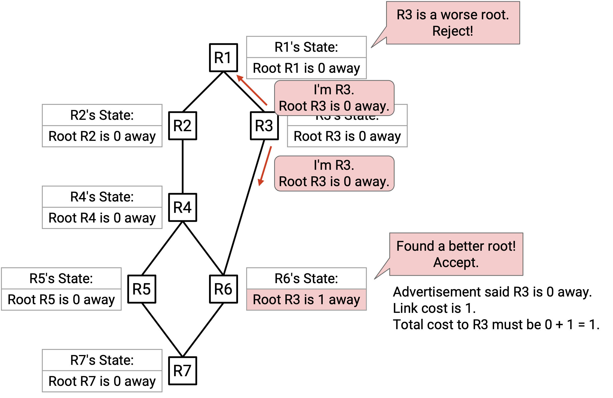

R1 听到这条 advertisement。R1 当前认为 root 是 R1，而 advertisement 提供的 root 是 R3。被 advertise 的 root 更差（ID 更高），所以 R1 拒绝这条 advertisement。

R6 听到这条 advertisement。R6 当前认为 root 是 R6，而这条 advertisement 提供的 root 是 R3。被 advertise 的 root 更好，所以 R6 接受这条 advertisement。R6 更新后的 state 写着：Root R3 is 1 away。注意：这个 cost 是由 R3 的 advertisement 中的 cost 0，加上到 R3 的 link cost 1 计算出来的。

此时，R6 已经更新了 state，所以它会向 neighbor 发送一条 advertisement（这个 demo 中没有显示）。

一段时间后，R1 向 neighbor 发送一条带有自己 state 的 advertisement：Root R1 is 0 away。

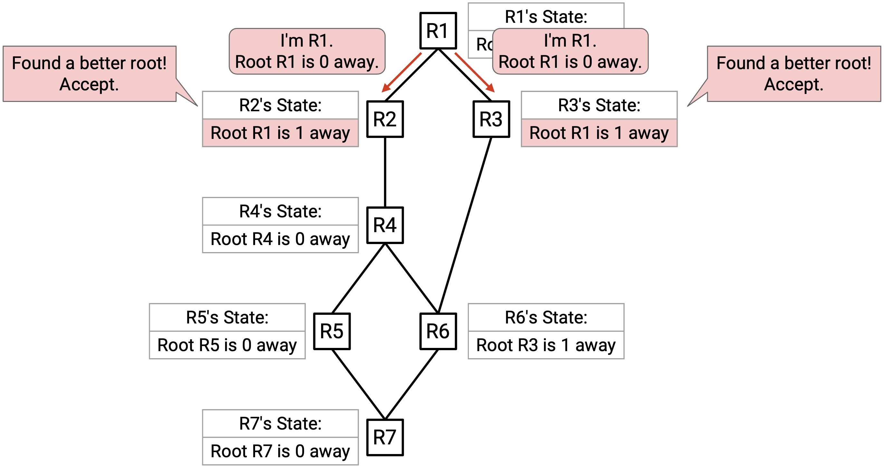

R2 听到这条 advertisement。被 advertise 的 root（R1）比当前 best-known root（R2）更好，所以 R2 接受这条 advertisement。R2 更新后的 state 写着：Root R1 is 1 away。

类似地，R3 听到这条 advertisement，并接受它，因为被 advertise 的 root（R1）比当前 best-known root（R3）更好。R3 更新后的 state 写着：Root R1 is 1 away。

R2 和 R3 已经更新了它们的 state，所以它们会各自向 neighbor 发送 advertisement。

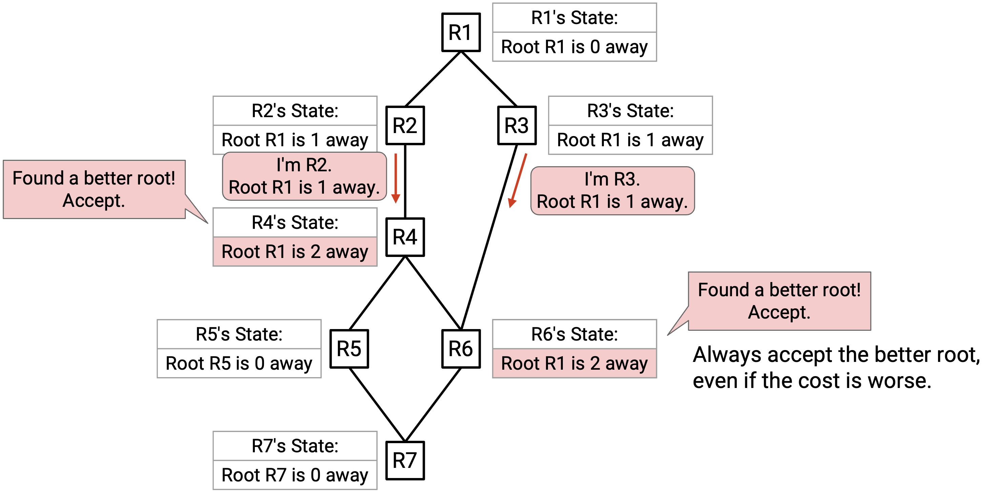

R4 听到来自 R2 的 advertisement。被 advertise 的 root（R1）比当前 best-known root（R4）更好，所以 R4 接受这条 advertisement。R4 更新后的 state 写着：Root R1 is 2 away。注意：这个 cost 是把 R2 的 advertisement 中的 cost 1，加上到 R2 的 link cost 1 相加得到的。

R6 听到来自 R3 的 advertisement。被 advertise 的 root（R1）比当前 best-known root（R3）更好，所以 R6 接受这条 advertisement。R6 更新后的 state 写着：Root R1 is 2 away。注意：R6 的旧 state 说 R3 距离 1，而新 state 说 R1 距离 2。尽管新 state 的 distance 更高，它仍然更好，因为新 state 拥有更好的 root。

R4 和 R6 已经更新了 state，所以它们会带着更新后的 state 向 neighbor 发送 advertisement。我们先展示 R4 的 advertisement，稍后再回到 R6（再次记住，现实中这些都在并行发生）。

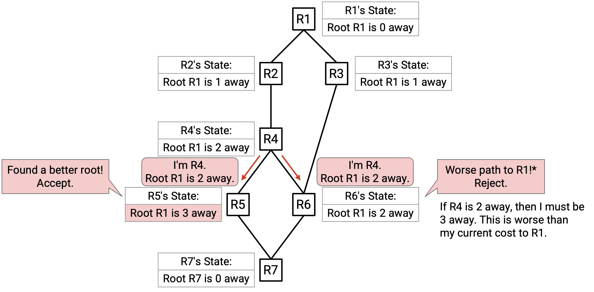

R5 听到来自 R4 的 advertisement。被 advertise 的 root（R1）比当前 best-known root（R5）更好，所以 R5 接受这条 advertisement。R5 更新后的 state 写着：Root R1 is 3 away（来自 advertisement 的 2，加上到 R4 的 link cost 1）。

R6 也听到来自 R4 的 advertisement。被 advertise 的 root（R1）和当前 best-known root（R1）相同，所以需要检查 cost。接受这条 advertisement 会得到 cost 2（来自 advertisement），再加上到 R4 的 link cost 1，总计 3。当前 best-known cost 是 2。因此，R6 拒绝这条 advertisement（3 比 2 更差）。

R5 已经更新了 state，所以它会带着更新后的 state 向 neighbor 发送 advertisement。

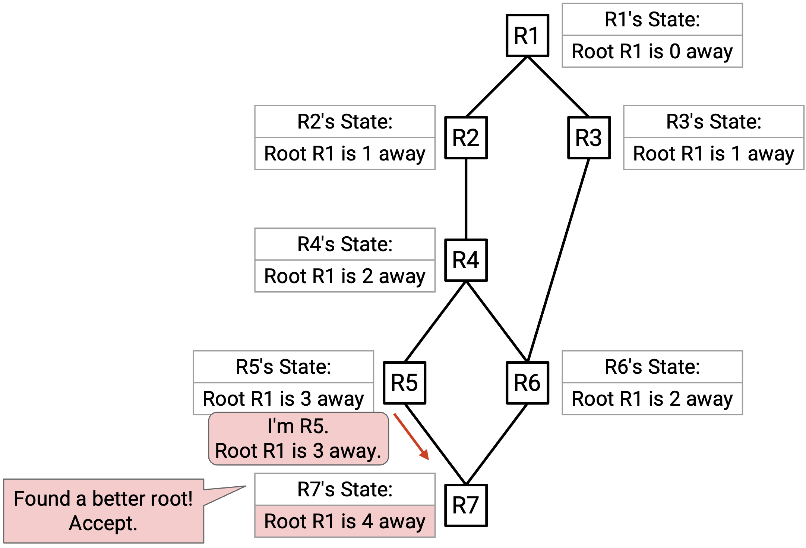

R7 听到来自 R5 的 advertisement。被 advertise 的 root（R1）比当前 best-known root（R7）更好，所以 R7 接受这条 advertisement。

R7 已经更新了 state，并且会向 neighbor 发送 advertisement，不过这里没有显示那条 advertisement（R6 会因为它到 root 的 cost 更差而拒绝它）。

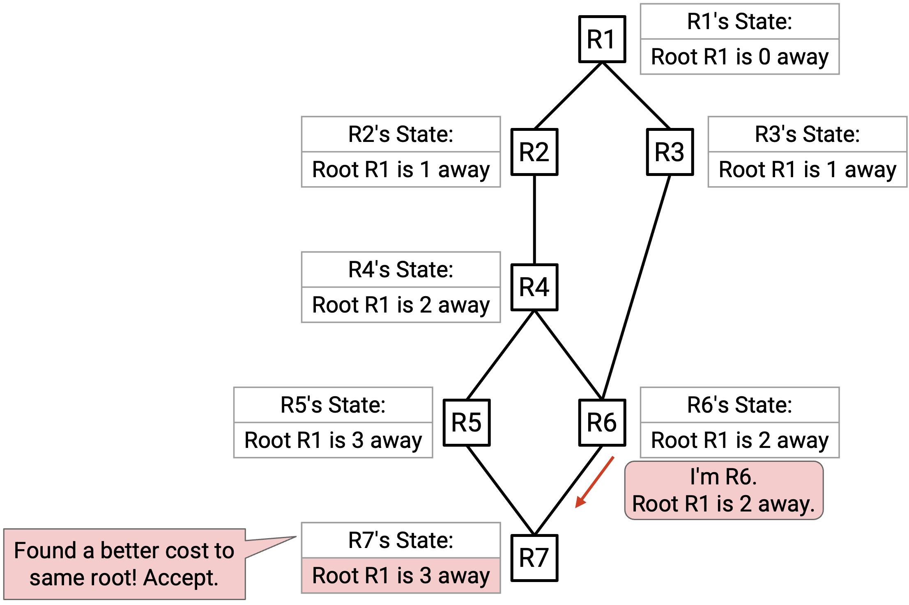

继续前面的过程，R6 向 neighbor 发送 advertisement，R7 收到这条 advertisement。被 advertise 的 root（R1）和当前 best-known root（R1）相同，所以需要检查 cost。接受这条 advertisement 会得到 cost 2（来自 advertisement），再加上到 R6 的 link cost 1，总计 3。当前 best-known cost 是 4。因此，R7 接受这条 advertisement（3 比 4 更好），并把自己的 state 更新为 cost-to-root 为 3（而不是 4）。

router 会继续彼此定期交换 advertisement。这个 demo 没有展示所有 advertisement，但最终 protocol 会 converge，所有 router 都会知道 root 是 R1。另外，所有 router 都会知道自己到 root 的 cost。

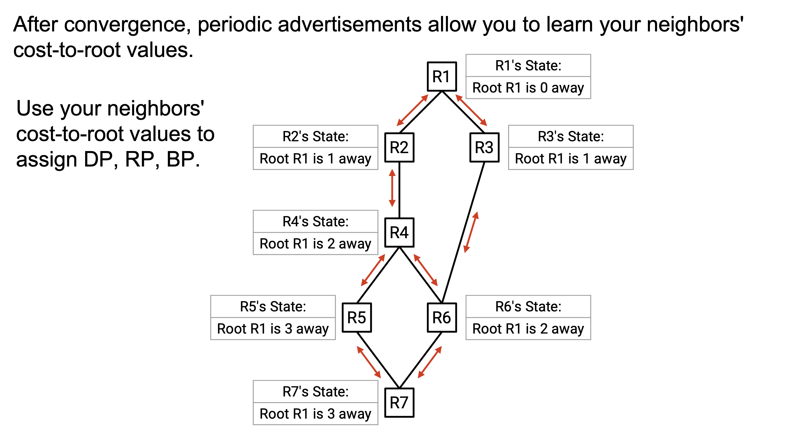

一旦所有 router 都知道自己到共同认可的 root 的 cost，它们就可以交换 periodic advertisement。这允许 router 学到 neighbor 的 cost-to-root value，进而让 router 把 port 分配为 DP、RP 或 BP。
