# NAT: Network Address Translation

## Motivation: IPv4 Address Exhaustion

回忆一下，IPv4 地址只有 $$2^{32}$$ 个，这不足以为 Internet 上的每一台 host 都分配地址。我们已经见过，IPv6 是解决 IPv4 地址耗尽问题的稳健方案，但 IPv6 的采用速度一直比较慢。

在此期间，为了节省地址，IANA 分配了一些特殊的 RFC 1918 私有 IP 地址范围，任何不需要 Internet 地址的网络都可以使用它们：192.168.0.0/16、10.0.0.0/8 和 172.16.0.0/12。事实证明，这些地址也经常用在你的家庭网络里，这样你的个人设备就不需要拥有唯一的 IP 地址。但是，你仍然需要访问 Internet，那么怎样才能使用私有 IP 地址上网呢？

## NAT: Conceptual

在 NAT 中，目标是用一个公共 IP 地址代表本地网络中的许多 host。技巧是让 gateway router 在发送消息之前，把私有 IP 地址转换成那个唯一的公共地址。随后，对于收到的回复，router 再把公共地址转换回私有地址。

Alice、Bob 和 Chuck 都在 Joe's Tire Shop 工作。他们拥有私有 IP 地址 A、B 和 C，这些地址不能在广域 Internet 上使用，因为它们并不唯一。相反，Joe's Tire Shop 中的所有人必须共享同一个公共 IP 地址，这是他们唯一拥有的、全局唯一且外部可理解的 IP 地址。

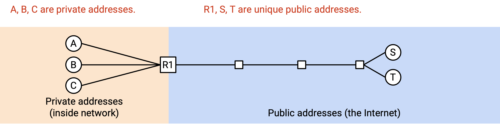

Alice 想给一个外部公共 server 发送消息，这个 server 的公共 IP 地址是 S。她发送一个 packet，内容是「From: A, To: S」。如果我们天真地直接发送这个 packet，S 就无法发送回复，因为 A 是私有 IP 地址。

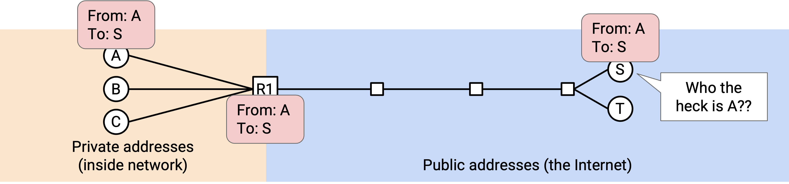

相反，当 packet 到达 gateway router 时，router 会重写 header，使其变成「From: R1, To: S」。router 同时做一条记录：如果我收到来自 S 的任何回复，它们应该发给 A。

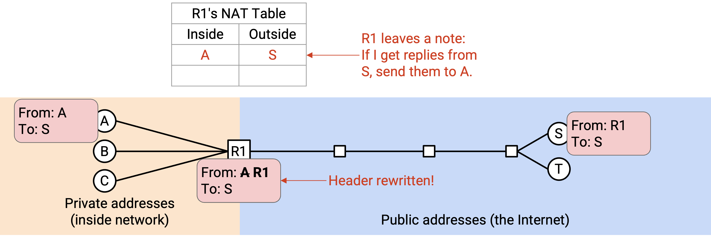

现在，S 收到 packet 后，就可以向公共地址 R1 发送回复：「From: S, To: R1」。当 gateway router R1 收到这个回复时，它会查看自己的记录，并把 header 重写成「From: S, To: A」。然后，这个 packet 就会被发回 A。

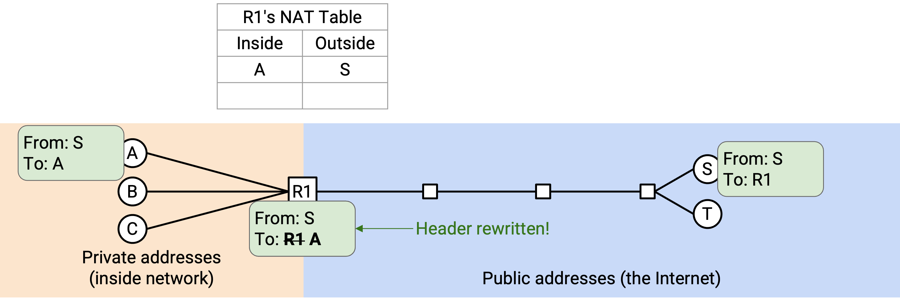

现在，Alice、Bob 和 Chuck 都可以发送出站 packet。当 router 收到一个 packet 时，它必须记住外部 destination 和内部 sender 之间的映射。（「B 刚刚给 N 发送了一个 packet，所以来自 N 的任何回复都应该发回 B。」）

如果 Alice 和 Bob 都想和 S 通信，就会出现一个问题。

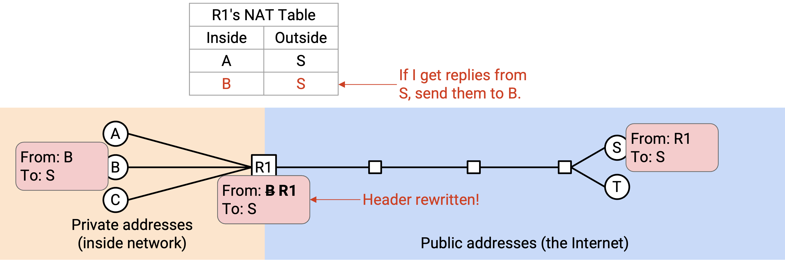

现在，如果来自 S 的回复到达 router，就会产生歧义：router 应该把这个回复发给 A，还是发给 B？

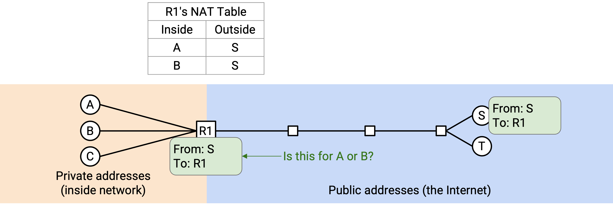

我们可以用 Layer 4 的逻辑端口解决这个问题。Alice 的连接写作：「From: A, Port 50000, To: S, Port 80」。router 像之前一样把它重写成「From: R1, Port 50000, To: S, Port 80」。现在记录会写成：如果我收到来自 S、Port 80，发往 R1、Port 50000 的任何回复，它应该发给 A。

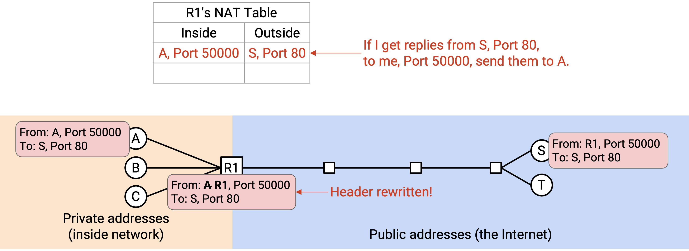

Bob 可以建立另一条连接：「From: B, Port 60000, To: S, Port 80」。router 像之前一样把它重写成「From: R1, Port 60000, To: S, Port 80」。这条连接的记录会写成：如果我收到来自 S、Port 80，发往 R1、Port 60000 的任何回复，它应该发给 B。

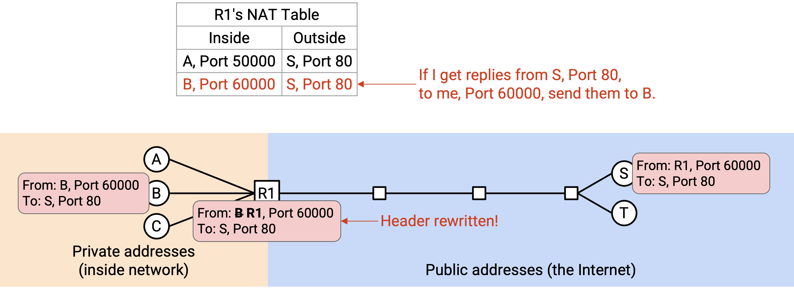

更一般地说，router 现在用 5-tuple 跟踪连接：source IP、destination IP、protocol、source port 和 destination port。当 router 收到出站 packet 时，它把私有 source IP 改成公共 source IP，并记录这个 5-tuple。随后，当 router 收到入站 packet 时，它会查找这个 packet 属于哪条连接，并把 packet 发给相应的 client（使用该 client 的私有 IP）。

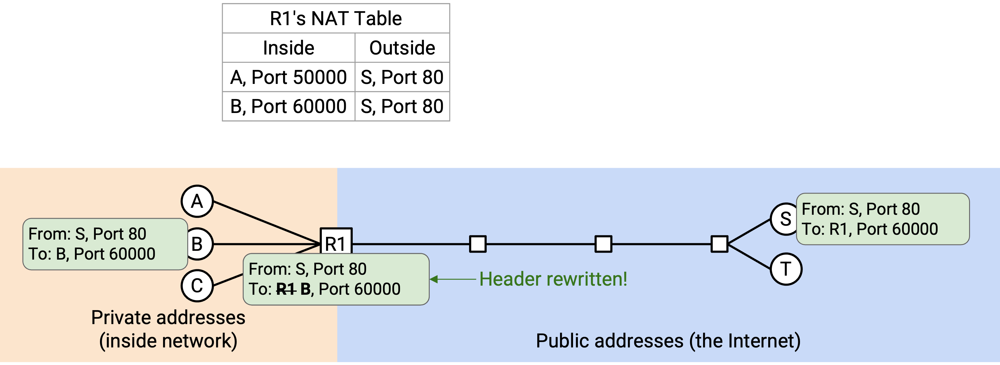

## Rewriting Client Port Numbers

我们还有最后一个问题：如果 Alice 和 Bob 没有分别选择 Port 50000 和 Port 60000，而是选择了同一个端口号（例如 Port 50000），会怎样？

现在，router 记住了两条连接：（A Port 50000 到 S Port 80）和（B Port 50000 到 S Port 80）。如果 router 收到一个入站 packet「From: S, Port 80, To: R1, Port 50000」，它就无法判断这个 packet 属于 A 的连接还是 B 的连接。

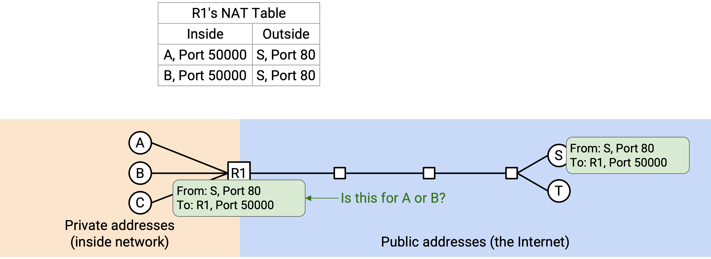

最后一个修复是：也允许 router 重写端口号。当 Bob 发送「From: B, Port 50000, To: S, Port 80」时，router 会发现已经有人在使用 Port 50000 连接到 S 的 Port 80。因此，router 为 Bob 编造一个「假」端口号（这里用 60000），并同时重写 source IP 和 source port，得到：「From: R1, Port 60000, To: S, Port 80」。

像之前一样，router 记住 Alice 的活动连接（A Port 50000 到 S Port 80）。但对于 Bob，router 还会额外记录这个假端口号：（B Port 50000，伪装成 60000，到 S Port 80）。

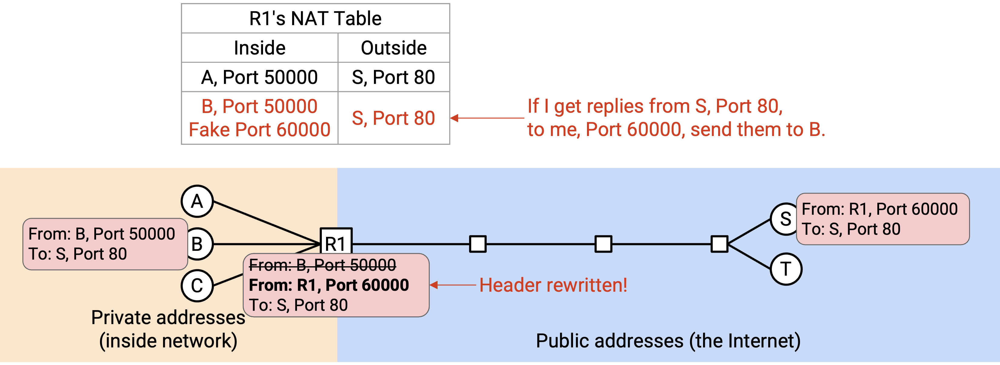

现在，如果 router 收到入站 packet「From: S, Port 80, To: R1, Port 50000」，它一定是发给 Alice 的。相反，如果入站 packet 是「From: S, Port 80, To: R1, Port 60000」，带有这个假端口号，那么它一定是发给 Bob 的。

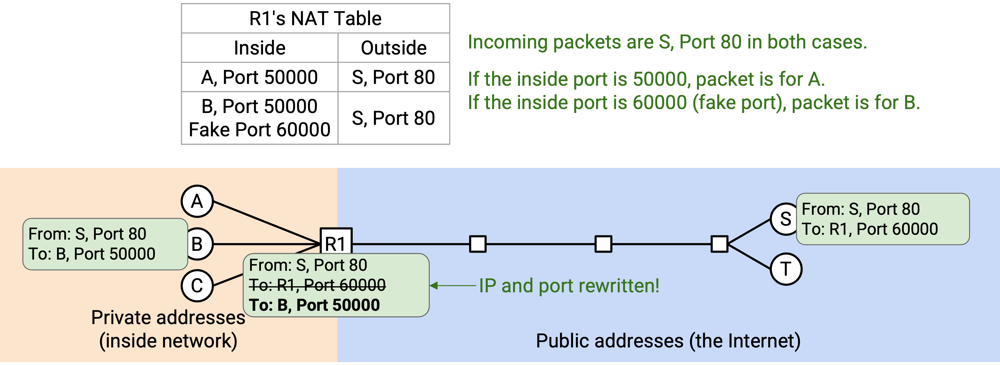

注意，Bob 并不知道 router 正在修改他的端口号。当 router 把这个 packet 转发回 Bob 时，假端口号必须改回原来的端口号。「From: S, Port 80, To: R1, Port 60000」必须被重写成「From: S, Port 80, To: B, Port 50000」。更一般地说，所有私有 client 都不应该需要知道或关心自己的 packet 被重写了。router 应该给它们一种假象：它们正在使用自己的私有 IP 地址和自己选择的端口发送、接收 packet。

## NAT: Implementation

当家庭 router 第一次连接到 ISP 时，它可以运行 DHCP 来获取 IP 地址。（前面我们讨论过 host 运行 DHCP，但 router 也可以运行 DHCP。）ISP 的 DHCP server 会回复，并给家庭 router 分配一个 IP 地址。这就是该 router 家庭网络中所有 host 要共享的单个公共地址。

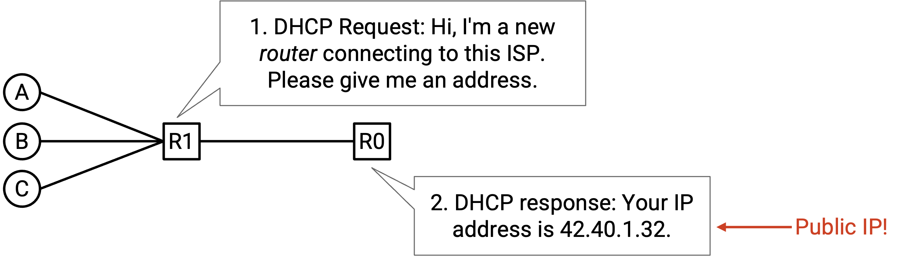

NAT 有几种不同模式。我们刚刚看到的模式称为 **Port Address Translation (PAT)**，它让我们能够引入前面看到的假端口号。PAT 模式要求 router 理解 Layer 4 protocol，这样才能解析 packet、跟踪连接并重写 header。

PAT 是最复杂、也最广泛使用的 NAT 模式，但 NAT 也有更简单的一对一地址转换模式。如果每台 host 实际上都有自己的 IP 地址，但它们从私有地址发送 packet，router 就可以只做一对一转换，把 10.0.0.1（私有）映射到 42.0.2.1（公共），把 10.0.0.2（私有）映射到 42.0.2.2（公共），以此类推。这种更简单的模式不能通过把多个 host 隐藏在单个公共地址后面来节省 IP 地址，但在其他场景中仍然有用。

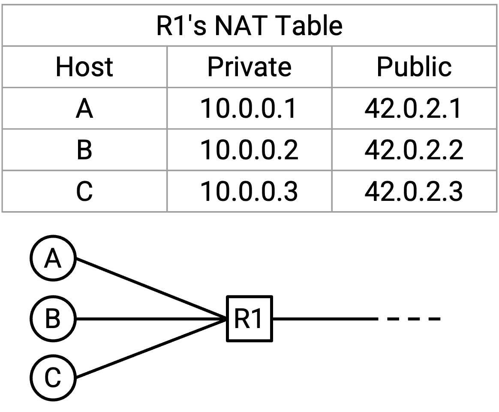

## Where is NAT Used?

NAT 会增加 router 转发 packet 的复杂度。router 现在除了要解析 Layer 3 header，还必须能够解析 Layer 4 header。此外，router 还必须能够重写 Layer 3 和 Layer 4 header。最后，router 必须维护一张连接状态表，用来跟踪所有经过它的 flow。所有这些功能都会增加转发每个 packet 所需的 CPU cycle，也会增加 router 为每条 flow 所需的内存。

由于 NAT 会增加 router 的复杂度，它通常会尽可能靠近网络边缘执行，以限制经过该 router 的 flow 数量。在你的家庭 router 上运行 NAT 是合理的，因为家里不会有太多设备通过家庭 router 发起连接。相反，在高性能 datacenter router 上运行 NAT 就不是一个好主意。

实践中，即使到今天，IPv4 中几乎每个个人（家庭或办公）网络都会使用小规模 NAT。随着 IPv4 地址耗尽，ISP 无法再给每个客户（也就是每个家庭 router）分配一个公共地址。因此，ISP 网络本身也不得不运行一种更复杂的 NAT，称为 Carrier Grade NAT (CGNAT)。这个版本的 NAT 部署在网络更深处，并要求 router 跟踪多得多的连接。

注意，我们通常不会为 IPv6 使用 NAT，因为 IPv6 地址足够多，可以给世界上的每台计算机分配唯一的公共地址。

## Inbound Connections

到目前为止，我们一直假设连接总是由拥有私有 IP 地址的 client 发起。换句话说，第一个 packet 总是出站的，从 client 发往 server。这符合大多数家庭网络的运行方式。当你在浏览器中加载网站时，你就是发起连接的 client。通常并不会有其他人试图主动连接到你。

但是，如果你正在运行一个 server，并且确实希望外部世界的人能够主动连接到这个 server，会怎样？外部用户不能向私有 IP 地址发送 packet。他们可以尝试向 router 的 IP 地址发送 packet，但如果 router 收到一个类似「From: outside user, To: R1, Port 28」的 packet，router 并不知道应该把它转发给哪一个私有 client。这是新连接的第一个 packet，所以 router 的表中还没有这条连接的信息。

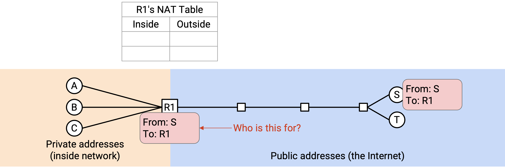

为了允许入站连接，执行 NAT 的 router 需要一张 **port mapping table**。位于网络内部、只有私有 IP 地址的 Alice 告诉 router：我要运行一个新的 server，并在 Port 28 上监听请求。现在，如果 router 看到某个外部用户发往 R1、Port 28 的 packet，router 就知道应该把这个 packet 转发给 Alice。

这张 port mapping table 中的条目可能需要手动指定（例如 Alice 手动配置 router）。UPnP (Universal Plug-n-Play) 和 NAT-PMP (NAT Port Mapping Protocol) 等动态协议允许动态配置开放端口。这些协议有时会被在线游戏等需要入站连接的 application 使用。

## Security Implications of NAT

NAT 打破了 end-to-end principle。到目前为止，我们说过，在 Layer 3 中，Internet 上的任何人都可以到达其他任何人。然而，因为 NAT 默认不允许入站连接，所以家庭网络中的用户只有私有 IP 地址，并且共享一个公共 IP 地址，外部无法自动到达他们。只有先配置 router，他们才能接收入站 packet。

NAT 具有默认不允许入站连接的性质。这可以被看作一种安全特性，尽管它更像是副作用，而不是有意设计出来的安全机制。NAT 会让入站连接默认被阻止，这可能有助于阻止攻击者尝试连接网络内部的 host。这种行为其实和 firewall 很相似（更多信息可参见 UC Berkeley CS 161 notes），firewall 也经常默认阻止入站连接。也就是说，这主要是一种巧合，所以 NAT 并没有真正实现一套原则化的安全策略，也不应该被看作万无一失的防御。

NAT 还有一个副作用：它可以帮助保护 client 的隐私。再次强调，这也并不是真正有意设计的安全特性。因为 router 会重写 client 的 IP 地址，所以 server 收到 packet 时，并不知道原始 sender 的身份（可能是 Alice、Bob 或 Chuck）。

相反，如果我们不使用 NAT，server 就可以知道 sender 的确切身份。此外，如果我们不使用 NAT，而是使用 IPv6，server 甚至可能知道 sender 正在使用哪一台确切的计算机，因为 IPv6 地址有时会用 MAC 地址自动配置（把 MAC 地址中的 bit 复制到 IP 地址中）。如果我们使用 IPv6，同时仍然希望保护 client 隐私，也确实存在一些替代方案，例如 IPv6 temporary/privacy addresses。
