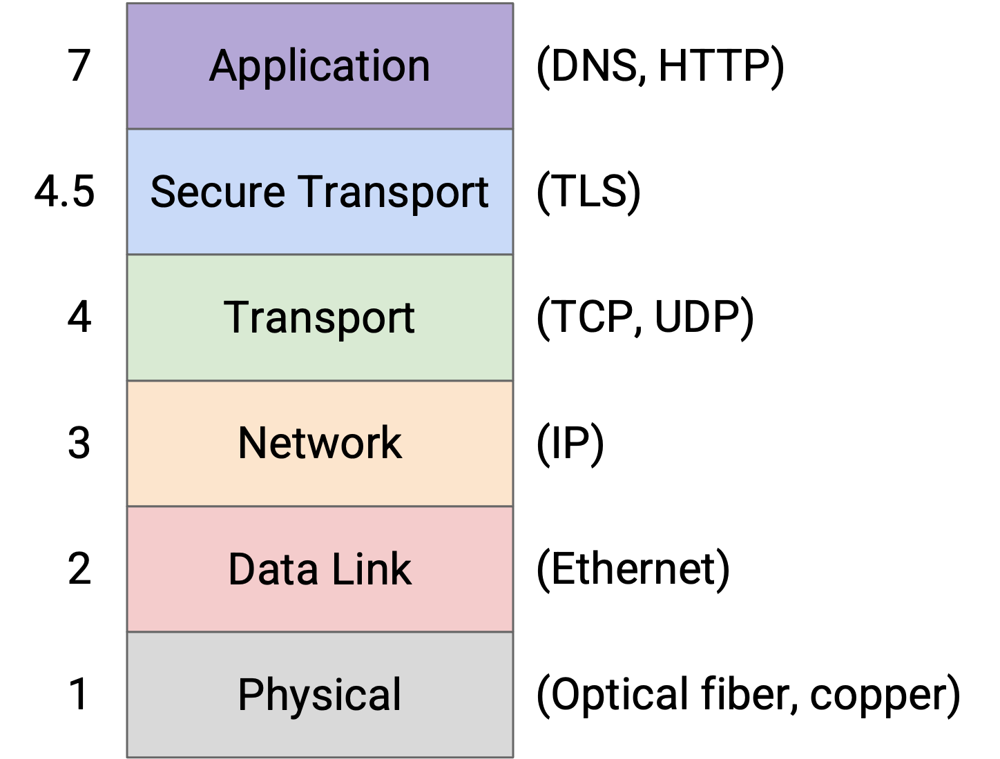
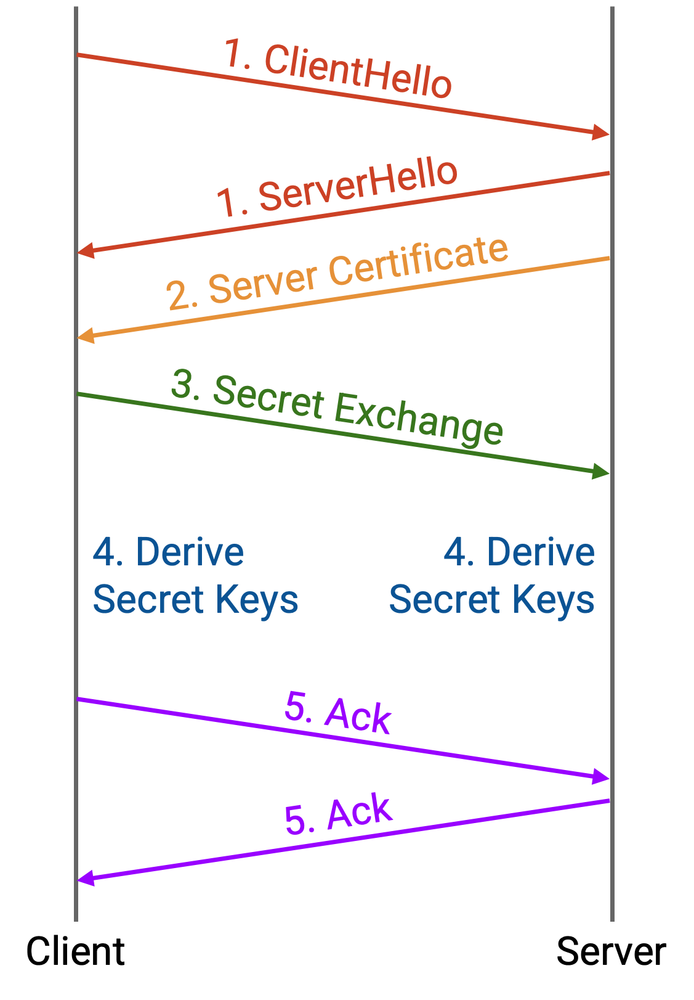

# TLS：安全 Bytestream

## 安全 Bytestream

TCP 本身无法抵御网络攻击者。网络中的某个人（例如恶意 router，或在链路上嗅探 packet 的攻击者）可以在你的 TCP packet 传输途中读取甚至修改它们。

另外，使用 TCP 时，你可能连接到攻击者，而不是真正的 server。假设你想连接到一家银行的网站，并对 `www.bank.com` 做 DNS lookup。攻击者（例如入侵了 resolver 或 router 的人）修改 DNS response，让它把 `www.bank.com` 映射到攻击者的 IP 地址 6.6.6.6。现在，当你与银行网站建立 TCP connection 时，你实际上是在和攻击者通信。你可能最终把银行密码发给攻击者！

为了解决这些安全问题，我们在 TCP 之上加入一个新的 protocol：**Transport Layer Security（TLS）**。

TLS 可以看作 Layer 4.5 protocol，位于 TCP 和 HTTP 这类 application protocol 之间。（我们使用 4.5 这样奇怪的数字，是因为已经过时的 Layer 5 和 Layer 6 与安全性无关。）TLS 依赖 TCP 的 bytestream 抽象，因此它不需要考虑单个 packet，也不需要考虑 packet loss 或重排序。TLS 向应用提供和 TCP 完全相同的 bytestream 抽象，只是这个 bytestream 现在能够抵御网络攻击者。这就是为什么 HTTP 和 HTTPS 在语义上是相同的 protocol。唯一的区别是 HTTPS 运行在 TLS-over-TCP 的安全 bytestream 之上，而 HTTP 运行在没有 TLS 的原始 TCP 之上。

为了区分 HTTPS 和 HTTP，我们使用 Port 80 处理 HTTP connection，使用 Port 443 处理 HTTPS connection。server 可以通过把所有 Port 80 请求重定向到 Port 443，强制用户使用 HTTPS。

## TLS Handshake

从高层看，TLS 使用密码学来加密通过 bytestream 发送的消息。TLS 还使用其他密码学 protocol（message authentication code）来防止攻击者修改在网络上传输的消息。

为了加密 traffic，TLS 必须先进行额外的 handshake，以交换密钥并验证 server 的身份（例如确认它是真正的银行，而不是冒充银行的人）。

因为 TLS 构建在 TCP 之上，TCP three-way handshake 会先照常进行。这会创建一个（不安全的）bytestream，让之后的所有消息，包括 TLS handshake，都可以不再考虑单个 packet。

接下来可以进行 TLS handshake：

1. client 和 server 交换 hello。hello 包含随机数，确保每次 handshake 都会得到不同的 secret key。（如果我们每次都使用同一个 key，而攻击者入侵我们并学到了这个 key，那就很糟糕。）hello 还允许 client 和 server 协商具体要使用哪些 cryptographic protocol。client 的 hello 会列出 client 支持的所有 cryptographic scheme，server 的 hello 会选择其中一个使用。

2. server 发送真实性证书。这会让 client 验证自己正在和真正的 server 通信，而不是和冒充者通信。client 实际上如何验证这个证书有一些复杂性，这里不讨论。

3. client 和 server 推导出一个只有二者知道的 secret。由于此时 bytestream 仍然不安全，它们需要一种 cryptographic protocol，使得可以在不安全 channel 上共享 secret。这里不讨论细节，但如果你熟悉 RSA public-key encryption（例如 UC Berkeley CS 70 中的内容），那就是这里可以使用的一种 cryptographic scheme。client 用 server 的 public key 加密一个 secret 并发送给 server。只有 server 知道对应的 private key，能够解密这条消息并得到 secret。

4. client 和 server 基于 shared secret 以及 hello 中的随机值推导 secret key。使用 secret 可以确保攻击者无法学到 secret key。使用随机值可以确保我们每次推导出的 key 都不同。这个推导过程由 client 和 server 在本地独立完成。secret key 实际上从不会通过网络发送，因此攻击者没有机会学到它们。

5. client 和 server 交换一些 acknowledgement，确认双方推导出了相同的 secret，并确认到目前为止网络上传输的消息没有被篡改（因为 bytestream 此时仍然不安全）。

至此，handshake 完成，之后所有消息都会用 secret key 加密（同时也会使用 message authentication code 来防止篡改）。我们现在已经在 TCP connection 之上建立了一个安全 bytestream，应用可以在这个安全 bytestream 之上交换数据。
