# Headers（头部）

## 为什么需要 Header？

在上一节中，我们看到在 Layer 3，数据以 packet 的形式穿越 Internet。假设一个 application 想通过 Internet 发送一个文件。我们可以取出文件中的一些 bit，把它们放进一个 packet，然后通过 Internet 发送出去。当 switch 收到这一串 1 和 0 时，它并不知道该如何处理这些 bit。

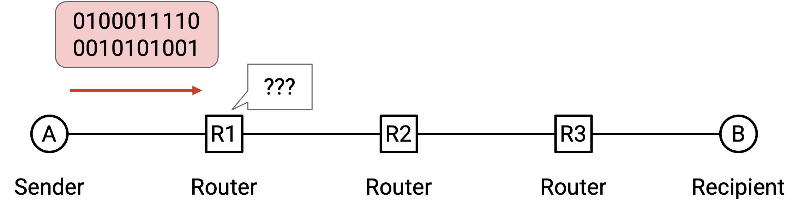

在类比中，如果我给朋友写了一封信，然后直接把信交给邮局，邮局并不知道该拿它怎么办。相反，我们应该把信放进信封，并在信封上写一些信息（例如朋友的地址），告诉邮局应该如何处理这封信。

就像信封一样，当我们发送一个 packet 时，需要附加额外的 metadata（元数据），告诉网络基础设施应该如何处理这个 packet。这些额外 metadata 称为 **header（头部）**。其余 bit（例如正在发送的文件、信封里的信）称为 **payload（载荷）**。

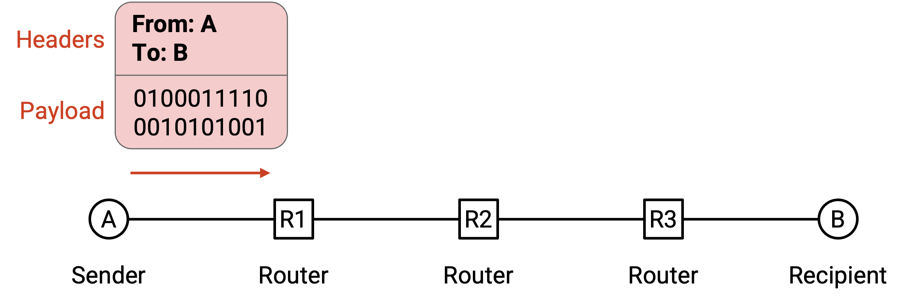

在类比中，邮局不应该阅读我的信件内容。它只应该读取信封上的信息，以决定如何发送这封信。类似地，网络基础设施也只应该读取 header，以决定如何递送数据。

收件人关心的是信里的内容，而不是信封。类似地，end host 上的 application 关心的是 payload，而不是 header。不过，end host 仍然需要知道 header 的存在，因为它们必须在发送 packet 前为其添加 header。

## Header 是标准化的

你也可以把 header 理解为发送/接收数据的 end host 与承载数据的网络基础设施之间的 API。编写软件时，我们需要决定用户用来和代码交互的接口，例如用户可以调用哪些函数、这些函数的参数是什么。类似地，header 中的信息就是用户访问 network 功能并向 network 传递参数的方式。

Internet 上的所有人（每个 end host、每个 switch）都需要就 header 的格式达成一致。如果 Microsoft Windows 修改操作系统代码，开始用不同的 header 结构发送 packet，其他人就无法理解这些 packet。

这也意味着我们在设计 header 时必须非常谨慎。一旦我们设计了一个 header 并把它部署到 Internet 上，就很难再改变这个设计，因为我们必须让所有人同意修改。这就是为什么标准组织可能会花费数年时间来设计和标准化 header。

## Header 应该包含什么？

我们应该在 header 中放入哪些信息？

Header 肯定应该包含 destination address（目的地址），它告诉我们应该把 packet 发送到哪里。

Header 也可以包含其他并非必需但很有用的信息。从技术上说，递送 packet 并不需要 source address（源地址），但在实践中，我们几乎总是把 source address 放进 header。这样 recipient 就可以向 sender 发回回复。

Header 还可以包含 checksum（校验和），用来确保 packet 在传输过程中没有被损坏。

Header 还可以包含 packet 长度等其他 metadata。注意，packet 的大小可以变化，例如用户可能只需要发送几个 byte。

## 多个 Header

我们简短回到邮政类比。假设 Company A 的老板想给 Company B 的老板写一封信。这条 message 会如何发送？

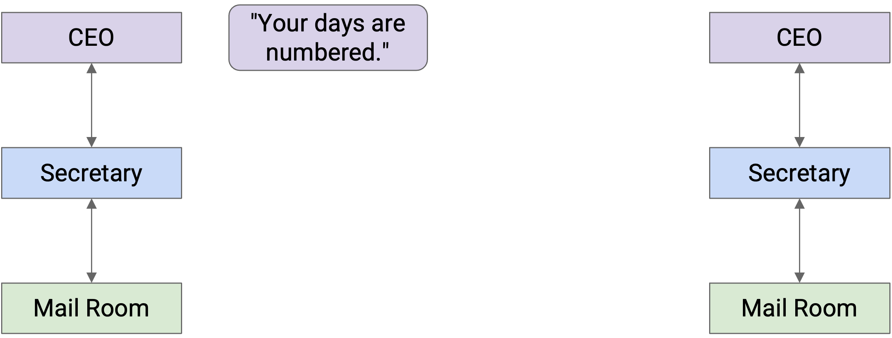

Company A 的老板把信折好，交给秘书。然后，秘书把信放进写有 Company B 老板全名的信封里。

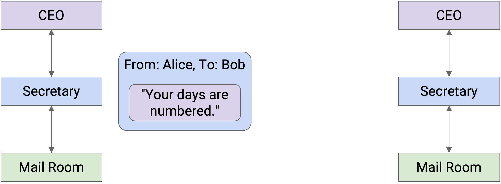

秘书把这封信交给收发室。邮务人员把这封信放进一个写有 Company B 街道地址的盒子里，并把包裹放上送货车。

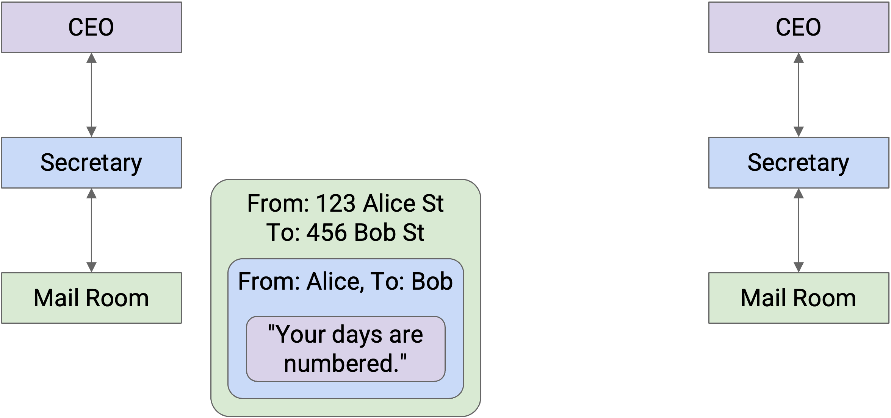

此时，信件本身被多层标识信息包裹着：信封、盒子。递送公司把信送到 Company B，途中可能经过多辆卡车、飞机、邮递员等。

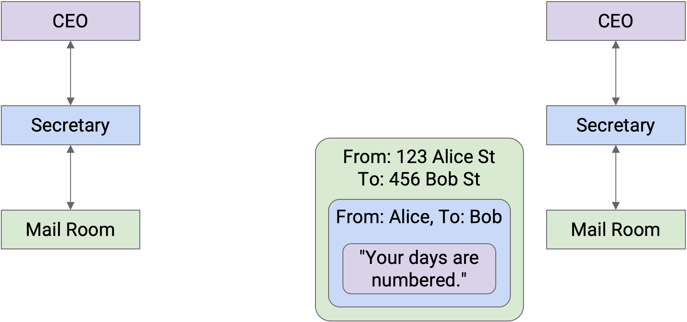

当信到达 Company B 时，收发室拆掉盒子，并把信封交给秘书。

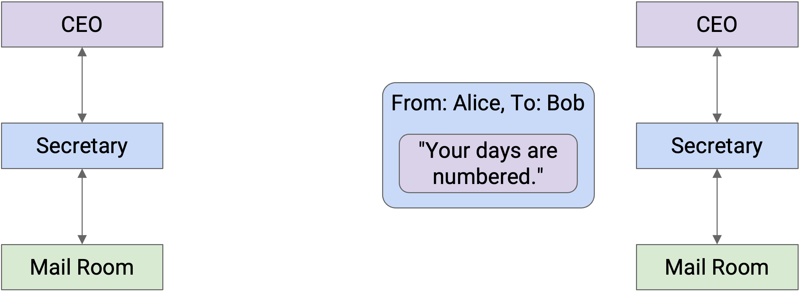

然后，秘书看到信封上写着老板的名字，拆掉信封，并把信交给 Company B 的老板。

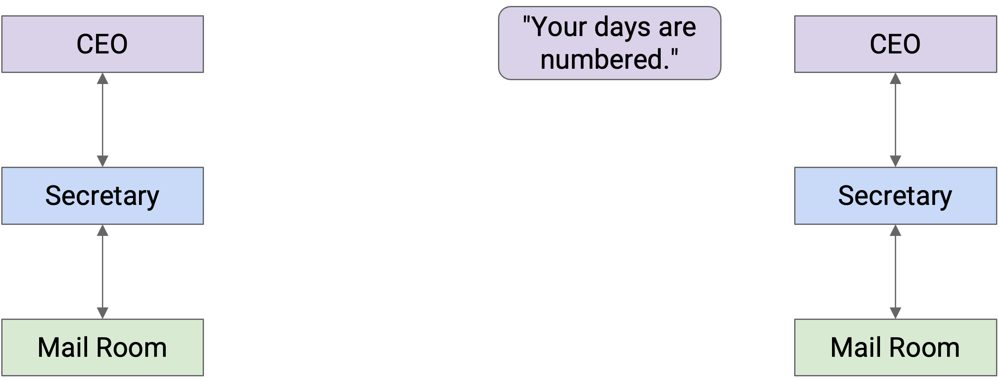

注意，当我们移动到更低的抽象层时，会在数据外面包上更多 header。随后，当我们移动到更高的抽象层时，又会一层层剥掉这些 header。

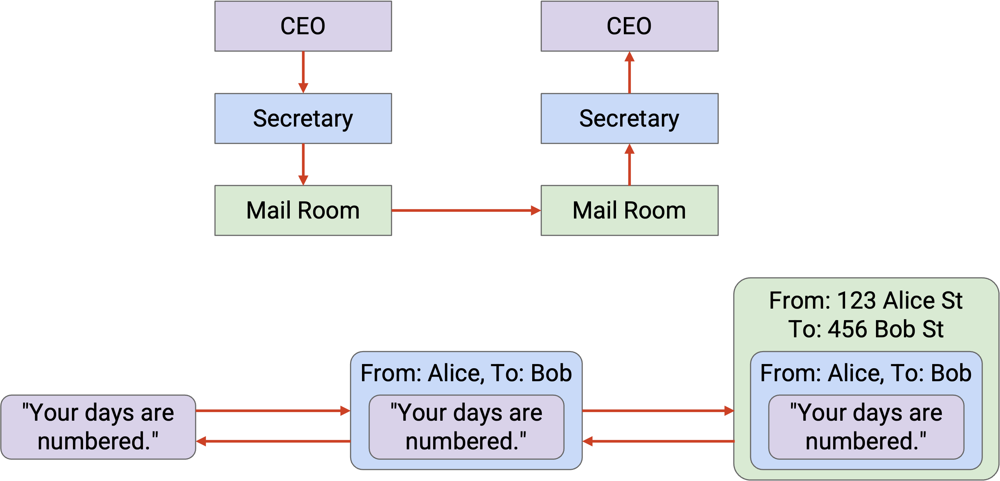

每一层只需要理解自己的 header，并且在某种意义上是在与同一层的 peer（对等实体）「通信」。当秘书 A 在信封上写名字时，这些信息是给秘书 B 读的，不是给邮递员或老板读的。

更正式地说，在 Internet 上，同一层的 peer 通过在该层建立 protocol 来通信。这个 protocol 只对该特定层的实体有意义。

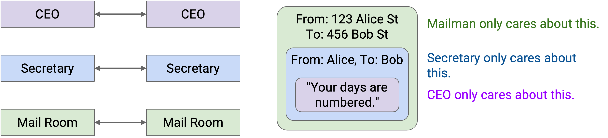

注意，某些 layer 会提供多个 protocol 选择，例如 Layer 2 的无线或有线 protocol。在这些情况下，通信双方需要使用相同的 protocol。一个有线 sender 不能直接和一个无线 recipient 通信。

## Addressing 和 Naming

前面我们说过，header 需要包含 recipient 的 address。这个 address 到底是什么？更正式地说，network address（网络地址）是某个值，用来告诉我们一个 host 位于 network 中的哪里。

当我们更详细地研究不同 layer 时，会看到不同 layer 拥有不同的 addressing scheme（寻址方案）。如果你想在 Soda Hall 内部寄一封信，可以把 destination address 写成 413 Soda Hall，楼里的人就知道该把信送到哪里。相比之下，如果你想把信寄到 New York，就必须写出完整街道地址，例如 123 Main Street, New York, NY。

类似地，Internet 中不同 layer 使用最适合该 layer 的不同 addressing scheme。例如，有时一个 host 会用人类可读的名称表示，例如 www.google.com。有时，同一个 host 会用机器可读的 IP address 表示，例如 74.124.56.2，这个数字以某种方式编码了服务器位置的信息；如果服务器移动，这个地址可能会变化。另一些时候，同一个 host 也可以用永不变化的硬件 MAC address 表示。

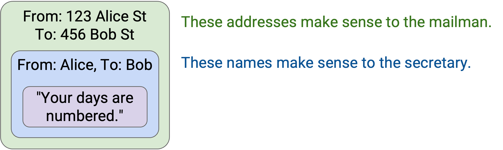

## Hosts 和 Routers 上的 Layers

Internet 不只是一个 sender 和一个 recipient。除了两个 end host 之外，还有 router 负责跨越多个 hop 将 packet 转发到目的地。那么，layering 和 header 这些概念如何在所有这些机器之间相互作用？

End host 需要实现所有 layer。你的计算机需要理解 Layer 7，才能运行 Web browser。你的计算机也需要理解 Layer 1，才能沿着电线发送 bit。你还需要中间所有 layer，才能让应用层数据（也就是老板的信）一路向下传递到物理层。

Router 呢？Router 确实需要 Layer 1 来从电线接收 bit，需要 Layer 2 来沿电线发送 packet，也需要 Layer 3 在 global network 中转发 packet。然而，router 并不真的需要考虑 Layer 4 和 Layer 7。Router 不会运行 Web browser 来显示网页，也不需要考虑 reliability（可靠性），回想一下 best-effort service model。

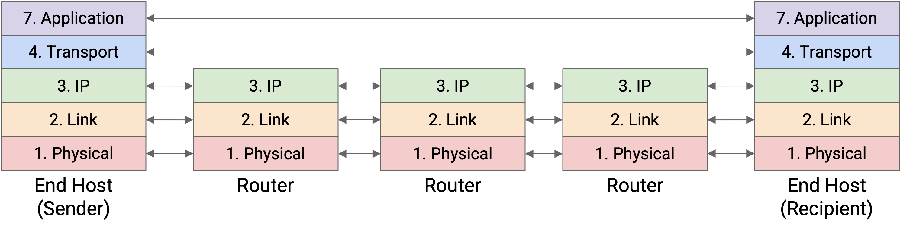

总结：底部 3 层会在所有地方实现，但顶部 2 层只在 end host 上实现。

## Hosts 和 Routers 上的 Multiple Headers：类比

我们再想想寄信。Company A 把信装进信封，然后信封又被放进盒子。这个盒子不会神奇地直接到达 Company B。事实上，它可能会经过多个邮局。

在每个邮局，邮递员会打开盒子并分拣邮件。邮递员查看信封，也就是打开盒子后露出的下一个 header，发现这封信是寄给 Company B 的。

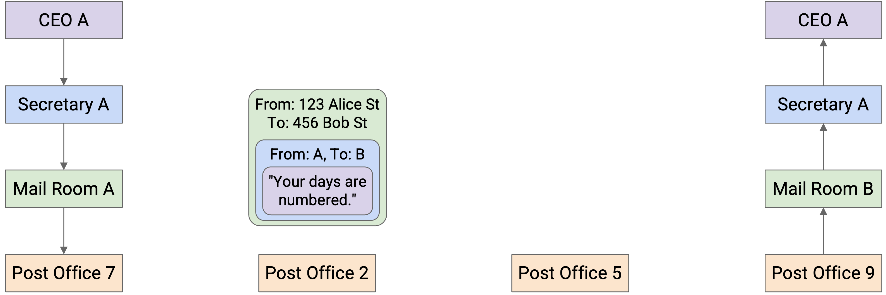

然后，邮递员把信封放进另一个可能不同的盒子里，使这封信能够到达去往 Company B 途中下一个邮局。

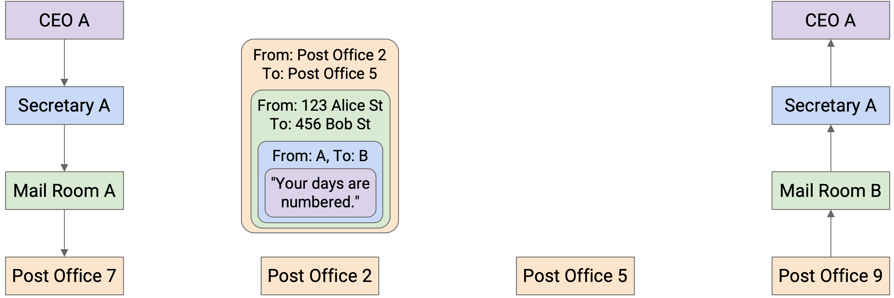

这个过程会在每个邮局重复。盒子被打开，露出里面的信封。然后，信封被放入一个新盒子，目的地是下一个邮局。注意，没有任何邮局会打开信封查看里面的信，因为它们不需要读取信件内容。

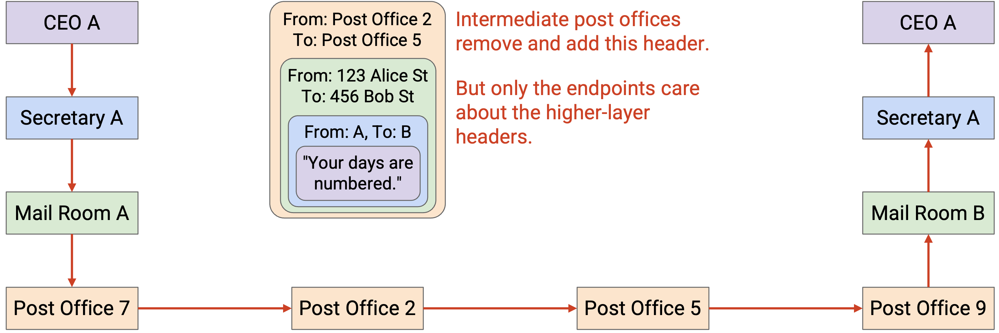

最终，这封信装在盒子里到达 Company B。这一次，Company B 打开盒子，再打开信封，看到里面的信。

## Hosts 和 Routers 上的 Multiple Headers

现在我们已经有了 hosts 和 routers 的完整图景，让我们重新观察 packet 在 network 中跨越多个 hop 时，header 被包裹和解包的过程。

首先，Host A 取得 message，并沿 stack（协议栈）向下处理，为 Layer 7、4、3、2 和 1 添加 header。现在，我们得到了一个被各层 header 包裹起来的 packet。

Layer 1 protocol 沿着电线发送这个 packet 的 bit，把它送到去往目的地路径上的第一个 router。

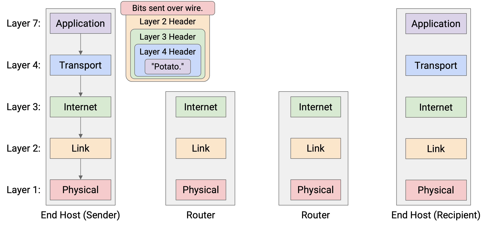

这个 router 必须把 packet 转发到 next hop，使 packet 最终到达 Host B。我们知道，在 global network 中 forwarding packet 是 Layer 3 的工作。因此，router 必须把这个 packet 解析到 Layer 3。

Router 读取并解开 Layer 1 和 Layer 2 header，露出下面的 Layer 3 header。Router 读取这个 header，以决定下一步应该把 packet 转发到哪里。

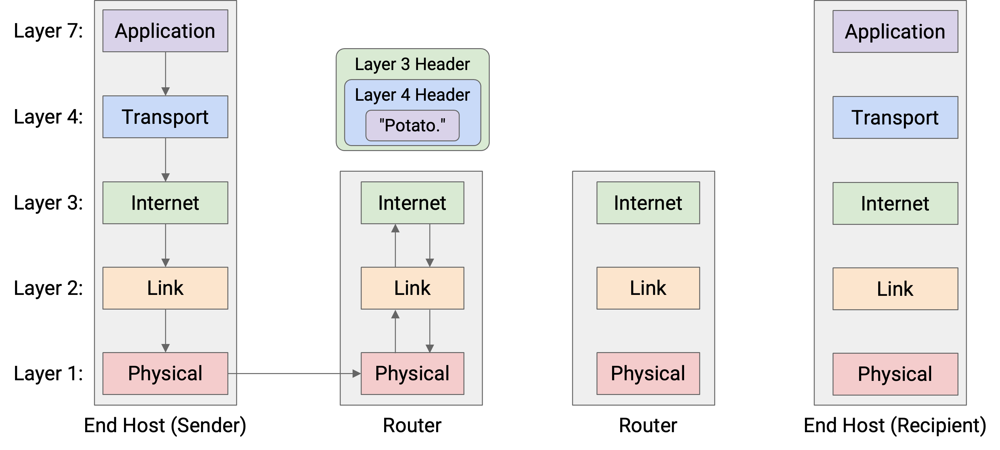

现在，为了把 packet 传给 next hop，router 必须再次沿 stack 向下处理，包上新的 Layer 2 和 Layer 1 header，然后沿电线把 bit 发送到 next hop。

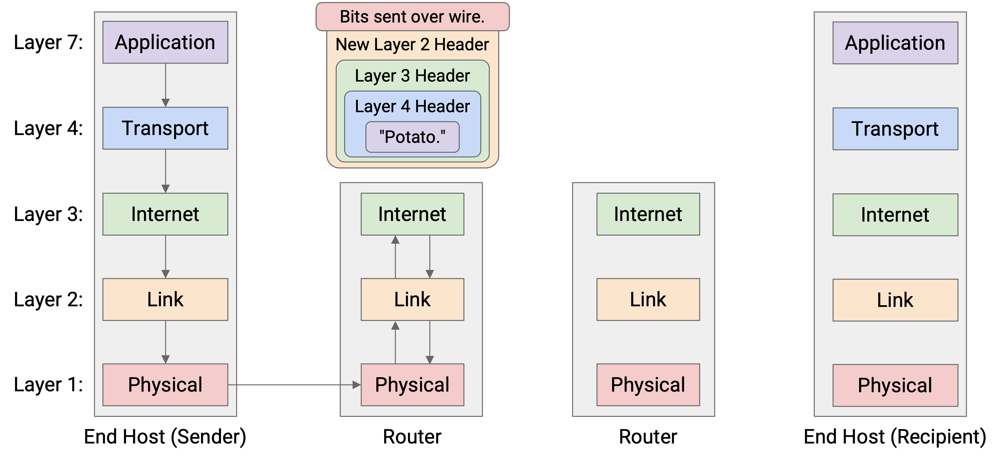

这个模式会在每个 router 上重复：Layer 1 和 Layer 2 被解开，露出 Layer 3 header；随后在把 packet 发送到 next hop 前，再包上新的 Layer 2 和 Layer 1 header。注意，任何 router 都不会查看 Layer 3 protocol 之上的内容，因为更高层只由 end host 解析。

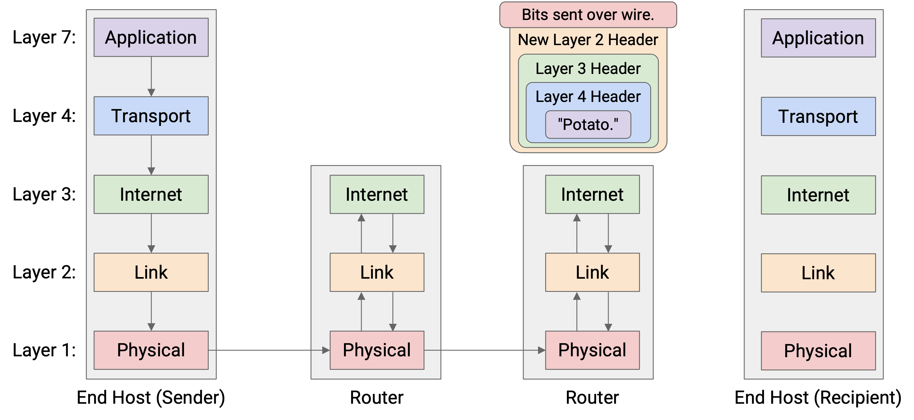

最终，packet 到达 Host B。Host B 逐层解开所有 header：Layer 1、2、3、4、7。Host B 成功收到了这条 message。

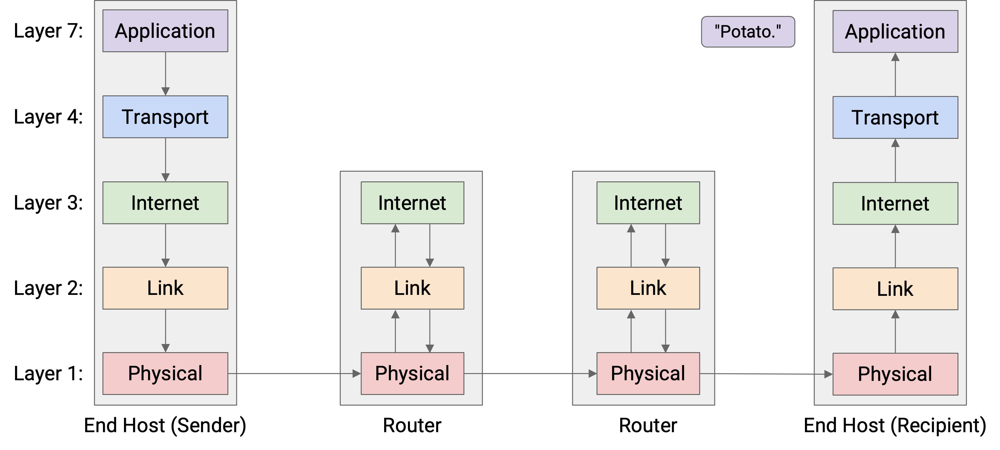

这种分层方案的一个结果是，每个 hop 都可以在 Layer 2 和 Layer 1 使用不同的 protocol。例如，第一个 hop 可能沿电线发送，因此 Host A 和第一个 router 使用的初始 Layer 2 和 Layer 1 header 可以对应有线 protocol。相比之下，后续某个 hop 可能沿无线 link 发送，因此该 hop 两端 router 使用的 Layer 2 和 Layer 1 header 可以对应无线 protocol。

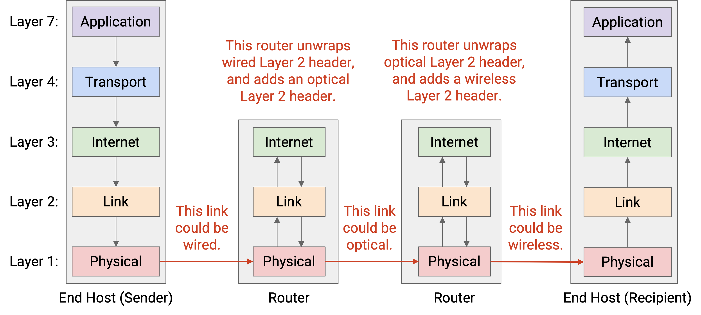

更一般地说，我们曾说每一层只需要和同一层的 peer 通信。现在我们可以在所有 layer 中看到这一点。在 Layer 4 和 Layer 7，两个 host 必须使用相同的 protocol，才能发送和接收 packet。Host 的 peer 是另一个 host。

相比之下，在 Layer 1 和 Layer 2，router 必须和 previous-hop 以及 next-hop router 使用相同的 protocol，这样 router 才能从 previous hop 接收 packet，并把 packet 发送到 next hop。Router 的 peer 是路径上的相邻 router。

总结：每个 router 解析 Layer 1 到 Layer 3，而 end host 解析 Layer 1 到 Layer 7。

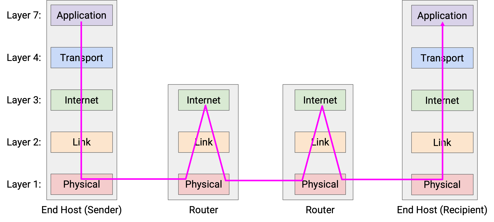
