# Designing Resource Sharing（设计资源共享）

## 资源共享：Statistical Multiplexing

Internet 上的 link 和 switch 都具有有限 capacity（容量）。我们需要解决的一个关键设计问题是：如何在不同 Internet 用户之间共享这些资源？

我们把这个问题稍微形式化一些。回忆一下，flow（流）是两个 end host 之间交换的一串 packet，例如你和朋友之间的一次视频通话。尽管 capacity 有限，Internet 仍然需要同时支持许多并发 flow。

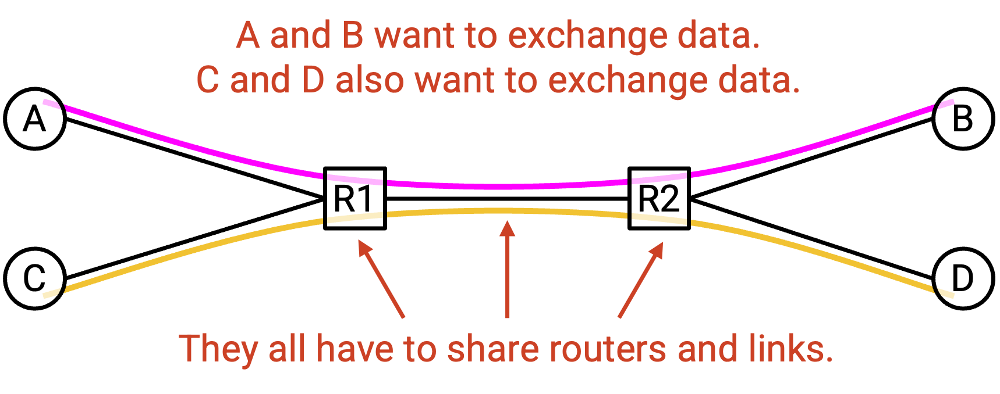

我们常说 network resource 是 **statistically multiplexed（统计复用）** 的。这意味着我们会根据用户需求动态分配资源，而不是预先把固定比例的资源分给每个用户。

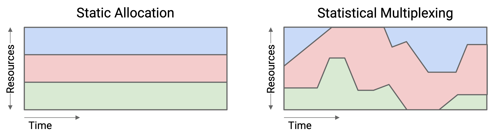

作为类比，考虑你的个人电脑。你的电脑并不会预先把一半 CPU 分配给 Firefox、另一半 CPU 分配给 Zoom，然后只允许每个 application 使用自己的那一半 CPU。相反，你的电脑会根据不同 application 的需求动态分配资源。

Statistical multiplexing 现在在计算机科学中无处不在。例如，在 cloud computing（云计算）中，不同公司可能会在 datacenter 中动态共享资源。

Statistical multiplexing 是高效共享 network resource 的一种好方法，因为用户需求会随时间变化。你很可能并不是每天 24 小时、每一秒都固定使用 10 Mbps bandwidth（带宽）。醒着的时候你可能需求更多，睡觉的时候需求更少。

让 statistical multiplexing 能够工作的前提是：在实践中，aggregate demand（总需求）的 peak（峰值）远小于 peak demand 的 aggregate（各自峰值之和）。

我们展开解释这句话。假设有两个用户 A 和 B。我们可以画出每个用户随时间变化的 demand。

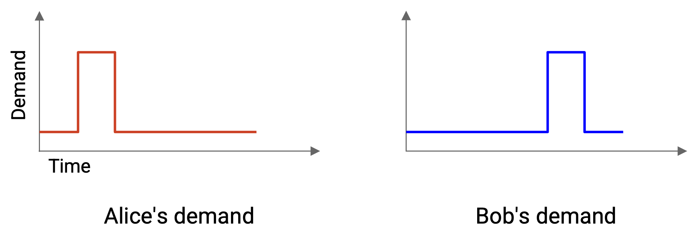

为了完全满足两个用户的需求，我们需要分配多少 capacity？

糟糕的策略（不使用 statistical multiplexing）是计算 peak demand 的 aggregate。我们找到 A 的 peak demand 和 B 的 peak demand，然后把它们相加。

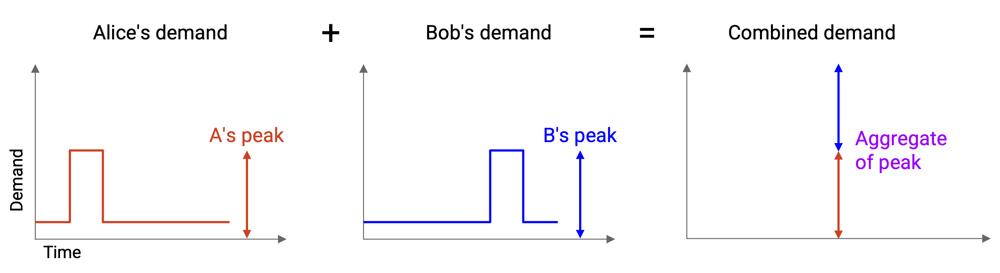

如果分配这么多 capacity，我们当然可以满足他们的需求。A 的 peak demand 是 X，所以给 A 分配 X；同样，给 B 分配 Y。然而，这种方法很浪费，因为 A 的 peak 和 B 的 peak 并没有发生在同一时间。

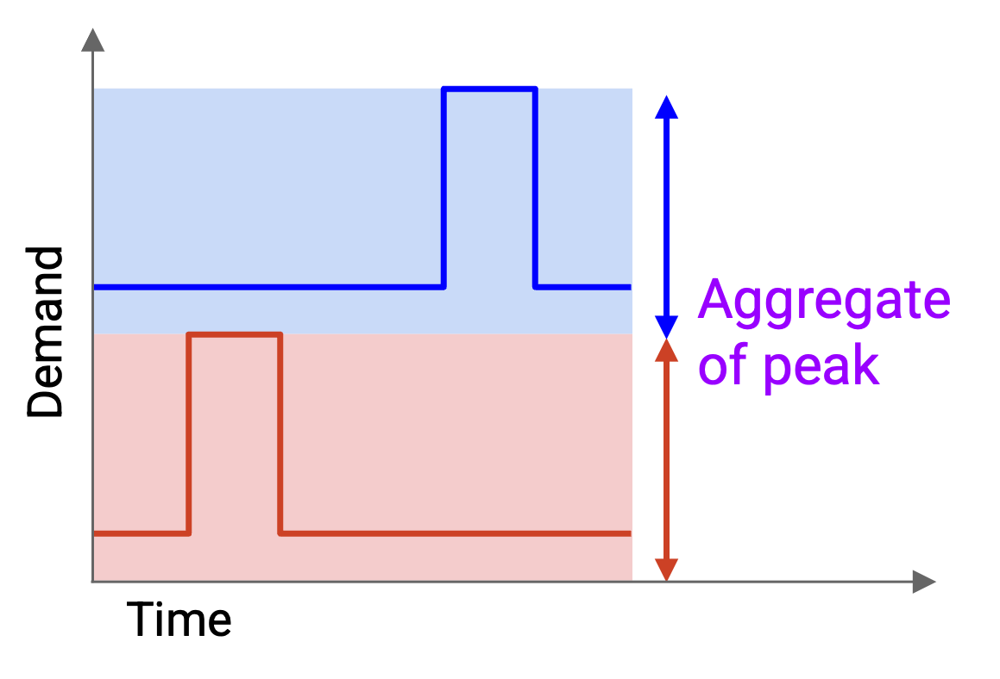

更好的策略（statistical multiplexing）是先计算 aggregate demand，也就是画出它们随时间合并后的需求。例如，新图中 10am 的 demand 等于 A 在 10am 的 demand 加上 B 在 10am 的 demand。然后，我们计算 aggregate demand 的 peak。

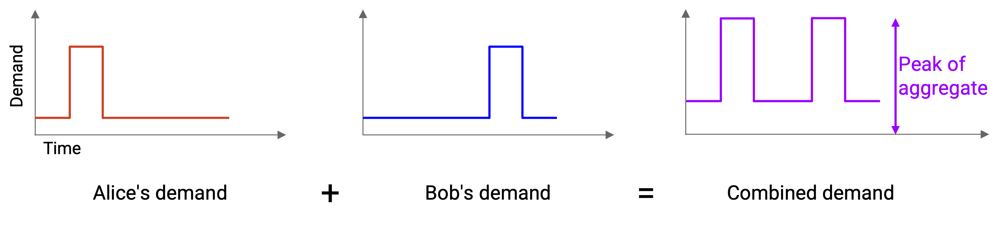

如果分配这么多 capacity，我们就无法再静态地把固定部分分给每个用户。然而，只要随时间动态改变分配给每个用户的数量，即使总 capacity 更少，我们仍然可以成功满足他们的需求。

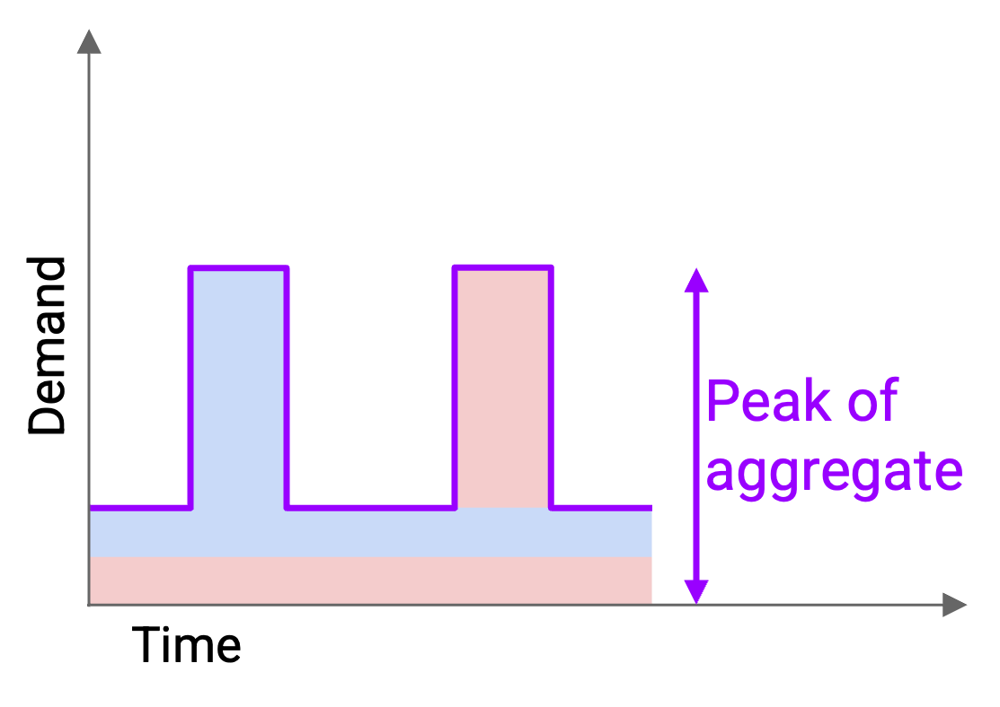

Statistical multiplexing 让我们能用更少 capacity 支持同样的用户，这对我们更便宜，也能更高效地使用资源。对于许多 distribution（分布），我们可以证明 aggregate 的 peak 实际上更接近 average demand（平均需求）之和，而这远小于 peak demand 之和。

在实践中，network 并不会按照「所有东西同时达到峰值」这种绝对最坏情况来 provision（配置容量）。相反，我们动态共享资源，并希望峰值不要同时出现。峰值仍然可能同时出现，这会导致 packet 被延迟或丢弃（回想 link queue）。尽管如此，我们仍然做出了使用 statistical multiplexing 的设计选择：更高效地利用资源，同时处理偶尔同时峰值带来的后果。

归根到底，statistical multiplexing 是一种带有 trade-off 的设计选择，不同用户可能会做出不同选择。例如，金融交易所有时会决定建设自己的专用网络来支持峰值需求，因为它们更关心在峰值期间确保网络连通性，而且也负担得起额外成本。

## 资源共享：Circuit Switching vs. Packet Switching

现在我们知道，可以使用 statistical multiplexing 来决定应该建设多少 capacity。下一个问题是：我们究竟如何在用户之间动态分配资源？

作为类比，考虑一家很受欢迎的餐厅：顾客很多，桌子有限。我们可以想象两种给顾客分配桌子的方法。一种是让顾客提前预订，另一种是先到先得。

Network 中共享资源的两种方法也类似。一种方法是 **best-effort（尽力而为）**。所有人都不做任何 reservation（预留），直接把数据发送进 network，然后希望结果最好。它不保证有足够 bandwidth 满足你的需求。

Best-effort 的经典设计称为 **packet switching（分组交换）**。Switch 独立查看每个 packet，并把 packet 转发得更接近目的地。Switch 不需要考虑 flow 或 reservation。

除了 packet 彼此独立之外，switch 之间也是彼此独立的。当一个 packet 跨越多个 switch 时，每个 switch 都独立考虑这个 packet，switch 之间不需要协调。

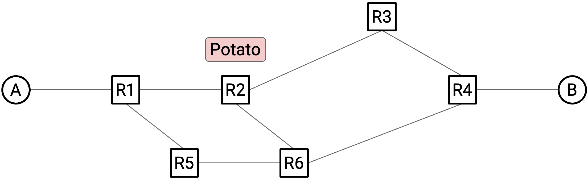

另一种方法基于 **reservation（预留）**。在 flow 开始时，用户明确请求并预留自己需要的 bandwidth。数据发送完成后，资源可以被释放，供其他人预留。

Reservation 的经典设计称为 **circuit switching（电路交换）**，它在研究界和工业界都被探索过。

在 flow 开始时，end host 使用某种 routing algorithm（路由算法）在 network 中识别一条 path（一系列 switch 和 link）。我们还没有讨论如何用 routing algorithm 找到这条 path，所以你现在可以先假设它「神奇地发生」。

然后，source（源端）向 destination（目的端）发送一条特殊的 reservation request message（预留请求消息）。沿途每个 switch 也都会听到这个请求。如果每个 switch 都接受请求，那么 reservation 就建立好了，source 和 destination 之间也就建立了一条由 switch 组成的 circuit。

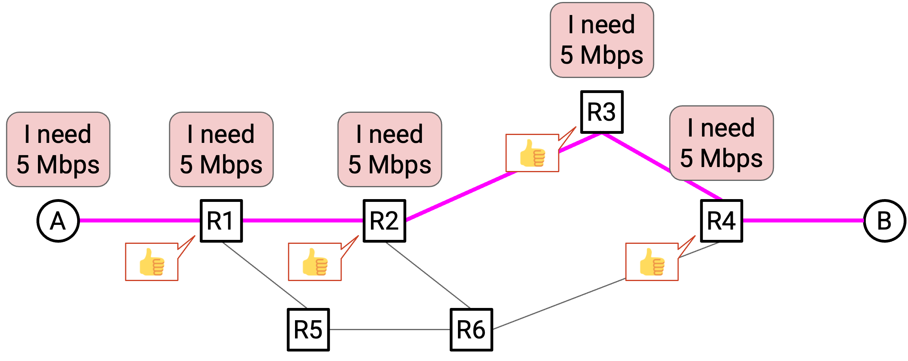

一旦每个 switch 都确认 reservation，数据就可以发送。最终，当 flow 结束时，source 会向 recipient 发送 teardown message（拆除消息）。沿途每个 switch 看到这条消息后，会释放自己的 capacity。

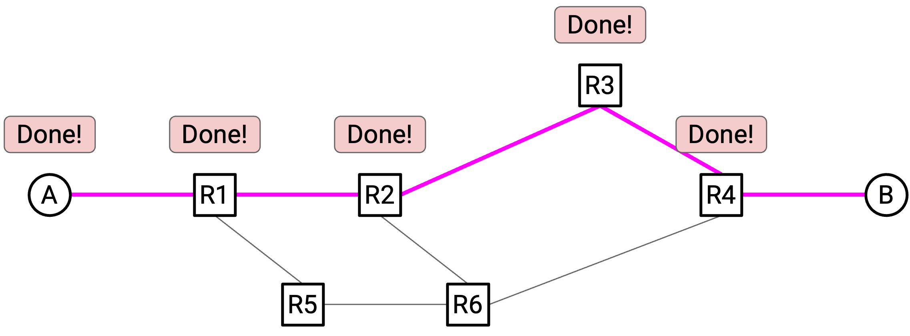

注意：这里使用 circuit 这个术语，是因为这个想法来自电话网络；电话网络使用同样的思想，让两个人能够互相通话。

请记住，circuit switching 和 packet switching 都体现了 statistical multiplexing。主要区别在于我们分配资源的 granularity（粒度）：reservation 是按 flow 分配，best-effort 是按 packet 分配。即使在 circuit switching 中，我们也是根据 reservation 动态分配资源，并不是为所有可能存在的 flow 预先保留资源。

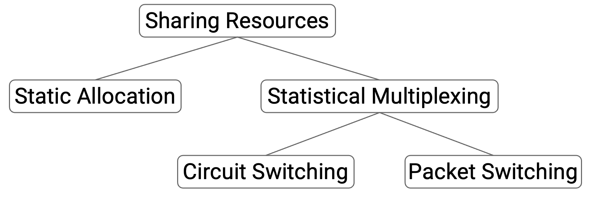

## Circuit Switching 与 Packet Switching 的 Trade-off

现在，我们有两种在 Internet 上共享资源的方法。哪一种更好？这取决于我们用什么 criteria（标准）评价它们。

我们可以从四个维度比较这两种方法。

1. 这是 network 提供给 application developer 的好抽象（或 API）吗？

Circuit switching 为 developer 提供了更有用的抽象，因为它保证了预留带宽。这让 developer 能获得更可预测、更容易理解的行为（假设一切顺利）。作为类比，考虑在 cloud 中预留一台机器来运行某个任务。如果 developer 知道自己得到的机器规格，就更容易推理性能。如果 developer 完全不知道自己使用的是什么机器，任务仍然可能运行，但性能就不那么可预测。

如果你是一个需要把资源分配给用户的网络运营者，circuit switching 也是一个有用的抽象。你确切知道每个用户请求了多少 bandwidth，因此可以向他们收取合适的费用。如果你不能保证向客户提供什么服务，实现一个直观的商业模型会稍微更难。

2. 这种方法在 scale（大规模）下高效吗？它是否使用了 network 上所有可用 bandwidth，还是会浪费部分 bandwidth？

Packet switching 通常更高效。具体好多少取决于 traffic source（流量来源）的 burstiness（突发性）。

如果每个 sender 始终以恒定速率发送数据，那么 circuit switching 和 packet switching 都能充分利用 capacity。

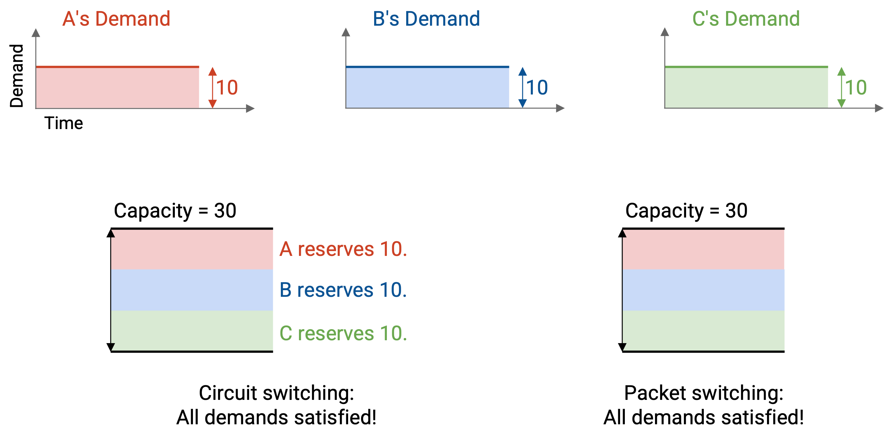

相比之下，如果每个 sender 的速率随时间变化，那么 packet switching 能更好地利用 bandwidth。

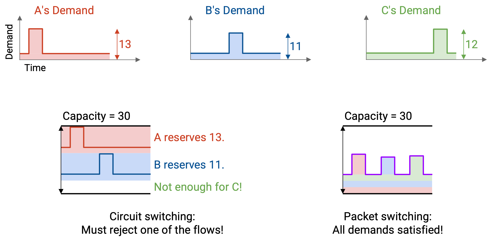

下面是一个 demand 随时间变化的例子。使用 reservation 时，三个 flow 必须分别预留 12、11 和 13 Mbps。由于我们只能分配 30 Mbps，其中一个 reservation 会被拒绝。

这种方法以两种方式浪费 bandwidth。首先，预留 12 Mbps 的 flow 在大部分时间里并没有真正使用它的 bandwidth。其次，如果 12 Mbps 和 11 Mbps 的 flow 获得 reservation，我们还剩下 7 Mbps 没有被任何人预留。

相比之下，在 packet switching 中，我们只是在 packet 到达时发送它们；任意时刻使用的总 bandwidth 从未超过 30 Mbps。用现有 bandwidth，我们就可以支持所有 flow。

形式化地说，flow 的 burstiness 定义为 peak rate（峰值速率）与 average rate（平均速率）的比值。没有一个清晰阈值能判断某个 flow 什么时候算 smooth（平滑）或 bursty（突发），这些更像描述性术语。

Voice call（语音通话）通常有较平滑的比例，例如 3:1；而 web browsing（网页浏览）通常更突发，例如 100:1。（语音通话比较平滑，也是电话网络使用 reservation 的原因之一。）

Packet switching 更高效的另一个原因是：circuit switching 需要额外时间建立和拆除 circuit。对于非常短的 flow（例如下载一个很小的文件），这尤其低效。

3. 每种方法处理大规模故障的能力如何？

Packet switching 更适合处理大规模故障。如果某个 router 失败，我们可以直接沿 network 中另一条 path 发送 packet。（我们还没有讨论具体如何做到，但 routing algorithm 很擅长适应 failure。）End host 不需要做任何不同的事情。

相比之下，在 circuit switching 中，如果 path 上某个 router 失败，network 仍然必须找到新 path，但 end host 要做的事情更多。Host 必须以某种方式检测 failure，并重新发送 reservation request。它还必须以某种方式释放旧 path 上的 reservation。如果新的 reservation request 被拒绝，又该怎么办？

这种 failure mode（故障模式）的 scale 很差。如果单个 router 宕机，但有数百万个 flow 正在使用这个 router，那么数百万个 reservation request 都必须同时重新建立。

我们不会详细解决这些问题，但希望你已经能感受到：在 circuit switching 中处理 failure 是一个相当困难的问题。

4. 在 scale 下实现每种方法有多复杂？

如果你真的尝试设计 circuit switching，许多额外设计问题会让 protocol 很快变得非常复杂。

Router 如何知道 reservation 已经成功？当 2 看到请求并同意时，它如何知道 3 和 4 也同意了？（一种可能方法是：我们沿相反方向发送 confirmation（确认），表示 reservation 已确认。）

如果 reservation request 在途中丢失怎么办？1 和 2 同意了，但 request packet 在到达 3 和 4 之前被丢弃。（一种可能方法是：设置 timer（计时器），如果 reservation 没有及时确认，就删除 reservation。然后 end host 必须重试。）

如果 request 发送后所有人都同意了，但返回途中的 confirmation 被丢弃怎么办？4 和 3 看到了 confirmation，但 confirmation packet 在到达 2 和 1 之前被丢弃。

如果 reservation 被拒绝怎么办？End host 应该重试并请求更少资源吗？应该等待一会儿后用相同请求重试吗？Router 在拒绝时是否应该说：「我不能给你 10 Mbps，但可以给你 8 Mbps」？

我们不会解决每个设计问题，但希望你已经注意到，circuit switching 比一开始看起来更难实现。

让 circuit switching 变复杂的根本问题是 state consensus（状态共识）。所有 router 都必须跟踪额外 state，并且它们都必须就这些 state 达成一致。

你可能听说过 Paxos protocol，它是让多个 processor 就 state 达成一致的极其复杂的 protocol。在实践中，人们通常只在 4-5 台 server 组成的小组上运行这些算法。而在 circuit switching 中，我们基本上是在要求 Internet 在 Internet scale 上运行这类机制，面对的是数百万 router 和 flow。

总结：circuit switching 通过预留带宽为 application 提供更好的性能，也让 developer 获得更可预测的行为。

然而，packet switching 能更高效地共享 bandwidth，并避免启动时间。它也更容易从 failure 中恢复，并且通常更简单，因为 router 需要考虑的事情更少。

## 实践中的 Circuit Switching 与 Packet Switching

在现代 Internet 中，packet switching 是默认方法。

Circuit switching 只在有限场景中使用。例如，RSVP（Resource Reservation Protocol）可以在小型 local network 内使用，让 router（不是 end host）彼此之间预留 bandwidth。

现代 Internet 中 circuit switching 的另一种用途是 dedicated circuit（专用电路），例如 MPLS circuit、leased line（租用线路）。作为一家公司，你可以专门购买一部分 Internet bandwidth，甚至可能包括物理基础设施，专供自己的业务使用。与标准 Internet connection 相比，这非常昂贵。

Dedicated circuit 的部署 scale 没有假想中的 full-Internet circuit switching 那么宏大。通常由人手动设置 reservation。Reservation 是 long-lived（长期存在）的，例如持续数年。Reservation 的 granularity 是公司，而不是单个 flow。

简史：Internet 在 1970s-1980s 最初被设计为一个较小规模、由政府资助的研究项目时，它采用的是 packet switching。

到了 1990s，当政府停止资助 Internet，控制权转移到商业企业时，研究界和工业界一度认为我们需要改用 circuit switching。设计者预测语音和直播电视会成为 Internet 上主要的高负载用途。这两个 application 都具有平滑的 bandwidth demand，非常适合 circuit switching。另外，由于 ISP 必须从新商业化的 Internet 中赚钱，他们认为 circuit switching 会提供更直观的商业模型。

研究界和标准组织曾投入大量工作来实现 circuit switching，但最终这是一个失败的愿景，原因包括我们前面讨论过的许多问题。此外，推动 Internet 增长的主要 application 是 email 和 Web，而不是 voice call 和 TV，这也是 circuit switching 愿景没有实现的另一个原因。

这些设计选择带来了一个有趣后果：user 和 developer 适应了 packet switching 的现实。如果你看视频时 connection 很差，你已经习惯 application 自适应并降低视频质量。（这与 broadcast TV 不同，后者不会这样做。）这说明技术也会改变用户行为。
