---
title: Addressing
parent: Routing
nav_order: 6
layout: page-with-toc
---

# Addressing锛堝鍧€锛?
## 鎵╁睍 Routing

鍒扮洰鍓嶄负姝紝鎴戜滑鐨?forwarding table 涓烘瘡涓?destination 淇濆瓨涓€鏉?entry銆傝繖鏃犳硶鎵╁睍鍒版暣涓?Internet銆?
濡傛灉鎴戜滑鍦ㄦ暣涓?Internet 涓婅繍琛?distance-vector锛屽氨蹇呴』涓?Internet 涓婄殑姣忎釜 host 鍙戦€佷竴鏉?announcement銆傚鏋滄垜浠湪鏁翠釜 Internet 涓婅繍琛?link-state锛屾瘡涓?router 閮藉繀椤荤煡閬撳畬鏁寸殑 Internet network graph銆傛棤璁哄摢绉嶆儏鍐碉紝鍙鏈変换浣?host 鍔犲叆鎴栫寮€ Internet锛屾垜浠兘蹇呴』閲嶆柊璁＄畻锛屼娇 network converge 鍒版柊鐨?routing state銆?
璁?routing 鑳藉鎵╁睍鐨勫叧閿紝鍦ㄤ簬鎴戜滑濡備綍涓?host 缂栧潃銆傚埌鐩墠涓烘锛屾垜浠竴鐩寸敤鏌愪釜鍚嶅瓧绉板懠姣忎釜 host 鍜?router锛堜緥濡?R1銆丷2銆丄銆丅锛夛紝浣嗗湪瀹炶返涓紝鎴戜滑浼氫娇鐢ㄦ洿鑱槑鐨?addressing scheme銆?
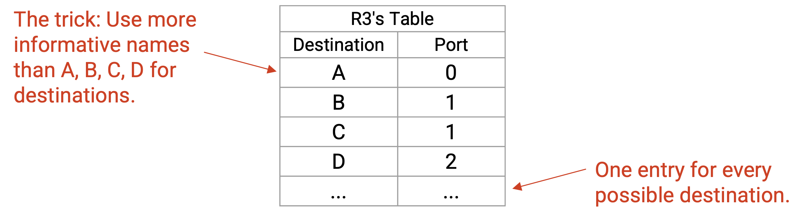

## IP Addressing

鍥炲繂閭斂绯荤粺绫绘瘮锛氫笉鍚屽満鏅細浣跨敤涓嶅悓鐨勫湴鍧€鏂规銆傞偖閫掑憳浣跨敤绫讳技 2551 Hearst Ave. 鐨勮閬撳湴鍧€锛涙ゼ閲岀殑绉樹功浣跨敤绫讳技 413 Soda Hall 鐨勬埧闂村彿銆傚湴鍧€閫氬父浼氫互鏌愮缁撴瀯鍖栨柟寮忓垎閰嶃€備緥濡傦紝涓夋ゼ鐨勬埧闂村彿閮戒互鏁板瓧 3 寮€澶达紝鍥涙ゼ鐨勬埧闂村彿閮戒互鏁板瓧 4 寮€澶淬€?
鍜岄偖鏀跨郴缁熶竴鏍凤紝Internet 鍦ㄦ瘡涓€灞備娇鐢ㄤ笉鍚岀殑 addressing scheme銆傛湰鑺傚叧娉?IP address锛屽畠鍙互鐢ㄤ簬 Layer 3 鐨?routing銆?
Network 涓婄殑姣忎釜 host锛堜緥濡備綘鐨勭數鑴戙€丟oogle 鐨勬湇鍔″櫒锛夐兘浼氳鍒嗛厤涓€涓?IP address銆傚湪鏈妭涓紝浣犲彲浠ュ亣璁炬瘡涓?host 閮芥湁鍞竴鐨?IP address銆?
**IP address锛圛P 鍦板潃锛?* 鏄竴涓敮涓€鏍囪瘑 host 鐨勬暟瀛椼€傚拰閭斂绯荤粺涓€鏍凤紝杩欎釜鏁板瓧鐨勯€夋嫨浼氬寘鍚竴浜涘叧浜?host 浣嶇疆鐨勪笂涓嬫枃淇℃伅銆?
娉ㄦ剰锛孖P address 涓嶄竴瀹氭槸闈欐€佺殑銆傚湪绫绘瘮涓紝濡傛灉浣犳惉鍒板彟涓€鏍嬫埧瀛愶紝浣犵殑鍦板潃浼氭敼鍙樸€傜被浼煎湴锛屽鏋滀綘鐨勭數鑴戠Щ鍔ㄥ埌鍙︿竴涓綅缃紝瀹冨姞鍏?network 鏃跺彲鑳戒細琚垎閰嶄竴涓笉鍚岀殑 IP address锛堣€屾棫 IP address 鏈€缁堜細 expire锛夈€?
IP address 鐨勯暱搴﹀彇鍐充簬浣跨敤鐨?IP 鐗堟湰銆侷Pv4 address 鏄?32 bits锛孖Pv6 address 鏄?128 bits銆備袱涓増鏈殑 routing 姒傚康绫讳技锛屼絾鍙鍙兘锛屾垜浠細浣跨敤 IPv4锛屽洜涓鸿緝鐭殑鍦板潃鏇村鏄撻槄璇汇€?

## Hierarchical Addressing

鍥炲繂涓€涓嬶紝Internet 鏄綉缁滅殑缃戠粶銆備笘鐣屼笂鏈夎澶?local network锛屾垜浠€氳繃鍦?local network 涔嬮棿娣诲姞 link 鏉ュ舰鎴愭洿澶х殑 Internet銆傝繖缁欎簡鎴戜滑涓€绉嶈嚜鐒剁殑 hierarchy锛屽彲浠ョ敤鏉ョ粍缁?addressing scheme銆?
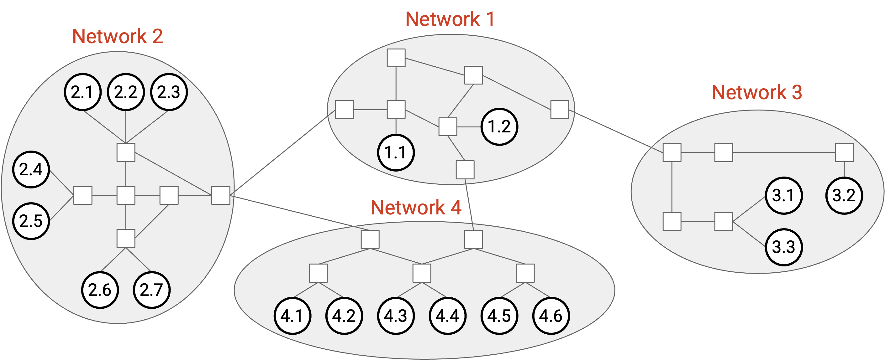

涓嬮潰鏄竴寮犵洿瑙傜殑 addressing 鍥俱€傛垜浠彲浠ョ粰姣忎釜 network 鍒嗛厤涓€涓暟瀛椼€傜劧鍚庯紝鍦?network 3 鍐呴儴锛屾垜浠彲浠ュ垎閰?host number 3.1銆?.2銆?.3 绛夛紱鍏朵粬 network 涓殑 host 涔熺被浼笺€?
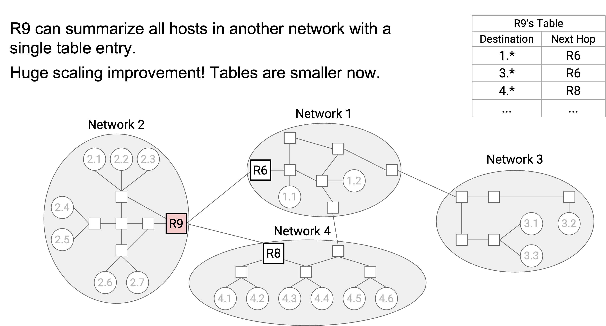

鐜板湪锛岃€冭檻 router R9 涓殑 forwarding table銆備互鍓嶏紝鎴戜滑浼氫负 network 1 涓殑姣忎釜 host 閮戒繚瀛樹竴鏉?entry锛岃€屼笖瀹冧滑鐨?next hop 閮芥槸 R6銆傛湁浜?hierarchical addressing锛屾垜浠彲浠ユ敼鐢ㄤ竴鏉?entry 琛ㄧず鏁翠釜 local network锛氭墍鏈?1.* address锛堝叾涓?* 琛ㄧず浠绘剰鏁板瓧锛夌殑 next hop 閮芥槸 R6銆傛垜浠篃鍙互璇存墍鏈?2.* address 鐨?next hop 閮芥槸 R8銆?
杩欑浣跨敤 wildcard match 鏉ユ眹鎬?route 鐨?hierarchical model锛屼細璁?forwarding table 鏇村皬銆?
姝ゅ锛岃繖绉嶆ā鍨嬭繕浼氳 table 鏇寸ǔ瀹氥€?
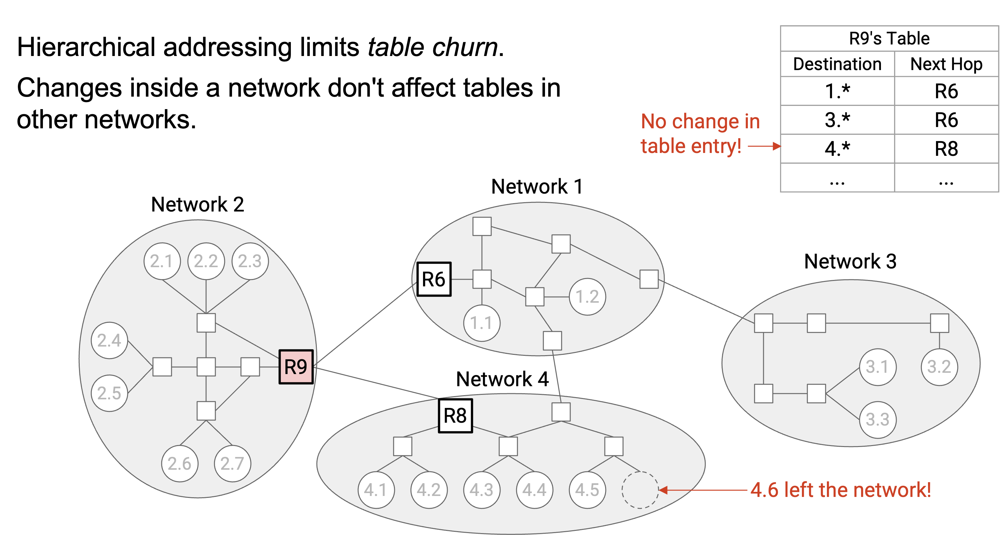

濡傛灉 network 1 鍐呴儴鐨?topology 鏀瑰彉锛屾垜浠笉闇€瑕佹洿鏂?R9 鐨?forwarding table锛堜篃涓嶉渶瑕佹洿鏂板叾浠?network 涓殑 table锛夈€傚疄璺典腑锛宭ocal network 鍐呴儴鐨勫彉鍖栵紙渚嬪鏈夋柊 host 鍔犲叆 network锛夊彂鐢熷緱姣?network 涔嬮棿鐨勫彉鍖栵紙渚嬪鏂伴摵璁惧湴涓嬬數缂嗭級棰戠箒寰楀锛屾墍浠?local change 鍙奖鍝?local table 鏄竴浠跺ソ浜嬨€?
鏇翠竴鑸湴璇达紝鎴戜滑鐨?address 鏈変袱涓儴鍒嗭細network ID 鍜?host ID銆傝繖璁?inter-domain routing protocol 鍙互涓撴敞浜?network ID锛岀敤鏉ュ鎵?network 涔嬮棿鐨?route锛涗篃璁?intra-domain routing protocol 鍙互涓撴敞浜?host ID锛岀敤鏉ュ鎵?network 鍐呴儴鐨?route銆傞殢鐫€ network 鍙樺寲锛岃繖涔熻 routing protocol 鏇寸ǔ瀹氥€侷nter-domain protocol 涓嶅叧蹇?network 鍐呴儴鐨勫彉鍖栵紝intra-domain protocol 涔熶笉鍏冲績鍏朵粬 network 涓殑鍙樺寲銆?
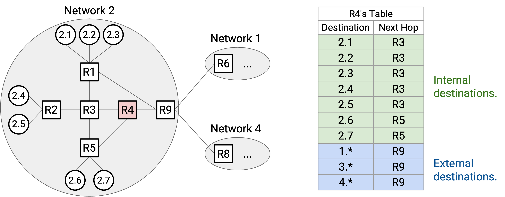

娉ㄦ剰锛孯9 鐨?forwarding table 浠嶇劧闇€瑕佷负鑷繁鎵€鍦?network锛堜篃灏辨槸 network 2锛夊唴閮ㄧ殑姣忎釜鍗曠嫭 host 淇濆瓨 entry銆?
绫讳技鍦帮紝R4 鏄竴涓病鏈夎繛鎺ュ埌鍏朵粬 network 鐨?internal router锛屽畠鏃㈤渶瑕?network 3 鍐呴儴姣忎釜鍗曠嫭 host 鐨?entry锛屼篃闇€瑕佸叾浠?network 鐨?aggregated entry锛堜緥濡?2.* 鐨?next hop 鏄?R9锛夈€侳orwarding table 鐨勮妯″彇鍐充簬鍚屼竴涓?network 鍐呴儴 host 鐨勬暟閲忥紝鍔犱笂澶栭儴 network 鐨勬暟閲忋€?

## Default Route

鐜板湪鎴戜滑鐭ラ亾锛宔ntry 鍙互琛ㄧず鏁翠釜 address range锛岃€屼笉涓€瀹氭€绘槸琛ㄧず鍗曚釜 address銆傛垜浠彲浠ヨ繘涓€姝ユ墿灞曡繖涓兂娉曟潵鎻愬崌鎵╁睍鎬с€?
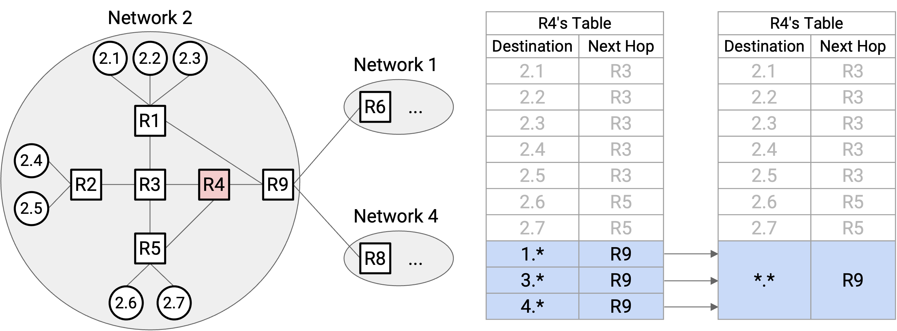

鑰冭檻 R4銆傚畠涓烘瘡涓?external network锛?.\*銆?.\* 鍜?4.\*锛夐兘鏈変竴鏉?entry锛岃€屼笖瀹冧滑鐨?next hop 閮芥槸 R9銆傛垜浠彲浠ユ妸鎵€鏈?external network 鑱氬悎鎴愪竴鏉?entry銆傛垜浠粛鐒朵細涓烘瘡涓?internal host锛?.1銆?.2 绛夛級淇濈暀 entry锛屼絾鏈€鍚庡啀鍐欎竴鏉¤鍒欙細瀵逛簬鎵€鏈変笉鍦?forwarding table 涓殑鍏朵粬 host锛宯ext hop 鏄?R9銆?
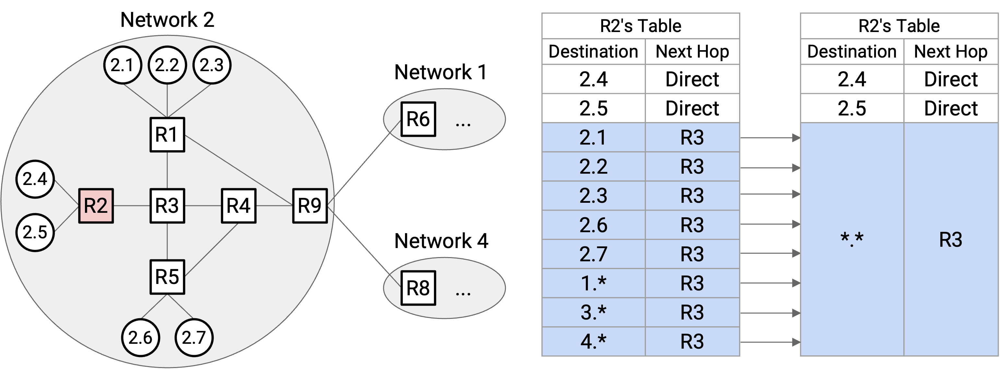

鍦?R2 涓婏紝鎴戜滑鍙互浣跨敤鏇存縺杩涚殑 aggregation銆傚悓鏍凤紝鎵€鏈?external network 鐨?next hop 閮芥槸 R3銆備絾鏄紝2.1銆?.2銆?.3銆?.6 鍜?2.7 鐨?next hop 涔熸槸 R3銆傚洜姝わ紝forwarding table 鍙渶瑕佷负 2.4 鍜?2.5 淇濈暀 static entry銆傜劧鍚庢垜浠彲浠ヨ锛屽浜庢墍鏈変笉鍦?forwarding table 涓殑鍏朵粬 host锛堝寘鎷竴浜?internal host 鍜屼竴浜?external host锛夛紝next hop 閮芥槸 R3銆?
涓轰簡琛ㄧず table 涓病鏈夊垪鍑虹殑鎵€鏈?host锛屾垜浠彲浠ヤ娇鐢?wildcard *.*锛屽畠浼氬尮閰嶆墍鏈夊唴瀹广€傚綋鍚戠粰瀹?destination 杞彂鏃讹紝router 浼氬厛妫€鏌?specific host锛堜緥濡?3.1锛夋垨 range锛堜緥濡?2.*锛夋槸鍚﹀尮閰嶃€傚鏋?router 鎵句笉鍒颁换浣曞尮閰嶉」锛屾渶缁堜細鍖归厤 *.* wildcard銆傝繖绉颁负 **default route锛堥粯璁よ矾鐢憋級**銆?
澶у鏁?host 鍙湁涓€鏉?hard-coded default route銆備緥濡傦紝host 2.4 鐨?forwarding table 鍙湁涓€鏉?entry锛岃〃绀烘墍鏈夊唴瀹归兘鍙戦€佺粰 R2銆傚疄璺典腑锛屼綘鐨勫鐢ㄧ數鑴戜篃鍙湁涓€鏉?entry锛岃〃绀烘墍鏈夊唴瀹归兘鍙戦€佺粰瀹堕噷鐨?router銆傝繖灏辨槸 host 涓嶉渶瑕佸弬涓?routing protocol 鐨勫師鍥犮€?

## 鍒嗛厤 Hierarchical IP Address锛氭棭鏈?Internet

涓轰簡鑾峰緱鏇村彲鎵╁睍鐨?routing锛屾垜浠渶瑕佷互鏌愮 hierarchical way 鍒嗛厤 address銆傝繖浜?address 闇€瑕佸寘鍚竴浜涗綅缃俊鎭紙渚嬪浣嶇疆鐩歌繎鐨?host 闇€瑕佸叡浜?address 鐨勪竴閮ㄥ垎锛夈€?
鍦ㄦ棭鏈?Internet 涓紝IPv4 address 鍜屽墠闈㈢殑鐩磋鐗堟湰涓€鏍凤紝鏈変竴涓?8-bit network ID 鍜屼竴涓?24-bit host ID銆?

渚嬪锛孉T&T 鐨?network ID 鏄?12锛孉pple 鐨?network ID 鏄?17锛岃€岀編鍥藉浗闃查儴鏈?13 涓笉鍚岀殑 network ID銆?
8-bit network ID 鎰忓懗鐫€鎴戜滑鍙兘鍒嗛厤 256 涓笉鍚岀殑 network ID锛屼絾鐜板疄涓紝鍙兘杩愯鑷繁 local network 鐨勭粍缁囪繙杩滆秴杩?256 涓€傚彟澶栵紝24-bit host ID 鎰忓懗鐫€姣忎釜 network 閮藉緱鍒?2\^24 = 16,777,216 涓?address銆備竴涓皬 network锛堜緥濡傚彧鏈?10 鍚嶅憳宸ョ殑鍏徃锛夊ぇ姒備笉闇€瑕?1600 涓囦釜 address銆傞殢鐫€ Internet 鍙樺ぇ锛屾垜浠渶瑕佷竴绉嶆柊鐨?addressing 鏂规硶銆?

## 鍒嗛厤 Hierarchical IP Address锛欳lassful Addressing

绗竴娆′慨澶嶅皾璇曟槸 **classful addressing锛堝垎绫诲鍧€锛?*锛屽畠鏍规嵁闇€姹傚垎閰嶄笉鍚屽ぇ灏忕殑 network銆傚湪杩欑鏂规硶涓紝鏈?3 绫?address锛屾瘡绫诲垎閰嶇粰 network ID 鍜?host ID 鐨?bit 鏁颁笉鍚屻€傛渶鍓嶉潰鐨?1-3 bits 鏍囪瘑姝ｅ湪浣跨敤鍝竴绫汇€?
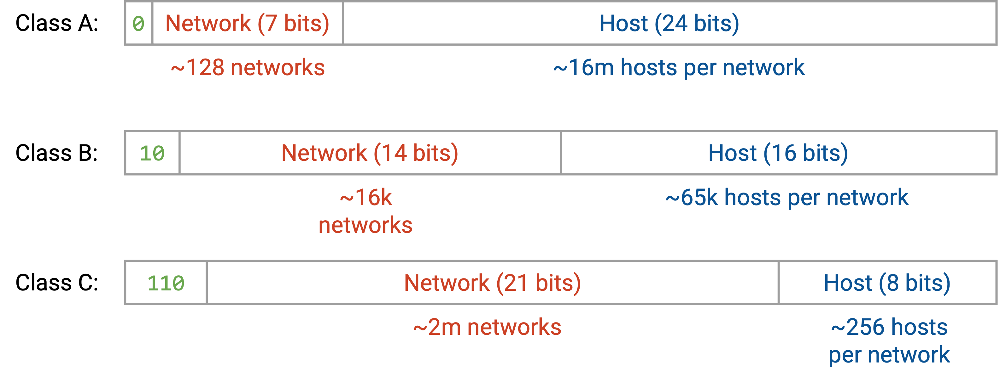

Class A address 浠?leading bit 0 寮€澶淬€傛帴涓嬫潵鐨?7 bits 鏄?network ID锛?28 涓?network锛夛紝鍐嶆帴涓嬫潵鐨?24 bits 鏄?host ID锛?600 涓囦釜 host锛夈€?
Class B address 浠?leading bits 10 寮€澶淬€傛帴涓嬫潵鐨?14 bits 鏄?network ID锛?6000 涓?network锛夛紝鍐嶆帴涓嬫潵鐨?16 bits 鏄?host ID锛?5000 涓?host锛夈€?
Class C address 浠?leading bits 110 寮€澶淬€傛帴涓嬫潵鐨?21 bits 鏄?network ID锛?00 涓囦釜 network锛夛紝鍐嶆帴涓嬫潵鐨?8 bits 鏄?host ID锛?56 涓?host锛夈€?
鍦ㄨ繖绉嶆柟娉曚腑锛屾垜浠幇鍦ㄥ彲浠ユ嫢鏈?200 涓?+ 16000 + 128 涓笉鍚岀殑 local network銆傛嫢鏈夋洿澶?host 鐨勫ぇ鍨嬬粍缁囧彲浠ヨ幏寰?Class A network锛岃緝灏忕粍缁囧彲浠ヨ幏寰?Class B 鎴?Class C network銆傚拰涔嬪墠涓€鏍凤紝鍦ㄥ崟涓?network 鍐呴儴锛宭eading class bit(s) 鍜?network ID bits 閮界浉鍚岋紝姣忎釜 host 鑾峰緱涓嶅悓鐨?host ID銆?
Classful addressing 鐨勪竴涓富瑕侀棶棰樻槸姣忎竴绫荤殑澶у皬銆侰lass A锛?600 涓囦釜 host锛夊澶у鏁扮粍缁囨潵璇村お澶э紝鑰?Class C锛?56 涓?host锛夊澶у鏁扮粍缁囨潵璇村お灏忋€傜粨鏋滄槸锛屽ぇ澶氭暟 network 閮介渶瑕佽惤鍦?Class B銆?
涓嶅垢鐨勬槸锛孋lass B network ID 鍙湁 16000 涓€傚埌 1994 骞达紝鎴戜滑宸茬粡蹇敤瀹?Class B network 浜嗐€傚洜姝わ紝鍙堥渶瑕佷竴绉嶆柊鐨?addressing 鏂规硶銆?
娉ㄦ剰锛氬湪鐜颁唬 Internet 涓紝classful addressing 宸茬粡杩囨椂銆?
娉ㄦ剰锛氫弗鏍兼潵璇达紝姣忎釜 network 涓殑 host 鏁伴噺瑕佸皯 2 涓紝鍥犱负鍏?0 address 鍜屽叏 1 address 琚繚鐣欑敤浜庣壒娈婄洰鐨勩€備緥濡傦紝鍦?Class C 涓紝姣忎釜 network 瀹為檯涓婃湁 254 涓?host锛岃€屼笉鏄?256 涓€?

## 鍒嗛厤 Hierarchical IP Address锛欳IDR

鎴戜滑鐨勭涓夌 hierarchical addressing 鏂规硶锛屼篃鏄幇浠?Internet 浠嶅湪浣跨敤鐨勬柟娉曪紝鏄?**CIDR**锛圕lassless Inter-Domain Routing锛夈€傚湪 CIDR 涓紝鎴戜滑浠嶇劧浣跨敤鍙彉闀垮害鐨?network ID锛屼絾涓嶅啀鍙湁 3 绉嶄笉鍚岀殑 network ID 闀垮害锛圕lass A銆丅銆丆锛夛紝鑰屾槸璁╁浐瀹?bit 鐨勬暟閲忎换鎰忓彲鍙樸€?
渚嬪锛岃€冭檻鍓嶉潰閭ｅ鍙湁 10 鍚嶅憳宸ョ殑灏忓叕鍙搞€傚湪 classful addressing 涓紝瀹冧細寰楀埌涓€涓?Class C network锛屼篃灏辨槸 256 涓?host address銆傚鏋滃畠鍙渶瑕?10 涓?host address锛屾垜浠彲浠ョ粰瀹冩洿闀跨殑 network ID锛屼粠鑰屽垎閰嶆洿灏戠殑 address銆?
濡傛灉鍒嗛厤 28-bit network ID锛宧ost ID 灏辨槸 4 bits锛?6 涓彲鑳界殑 address锛夈€傚鏋滃垎閰?29-bit network ID锛宧ost ID 灏辨槸 3 bits锛? 涓彲鑳界殑 address锛夈€傛垜浠棤娉曠簿纭垎閰?10 涓?address锛屼絾 28-bit network ID 宸茬粡瓒冲杩欏鍏徃浣跨敤銆傝繖閲屼細鏈変竴鐐规氮璐癸紙6 涓湭浣跨敤 address锛夛紝浣嗕粛鐒惰繙濂戒簬鍒嗛厤 256 涓?address銆?
鍐嶄妇涓€涓緥瀛愶紝鑰冭檻涓€涓渶瑕?450 涓?host address 鐨勭粍缁囥€傚湪 classful addressing 涓紝Class C锛?56 涓?address锛変笉澶燂紝鎵€浠ュ畠浼氭敹鍒颁竴涓?Class B network锛屾嫢鏈?65000 涓?host address锛屽叾涓ぇ澶氭暟 address 閮戒笉浼氳浣跨敤銆傛湁浜嗕换鎰忛暱搴︾殑 network ID锛屾垜浠彲浠ュ垎閰?23-bit network ID锛岀暀涓?9 bits 鐢ㄤ簬 host addressing锛?12 涓?address锛夈€傝繖鑳芥弧瓒崇粍缁囬渶姹傦紝骞舵氮璐瑰皯寰楀鐨?address銆?

## 澶氬眰 Hierarchical Assignment

鐜板疄涓殑 hierarchy 鍙互鏈夊緢澶氬眰銆備緥濡傦紝鍦ㄤ竴涓?network 鍐呴儴锛岀粍缁囧彲浠ラ€夋嫨鎶婄壒瀹?address range 鍒嗛厤缁欑壒瀹?sub-organization锛堜緥濡傚叕鍙告垨澶у閲岀殑閮ㄩ棬锛夈€?
瀹炶返涓紝鎴戜滑浼氬埄鐢ㄧ幇瀹炰笘鐣屼腑澶氬眰鐨勭粍缁囧拰鍦扮悊 hierarchy 鏉ュ垎閰?address銆侷CANN锛圛nternet Corporation for Names and Numbers锛夋槸鎷ユ湁鎵€鏈?IP address 鐨勫叏鐞冪粍缁囥€?
ICANN 浼氭妸 address block 鍙戠粰 Regional Internet Registry锛圧IR锛夛紝姣忎釜 RIR 浠ｈ〃鐗瑰畾鍥藉鎴栧ぇ闄嗐€備緥濡傦紝RIPE 鑾峰緱娆х洘鐨勬墍鏈?address锛孉RIN 鑾峰緱鍖楃編 address锛孉PNIC 鑾峰緱浜氭床/澶钩娲?address锛孡ACNIC 鑾峰緱鍗楃編 address锛孉FRINIC 鑾峰緱闈炴床 address銆備緥瀛愶細ICANN 鎶婃墍鏈変互 1101 寮€澶寸殑 address 缁?ARIN銆?
鐒跺悗锛屾瘡涓?RIR 浼氭妸鑷繁 range 鐨勪竴閮ㄥ垎鍒嗛厤缁欏ぇ鍨嬬粍缁囷紙渚嬪鍏徃銆佸ぇ瀛︼級鎴?ISP銆傝繖浜涚粍缁囨垨 ISP 绉颁负 Local Internet Registry銆備緥瀛愶細ARIN 鎺у埗鎵€鏈変互 1101 寮€澶寸殑 address锛屽苟鎶婃墍鏈変互 1101 11001 寮€澶寸殑 address 缁?AT&T銆?
鏈€鍚庯紝姣忎釜 local Internet registry 浼氭妸鍗曚釜 IP 鍒嗛厤缁欏叿浣?host銆備负浜嗗鍔?hierarchy锛宭ocal registry 涔熷彲浠ユ妸 IP range 鍒嗛厤缁欏皬缁勭粐锛屽皬缁勭粐鍐嶅垎閰嶅崟涓?IP銆?
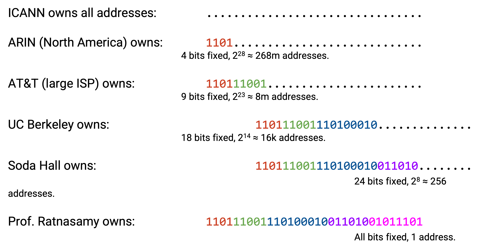

鍦ㄦ瘡涓€灞傦紝棰濆鍥哄畾澶氬皯 bit 鍙栧喅浜庤鍒嗛厤澶氬皯 address銆備緥濡傦紝ARIN 鍙兘鎯崇粰 AT&T 800 涓囦釜 address锛屽苟璁＄畻鍑哄浐瀹?9 bits 浼氬緱鍒?800 涓囦釜 host address銆侫RIN 宸茬粡鍥哄畾浜?4 bits锛屾墍浠ュ畠鍐嶅浐瀹?5 bits锛屽苟鎶婃墍鏈変互杩?9 bits 寮€澶寸殑 address 鍒嗛厤缁?AT&T銆侫T&T 鎺ョ潃鍙兘鎶?prefix 1101 11001 110100010 缁?UC Berkeley锛屼粠鑰屾彁渚?16000 涓?address銆傞殢鐫€鎴戜滑鍚?sub-organization 鍒嗛厤 address锛屾洿澶?bit 浼氳鍥哄畾锛屽苟涓斿缁堜繚鐣?parent organization 宸茬粡鍥哄畾鐨?bit銆?

## IP Address 鍐欐硶

鎴戜滑鍙互鎶?IP address 鍐欐垚 32-bit 鐨?1 鍜?0 搴忓垪锛屼篃鍙互鍐欐垚涓€涓緢澶х殑鏁存暟銆傚疄璺典腑锛屼负浜嗗彲璇绘€э紝鎴戜滑鎶婃瘡涓€缁?8 bits 鍐欐垚涓€涓暣鏁帮紙鑼冨洿鏄?0 鍒?255锛夈€備緥濡傦紝IP address 00010001 00100010 10011110 00000101 鍙互鍐欐垚 17.34.158.5銆傝繖鏈夋椂绉颁负 **dotted quad锛堢偣鍒嗗洓娈碉級** 琛ㄧず娉曘€?
鍒扮洰鍓嶄负姝紝鎴戜滑涓€鐩存妸 address range 鍐欐垚 bit锛堜緥濡傛墍鏈変互 1101 寮€澶寸殑 IP锛夈€備负浜嗗啓鍑轰竴涓?address range锛屾垜浠彲浠ヤ娇鐢?**slash notation锛堟枩鏉犺〃绀烘硶锛?*銆傛垜浠厛鍐欏嚭鍥哄畾 prefix锛岀劧鍚庝负鎵€鏈夊墿浣欑殑鏈浐瀹?bit 鍐?0锛屽苟鎶婂緱鍒扮殑 32-bit 鍊艰浆鎹㈡垚 dotted quad IP address銆傜劧鍚庯紝鍦?slash 鍚庨潰鍐欏嚭鍥哄畾 bit 鐨勬暟閲忋€?
渚嬪锛屽鏋?prefix 鏄?11000000锛屾垜浠负鎵€鏈夋湭鍥哄畾 bit 娣诲姞 0锛屽緱鍒?11000000 00000000 00000000 00000000銆備綔涓?32-bit address锛屽畠鏄?192.0.0.0銆傜劧鍚庯紝鍥犱负鍥哄畾浜?8 bits锛屾垜浠妸杩欎釜 range 鍐欎綔 192.0.0.0/8銆?
濡傛灉瑕佹妸鍗曚釜 address 鍐欐垚 range锛屽彲浠ュ啓鎴愮被浼?192.168.1.1/32锛岃〃绀烘墍鏈?32 bits 閮藉浐瀹氥€傚彟澶栵紝default route *.* 鍙互鍐欐垚 0.0.0.0/0銆?
Slash notation 鏈夋椂鐪嬭捣鏉ユ湁鐐硅糠鎯戯紝鍥犱负鎴戜滑浣跨敤浠绘剰鐨?8-bit 鍒嗘锛屽苟鐢ㄥ崄杩涘埗鏁板瓧涔﹀啓銆備緥濡傦紝8-bit prefix 11000000 鍜?12-bit prefix 11000000 0000 閮戒細鍐欐垚 192.0.0.0/8 鍜?192.0.0.0/12锛堝悓涓€涓?IP address 琛ㄧず涓嶅悓 range锛夈€傚啀涓句竴涓緥瀛愶紝濡傛灉鎴戞嫢鏈?4-bit prefix 1100锛屽氨鍙互鍒嗛厤 5-bit prefix 11001銆備綔涓?range锛屽畠浠啓鎴?192.0.0.0/4 鍜?200.0.0.0/5銆備箥鐪嬩箣涓嬶紝寰堥毦鐪嬪嚭绗簩涓?range 瀹為檯涓婃槸绗竴涓?range 鐨勫瓙闆嗭紝蹇呴』鍐欏嚭 bit 鎵嶈兘纭銆?
Slash notation 涓?slash锛堜緥濡?/16锛夌殑鍙︿竴绉嶆浛浠ｆ柟寮忔槸 **netmask锛堢綉缁滄帺鐮侊級**銆傚拰 slash 鍚庨潰鐨勬暟瀛椾竴鏍凤紝netmask 鍛婅瘔鎴戜滑鍝簺 bit 鏄浐瀹氱殑銆備负浜嗗啓 netmask锛屾垜浠妸鎵€鏈夊浐瀹?bit 鍐欐垚 1锛屾墍鏈夋湭鍥哄畾 bit 鍐欐垚 0锛屽苟鎶婄粨鏋滆浆鎹㈡垚 dotted quad銆備緥濡傦紝濡傛灉 range 鏄?192.168.1.0/29锛屾垜浠彲浠ュ啓鍑?29 涓?1锛堝浐瀹?bit锛夊拰 3 涓?0锛堟湭鍥哄畾 bit锛夈€?1111111 11111111 11111111 11111000 鍐欐垚 dotted quad 鏄?255.255.255.248銆傜敤 netmask notation 琛ㄧず鏃讹紝杩欎釜 range 鏄?192.168.1.0锛宯etmask 鏄?255.255.255.248锛堢敤 netmask 鏇夸唬 slash锛夈€?
鍦ㄨ繖浜涜涔変腑锛屾垜浠€氬父浣跨敤 slash notation锛屽洜涓哄畠鏇存柟渚块槄璇汇€傚疄璺典腑锛宯etmask 涔熷緢鏈夌敤锛氱粰瀹氫竴涓叿浣?IP address锛屽鏋滀綘鍦?IP address 鍜?netmask 涔嬮棿鎵ц bitwise AND锛屾墍鏈?host bit 閮戒細琚竻闆讹紝鍙墿涓?network bit銆?

## 鐢?CIDR 鑱氬悎 Route

鍦ㄦ垜浠渶鍒濈殑 network ID 鍜?host ID 妯″瀷涓紝鍙互鎶婂悓涓€涓?network 鍐呴儴鐨勬墍鏈?host 鑱氬悎鎴?forwarding table 涓殑涓€鏉?route锛堜緥濡?2.* 琛ㄧず network 2 涓殑涓€鍒囷級銆?
澶氬眰 hierarchical addressing 鎰忓懗鐫€锛屾垜浠篃鍙互鎶婂涓?network 鑱氬悎鎴愪竴鏉?route銆?
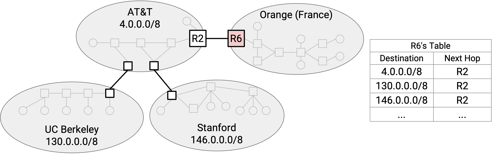

鑰冭檻杩欏紶 network 鍥俱€傚湪鏈€鍒濈殑妯″瀷涓紝R6 闇€瑕佸垎鍒负 AT&T銆乁CB 鍜?Stanford 鍑嗗 forwarding entry銆?
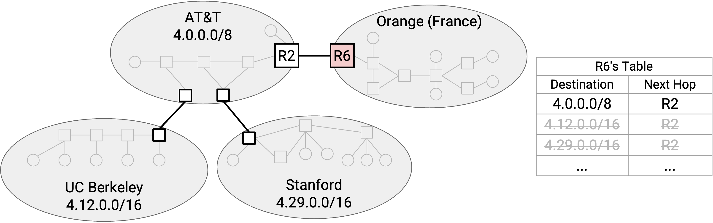

鐒惰€岋紝濡傛灉浣跨敤 hierarchical addressing锛岄偅涔?UCB 鐨?range锛?.12.0.0/16锛夊拰 Stanford 鐨?range锛?.29.0.0/16锛夐兘鏄?AT&T 鐨?range锛?.0.0.0/8锛夌殑瀛愰泦銆傚鏋?AT&T 鎶婅繖浜?range 鍒嗛厤缁欒嚜宸辩殑涓嬫父瀹㈡埛 UCB 鍜?Stanford锛屽氨鍙兘鍑虹幇杩欑鎯呭喌銆?
鐜板湪锛孯6 鍙渶瑕佷竴鏉?entry 灏辫兘琛ㄧず AT&T銆乁CB 鍜?Stanford銆傛垜浠妸涓や釜杈冨皬鐨?range 鑱氬悎杩涗簡瀹冧滑鍏卞悓鎵€灞炵殑鏇村ぇ range銆?

## Multi-Homing

鑱氬悎 range 骞朵笉鎬绘槸鏈夋晥銆傚亣璁炬垜浠坊鍔犱竴鏉′粠 R6 鐩存帴鍒?Stanford 鐨?link銆?
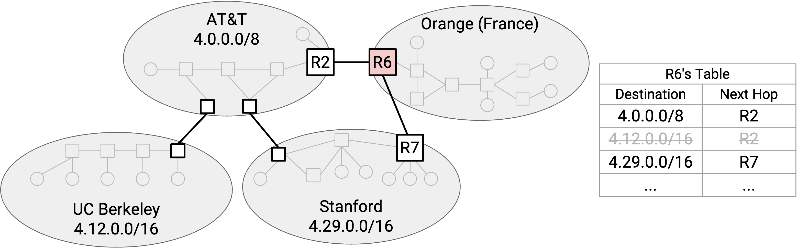

鑱氬悎鍚庣殑 route 璇达紝鎵€鏈夊彂寰€ AT&T锛堜互鍙婂畠鐨勪笅绾э級鐨?packet锛宯ext hop 閮芥槸 R2銆傛垜浠渶瑕佹坊鍔犱竴鏉￠澶?entry锛岃〃绀?Stanford 鐨?next hop 鏄?R7銆?
娉ㄦ剰锛屾垜浠殑 forwarding table 鐜板湪鏈変簡褰兼閲嶅彔鐨?range銆備竴涓?destination 鍙兘鍖归厤澶氫釜 range銆備负浜嗛€夋嫨 route锛屾垜浠細杩愯 **longest prefix matching锛堟渶闀垮墠缂€鍖归厤锛?*锛屼篃灏辨槸浣跨敤涓?destination IP address 鍖归厤鐨勬渶鍏蜂綋 range銆備緥濡傦紝濡傛灉鏈変竴涓?packet 鍙戝線 UCM host锛屾垜浠細浣跨敤 UCM 涓撳睘 entry锛屽洜涓哄畠鏈夋洿闀跨殑 19-bit prefix銆傚嵆浣?9-bit AT&T entry 涔熷尮閰嶈繖涓?destination锛屽畠鐨?prefix 鏇寸煭锛屾墍浠ユ垜浠笉鐢ㄨ繖鏉?route銆?
濡傛灉鎴戜滑鏈変竴涓?packet 鍙戝線 UCB host锛屽氨涓嶈兘浣跨敤 Stanford 涓撳睘 entry锛屽洜涓?16-bit prefix 涓嶄細鍖归厤 UCB host銆備絾鎴戜滑浠嶇劧鍙互浣跨敤 8-bit AT&T entry锛屽畠浼氬尮閰嶈繖涓?destination銆?

## IPv6 绠€鍙?
IPv4 address 鏄?32 bits锛岃繖鎰忓懗鐫€鎴戜滑澶х害鏈?40 浜夸釜鍙敤 address銆傝繖澶熷悧锛?
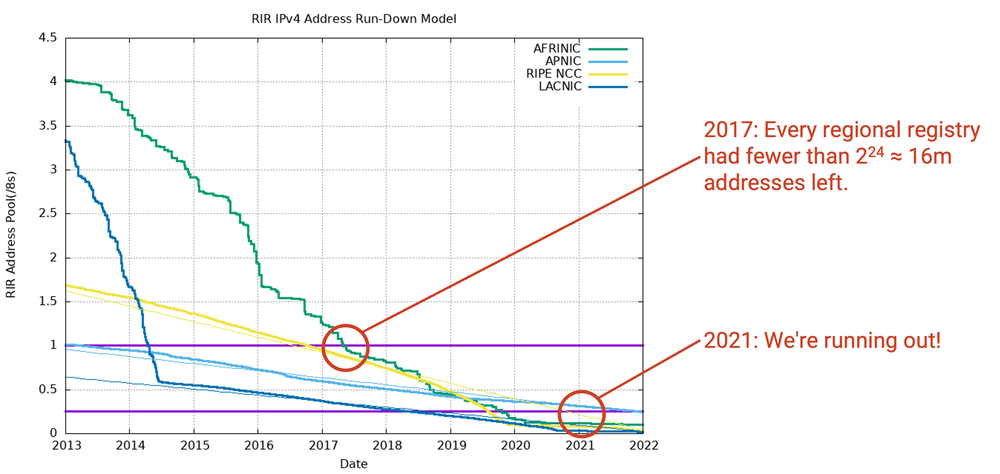

杩欏紶鍥惧睍绀轰簡姣忎釜 regional registry 闅忔椂闂村墿浣欑殑鏈垎閰?IP address 鏁伴噺锛坹 杞达級銆?
鍒?2017 骞达紝鎵€鏈変汉鍙敤鐨?address 閮藉皯浜庝竴涓?/8 block锛堜篃灏辨槸灏戜簬 2\^24 = 1600 涓囦釜 address锛夈€傛瘡涓?regional registry 閮戒繚鐣欎簡涓€涓鐢?/8 block锛屼互闃蹭竾涓€锛涗絾鍒?2017 骞达紝鎵€鏈変汉閮戒笉寰椾笉寮€濮嬩娇鐢ㄨ嚜宸辩殑澶囩敤 address銆傚埌 2021 骞达紝杩炲鐢?address 涔熷揩鐢ㄥ畬浜嗐€?
涓€涓皬鎻掓洸锛?011 骞?2 鏈堬紝鏈€鍚庝竴涓?/8 block 琚垎閰嶆椂锛岃繕涓捐浜嗕竴鍦虹嚎涓嬩华寮忥紝鐢氳嚦鍙戞斁浜嗙壒鍒殑绾歌川璇佷功銆?
闅忕潃 Internet 澧為暱锛屾垜浠紑濮嬫剰璇嗗埌 address 缁堟湁涓€澶╀細鑰楀敖銆傚垢杩愮殑鏄紝杩欎竴鐐瑰緢鏃╁氨琚剰璇嗗埌锛屼簬鏄?IPv6 鍦?1998 骞磋寮€鍙戝嚭鏉ワ紝鐢ㄦ潵搴斿 IP address exhaustion锛圛P 鍦板潃鑰楀敖锛夈€?
浠庢牴鏈笂璇达紝IPv6 鐨?addressing structure 涓?IPv4 鐩稿悓銆侷Pv6 闇€瑕佷竴浜涜緝灏忕殑瀹炵幇鏀瑰姩锛屼笉杩囪繖浜涗笌杩欓噷鐨勮璁烘棤鍏炽€?
IPv6 鐨勪富瑕佹柊鐗规€ф槸鏇撮暱鐨?address銆侷Pv6 address 闀?128 bits锛岃繖鎰忓懗鐫€澶х害鏈?$3.4 \times 10^{38}$ 涓彲鑳界殑 address銆傝繖鏄竴涓ぉ鏂囨暟瀛楋紝鎵€浠ユ垜浠案杩滀笉浼氱敤瀹屻€傚畤瀹欑殑骞撮緞鏄?$10^{21}$ 绉掞紝鎵€浠ュ嵆浣挎垜浠粰姣忎竴绉掗兘鍒嗛厤涓€涓?address锛屼篃鍙敤浜嗘墍鏈夊彲鐢?address 鐨?0.000000000000001%銆?
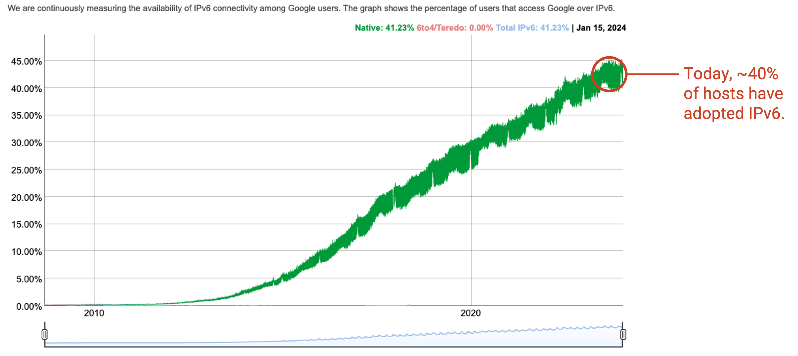

IPv6 寮€鍙戜簬 1990 骞翠唬锛屼絾骞舵病鏈夌珛鍒昏鎵€鏈夎绠楁満閲囩敤銆傚嵆浣垮湪 2010 骞达紝鍩烘湰涓婁篃娌′汉浣跨敤 IPv6銆傛埅鑷?2024 骞达紝绾?45% 鐨?end user 浣跨敤 IPv6锛岃€屼笖鍏朵腑澶у鏁扮敤鎴蜂綅浜?Internet 閲囩敤鐜囪緝楂樼殑鍙戣揪鍥藉銆侷Pv6 瓒婃潵瓒婂箍娉涢噰鐢ㄧ殑涓昏鍘熷洜锛屾槸 IPv4 address 姝ｅ湪鑰楀敖銆?
涓轰粈涔?IPv6 閲囩敤杩欎箞鎱紵鐢ㄦ埛銆佹湇鍔″櫒鍜?Internet 杩愯惀鑰呴兘蹇呴』鍗囩骇杞欢鍜岀‖浠讹紙渚嬪 router銆乴ink銆佽绠楁満涓婄殑 device driver锛夋潵鏀寔 IPv6銆俁outer 鐜板湪闇€瑕佷袱寮?forwarding table锛屼竴寮犵敤浜?IPv4 address锛屼竴寮犵敤浜?IPv6 address銆?
IPv6 upgrade 蹇呴』淇濇寔 backward-compatible銆傚鏋滄煇涓湇鍔″櫒鍙湁 IPv6 address锛屼娇鐢ㄥ彧鏀寔 IPv4 鐨勬棫鐢佃剳鐨勭敤鎴峰氨鏃犳硶浣跨敤杩欎釜鏈嶅姟鍣ㄣ€侷Pv4 鍜?IPv6 鏈川涓婃槸褰兼鐙珛鐨?addressing system锛屾病鏈夊姙娉曞湪 IPv4 鍜?IPv6 address 涔嬮棿杞崲銆傛埅鑷?2024 骞达紝璁稿璁＄畻鏈轰粛鐒朵笉鏀寔 IPv6锛屽洜姝よ澶氭湇鍔￠渶瑕佸悓鏃舵敮鎸?IPv4 鍜?IPv6銆?
鍚屾椂鏀寔 IPv4 鍜?IPv6 鐨勮绠楁満杩樺繀椤昏€冭檻浣跨敤鍝竴涓€傛煇涓€涓竴瀹氭洿濂藉悧锛熷疄璺典腑锛孖Pv6 鏇村揩锛屼絾璁稿鍏朵粬瀹炵幇缁嗚妭涔熶細褰卞搷浣犵殑閫夋嫨銆?

## IPv6 Address Notation

IPv6 address 閫氬父鐢ㄥ崄鍏繘鍒惰€屼笉鏄崄杩涘埗涔﹀啓銆備緥濡傦細

2001:0D08:CAFE:BEEF:DEAD:1234:5678:9012

杩欐槸涓€涓?IPv6 address锛?2 涓崄鍏繘鍒舵暟瀛?= 128 bits锛夈€備负浜嗗彲璇绘€э紝鎴戜滑鍦ㄦ瘡 4 涓崄鍏繘鍒舵暟瀛楋紙16 bits锛変箣闂村姞涓€涓啋鍙枫€?
涓轰簡鍙鎬э紝鎴戜滑鍙互鐪佺暐姣忎釜 4 浣嶅潡涓殑 leading zero銆備緥濡傦細

2001:0DB8:0000:0000:0000:0000:0000:0001

鍙互缂╃煭涓?2001:DB8:0:0:0:0:0:1銆?
涓轰簡鍙鎬э紝鎴戜滑杩樺彲浠ョ渷鐣ヤ竴闀夸覆 0锛屼緥濡?2001:DB8::1銆傚弻鍐掑彿琛ㄧず鎶婃墍鏈夌己澶辩殑 4 浣嶅潡閮藉～鎴?0000銆傛瘡涓?address 鍙兘杩欐牱鍋氫竴娆°€傦紙鐪佺暐涓ゆ range 浼氶€犳垚姝т箟锛屽洜涓烘垜浠笉鐭ラ亾姣忔搴旇濉灏戜釜 0銆傦級

Slash notation 鍦?IPv6 涓粛鐒跺彲浠ヤ娇鐢ㄣ€傚崟涓?address 鏄?/128锛堟墍鏈?bit 鍥哄畾锛夈€備竴涓?32-bit prefix 鍙兘鍐欐垚 2001:0DB8::/32銆?
鐢变簬 address space 鏋佸ぇ锛屽湪 IPv6 涓紝浣犲彲浠ユ妸 network ID 鍥哄畾涓?64 bits锛屾妸 host ID 涔熷浐瀹氫负 64 bits锛屽苟涓斾粛鐒舵案杩滀笉浼氱敤瀹?network ID 鎴?host ID銆備簨瀹炰笂锛屾湁涓€浜涚壒娈?protocol 鍏佽 network 鍜?host 閫夋嫨鑷繁鐨?64-bit network ID 鍜?host ID锛堝苟妫€鏌ユ病鏈夊埆浜烘鍦ㄤ娇鐢ㄥ畠锛夛紝鑰屼笉闇€瑕佹煇涓粍缁囧垎閰嶅叿浣?ID銆?
瀹炶返涓紝regional registry 閫氬父鎶?32-bit prefix 鍒嗛厤缁?ISP锛孖SP 閫氬父鎶?48-bit prefix 鍒嗛厤缁欑粍缁囥€傜劧鍚庯紝缁勭粐鍙互鎶?64-bit prefix 鍒嗛厤缁欐洿灏忕殑 sub-network銆傚湪 IPv6 涓紝鎴戜滑閫氬父涓嶄細鐪嬪埌闀夸簬 /64 鐨?prefix銆傚嵆浣挎槸缁勭粐鍐呴儴鏈€灏忕殑 sub-network锛屼篃鏈?64-bit prefix锛屽苟鐢?64 bits 涓哄叿浣?host 缂栧潃銆備娇鐢ㄨ繖浜涙爣鍑嗗寲 prefix size 鍙互璁?prefix 鎼哄甫鏇村淇℃伅銆備緥濡傦紝鍦?IPv4 涓紝寰堥毦鐪嬪嚭涓€涓?/19 prefix 琛ㄧず浠€涔堬紱浣嗗湪 IPv6 涓紝鎴戜滑鐭ラ亾 /32 prefix 閫氬父琛ㄧず涓€涓?ISP銆俆ODO double check this
