# Model for Inter-Domain Routing

## Inter-Domain Routing

回忆前面讲过的内容：routing 是在由多个网络组成的网络中执行的。我们已经见过 distance-vector 和 link-state protocol，它们可以用来实现 intra-domain routing，也就是让 packet 在一个本地网络内部发送。

本节中，我们会建立一个模型，用来定义 inter-domain routing protocol，也就是在不同本地网络之间发送 packet 的 protocol。我们还会看到 inter-domain 和 intra-domain routing protocol 如何结合，让 packet 可以发送到任意网络中的任意 host。

## 定义 Autonomous System

我们可以通过定义 **autonomous system (AS)** 来形式化「本地网络」这个概念。一个 AS 是由同一个运营者运行的一个或多个本地网络。例如，在 Google 这样的公司内部，可能有一个用于员工计算机的本地网络，另一个用于数据中心的本地网络，但这两个网络都由同一家公司控制。运营者可以部署一个统一的 intra-domain routing protocol，让这些本地网络中的任意机器之间互相发送消息。有时，**domain** 这个词会非正式地指代 AS，不过这个词也会在其他 protocol 中使用，所以我们会尽量说 AS。

为了思考 autonomous system 之间的 packet routing，我们可以抽象掉 AS 内部的所有单个 router 和 host，把整个 AS 看作一个实体。然后，我们可以画出一张图，其中每个节点表示一个 AS，两个 AS 之间的边表示它们之间的连接。这张图有时称为 **inter-domain topology** 或 **AS graph**。

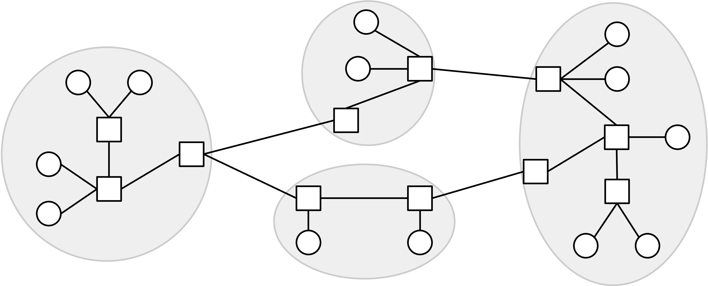

## Autonomous System 简史

现实中，一个叫 Internet Assigned Numbers Authority (IANA) 的组织管理着 Internet 中所有 autonomous system 的全局列表。要成为一个 AS，你必须向这个组织注册，并获得一个唯一的 autonomous system number (ASN)。

有趣事实：早期的 IANA 是由 Jon Postel 一个人手动管理的。这意味着世界上任何想注册新 AS 的人，都必须请求他的批准。

今天，全球已经有超过 90,000 个 autonomous system，其中美国拥有的 AS 数量最多。

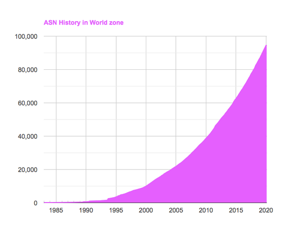

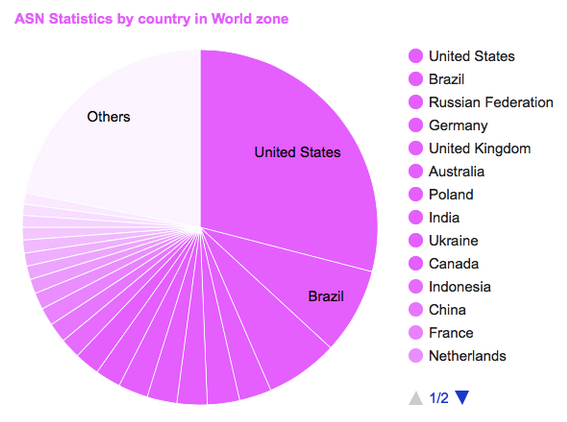

有趣事实：UC Berkeley 的 ASN 是 25。考虑到现在有这么多 ASN，这个数字非常小。这反映出 UC Berkeley 很早就在 Internet 历史中（20 世纪 80 年代）获得了自己的 ASN。

## AS 的类型

回忆一下，在为 intra-domain routing 建模时，我们区分了 end host 和 router。我们会为 inter-domain routing 做类似区分，定义两类 AS。

**stub autonomous system** 只用于给本地网络中的 host 提供 Internet 连接。stub AS 只代表 AS 内部的 host 发送和接收 packet，不会在不同 AS 之间转发 packet。这类似于 intra-domain routing 模型中的 end host：它们只发送和接收自己的 packet，不会转发别人的 packet。

stub AS 的现实例子包括非 Internet 公司（例如一家银行为员工提供连接）或大学（例如 UC Berkeley 为学生和员工提供连接）。这些组织不负责承载其他组织的 Internet 流量。世界上绝大多数 AS 都是 stub AS。

相比之下，**transit autonomous system** 会代表其他 AS 转发 packet。transit AS 可以通过接收并转发 packet，在两个不同 AS 之间承载 packet。

transit AS 对应现实中业务包含向其他组织销售 Internet 连接的公司。现实例子包括 AT&T 和 Verizon，你可以付钱让这些公司为你提供 Internet 连接。一些 transit AS（如 AT&T）是全球性的，在世界各地都有基础设施。另一些可能只覆盖某个地区，例如 Sonic 这个只转发加州往返流量的 ISP。

注意，transit AS 仍然可以包含会发送和接收自己 packet 的 end host。尽管如此，transit AS 更类似于 intra-domain routing 模型中的 router：它会接收其他用户的 packet，并代表用户转发它们。

这些笔记会使用 stub AS 和 transit AS 这个模型，不过现实中的分类有时没那么清楚。例如，Google、Microsoft、Amazon 这样的科技巨头控制着巨大的 AS，承载的流量和 transit AS 一样多（甚至更多）。由于它们的主要角色是承载进出自己服务的流量（例如接收 Google 搜索请求并返回搜索结果），它们可以被归类为 stub AS。不过近年来，这些公司也开始提供在 AS 之间承载流量的服务，所以也可以说它们某种程度上属于 transit AS。

## Inter-Domain Topology 由商业关系定义

在 inter-domain topology 中，如果两个 AS 交换流量，我们就在它们之间画一条边。是什么让两个现实组织（例如一家本地银行和 Verizon）同意交换流量？AS graph 中的边由 AS 之间现实世界的商业关系定义。

一对 AS 之间可能有两种关系。

一对 AS 可能处于 customer-provider relationship。现实中，**customer** 支付服务费用，**provider** 收钱并提供连接。例如，本地银行 AS 可以是 customer，向 provider Verizon 付费购买 Internet 服务。

一对 AS 也可能处于 **peer** relationship。两个 peer AS 通常彼此发送大致相等的流量。现实中，两个 AS 可以通过公司之间签署法律合同来成为 peer。通常，只要双向发送的流量大致相等，两个 peer 会同意互不支付连接服务费用。

## 带商业关系的 AS Graph

我们可以在 AS graph 中加入箭头来表示这些关系。有向边从 provider 指向 customer。无向边连接两个 peer。注意，这张图可以同时包含有向边和无向边（不是所有边都必须有箭头）。

图中的 stub AS 只作为 customer。它们有入边，表示是谁为它们提供连接。不过它们没有出边，因为它们不向别人提供连接。

相比之下，图中的 transit AS 是 provider。它们的出箭头表示它们正在向其他组织销售连接。

注意，箭头方向并不告诉我们 packet 的发送方向。事实上，即使沿着有向边，packet 也可以双向发送。customer 通常付钱给 provider，以便能够向 Internet 的其他地方发送 packet，并从其他地方接收 packet。

## AS Graph 是无环的

customer-provider relationship 构成的图是无环的。图中不会包含只由有向边组成的 cycle。

这个无环性质来自现实世界中 cycle 的含义。现实中，一个 cycle 意味着 A 付钱给 B，B 付钱给 C，然后 C 又付钱给 A，让钱从某人那里流出后又回到自己，这不合理。另外，这个 cycle 还意味着 A 为 C 提供服务，C 为 B 提供服务，B 又为 A 提供服务。某人为自己提供连接也不合理。

打个比方，想象你给 UC Berkeley 交学费上课，然后 UC Berkeley 给 UC 系统交学费上课，最后 UC 系统又给你交学费上课。这种商业关系没有意义。

注意，无环性质只适用于 customer-provider relationship。peering relationship 形成 cycle 是可以的。例如，A-B、B-C、C-A 都是 peer 没问题。它们之间没有互相付钱，所以不会出现定义不清的商业关系。

## Provider 层级和 Tier 1 AS

图无环的一个结果是，我们可以形成 provider 的层级结构。换句话说，我们可以排列这些节点，使所有箭头都指向下方。stub AS 位于底部，provider 位于顶部。服务从高层节点流向低层节点。低层节点向高层节点付钱。

在层级结构最顶端，有 **Tier 1 autonomous systems**。它们没有 provider（没有入边）。每个 Tier 1 AS 都与其他所有 Tier 1 AS 有 peering relationship。

这个层级结构带来一个结果：每个非 Tier 1 AS 至少有一个 provider（入边）。这在现实中也合理，因为你必须付钱给某人，让对方为你提供连接。

在这个层级中，从任意 AS 出发，沿着 provider 的上行链路走，总会到达某个 Tier 1 AS。这也符合现实。所有 Tier 1 AS 彼此 peering，是整个 Internet 连通的原因（而不是变成两个互不连通的子图，代表两个分开的 Internet，只能和自己半边的 host 通信）。为了保证到图中每个其他 AS 都有路径，每个 AS 都必须有一条向上的路径，最终通往 Tier 1 AS。

TODO-diagram

现实中 Tier 1 AS 的例子包括 AT&T 和 Verizon（美国），France Telecom 和 Telecom Italia（欧洲），以及 NTT Communications（日本）。现实中大约有 20 个 Tier 1 或接近 Tier 1 的 AS。这些 Tier 1 AS 通常拥有横跨多个大洲的基础设施（例如海底电缆）。

AS graph 的层级结构由现实世界中的商业和政治动机定义。理论上，可以画出一张像树一样的 AS graph，由一个根部的 Tier 1 AS 向每个 stub AS 提供服务。然而，这意味着一个现实实体控制着全世界的 Internet 访问，从政治角度看可能并不理想。

## Policy-Based Routing

回忆一下，在 intra-domain routing 中，我们的目标是找到有效路径（没有 loop、没有 dead-end），并且路径尽量合适（least cost）。

在 inter-domain routing 中，我们仍然希望路径有效。不过，与 intra-domain routing 不同，在那里一个 router 相对另一个 router 没有什么特殊之处；而在 inter-domain routing 中，每个 autonomous system 都有自己的商业目标，以及与其他 AS 的关系（例如 customer、provider、peer）。因此，我们需要重新定义「合适」的路径，以反映 AS 在现实世界中的商业目标和偏好。

为了让每个 AS 能以符合自身现实目标的方式承载流量，我们的 routing protocol 会允许每个 AS 设置自己的 policy。然后，protocol 计算出的路径应该正确尊重每个 AS 的 policy。

理论上，AS 可以设置任意 policy，不过实践中确实存在标准惯例（下面会讨论）。下面是一些 AS 可能设置的 policy 示例：

- 「我不想让 AS#2046 的流量穿过我的网络。」（定义我如何处理来自其他 AS 的流量。）
- 「我希望我的流量由 AS#10 承载，而不是 AS#4。」（定义其他 AS 应该如何处理我的流量。）
- 「除非绝对必要，不要让我的流量经过 AS#54。」
- 「我工作日偏好 AS#12，周末偏好 AS#13。」（policy 可以随时间变化。）

routing protocol 并不关心 AS 为什么有这些偏好。也许我拒绝承载 AS#2046 的流量，是因为它是竞争对手，但 protocol 不需要知道这个原因。

到目前为止，我们的 least-cost routing protocol 无法支持这些 policy。least-cost 是一个全局最小化问题，每个 router 都试图解决同一个问题。相比之下，在 policy-based routing 中，每个 AS 只关心自己的 policy，并不存在一个所有人合作求解的全局问题。

## Routing Policy 的 Gao-Rexford 规则

虽然我们的 routing protocol 允许每个 AS 设置任意 policy，但实践中，大多数 AS 会根据一些标准惯例来设置 policy，这些惯例称为 **Gao-Rexford rules**。这些惯例基于一个假设：现实组织喜欢赚钱，不喜欢亏钱。

AS 通常遵循两条宽泛规则。第一，当一个 AS 可以选择多条 route 时，它偏好把 packet 转发给最赚钱的 next hop。具体来说，AS 偏好 next hop 是 customer 的 route。如果没有这种 route，AS 偏好 next hop 是 peer 的 route。只有在没有更好 route 时，AS 才会选择 next hop 是 provider 的 route，因为那样它不得不付钱。

这条原则规定 AS 会选择哪些 route。你可以把它看作 distance-vector protocol 中路径选择的「基于偏好」版本。我不是选择自己知道的最短 route，而是选择 next hop 能让我赚钱（customer 最好）、帮我省钱（没有 customer 时选 peer）、并尽量避免亏钱（没有 customer 或 peer 时才选 provider）的 route。

第二，AS 只有在能获得报酬时才会承载流量。AS 没有动力做免费劳动。这条原则规定 AS 愿意参与哪些路径。你可以把它看作 distance-vector protocol 中宣布路径的更严格版本。我不是把 route 广告给每个 neighbor、允许任何人通过我转发 packet；我只广告那些我能因转发 packet 而获得报酬的 route。

第二条原则的一个结果是：作为一个 AS，我承载的 traffic 应该来自 customer，或者去往 customer。换句话说，对于经过我的任何 route，我的两个 neighbor 中至少有一个必须是 customer。

我们逐个看具体情况。

如果我的两个 neighbor 都是 customer，这样的 route 是可接受的，因为两个 customer 都付钱给我，让我转发 packet。

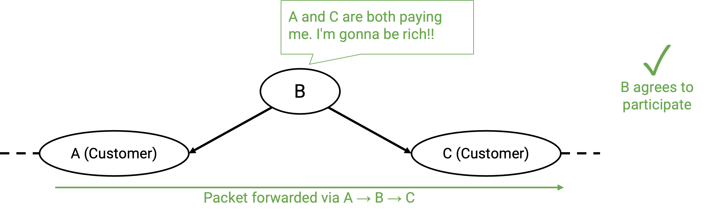

类似地，如果一个 neighbor 是 customer，另一个是 peer，这样的 route 也是可接受的，因为即使 peer 不付钱，customer 会付钱。

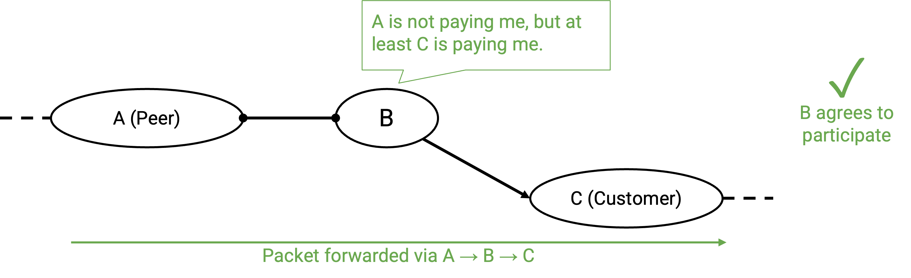

如果一个 neighbor 是 customer，另一个是 provider，这样的 route 也是可接受的。乍一看，这条路径可能不划算，因为 customer 付钱给我，然后我又付钱给 provider。有没有可能我不赚钱，甚至亏钱？这可能是真的，但如果我们不参与这种 route，我们就会变成一个没有用的 AS，无法服务 customer。AS 的工作是给自己的用户提供连接，参与这些 customer-AS-provider route 可以解锁通向 Internet 其他部分的更多 route。

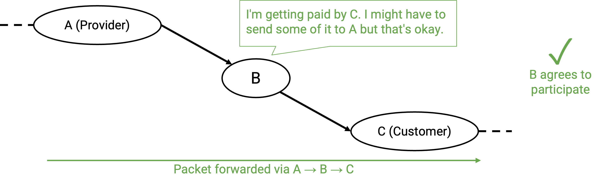

如果我的两个 neighbor 都是 peer，这样的 route 是不可接受的，因为双方都没有付钱让我转发 packet。

更一般地说，peer 不会在其他 peer 之间提供 transit。从层级结构角度看，一条 path 不应该在同一层级连续走多个 hop。

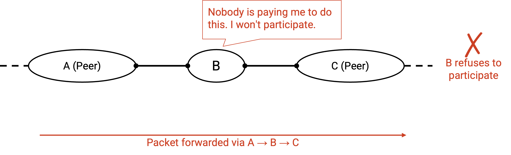

如果一个 neighbor 是 peer，另一个是 provider，这样的 route 也不可接受，因为同样没有任何一方付钱让我转发 packet。

更一般地说，如果一个 AS 有 peering link，那么这条 link 只会承载去往或来自自己 customer 的 traffic。换句话说，当 packet 通过 peering link 到达 B 时，B 唯一有利可图的选择是把 packet 转发给 customer（而不是 provider，也不是另一个 peer）。类似地，来自 customer 的 packet 可以通过 peering link 转发（customer 付钱），但来自 provider 和 peer 的 packet 不能通过 peering link 转发（没人付钱）。

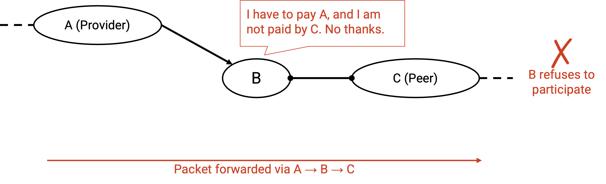

类似地，如果我的两个 neighbor 都是 provider，这样的 route 是不可接受的，因为我必须付钱给两边来转发 packet，而没有任何人付钱给我做这件事。

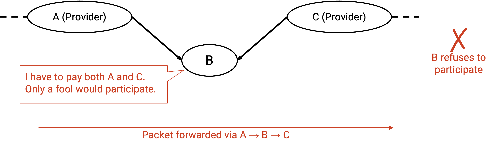

## Gao-Rexford 规则示例

选择 route 的 policy（customer 最优，provider 最差）和宣布 route 的 policy（只宣布并参与至少有一个 neighbor 是 customer 的 route）会被用在我们修改后的 protocol 中，用来计算尊重每个 AS policy 的 route。我们还没说怎样计算 route，但给定一条 route，我们可以检查它是否满足这两条 policy。

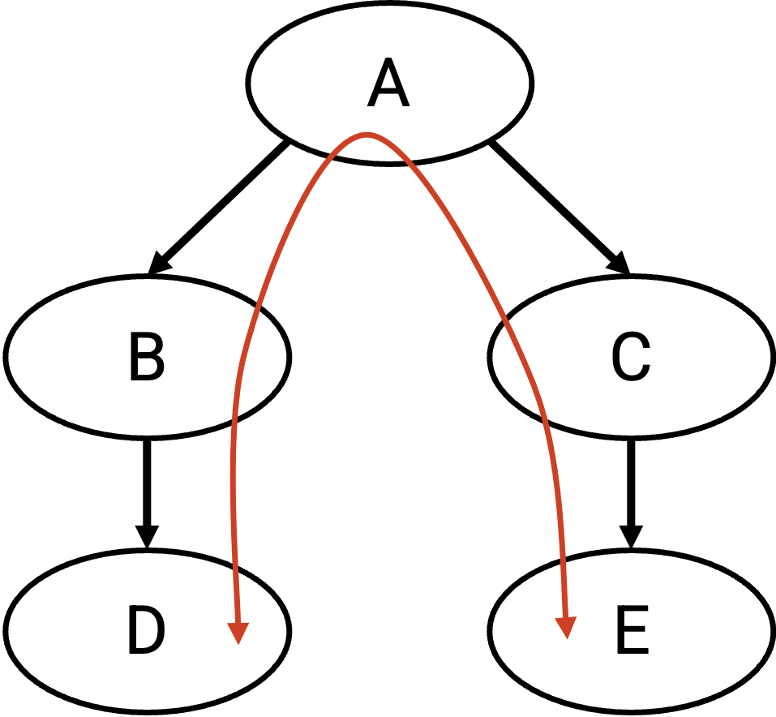

在这个例子中，假设 D（一个 stub AS）中的一台计算机想和 E（另一个 stub AS）中的一台计算机通信。D 和 E 可能想交换消息（记住，箭头表示 customer/provider 关系，不表示 packet 方向）。

traffic 的一条可能路径是 D、B、A、C、E（从 E 到 D 的消息则反向）。

这条路径中谁付钱给谁？由于 traffic 沿 D-B link 发送，customer（D）必须付钱给 provider（B）。类似地，E 必须付钱给 C，而 B 和 C 都必须付钱给 A。

transit AS A、B、C 会同意宣布并参与这条 route 吗？我们检查它们各自的 neighbor。

A 沿这条 path 的两个 neighbor 都是 customer，所以 A 在赚钱，并认为这条 path 可接受。

B 的 neighbor 是一个 customer（D）和一个 provider（A）。B 从 customer（D）那里赚钱，并认为这条 path 可接受。（记住，带有一个 customer neighbor 和一个 provider neighbor 的 path 是可接受的，即使这个 AS 的净利润可能为 0，因为它们带来了更广泛的连接能力。）

类似地，C 至少有一个 customer neighbor（E），所以它也认为这条 route 可接受。

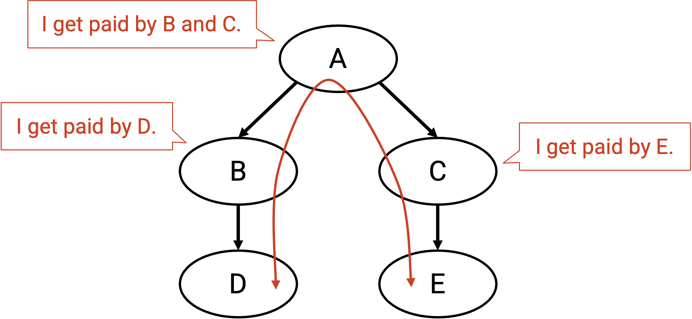

B 和 C 不一定都付钱给 A，它们也许会选择建立 peer relationship，这会改变 AS graph：

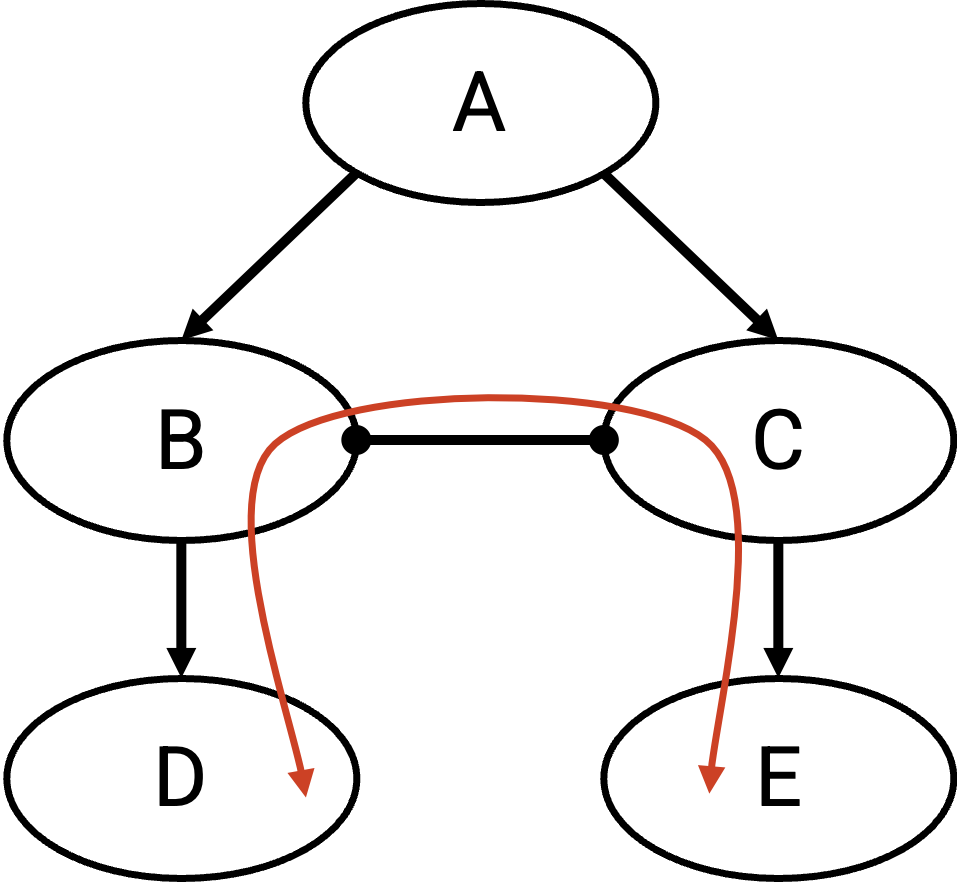

现在，traffic 的另一条可能路径是 D、B、C、E。D 仍然需要付钱给 B，E 仍然需要付钱给 C。不过，B 和 C 不再需要付钱给 A，而且它们彼此也不付钱（peering relationship）。

同样，我们可以检查这条 path 上的 transit AS，也就是 B 和 C，是否会同意宣布并参与这条 route。B 的 neighbor 是一个 customer（D）和一个 provider（C）。B 从 customer（D）那里赚钱，并认为这条 path 可接受。类似地，C 至少有一个 customer neighbor（E），所以 C 也认为这条 path 可接受。

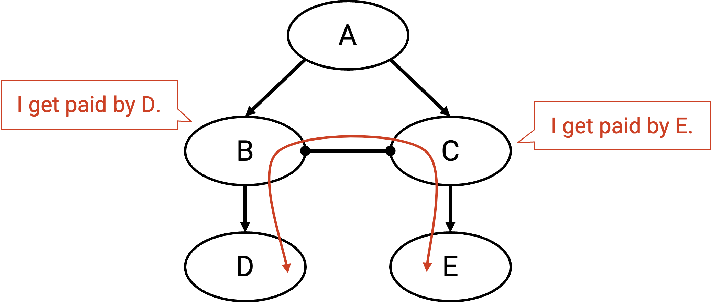

我们刚刚推理出，有两条可接受的 path 可以用来从 D 向 E 发送消息。现在，B 必须决定走 B-A-C-E，还是走 B-C-E。B 应该选择哪条 path？根据第一条原则，B 偏好最赚钱的 path（而不是最短 path）。在 B-A-C-E 中，next hop 是 provider A（我们必须付钱给它）；在 B-C-E 中，next hop 是 peer C（不需要付钱）。因此，B 会选择经过 C 的 path，最终得到 path D-B-C-E。

注意：看起来 B 和 C 通过额外的 peering relationship 省了钱，那为什么不是每个 AS 都建立 peer relationship 来省钱？现实中，建立一条 link 也需要安装物理基础设施（例如地下铺设电缆），所以在 AS 之间建立新关系，需要在更便宜的 route 和建立成本之间做 trade-off。

## Route 是 Valley-Free 的

更一般地说，AS graph 中的 path 总是 **valley-free**。

从层级结构角度看，如果一条 path 包含通过 peering link 的横向 hop，那么紧接着的下一 hop 必须向下走到 customer。下一 hop 不能再次横向（两个 neighbor 都是 peer），也不能向上走到 provider（neighbor 是 peer 和 provider）。

从层级结构角度看，如果一条 path 包含从 provider 到 customer 的向下 hop，那么紧接着的下一 hop 必须继续向下走到某个 customer。下一 hop 不能再次横向（neighbor 是 provider 和 peer），也不能向上（两个 neighbor 都是 provider）。

如果向下 link 后必须接另一个向下 link，那么我们可以得出结论：一旦 path 中出现向下 link，之后所有 link 都必须继续向下。valley 指的是一条 path 先向下走，然后又转头开始向上走。path 不能包含 valley，因为一旦开始向下，就必须一路向下到达 destination。

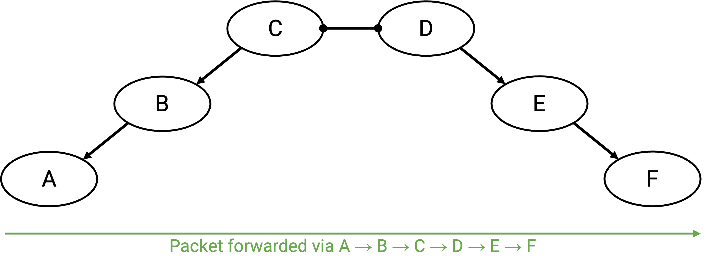

总结一下，下面是我们推导出的规则（不过更好的理解方式，是把它们看作尊重 AS 金钱偏好的结果，而不是死记硬背）：

- 向上的 link 后面可以接 peering link、向下的 link，或者另一个向上的 link。（如果上一 hop 付钱给我，我很乐意把 packet 转发给任何人。）
- peering link 后面只能接向下的 link。（如果上一 hop 没有付钱给我，我需要下一 hop 是会付钱给我的 customer。）
- 向下的 link 后面只能接向下的 link。（如果上一 hop 是我正在付钱的 provider，我需要下一 hop 是会付钱给我的 customer。）

这些规则意味着 route 总是 valley-free 且 single-peaked。一条 route 可以从 0 条或多条向上的 link 开始。最终，它会到达一个唯一峰值，并经过 0 条或 1 条 peering link。然后，route 必须一路向下到达 destination（不能再横向或向上移动）。

path 不能有 valley（先向下，再转头向上）。此外，path 的横向移动只能出现在峰值处。一旦你横向移动，就必须转头向下。不能继续横向走，也不能向上走。

## AS 想要 Autonomy 和 Privacy

在设计用于计算 inter-domain route 的 protocol 时，我们的 protocol 应该尊重每个 AS 的 autonomy 和 privacy。

AS 想要 **autonomy**，也就是自由选择任意 policy，而不必与其他 AS 协调，也不必担心 protocol 允许哪些 policy。实践中，policy 通常遵循我们描述的基于金钱的原则，但 protocol 不应该强迫 AS 遵循某个特定 policy。

AS 也想要 **privacy**。AS 不希望必须显式告诉网络中的其他人自己的偏好和 policy。例如，AS 不应该需要明确告诉所有人，自己的 neighbor 哪些是 peer、customer 或 provider。这反映了现实世界中的商业策略。作为一家公司，你可能不想向竞争对手透露自己的 customer 和 provider 信息。

注意，我们对 privacy 的定义是：AS 不应该需要*显式*暴露自己的 policy。实践中，AS 仍然需要与网络其他部分协调，以便就穿过网络的 path 达成一致，所以某种程度的信息泄露不可避免。存在一些 reverse-engineering 技术，可以追踪 packet 在网络中实际走过的 route。

例如，网络中的其他人不可避免地可以发现一个 packet 走的是哪条 route。不过，我们的 protocol 不应该强迫 AS 向全世界说明「我更喜欢这条 path，而不是另一条 path」。我们也不应该强迫 AS 公开谁是它的 provider、peer 和 customer。
