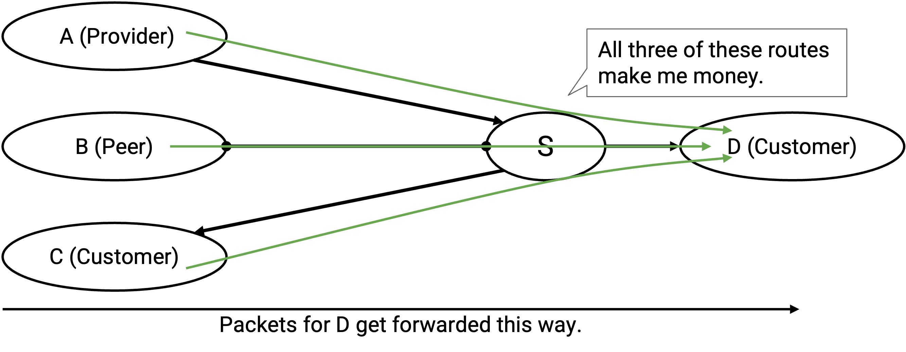
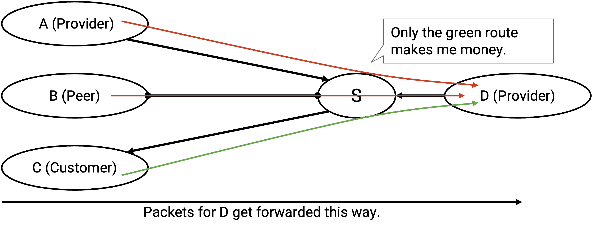

# Border Gateway Protocol (BGP)

## BGP 简史

least-cost routing protocol 和图论中的 shortest-path problem 密切相关，而这个问题在 Internet 出现之前就已经被计算机科学研究过。Dijkstra's algorithm 来自 1956 年，Bellman-Ford algorithm 来自 1958 年。早期 routing protocol 的设计者可以借用这些算法中的思想。

早期的 Internet 是由政府资助的项目，由美国国防部集中控制。当时还没有 autonomous system 这个概念，而且 least-cost algorithm 可以扩展到早期 Internet 的小规模。后来，随着 Internet 发展，政府把控制权转移给不同的商业实体，这些实体不得不临时发展出 inter-domain routing protocol。

与早期 least-cost routing protocol 不同，「每个 autonomous system 都有自己的私有 policy」这个概念在计算机科学中没有先例。inter-domain routing protocol 背后的思想，必须根据这些新 Internet 公司不断出现的需求临时发展出来。

BGP 创建于 1989-1995 年，它的临时发展过程意味着这个 protocol 并不完美。如果今天从零重写 protocol，结果可能会不一样。不过，这个 protocol 已经证明自己有效且有韧性，并且至今仍然是正在使用的 inter-domain routing protocol。（记住，所有人都必须同意使用同一个 inter-domain routing protocol，所以只有一个。）

## BGP 基于 Distance-Vector

回忆一下，我们见过两类 intra-domain routing algorithm：distance-vector algorithm 和 link-state algorithm。设计 BGP 时，哪一类 algorithm 更适合作为起点？

记住，在 BGP 中，我们需要尊重单个 AS 的 privacy。如果使用 link-state protocol，那么每个 AS 都必须把自己的 policy 告诉整个网络，让所有人都有完整知识来独立计算 route。

此外，在 BGP 中，我们需要尊重 autonomy，并允许每个 AS 自己做 policy decision。然而，link-state protocol 要求所有人以某种一致方式计算 route（例如所有人都同意使用 least-cost path）。

link-state algorithm 不尊重 AS 的 privacy 或 autonomy，所以围绕 link-state 来设计 BGP 会是很差的选择。相比之下，distance-vector 允许每个单独 AS 自己决定接受或拒绝哪些 route，以及宣布哪些 route。此外，因为 distance-vector 不是全局 protocol，每个 AS 不需要知道其他所有人的 policy，也能计算出有效 route。

distance-vector protocol 中许多核心思想仍然适用于 BGP。我们发送和接收的 advertisement 仍然针对某一个 destination。就像前面几节一样，我们会讨论针对单个 destination 的 advertisement 和 route，但要知道 protocol 会同时为多个 destination 运行。

在 distance-vector protocol 和 BGP 中，每个 AS 都只使用自己收到的 advertisement 中的信息来计算 route，而看不到网络拓扑的全局图景。此外，在这两类 protocol 中，AS 都会持续发送和接收 advertisement，直到所有人都收敛到一组 route。

BGP 遵循 distance-vector protocol 的相同核心思想，但术语略有变化。我们不说每个 AS announce 或 advertise route，而是说 AS **exporting** route。然后，每个 AS 监听 advertisement 并选择自己偏好的 route，这称为 **importing** route。

distance-vector 是一个很好的起点，但它缺少什么？

distance-vector protocol 被设计用来寻找 least-cost route，而在 BGP 中，我们希望 route 基于每个 AS 自己的 policy 来决定。

## 基于 Policy 的 Import 和 Export

从高层看，为了支持 policy，我们会修改 importing 和 exporting route 的规则。每个 AS 只会 export（advertise）自己喜欢的 route（根据自己的 policy）。同时，在 importing（selecting）route 时，AS 会根据 policy 选择最佳 route，而不是根据 distance。

当一个 AS 收到多个针对同一 destination 的 advertisement 时，它不再选择最短 route，而是基于 policy 选择（import）一条 route。

记住，advertisement 从 destination 向外传播，而 message 会向 destination 更近的方向转发（与 advertisement 的方向相反）。import decision 决定一个 AS 把出站 traffic 发往哪里。例如，如果 S 从 A、B、C 听到关于同一 destination 的 advertisement，S 的 import decision（选 A、B 或 C）决定了发往该 destination 的 packet 会被转发到哪里。

在 distance-vector protocol 中，当我收到一个 announcement 并安装一条新 route 时，我总是把这条新 route 宣布给所有 neighbor。

现在 AS 有了自己的 policy，它们可以选择是否参与某条 route。如果一个 AS 对某条 route 不满意，它现在可以选择不把这条 route export 给某些 neighbor。

例如，假设我的 policy 是不想承载 C 的 traffic。这可能是出于金钱原因，也可能是我自己的其他 policy decision。当我接受一个 advertisement 并安装一条 route 时，我可以不把这条 route advertise 给 C。

再次记住，data 的流向与 advertisement 相反。export decision 决定 AS 愿意承载什么入站 traffic。如果我 export 一条 route，我就是同意参与这条 route，并允许其他人沿着这条 route 把 packet 转发给我。

这条规则的一个结果是，即使底层 graph 是连通的（任意两个节点之间存在 path），也不能保证每个 AS 都能到达每个其他 AS。实践中，我们可以通过对 AS 的 policy 和 AS graph 结构建立一些惯例来保证 reachability。

## 实现 Gao-Rexford 规则

一般来说，BGP 支持任意 policy，但任意 policy 无法保证 Internet 完全连通（packet 可以从任意 source 到任意 destination）。

回忆一下，**Gao-Rexford rules** 会强制一个更受限制的 policy 集合，这些 policy 基于常见的金钱导向 import 和 export policy。没有人强制 AS 必须遵循这些规则。不过，如果 AS 同意遵循这些规则，我们就可以对 Internet connectivity 做出更强假设。

简史：这些规则以 20 世纪 90 年代 AT&T 的 Lixin Gao 和 Jennifer Rexford 命名。当时，每个 AS 都临时制定自己的 policy。Gao 和 Rexford 调查了 AS 的 policy，总结出这些规则，并用它们证明 Internet 的一些保证。

importing route 时，Gao-Rexford rules 说，AS 偏好 import 由 customer advertise 的 route，其次是由 peer advertise 的 route，最后才是由 provider advertise 的 route。

实践中，AS 还会在 Gao-Rexford rules 之外实现额外的 tiebreaking rule。例如，如果我从两个 customer 收到 advertisement，就需要额外的 tiebreaker 来偏好其中一个。性能是常见 tiebreaker，比如选择带宽更高或 path 更短的 route。

基于 Gao-Rexford rules，我们应该怎样 export path？回忆一下，如果至少有一个 neighbor 是 customer，AS 就同意参与某条 route。因此，AS 应该只在结果 route 被接受后某一侧有 customer neighbor 的情况下 advertise route。

我们逐个看具体情况。

我从 customer 收到并安装一条 route。这意味着这条 route 的 next hop 是这个 customer。我应该把这条 route export 给谁？我已经保证一侧有 customer 付钱给我，所以可以把这条 route export 给所有人（customer、provider、peer）。

我从 peer 收到并安装一条 route（next hop 是 peer）。我应该把这条 route export 给谁？目前还没有人付钱给我，所以我应该只把这条 route export 给 customer。如果我把这条 route export 给 peer 或 provider，并且对方接受了，那我就创建了一条两边都没人付钱给我的 route。

类似地，如果我从 provider 收到并安装一条 route，我也应该只把这条 route export 给 customer，因为我需要至少一侧付钱给我，而 provider 不会付钱。

Gao-Rexford rules 允许我们严格证明下面这句话：假设 AS graph 是层级化且无环的，并且所有 AS 都遵循 Gao-Rexford rules，那么我们可以在 steady state 中保证 reachability 和 convergence。

拆开这句话中的具体术语：reachability 意味着图中任意两个 AS 都可以通信。convergence 意味着所有 AS 最终都会停止更新自己的 path，网络会达到一个 steady state，并在任意两个 AS 之间形成有效 path。「in steady state」意味着如果网络拓扑发生变化，path 可能需要一些时间才能再次变化并达到 steady state。

回忆一下，hierarchical 意味着从任意 AS 出发，沿层级向上移动（从 customer 到 provider）都会到达 Tier 1 AS。acyclic 意味着不存在 customer-provider relationship（有向边）构成的 cycle。

这个结论的证明要求所有人都遵循 Gao-Rexford rules。如果 AS 运行自己的任意 policy，这些保证就不再成立。

## 修改一：BGP 聚合 Destination

我们还需要对 distance-vector protocol 做两个修改。

在 distance-vector protocol 中，我们展示过每个 destination 都有一个唯一地址，forwarding table 会把每个 destination 映射到 next hop 和 distance。

在 BGP 中，每个 AS 用一个 prefix 来寻址，它表示该 AS 内部所有机器共享同一个 prefix。

这些 forwarding table 可能变得非常大（想象一个 provider 有数百个 customer），而且每个单独 destination 都需要在一个单独 announcement 中描述。有没有办法更简洁地表达这个 forwarding table？

为了提升可扩展性，BGP 允许 AS 把多个 destination **aggregate** 到一个 forwarding table 条目中，并宣布一个更一般的 prefix，把所有 destination 合并包含进去。

注意，实践中 BGP 对宣布的 prefix 大小有约定。例如，AS 不会为单个 IP 地址发 announcement。24-bit prefix（256 个地址组成的块）通常是会被宣布的最小地址单位。

## 修改二：Path-Vector Protocol

在 distance vector 这样的 least-cost protocol 中，我们不必担心 loop。每个 router 都在试图寻找 least-cost route，而根据定义，least-cost route 不会包含 loop。

现在每个 AS 都基于自己的偏好选择 route，我们失去了无 loop 的保证。例如，假设 B 喜欢经过 C 的 path，C 喜欢经过 B 的 path。这样就创建了 routing loop。

为了解决这个问题，BGP announcement 不再包含到 destination 的 distance，而是包含到 destination 的完整 AS path。这把 protocol 从 distance-vector 变成了 **path-vector** protocol。

例如，在 distance-vector protocol 中，A 会宣布：「我能以 cost 1 到达 destination。」然后，B 会宣布：「我能以 cost 2 到达 destination。」

在 path-vector protocol 中，A 会宣布：「我能通过 path [A] 到达 destination。」然后，B 会宣布：「我能通过 path [B, A] 到达 destination。」

有了这个修改，AS 可以通过检查 advertisement 中的 path，判断被 advertise 的 path 是否包含 loop。具体来说，如果我收到一个 advertisement，只需要检查 path 中是否包含我自己。如果包含，这会导致 packet 被送回我这里，形成 loop，所以我会忽略这个 advertisement，不接受也不 advertise 这条带 loop 的 route。

注意：如果所有人都同意丢弃带 loop 的 route，就可以保证 advertisement 不包含 loop。一条被 advertise 的 route 只有在我看到它已经包含我自己，并且把我自己加进去会形成 loop 时，才会创建 loop。

从 distance-vector 到 path-vector 的变化也允许 AS 实现任意 policy。在 distance-vector protocol 中，我可能有一个 policy：「尽可能避开 AS#2063。」如果我收到一个 advertisement：「我能以 cost 12 到达 destination」，我并不知道这条被 advertise 的 path 是否经过 AS#2063。相反，如果 advertisement 包含整条 path，我就可以在决定接受或拒绝前，检查 path 是否经过 AS#2063。

注意：我们前面见过的传统 BGP import policy（偏好选择通往 customer 的 route，其次 peer，再其次 provider）只依赖 next hop，而不依赖整条 path。尽管如此，改成 path-vector 对 loop detection 很有用，也让 protocol 可以推广到任意 policy。

## Stub AS 使用 Default Route

有些 AS 不需要运行 BGP 来决定怎样通过网络转发 packet。特别是，如果一个 stub AS 只连接到单个 provider，那么所有发往其他 AS 的 packet 都应该发送给这个 provider。stub AS 可以为其他 AS 中的所有 destination 安装一条硬编码的 **default route**。

那么，其他 AS 想向这个 stub AS 发送 packet 时怎么办？stub 可以请求 provider 安装一条 **static route**，告诉 provider 如何把 packet 发往这个 stub AS。这样，provider 就可以运行 BGP，并把这条 static route advertise 给 Internet 的其他部分。stub 可以请求 provider 硬编码这条 static route，而 stub 自己不必运行 BGP，因为 provider 会代表 stub advertise 通往 stub 的 route。

Internet 中大多数小型 AS 都是使用 default route 和 static route 的 stub AS。

stub AS 类似于 intra-domain routing 中的 end host。它们为自己的 AS 发送和接收 packet，但不转发自己的 packet，也不参与 routing 过程。就像 intra-domain routing 中一样，我们通常会忽略 stub AS，只考虑真正参与 BGP 的 transit AS。
