# Distance-Vector Protocols

## 算法草图

在本节中，我们会设计一种 **distance-vector protocol（距离向量协议）**。这是三类 routing algorithm 之一，另外两类是 link-state 和 path-vector。

Distance-vector protocol 在 Internet 和 ARPANET（Internet 的前身）中有很长的历史。典型的 distance-vector protocol 是 **Routing Information Protocol（RIP）**，我们接下来设计的 D-V protocol 与 RIP 有许多相似之处。

为了对本节要研究的 routing protocol 建立一些直觉，请考虑下面这个 network。

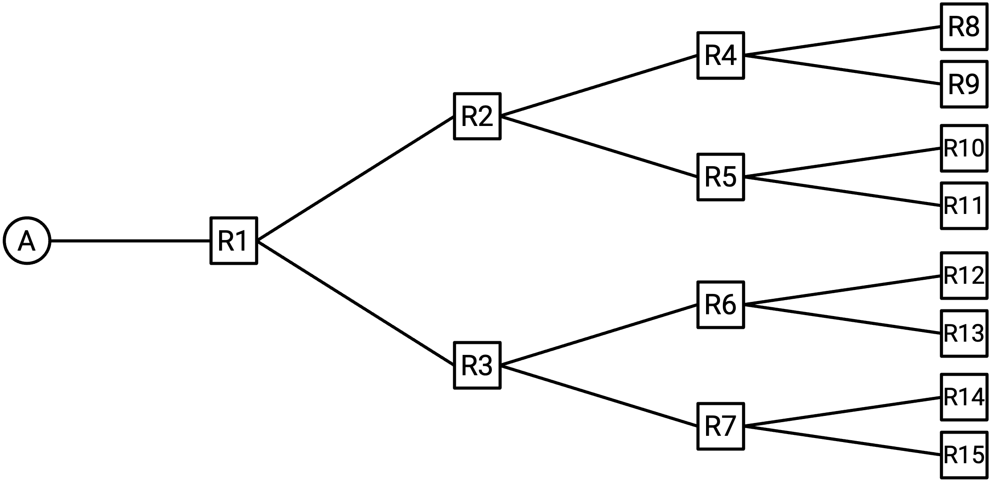

一开始，每个 router 的 forwarding table 都是空的。我们的目标是填充每个 router 的 forwarding table，使得 packet 可以从 network 中任何位置被 route 到目的地 A。

首先，A 可以告诉 R1：「我是 A。」现在，R1 知道如何把 packet 转发到 A。

既然 R1 已经有了一条通往 A 的 path，它就可以告诉自己的 neighbor R2 和 R3：「我是 R1，我可以到达 A。」

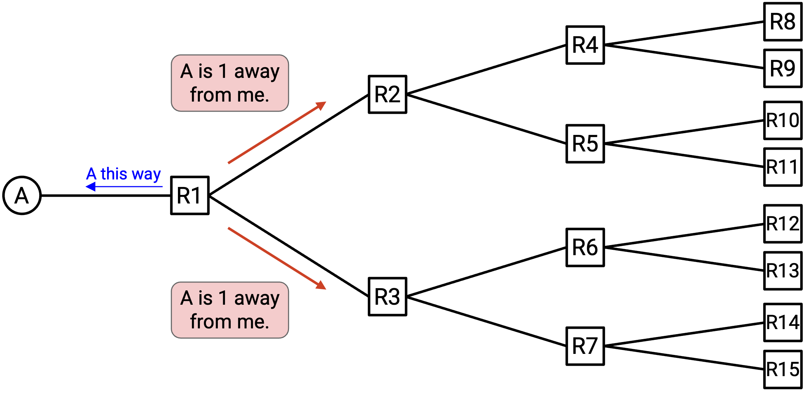

现在，R2 和 R3 知道它们可以通过把 packet 转发给 R1 来到达 A。

R2 现在可以告诉自己的 neighbor R4 和 R5：「我是 R2，我可以到达 A。」类似地，R3 可以告诉自己的 neighbor R6 和 R7：「我是 R3，我可以到达 A。」

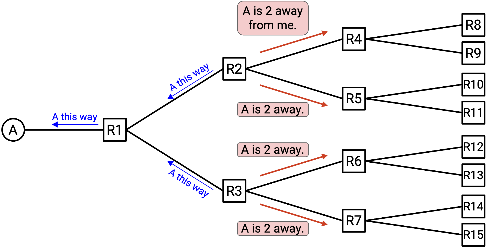

现在，R4 和 R5 知道发往 A 的 packet 可以转发给 R2；R6 和 R7 知道发往 A 的 packet 可以转发给 R3。

这个过程会继续下去：R4、R5、R6 和 R7 分别告诉自己的 neighbor 自己是谁，以及自己可以到达 A。最后，每个人的 forwarding table 都被填好，我们就可以把 packet 从 network 中任何位置 route 向 A。

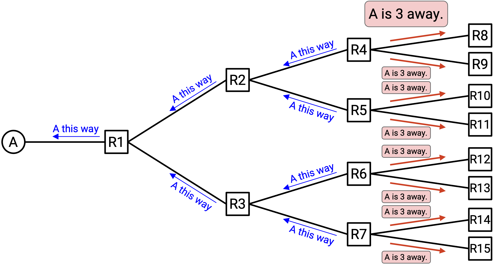

总结一下：当你收到某个人发来的 announcement，说它可以到达 A 时，你应该记下是谁发来了这个 announcement。现在，你就可以通过这个人发送以 A 为目的地的消息。

另外，既然你现在已经有办法把消息发到 A，你也应该向所有 neighbor 发出 announcement，让它们可以通过你发送以 A 为目的地的消息。

如果有多个 destination 呢？我们可以反复运行同一个 algorithm，每个 destination 运行一次。这样 forwarding table 就会包含多条 entry，每个 destination 对应一条。

在这些讲义中，为了简化，我们会聚焦在单个 destination 上，但我们设计的 protocol 可以扩展到多个 destination。

{: .blue}
> 让我们回顾一下目前的 protocol。
>
> 对每个 destination：
> - 如果你听说有一条通往该 destination 的 path，就更新 table。
> - 然后，告诉你所有的 neighbor。

## Announcement 和 Message 的方向

在这个 protocol 中，很容易混淆 announcement 和 message 发送的方向。

关于如何到达 A 的 announcement 从 A 开始，并向外传播。例如，B 向 D 发送了一个 announcement，说「我是 B，发往 A 的 message 可以通过我发送。」

相比之下，真正发往 A 的 message 是向内发送的，也就是朝着 A 前进。例如，一条 message 可能从 D 出发，在前往 A 的路上被发送给 B。

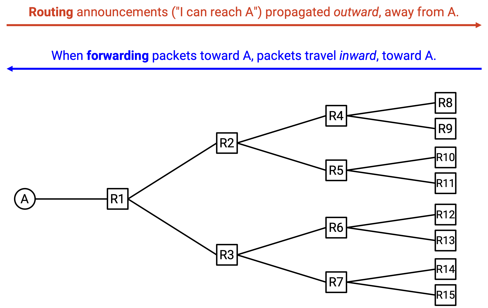

Announcement 的方向正好与 message 本身的方向相反。注意不要把 announcement 和真正的 message 混淆！

## 规则 1：Bellman-Ford Update

如果有多条 path 可以到达 A，会怎样？

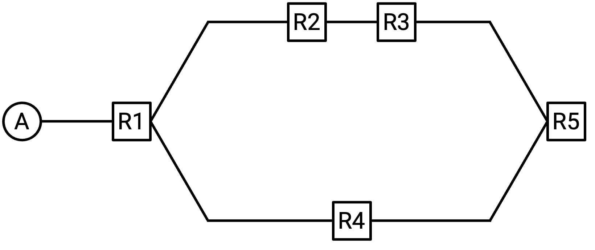

在这个场景中，R3 和 R4 都会 announce 它们可以到达 A。R5 应该选择把 packet 转发给 R3，还是转发给 R4？

回忆一下，我们的目标是在 network 中找到 least-cost route。为了让 router 能从多条被 advertised 的 path 中选择 least-cost path，我们还需要在 announcement 中包含 cost。

R3 的 announcement 现在会说：「我是 R3，我可以用 cost 3 到达 A。」

R4 的 announcement 现在会说：「我是 R4，我可以用 cost 2 到达 A。」

现在，R5 注意到 R4 提供的 path 更短，于是决定通过 R4 转发 packet。

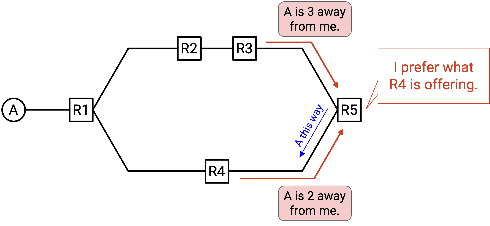

我们会用 forwarding table 记住到 destination 的 best-known cost（以及对应的 next-hop）。现在，forwarding table 的每条 entry 都会告诉我们：destination、到达该 destination 的 next-hop，以及通过这个 next hop 到达 destination 的 cost。

注意：形式化地说，forwarding table 存储的是 key-value pair，把每个 destination 映射到一个包含 next hop 和 distance 的 2-tuple。为了简化，我们会把 table 画成 3 列。

R5 可能不会同时听到两条 path，所以我们需要更精确地说明：当我们听到一条新 path 时会发生什么。听到一条 path 时有三种可能：

1. 如果 table 中还没有通往该 destination 的 path，就接受这条 path。如果我还没有办法到达 A，我就应该接受任何被提供的 path。

    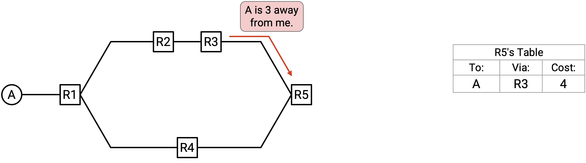

2. 如果新 path（我们刚听到的 path）比 best-known path（forwarding table 中已有的 path）更好，我们应该接受新 path，并用它替换 table 中的旧 path。

    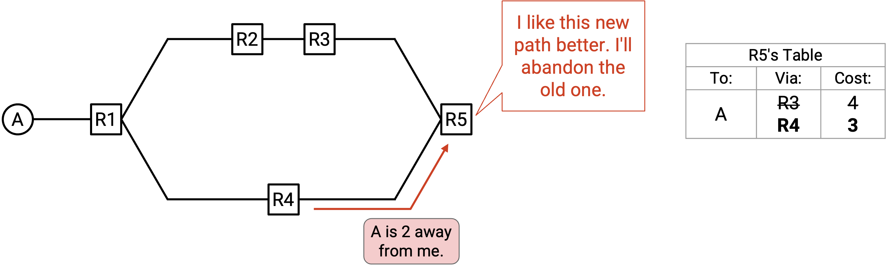

3. 如果新 path（我们刚听到的 path）比 best-known path（forwarding table 中已有的 path）更差，我们应该忽略新 path，继续使用 table 中的 path。

{: .blue}
> 让我们回顾一下目前的 protocol。
>
> 对每个 destination：
> - 如果你听说有一条通往该 destination 的 path，在以下情况下更新 table：
>     - **该 destination 不在 table 中。**
>     - **advertised cost 比 best-known cost 更好。**
> - 然后，告诉你所有的 neighbor。

我们如何知道一条新 path 更好还是更差？这里必须小心，因为不是所有 link cost 都相同。当某个人 advertise 一条 path 时，通过这条 path 的 cost 实际上是两个数的和：从你到这个 neighbor 的 link cost，加上从这个 neighbor 到 destination 的 cost（也就是 neighbor advertised 的 cost）。

举一个具体例子，假设我们听到：「我是 R1，A 离我有 5。」这条新 path 的 cost 实际上是 1（从我们到 R1 的 link cost），加上 5（从 R1 到 A 的 cost，来自 advertisement），也就是 6。

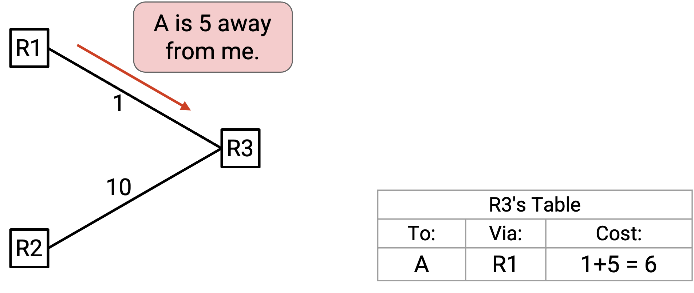

稍后，我们可能听到：「我是 R2，A 离我有 3。」只看 advertisement 中的 cost 是错误的。在这个例子中，新 path 的 cost 实际上是 10（从我们到 R2 的 link cost），加上 3（从 R2 到 A 的 cost，来自 advertisement），也就是 13。这个 cost 并不优于我们已知的 best-known cost 6，所以我们不会更新 table。Packet 仍然会被转发给 R1。

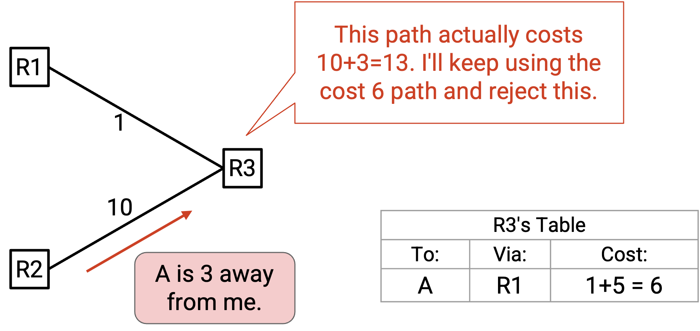

{: .blue}
> 让我们回顾一下目前的 protocol。
>
> 对每个 destination：
> - 如果你听说有一条通往该 destination 的 path，在以下情况下更新 table：
>     - 该 destination 不在 table 中。
>     - advertised cost **加上到 neighbor 的 link cost**，比 best-known cost 更好。
> - 然后，告诉你所有的 neighbor。

对我们听到的每个 announcement，都必须比较两个数。一个数是 table 中的 best-known cost。另一个数是到 neighbor 的 link cost，加上 neighbor 到 destination 的 advertised cost。如果后者更低，我们就使用新 path，并放弃旧 path。

## 规则 1：Distributed Bellman-Ford Algorithm

这个操作看起来熟悉吗？事实证明，这正是 Dijkstra shortest paths algorithm 中的 relaxation（松弛）操作！

**Bellman-Ford** 是另一种 shortest paths algorithm，它也依赖 relaxation 作为关键操作。Bellman-Ford 甚至比 Dijkstra 更简单：反复遍历所有 edge，对每条 edge 做 relaxation，直到得到所有 shortest path。

你可能曾经在数据结构课（比如 UC Berkeley 的 CS 61B）里实现过 Dijkstra 或 Bellman-Ford。可惜，你当时写的代码对我们的 routing protocol 并不太有用。记住，routing protocol 必须是 distributed（分布式）的，因为 router 没有 network 的全局视图（没有中央指挥者）。另外，router 是 asynchronous（异步）运行的。没有人强制规定 router 执行 relaxation operation 的顺序，也没有人强制规定 router 发出 announcement 的顺序。

相反，我们一直在设计的 routing protocol 是 Bellman-Ford algorithm 的 distributed、asynchronous 版本。这个 protocol 是 distributed 的，因为我们并不是让一台计算机运行整个 algorithm。相反，每个 router 都在不看到整个 graph 的情况下计算自己负责的那部分答案（填充自己的 forwarding table）。这个 protocol 是 asynchronous 的，因为所有 router 都可以同时运行 algorithm，而不需要控制操作顺序。

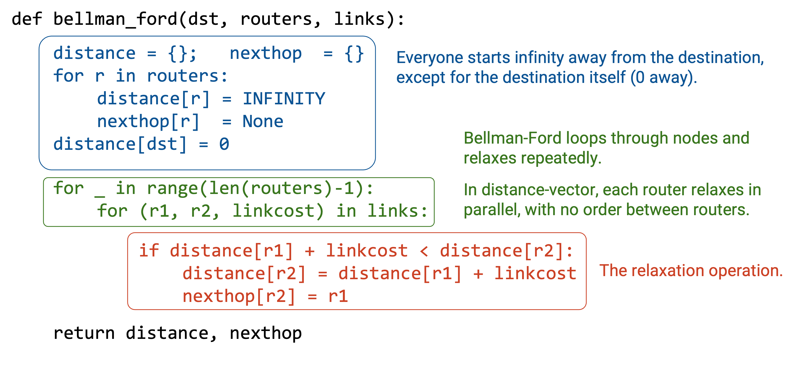

注意：虽然为了简化，我们只展示单个 destination，但不要忘记，我们的 routing protocol 能够找到通往所有 destination 的 shortest path，就像 centralized（单机）Dijkstra 或 Bellman-Ford algorithm 一样。

## Bellman-Ford 示例

术语说明：当我们向 neighbor 发送类似「我是 R1，我可以用 cost 5 到达 A」这样的 message 时，这通常称为 **announcing** 或 **advertising** 一条 route。注意，这个 advertisement 包含三个值：destination、你的 identity（这样 neighbor 才能转发给你），以及从你到 destination 的 total cost。

再把目前的 algorithm 复述一遍：

当你收到另一个 router 发来的 announcement 时，你把从 destination 到另一个 router 的 cost（这个 cost 在 announcement 中）加上从另一个 router 到你的 link cost。如果这个和小于你 table 中到 destination 的 best-known distance，你就把这个 destination 的 forwarding table entry 替换为新的 next hop（announcement 中另一个 router 的 identity）和新的 distance（刚算出来的和）。

如果你收到另一个 router 发来的 announcement，而 destination 不在你的 forwarding table 中，会怎样？你还没有这个 destination 的 best-known distance，因为你还不知道如何到达这个 destination。在这种情况下，你可以向 forwarding table 添加一条新 entry，包含新的 destination，以及 advertisement 中的 next hop 和 cost。

当你改变 forwarding table 时，意味着你发现了一条通往 destination 的新 path。为了把这条新 path 传播到 network 的其他部分，你需要向相邻 router announce 这条新 path（destination、你的 identity，以及经由你的 cost）。

带着这个 algorithm，我们来看一个例子。在这个 network 中，由于 edge 没有标注，我们假设所有 edge 的 cost 都是 1。我们希望用通往 A 的 route 填充 forwarding table，其中 A 是唯一的 destination。

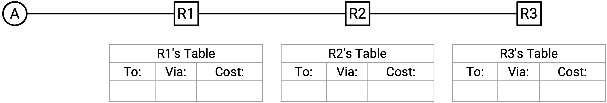

首先，使用 static routing，我们在 R1 的 forwarding table 中 hard-code 一条 entry。为了到达 destination A，next hop 是 A 本身，这条 path 的 cost 是 1。

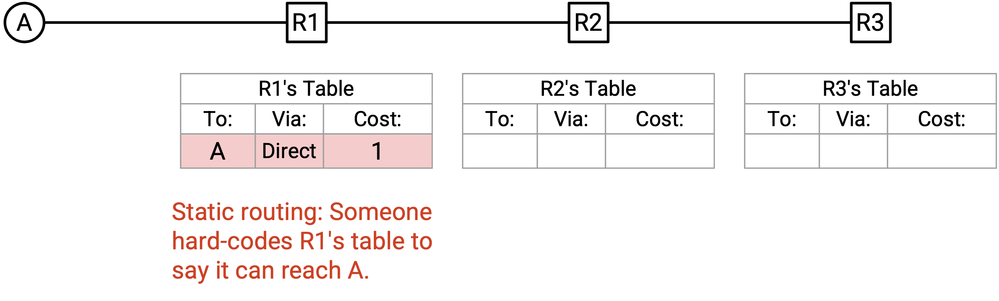

R1 的 forwarding table 发生了变化，所以 R1 会创建一个包含 3 个值的新 announcement：destination（A）、router 的 identity（R1），以及经由这个 router 到 destination 的 cost（1）。这个 announcement 会发送给 R1 的所有 adjacent router，也就是只有 R2。

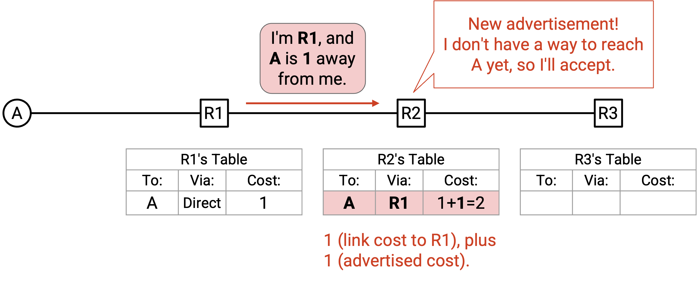

R2 收到这个 announcement，并在自己的 forwarding table 中查找 destination A 对应的 entry。Forwarding table 是空的，所以不存在这样的 entry。因此，R2 会添加一条包含 3 个值的新 entry：destination（A）、next hop（来自 announcement 的 R1），以及经由 R1 到 destination 的 cost（2，也就是 announcement 中的 cost 加上到 R1 的 link cost）。

R2 的 forwarding table 发生了变化，所以 R2 会生成一个包含 3 个值的 announcement：destination（A）、router 的 identity（R2），以及经由这个 router 到 destination 的 cost（2）。这个 announcement 会发送给 R2 的所有 adjacent router，也就是 R3 和 R1。

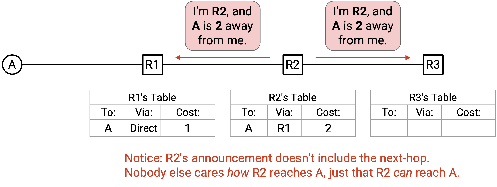

注意，在目前的 protocol 中，router 会向所有 neighbor 发送 announcement。这意味着 R2 的 announcement 也会发送给 R1。如果这让你不舒服，先别急，我们稍后会回到这一点。

R1 收到这个 announcement。根据 R1 的 forwarding table，目前到达 A 的 best-known way 的 cost 是 1。经由 R2 的 path 则会花费 2（来自 R2 的 announcement），加上 1（到 R2 的 link），总共是 3。这是一条更差的到达 A 的方式，所以 R1 会忽略这个 announcement，并保持 forwarding table 不变。

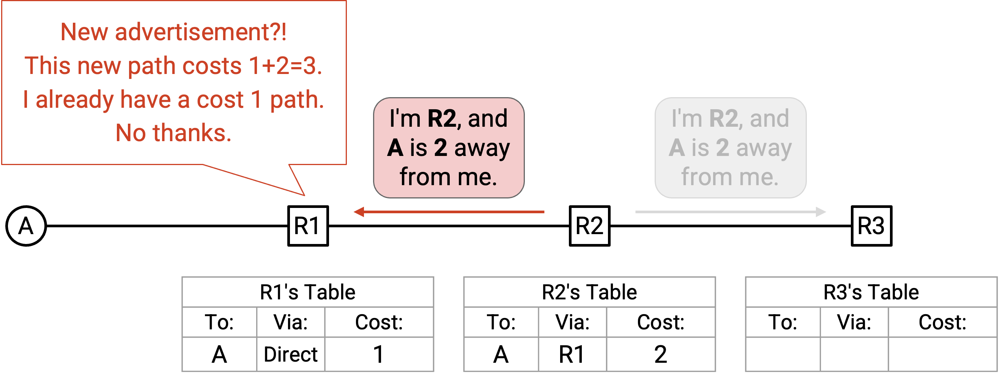

R3 也收到同一个 announcement。R3 的 forwarding table 是空的，所以 R3 会安装一条包含 3 个值的新 entry：destination（A）、next hop（来自 announcement 的 R2），以及经由 R2 到 destination 的 cost（3，也就是 announcement 中的 cost 加上 R3-R2 link 的 cost）。

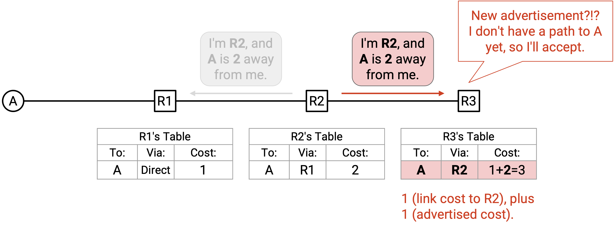

根据目前的规则，如果你更新了 forwarding table，就需要向所有 neighbor 发送 announcement。尽管我们可以看出接下来的 announcement 不会改变任何东西，但 R3 没有像我们一样拥有 network 的全局视图，所以 R3 会向所有 neighbor 发送 announcement，也就是发送给 R2。这个 announcement 包含：destination（A）、next hop（R3），以及经由这个 next hop 的 cost（3）。

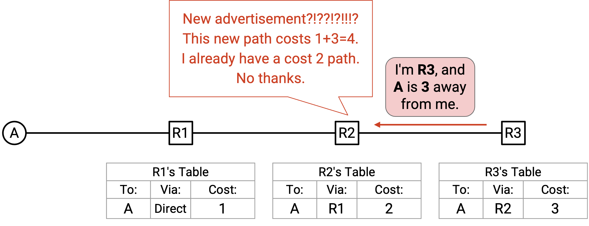

R2 收到这个 announcement。R2 从 forwarding table 中知道自己有一条 cost 为 2 的 path 可以到达 A。这个 announcement 提供的 path cost 是 3（来自 announcement），加上 1（R2-R3 link 的 cost），总 cost 为 4。这比 forwarding table 中的 cost 更差，所以 R2 忽略这个 announcement。

R2 没有更新 forwarding table，因此它不会发出 announcement。此时，不会再有新的 announcement。我们可以看到，每个 router 都已经填充了关于如何到达 A 的 forwarding table 信息。我们也可以看到，这些 forwarding table 合起来形成了一棵 valid、least-cost 的 delivery tree，包含到达 A 的 shortest route。

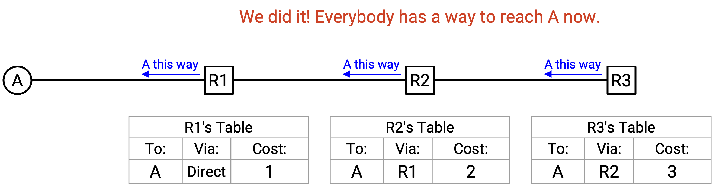

## 规则 2：来自 Next-Hop 的 Update

回忆上一节中的一个 routing 挑战：network topology 可能会改变。

假设我们听到 R2 发来的 advertisement，说 A 离 R2 有 3。如果我们的 table 中什么都没有，就会接受这个 advertisement，并记录 cost 为 1+3=4。

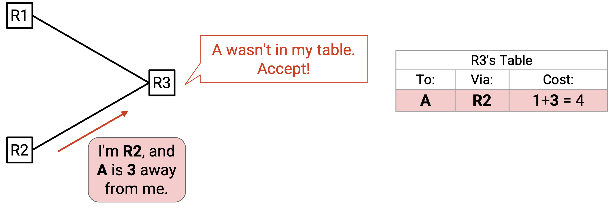

稍后，我们可能听到 R2 发来的另一个 advertisement，说 A 离 R2 有 8。根据前一个规则，我们会拒绝它，因为 advertised cost（1+8=9）比当前 cost（4）更差。

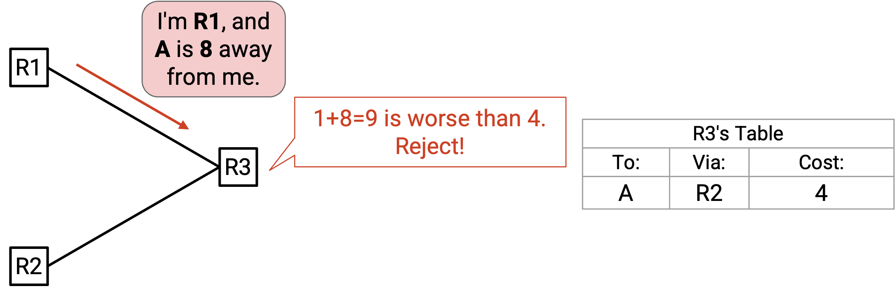

然而，我们在拒绝这个 advertisement 时必须小心。发出 announcement 的 router（R2），正是我们正在使用的 next hop router。R2 其实是在说：「如果你把我当作 next hop，那么我到 A 的 distance 不再是 3，而是 8。」但我们忽略了这条 message，因为我们没有考虑 path 可能会改变。

为了解决这个问题，我们必须修改 update rule。如果我们听到来自 next-hop router（也就是我们正在把 packet 转发给的、拥有 best-known path 的 router）的 announcement，就应该把这个 announcement 当作 update，并修改 forwarding table。即使这个 announcement 产生了一条更差的 path，我们也应该这样做，因为 next hop 可能是在告诉我们 path cost 发生了变化，而且变得更差。

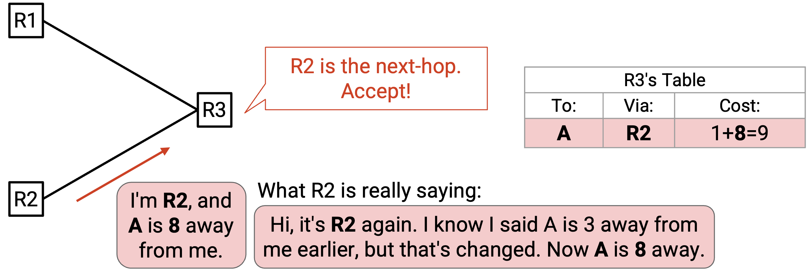

注意，当这条新规则适用时，我们不会更新 forwarding table 中的 destination 或 next hop，只更新 distance。在这个例子中，R3 上发往 A 的 packet 仍然转发给 R2（destination 相同，next hop 相同），但经由 R2 的 cost 改变了。

{: .blue}
> 让我们回顾一下目前的 protocol。
>
> 对每个 destination：
> - 如果你听到关于该 destination 的 advertisement，在以下情况下更新 table：
>     - 该 destination 不在 table 中。
>     - advertised cost 加上到 neighbor 的 link cost，比 best-known cost 更好。
>     - **这个 advertisement 来自当前 next-hop。**
> - 然后，告诉你所有的 neighbor。

为了支持不断变化的 topology，router 会无限期地运行 routing protocol。

假设我们在没有 topology change 的情况下无限期运行这个 protocol。起初，一些 relaxation 会成功，forwarding table 会发生变化。最终，当我们找到 network 中所有 least-cost route 时，algorithm 会 **converge（收敛）**。此时，如果我们继续对 edge 做 relaxation，forwarding table 不会再改变。每次 relaxation 都会被拒绝，因为到目标的 best-known path 已经都是 shortest path，我们永远不会再找到一条更好的 path 来替换当前 shortest path。Network 在 convergence 时的状态称为 **steady state（稳态）**。

稍后，假设 topology 改变了（例如某个 router 可能 failed）。随着我们继续运行 protocol，一些 relaxation 可能会再次成功，因为底层 graph 已经改变。经过一段时间后，delivery tree 会再次 converge 到新的 least-cost route，并在下一次 topology change 之前停止变化。

打个比方，可以想象一池水。在 steady state 下，如果没有扰动，水面完全静止。如果你向水里扔一块石头，环境会调整刚发生的变化，于是产生一些涟漪；但过一段时间后，水面又会恢复完全静止。

## 规则 3：重新发送

回忆上一节中的另一个 routing 挑战：packet 可能会被 drop。

例如，让我们倒回到前面例子的最开始。R2 和 R3 的 forwarding table 为空，R1 更新了到 A 的 hard-coded route。如果 R1 发出一个 announcement，但 packet 被 drop 了，会怎样？R2 永远听不到这个 announcement，protocol 就失败了。

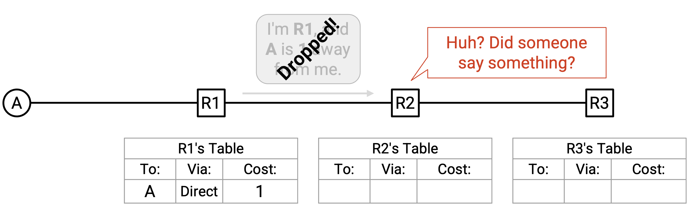

你可以尝试设计更复杂的机制来保证 reliability（例如强制接收者发送 acknowledgement），但我们先采用一个简单方案：如果你有 announcement 要发，就每隔几秒重新发送一次。事实证明，这个简单方案和我们后面的一些设计选择配合得很好，不需要更复杂的东西。

形式化地说，protocol 会定义一个 **advertisement interval（通告间隔）**。实践中常见的 interval 是 30 秒。如果 interval 是 X 秒，那么每个 advertisement 都必须每 X 秒重新发送一次。

只要我们等待足够久，并重新发送 packet 足够多次，只要 link 有时能够工作，这条 link 最终就会成功发送 advertisement。如果 link 会 drop 每一个 packet，那么 advertisement 就无论如何都发不出去（而且一个成功率为 0% 的 link 也许本来就不应该出现在 graph 里）。最终，在足够多次重新发送之后，这个 protocol 仍然会 converge。

{: .blue}
> 让我们回顾一下目前的 protocol。
>
> 对每个 destination：
> - 如果你听到关于该 destination 的 advertisement，在以下情况下更新 table：
>     - 该 destination 不在 table 中。
>     - advertised cost 加上到 neighbor 的 link cost，比 best-known cost 更好。
>     - **这个 advertisement 来自当前 next-hop。**
> - 在 table 更新时，以及周期性地（advertisement interval）向所有 neighbor advertise。

注意，按 interval 重新发送可以和我们前面的规则配合使用：只要 forwarding table 改变，就立刻发送 announcement。Table 改变后立即发送的 announcement 称为 **triggered update（触发更新）**。

即使我们只按 interval 发送 announcement，protocol 也仍然会 converge。Table 改变后，我们等待 interval 到期，然后发出 announcement。不过，在 interval update 之外再加入 triggered update 是一种 optimization，可以帮助 protocol 更快 converge。既然我们已经知道 update，不妨立刻 announce，而不是等待 interval。

有了这条新规则之后，一旦 network converge，每个 router 仍然会周期性地重新发送 announcement，但这些 announcement 都不会被接受，因为我们处于 steady state，大家已经拥有 shortest-cost route。

在前面的例子中，network converge 后，R3 可能决定重新发送它的 announcement，其中 destination 是 A，next hop 是 R3，经由 R3 的 cost 是 3。但 R2 会忽略这个 announcement，因为它的 forwarding table 已经有一条更便宜的 route，cost 为 2（announcement path 的 cost 是 3 + 1 = 4）。

## 规则 4：过期

回忆我们前面遇到的 routing 挑战：network topology 可能改变。特别是，link 和 router 都可能 failed。如果 network 中的某个 router failed，我们的 route 可能会变得 invalid。Failed router 不会告诉我们这个问题（因为它已经 failed），所以我们会卡在这条 invalid route 上。

为了解决这个问题，我们给每条 route（也就是每条 table entry）一个有限的 **time to live（TTL）**。这是一个倒计时器，告诉我们还能保留这条 forwarding entry 多久。

Periodic update 可以帮助我们确认一条 route 仍然存在。如果我们从 next-hop 收到 advertisement，就可以把 TTL 重置（「充电」）回原始值。

如果 network 中有什么东西 failed，我们就会停止收到 periodic update。最终，TTL 会 expire。如果 TTL expire，我们就从 table 中删除这条 entry。直观地说：我们不再收到 update，所以这条 route 很可能已经不 valid。

下面是一个 TTL 运行的例子。在这个例子中，我们是 R3。在时间 t=0，我们听到一个 announcement：「我是 R2，A 离我有 5。」我们的 table 没有 A 的 entry，所以会接受这条 path，并把它的 TTL 设置为 11。注意，这个 TTL 与特定 table entry 关联。如果我们有多条 table entry，它们各自都会有自己的 TTL。

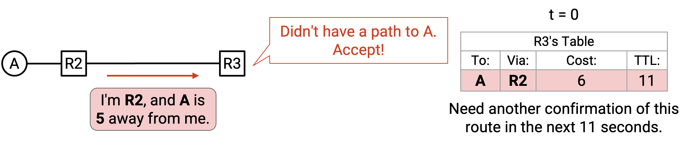

TTL 为 11 表示 R2 必须在接下来的 11 秒内再次向我们确认这条 route。否则，这条 table entry 会被删除。（注意：初始 TTL 11 是任意选择的。实践中，这个数字会由 protocol 或操作 router 的人设置。）

时间流逝。t=1 时，TTL 现在是 10。t=2 时，TTL 现在是 9。t=3 时，TTL 现在是 8。t=4 时，TTL 现在是 7。

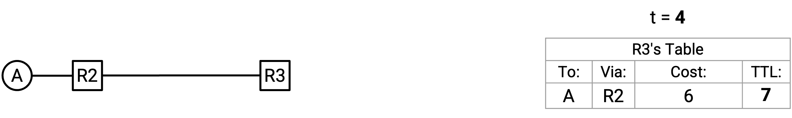

t=5 时，R2 执行周期性的 announcement 重新发送：「我是 R2，A 离我有 5。」我们查看 table，发现 R2 是当前到 A 的 next-hop，所以应该接受这个 advertisement（根据规则 2）并更新 table。

因为我们得到了一次确认，说明这条 route 仍然存在，所以 TTL 可以重置回初始值 11。我们需要在接下来的 11 秒内再次从 R2 得到这条 route 的确认。

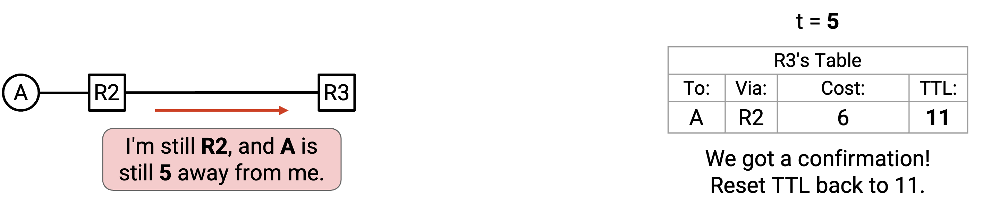

假设 t=6 时，一条 link down 了，A 现在不可达。R2 删除自己到 A 的 static route，并且不再发送任何 periodic update。

t=16 时（距离 t=5 的最后一次 update 已经过去 11 秒），我们 table entry 中的 TTL 已经一路降到 0，所以会从 table 中删除这条 entry。

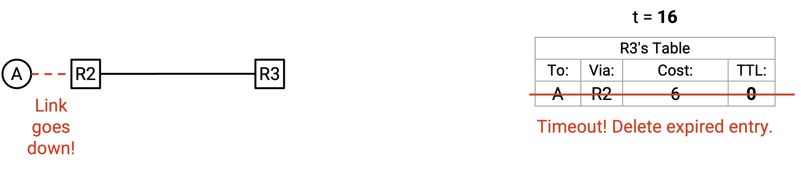

{: .blue}
> 让我们回顾一下目前的 protocol。
>
> 对每个 destination：
> - 如果你听到关于该 destination 的 advertisement，在以下情况下更新 table **并重置 TTL**：
>     - 该 destination 不在 table 中。
>     - advertised cost 加上到 neighbor 的 link cost，比 best-known cost 更好。
>     - 这个 advertisement 来自当前 next-hop。
> - 在 table 更新时，以及周期性地（advertisement interval）向所有 neighbor advertise。
> - **如果 table entry expire，就删除它。**

注意不要混淆 router 必须维护的各种 timer。

Advertisement interval 告诉 router 什么时候向 neighbor advertise route。它通常是整张 table 共用的一个 timer，因此每当 advertisement interval timer expire，router 就 advertise table 中的所有 route。在上面的例子中，advertisement interval timer 是 5 秒，因为 R2 在 t=0 和 t=5 发送了 advertisement。

相比之下，TTL 告诉 router 什么时候删除 table entry。每条 table entry 都有自己独立的 TTL，为这条特定 entry 倒计时。在上面的例子中，初始 TTL 是 11 秒（当我们接受 advertisement 时重置为 11），并且每条 table entry 都独立倒计时。

到这里，我们已经有了一个基本可用的 routing protocol！接下来添加一些帮助更快 converge 的 optimization。

## 规则 5：Poisoning Expired Routes

等待 route expire 很慢。为了理解原因，让我们重新看一遍前面的示例。

在这个例子中，我们是 R3。假设到 t=5 时，我们已经学到一条经由 R2 到 A 的 route，并且这条 route 还有 11 秒 TTL。

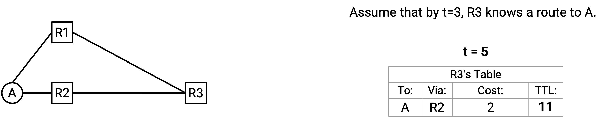

t=6 时，A-to-R2 link down 了！这条 table entry 现在坏掉了，因为如果我们把 packet 转发给 R2，它们实际上到不了 A。然而，我们还不知道这条 entry 已经坏掉。我们必须再等 10 秒，让这条 route expire。

同样在 t=6，我们收到一个新的 announcement：「我是 R1，A 离我有 1。」我们查看 table，发现已经有办法到达 A，所以拒绝这个 announcement。（注意：这个示例中并不重要，但我们假设这里不接受 equal-cost path。）

如果我们知道已有 route 已经坏掉，就可以现在立刻接受这个新的 advertisement。但实际上，我们注定还要继续使用这条坏掉的 path 10 秒。

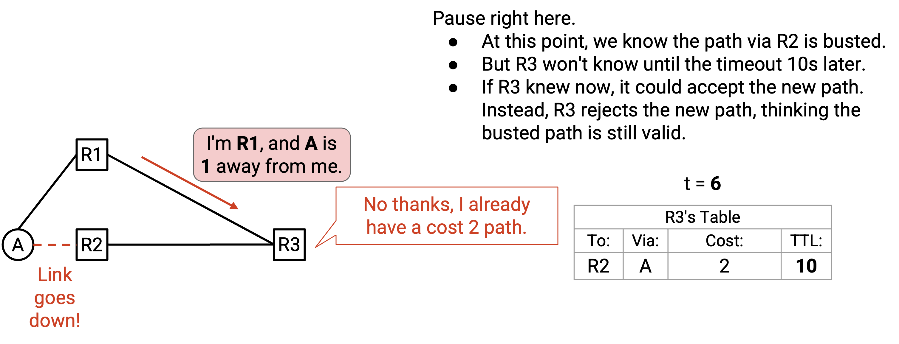

时间流逝。到 t=11（五秒后）时，坏掉的 route 仍然还有 5 秒 TTL。

t=11 时，我们又收到一个 announcement：「我是 R1，A 离我有 1。」R1 正在重新发送前面的 announcement。我们再次查看 table，发现仍然有一条 A 的 entry，所以再次拒绝这个 announcement。

同样，如果我们有办法知道已有 route 已经坏掉，就可以接受这个新的 advertisement。然而，按照当前方法，我们注定要在剩下的 5 秒里继续使用这条坏掉的 path。

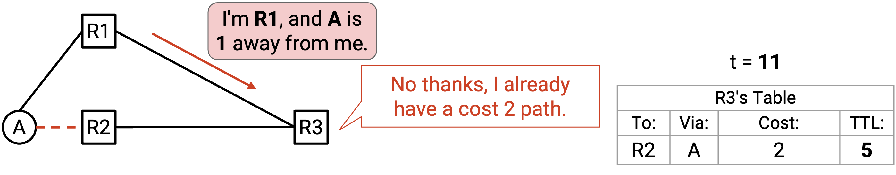

时间继续流逝。到 t=16（又五秒后）时，坏掉 route 的 TTL 终于到达 0，我们可以从 table 中删除这条 entry。

同样在 t=16，R1 再次重新发送 announcement：「我是 R1，A 离我有 1。」终于，我们的 table 里没有到 A 的 route 了（坏掉的 route 刚刚被删除），所以可以接受这个 announcement。

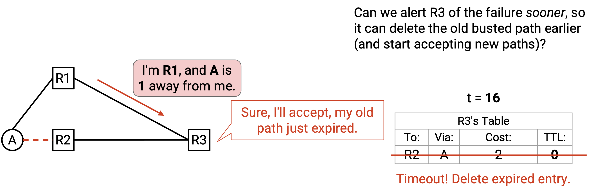

刚才发生了什么？t=6 时 failure 发生，我们 table 中的 entry 变坏了。然而，因为这条坏掉的 route 还剩 10 秒 TTL，我们注定要继续使用它 10 秒。在这段时间里，任何发往 A 的 packet 都会丢失，因为我们会把 packet 沿着坏掉的 path 转发。另外，我们也可能把这条坏掉的 route advertise 给其他人，导致它们也丢 packet。最后，正如我们看到的，我们可能还会拒绝新的 path，因为误以为坏掉的 path 仍然 valid。

这里的关键问题是：当某个东西 failed 时，这个 failure 没有被报告出来，所以我们只能依赖 timeout 来删除坏掉的 path。这很慢。有没有办法更早检测 failure？

解决方案是 **poison（毒化）**：当某个东西 failed 时，如果可能，显式 advertise 一条 path 已经坏掉。

用自然语言来说，R2 发送的新 poison announcement 会说：「我是 R2，我已经没有办法到达 A。」在 protocol 中，我们通过 advertise 一条 cost 为 infinity 的 path 来编码这条 message：「我是 R2，A 离我是 infinity。」这条 infinite-cost path 表示一条坏掉的 path。

Poisoned path 会像其他 path 一样传播。如果我们正在把 packet 转发给 R2，并且从 R2 收到 poison message，就会更新 forwarding table，把 cost 替换为 infinity（根据规则 2）。我们也可以向 neighbor advertise 这个 infinite-cost poison，让它们也知道这条 path 已经坏掉。这允许一条 invalid path 在 network 中传播，可能比等待 path timeout 快得多。

让我们再次观看前面的示例，不过这次在 route expiry 时使用 poisoning。和前面一样，假设到 t=5 时，我们已经学到一条经由 R2 到 A 的 route，并且这条 route 还有 11 秒 TTL。

t=6 时，A-to-R2 link down 了！这条 table entry 现在坏掉了。不过，我们还不知道这条 entry 已经坏掉。

经过修改后，R2 不再什么都不说，而是向我们发送 poison announcement：「我是 R2，A 离我是 infinity。」根据规则 2（接受来自 next-hop 的 update），我们注意到 R2 是我们的 next hop，所以接受这个 announcement，并更新 table。

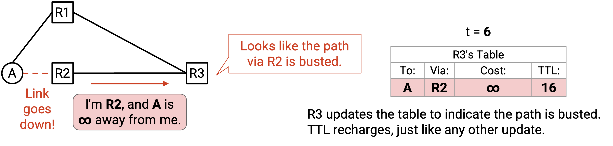

我们的 table entry 现在编码了这样一个事实：A 其实无法经由 R2 到达。和其他 table entry 一样，这条 entry 也有 TTL。另外，我们可以像 advertise 其他 entry 一样，向 neighbor advertise 这条 infinite-cost path。这会告诉 neighbor：我们也无法再到达 A。

同样在 t=6，table update 之后，我们收到一个新的 announcement：「我是 R1，A 离我有 1。」使用这条 route 的 distance 是 2（link cost 1，加上 advertisement cost 1），它优于 infinity（来自 table）。我们接受这个 advertisement 并更新 table。现在，发往 A 的 packet 会经由 R1，而不是 R2。

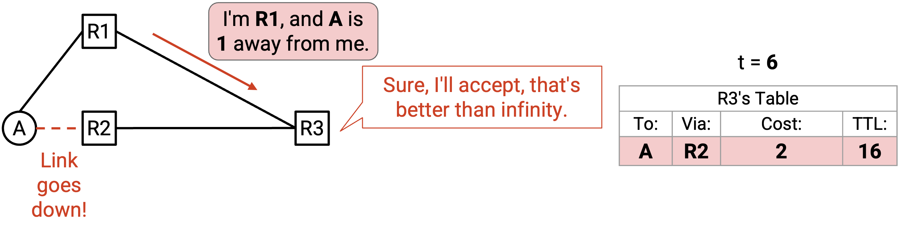

在前面的示例中，t=6 时我们被迫等待 10 秒，让坏掉的 route expire。借助 poison announcement，我们能够在 t=6 立即让那条坏掉的 route invalid，并接受新的 path。

有了 poison，我们能够更早 converge 到 valid path。在 t=6 到 t=16 之间，packet 现在可以正确到达 A（而在没有 poison 的方法中，这段时间里的 packet 会丢失）。另外，多亏 poison，我们避免了在这段时间里把坏掉的 route 传播给其他人。更好的是，我们还可以把 poison 传播给其他人，让它们知道经由我们（以及 R2）到 A 的 path 已经坏掉。

让我们形式化 poison 的规则。Poison 有两个来源之一：你的某条 route timeout，或者你注意到一个 local failure（例如你的某条 link down）。当其中之一发生时，你可以把相应 table entry 的 cost 更新为 infinity，重置 TTL，并向 neighbor advertise 这个 poison。

Poison 如何传播？当你从当前 next-hop 收到 poison advertisement 时，接受它。你的 next-hop 正在告诉你这条 route 不再存在（类似规则 2 中 advertise 更差的 path），所以你需要更新 table。更新 table 时，你会像其他 table update 一样重置 TTL。你也会像其他 table update 一样向 neighbor advertise 这个 poison，让 neighbor 也知道这条 route 已经坏掉。

最后一个修改：既然我们的 table 包含 poison，就必须小心不要沿着 poisoned route 转发 packet。如果 table entry 说 A 可以经由 R1 到达，cost 为 infinity，这真正的意思是 A 无法经由 R1 到达。如果我们收到一个发往 A 的 packet，就不能把它转发给 R1。

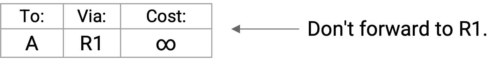

{: .blue}
> 让我们回顾一下目前的 protocol。
>
> 对每个 destination：
> - 如果你听到关于该 destination 的 advertisement，在以下情况下更新 table **并重置 TTL**：
>     - 该 destination 不在 table 中。
>     - advertised cost 加上到 neighbor 的 link cost，比 best-known cost 更好。
>     - advertisement 来自当前 next-hop。**包括 poison advertisement。**
> - 在 table 更新时，以及周期性地（advertisement interval）向所有 neighbor advertise。
> - 如果 table entry expire，**把这条 entry 变成 poison 并 advertise 它**。

## 规则 6A：Split Horizon

让我们再次回到最常用的运行示例，展示另一个问题。假设我们处于 steady state，forwarding table 中有正确的到 A 的 shortest route。Announcement 正在周期性地重新发送，但所有 announcement 都会被拒绝，因为我们处于 steady state。

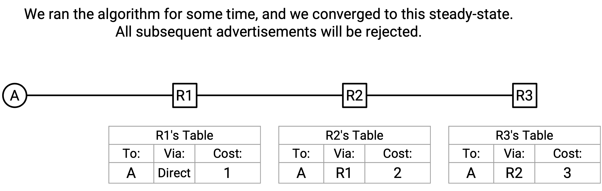

R1-R2 link down 了，并且由于 R1 停止发送 periodic announcement，R2 的 entry expire 了。R2 现在有一个空的 forwarding table。接下来会发生什么？

最终，R3 向 R2 重新发送它的 announcement，其中 destination 是 A，next hop 是 R3，经由 next hop 的 cost 是 3。

R2 的 table 是空的，所以它接受这个 announcement，并添加 destination（A）、next hop（R3）、经由 next hop 的 cost（3 + 1 = 4）。

我们创建了一个 routing loop！R2 会把 packet 转发给 R3，而 R3 会把 packet 转发给 R2。

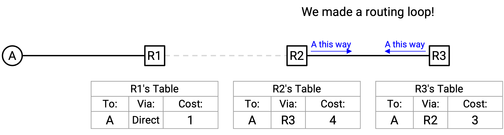

这个问题一开始可能不容易发现，所以我们再直观地复述一次。假设我接受了一条来自 Alice 的 route，这意味着我会把 packet 转发给 Alice。如果我接着又把这条 route 提供回 Alice，会发生什么？如果她接受这条 route，她最终会把 packet 转发给我，而我又会把 packet 转回给她。

如果 network topology 从不改变，这个 advertisement 是无害的。我提供给 Alice 的 path 是从 Alice 到我，再回到 Alice。这条新 path 肯定更贵，因为它增加了一个不必要的 loop，所以 Alice 总会拒绝这个 advertisement。

然而，如果 Alice 失去了自己的 route，这个 advertisement 就很危险。现在，我的 advertisement 会骗 Alice，让她以为可以把 packet 发给我。但我的 path 依赖 Alice 本身，所以如果她接受这条 path，我们就会创建一个 loop：她把 packet 发给我，而我又把 packet 直接发回给她。这里的关键问题是：Alice 以为我 advertise 的 path 是独立的，并且不会经过 Alice。但事实上，我的 path 确实经过 Alice，所以如果她接受我的 path，最终就会把 packet 转发回自己。

为了解决这个问题，我们需要避免向 Alice 提供已经涉及她自己的 route。我们永远不希望 Alice 接受一条会把 packet 发回给自己的 route。

这引出了一种称为 **split horizon（水平分割）** 的解决方案：我们永远不把一条 route advertise 回给提供这条 route 的人。

{: .blue}
> 让我们回顾一下目前的 protocol。
>
> 对每个 destination：
> - 如果你听到关于该 destination 的 advertisement，在以下情况下更新 table **并重置 TTL**：
>     - 该 destination 不在 table 中。
>     - advertised cost 加上到 neighbor 的 link cost，比 best-known cost 更好。
>     - advertisement 来自当前 next-hop。包括 poison advertisement。
> - 在 table 更新时，以及周期性地（advertisement interval）向所有 neighbor advertise。
>     - **但不要 advertise 回给 next-hop。**
> - 如果 table entry expire，把这条 entry 变成 poison 并 advertise 它。

## 规则 6B：Poison Reverse

**Poison reverse（毒性反转）** 是另一种避免 routing loop 的方式。我们可以使用 split horizon 或 poison reverse 来解决前面的问题（二者择一，不能同时用）。

在 split horizon 中，如果某个人给了我一条 route，我就不把这条 route advertise 回给它。

相比之下，在 poison reverse 中，如果某个人给了我一条 route，我会显式地把 poison advertise 回给它。换句话说，我明确告诉它：「不要把 packet 往我这里发」（因为我只会把 packet 转回给你）。

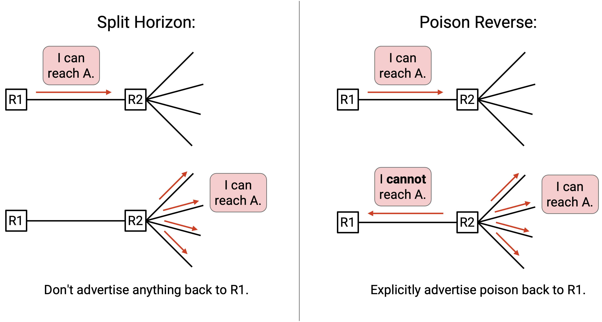

让我们再看一遍示例，但这次使用 poison reverse，而不是 split horizon。和前面一样，我们先到达 steady state，然后 R1-R2 down，R2 失去自己的 table entry。

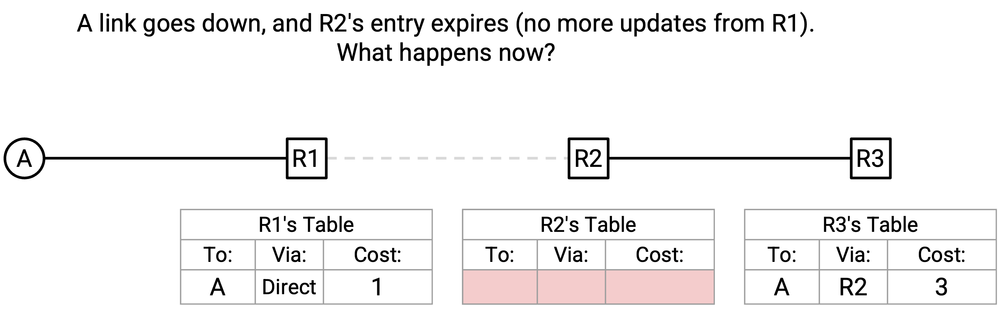

如果我们没有实现任何修复，这就是 R3 会向 R2 advertise 自己的 route，并且 R2 会接受一条经过自己的 route 的时刻。

如果我们实现了 split horizon，R3 此时不会把自己的 route advertise 回给 R2。

在 poison reverse 方法中，R3 显式地向 R2 发送一个 advertisement：「我是 R3，A 离我是 infinity。」

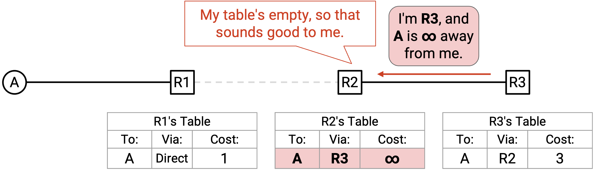

R2 没有 A 的 entry（旧 entry 已经 expire），所以它接受这条新的 poisoned route。现在，R2 的 table 明确写着它无法经由 R3 到达 A。借助 poison reverse，我们避免了 routing loop！

在我们的 network 模型中，split horizon 和 poison reverse 都能帮助避免 routing loop。更一般地说，如果 routing loop 确实出现，poison reverse 可以帮助更早消除它们。

例如，假设我们以某种方式最终出现了 routing loop，其中 R2 和 R3 互相转发 packet。

在 split horizon 方法中，不会发送 poison。R2 从 R3 得到 route，所以不会向 R3 发送任何东西。类似地，R3 从 R2 得到 route，所以也不会向 R2 发送任何东西。这个 loop 会一直存在，直到 table entry expire。在此之前，packet 可能会在 loop 中丢失。

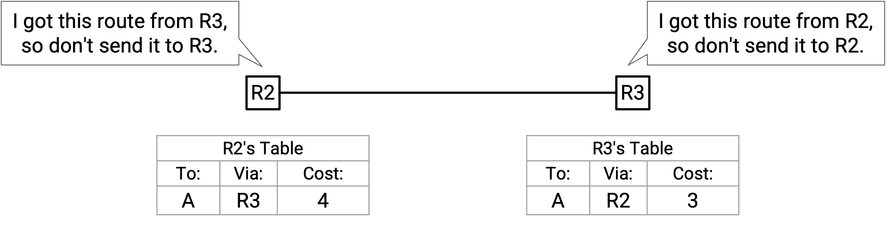

相比之下，如果我们使用 poison reverse 方法，R3 会显式地把 poison 发回给 R2：「我是 R3，A 离我是 infinity。」R2 接受这个 advertisement（规则 2，route 来自它的 next-hop），并更新 table，使经由 R3 的 path invalid。Poison reverse advertisement 会立即消除 routing loop。

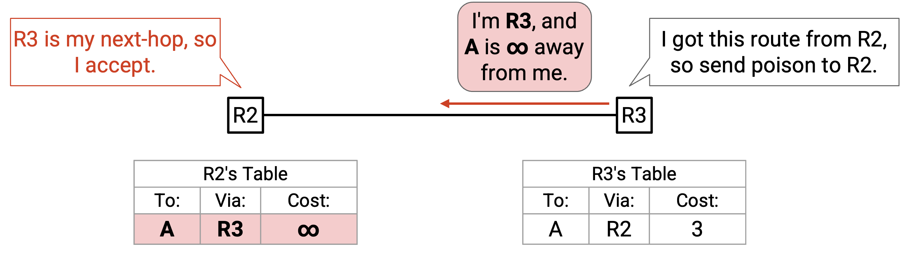

{: .blue}
> 让我们回顾一下目前的 protocol。
>
> 对每个 destination：
> - 如果你听到关于该 destination 的 advertisement，在以下情况下更新 table **并重置 TTL**：
>     - 该 destination 不在 table 中。
>     - advertised cost 加上到 neighbor 的 link cost，比 best-known cost 更好。
>     - advertisement 来自当前 next-hop。包括 poison advertisement。
> - 在 table 更新时，以及周期性地（advertisement interval）向所有 neighbor advertise。
>     - 不要 advertise 回给 next-hop。
>     - **……或者，向 next-hop advertise poison。**
> - 如果 table entry expire，把这条 entry 变成 poison 并 advertise 它。

注意，split horizon 和 poison reverse 是两个选择，而且你只能选择其中一个使用（不能两者都用）。你要么不向 next-hop 回传任何东西，要么显式地向 next-hop advertise poison。

## 规则 7：Count to Infinity

Split horizon 或 poison reverse 帮助我们避免了长度为 2 的 loop，也就是 R1 转发给 R2，R2 又转发给 R1。但我们仍然可能遇到涉及 3 个或更多 router 的 routing loop。

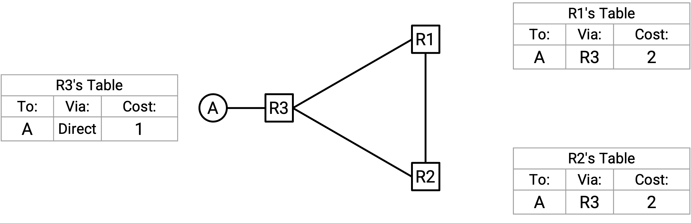

为了理解原因，考虑这个 network。假设 table 已经到达 steady-state。R1 和 R2 都转发给 R3，而 R3 转发给 A。

A-R3 link down 了！A 现在不可达。根据规则 5，R3 更新自己的 table，显示到 A 的 cost 为 infinity，并把这个 poison 发送给 R2 和 R1。

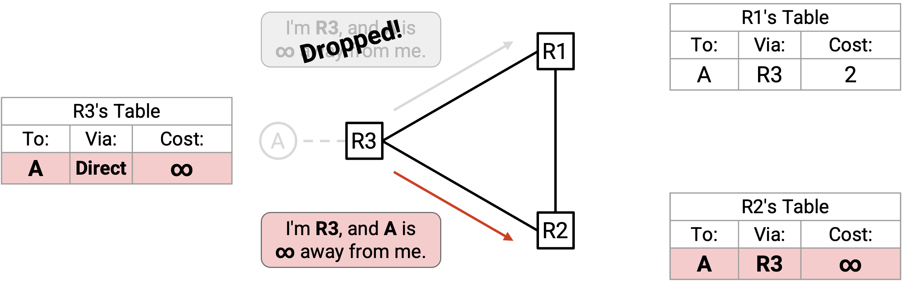

R2 收到 poison advertisement 并更新 table（规则 2，接受来自 next-hop 的 update）。现在，R2 和 R3 都知道 A 不可达。

发往 R1 的 poison advertisement 被 drop 了！R1 没看到这个 poison，所以它仍然以为自己可以经由 R3 到达 A。（poison 之后可以重新发送，但在这个示例中，接下来所有坏事都会在 poison 有机会重新发送之前发生。）

此时，R2 和 R3 无法到达 A，但 R1 认为自己仍然可以到达 A。

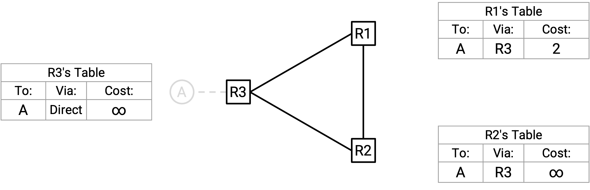

最终，R1 发出一个 advertisement。R1 到 A 的 path 经由 R3，所以根据 split horizon，它不会 advertise 给 R3。不过，R1 仍然会 advertise 给 R2：「我是 R1，A 离我有 2。」

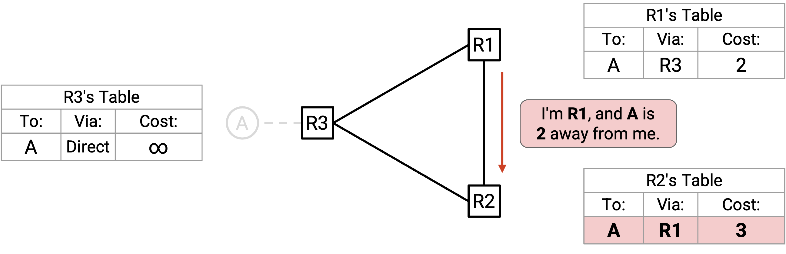

R2 没有办法到达 A，所以它接受这条 route。现在，R2 被骗得以为自己可以用 cost 3 到达 A。

R2 发出关于自己新 route 的 advertisement。Split horizon 规定 R2 不会 advertise 回给 R1，但它仍然会 advertise 给 R3：「我是 R2，A 离我有 3。」

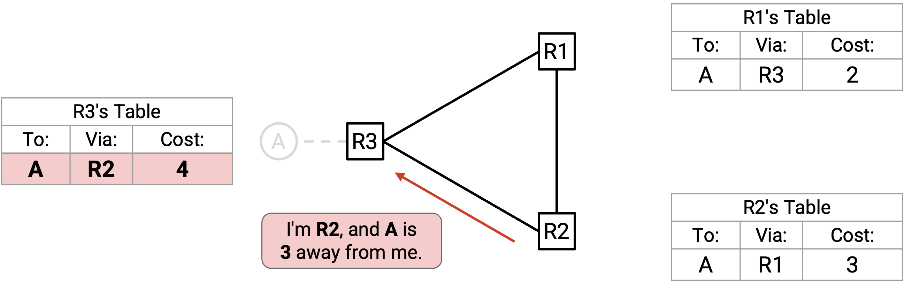

R3 没有办法到达 A，所以它接受这条 route。现在，R3 被骗得以为自己可以用 cost 4 到达 A。

接下来，R3 向 R1 发送 advertisement（根据 split horizon，不发送给 R2）：「我是 R3，A 离我有 4。」

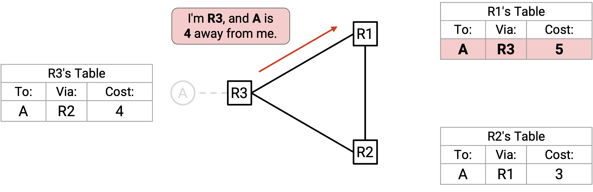

R1 会接受这个 advertisement（规则 2，advertisement 来自 next-hop）并更新 table。现在，R1 认为自己到 A 的 cost 是 5。

也许你已经看出接下来会怎样。R1 advertise 给 R2（根据 split horizon，不发送给 R3）：「我是 R1，A 离我有 5。」

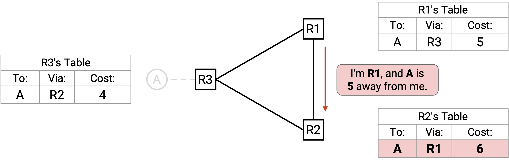

R2 接受这个 advertisement（规则 2），并认为自己可以用 cost 6 到达 A。

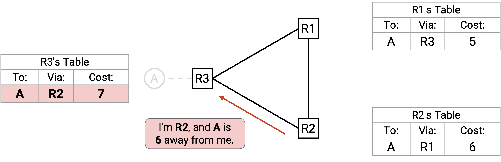

R2 向 R3 advertise cost 6，于是 R3 现在认为自己可以用 cost 7 到达 A。

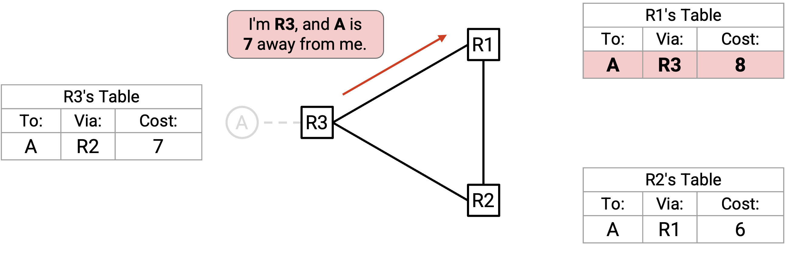

R3 向 R1 advertise cost 7，于是 R1 现在认为自己可以用 cost 8 到达 A。

R1、R2 和 R3 会不断循环地互相发送 advertisement，cost 逐步升高（这些 advertisement 都会被规则 2 接受）。同时，发往 A 的 packet 会卡在这些 router 之间的 forwarding loop 里。

让我们再复述一下这个问题。Poison 没有正确传播到所有 host，所以某个 router 的 table 中仍然有一条坏掉的 path。然后，这条坏掉的 path 被沿着 loop advertise，规则 2 导致 cost 不断增加，看不到尽头。

为什么 split horizon 没有救我们？记住，split horizon 只阻止 router 把 route advertise 回自己的 next-hop。但在这个例子中，loop 的长度是 3，我们从来没有把 route advertise 回 next-hop。

（注意：poison reverse 也救不了我们。如果 R3 把 poison advertise 回 R2，那么 R2 会忽略这个 poison，因为 R2 的 next hop 是 R1，而不是 R3。）

这称为 **count-to-infinity（数到无穷）** 问题。到目前为止，我们的修复（poison expired route、split horizon、poison reverse）都无法解决它。

为了解决这个问题，我们会强制规定一个 maximum cost。在 RIP 中，这个值是 15。所有大于这个 maximum 的 cost（也就是 16 或以上）都被视为 infinity。

有了这个修复，loop 仍然会存在一段时间，但最终所有 cost 都会到达 16（infinity）。让我们看看这个过程。

Cost 会随着每个 advertisement 增加。最终，R1 向 R2 advertise：「我是 R1，A 离我有 14。」R2 接受（根据规则 2）并把自己的 cost 更新为 15。

R2 向 R3 advertise：「我是 R2，A 离我有 15。」R3 接受（根据规则 2），但不会把 cost 更新为 16，而是更新为 infinity。

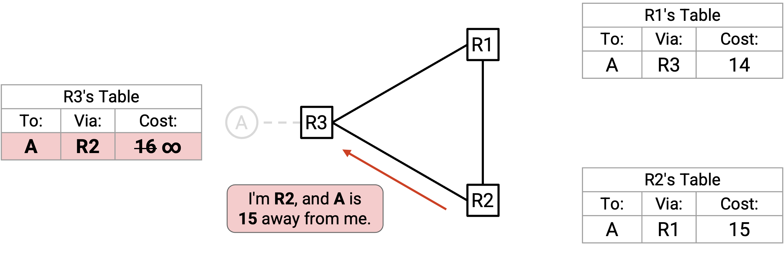

接下来，R3 向 R1 advertise：「我是 R3，A 离我是 infinity。」R1 接受（根据规则 2），现在 R1 的 cost 也变成 infinity。（注意：这个 advertisement 看起来就像 poison，虽然这里的 infinity 来自 count to infinity，而不是来自检测到 failure。）

最后，R1 向 R2 advertise：「我是 R1，A 离我是 infinity。」R2 接受（根据规则 2），现在所有 router 的 cost 都变成 infinity。

我们又到达 steady-state 了！以后所有 advertisement 都会 advertise infinite cost，并且不会改变 table。最终，这些 infinite-cost entry 都会 expire。或者，如果出现另一条到 A 的 route，它会替换这条 infinite-cost entry。

{: .blue}
> 让我们回顾一下目前的 protocol。
>
> 对每个 destination：
> - 如果你听到关于该 destination 的 advertisement，在以下情况下更新 table **并重置 TTL**：
>     - 该 destination 不在 table 中。
>     - advertised cost 加上到 neighbor 的 link cost，比 best-known cost 更好。
>     - advertisement 来自当前 next-hop。包括 poison advertisement。
> - 在 table 更新时，以及周期性地（advertisement interval）向所有 neighbor advertise。
>     - 不要 advertise 回给 next-hop。
>     - ……或者，向 next-hop advertise poison。
>     - **任何大于或等于 16 的 cost 都被 advertise 为 infinity。**
> - 如果 table entry expire，把这条 entry 变成 poison 并 advertise 它。

## Eventful Update

Router 可能想发送 advertisement 的时机有三种：

1. Table 改变时发送 advertisement。这些称为 **triggered update（触发更新）**。当我们接受新的 advertisement、添加新的 link（例如新的 static route），或 link down（例如 route 被 poisoned）时，table 都可能改变。

2. 每隔一个 advertisement interval，周期性发送 advertisement。

3. 当 table entry expire（并被 poison 替换）时发送 advertisement。

注意，triggered update 是一种 optimization。我们并不一定要在每次 table 改变时立刻 advertise，也可以只等待下一个 advertisement interval 到来再 advertise 这些变化。这个 protocol 仍然是正确的。不过，除了 periodic update 之外加入 triggered update，可以帮助 protocol 更快 converge 到正确 route，因为我们会在学到新信息的一瞬间就传播它。
