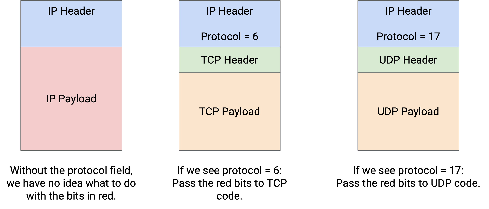
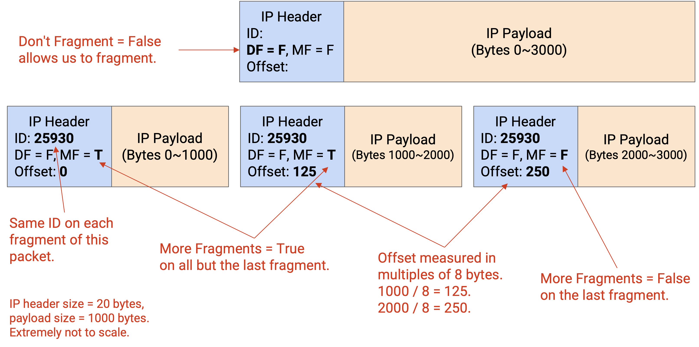
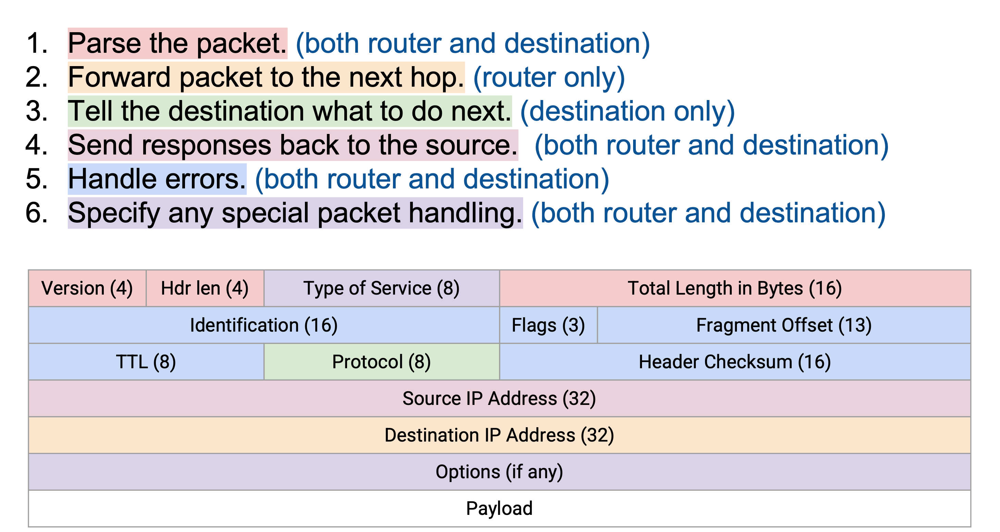
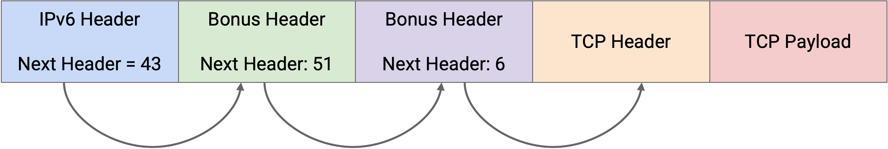
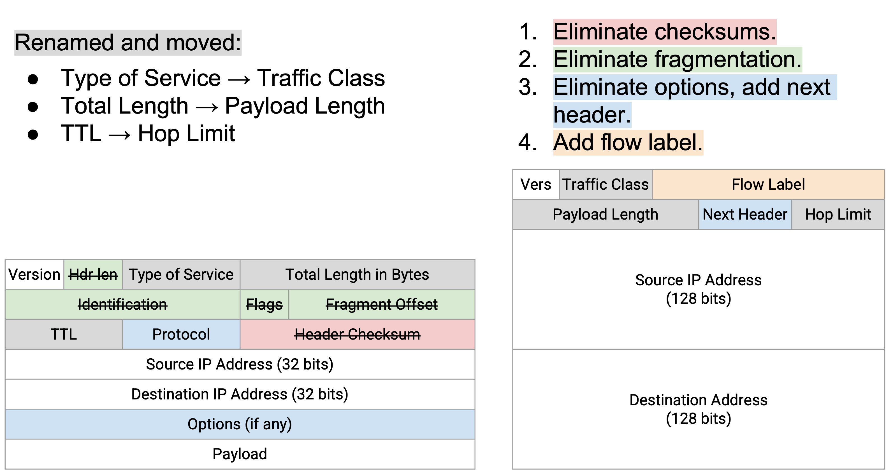
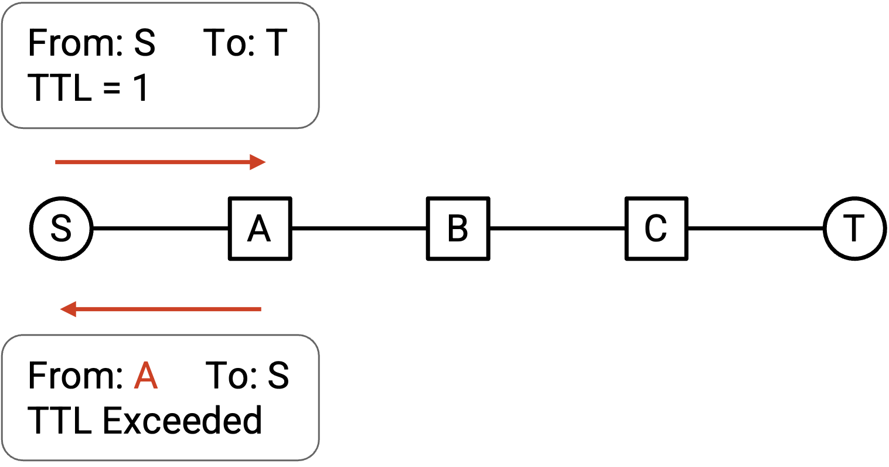
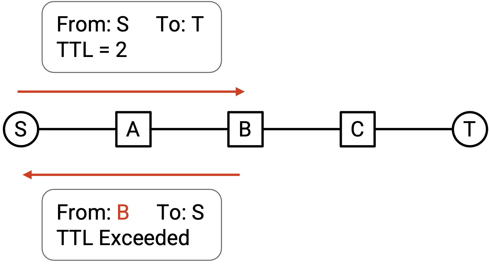
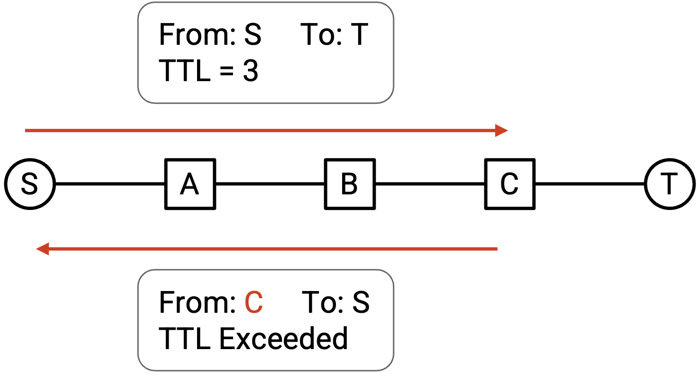
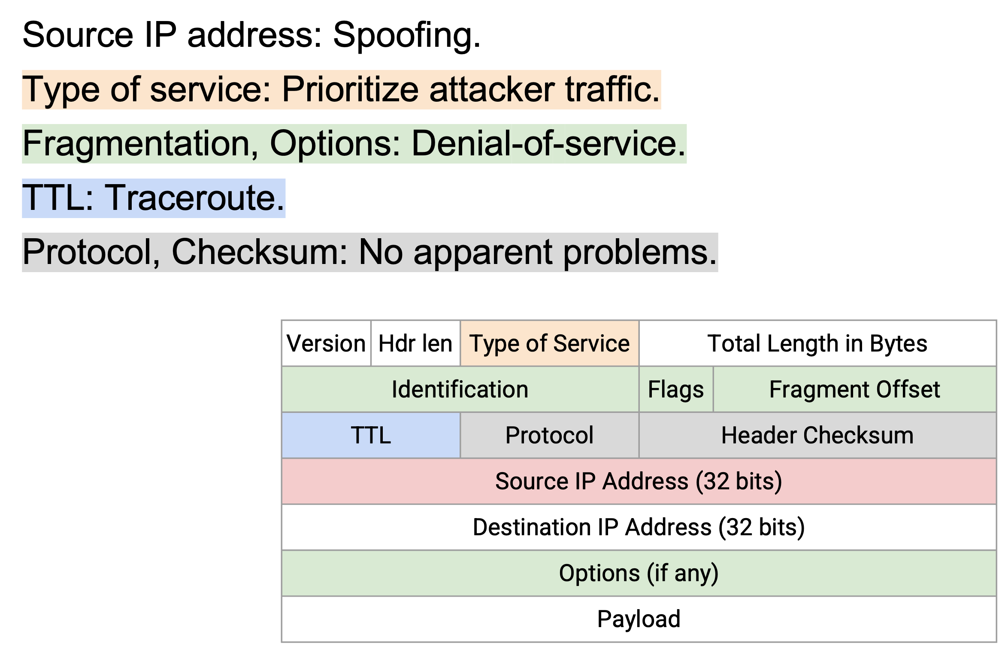

# IP Header

## IP Header 的设计目标

回忆一下，像 IP 这样的 protocol 由 syntax 和 semantics 组成。syntax 决定 IP header 中有哪些字段，semantics 决定这些字段如何被处理。

还要回忆一下，IP packet 由 header 和 payload 组成。header 包含 IP protocol 可以处理的相关 metadata。payload 包含会被传递给更高层 protocol 的任意数据，IP protocol 不会解析它。

最后，回忆一下，当我们沿 stack 向下移动时会添加 header，当我们把 packet 沿 stack 向上传递时会去掉 header。IP header 会在 end host 处处理，也会在每个中间 router 处处理。

IP header 应该尽可能小。Internet 上传输的每个 packet 都需要附带 IP header，所以即使 IP header 只增加 1 个 byte，也会显著增加整个 Internet 上的总带宽消耗。

IP header 应该尽可能简单。每个 router 和 end host 在发送和接收 IP packet 时都必须处理它们，所以难以处理的 header 会拖慢整个 Internet。理想情况下，我们希望 header 能完全在硬件中处理，因此不能假设处理这个 header 时可以使用通用 CPU 操作。

## IP Header 字段

一个 IP protocol 需要做四件事：

所有人（end host、router）都需要能够**解析** packet，并理解这些 bit 的含义。为了支持这一点，header 会包含 **IP version**（4-bit value）、**header length**（4-bit value，以 4-byte word 衡量，因为 IP header 长度不是固定的），以及 **packet length**（16-bit value，以 byte 衡量）。

router（不是 end host）需要把 packet **转发**到下一个 router。为了支持这一点，header 会包含 **destination IP address**（32-bit value）。

end host（不是 router）需要把 packet **向上传递**给更高层。为了支持这一点，header 会包含 **protocol number**（8-bit value），它告诉我们应该使用哪个 Layer 4 protocol（TCP 或 UDP）来处理 payload。例如，protocol number 6 表示使用 TCP protocol 来读取剩余 payload（把 payload 的最前面一些 bit 当作 TCP header 来读，依此类推）。protocol number 17 对应 UDP protocol。

end host 和 router 需要能够向 source **send replies**。为了支持这一点，header 会包含 **source IP address**（32-bit value）。

## IP 错误处理

end host 和 router 还需要能够在 packet 需要额外处理时**指定问题或特殊情况**。

IP packet 可能陷入 loop（例如 routing protocol 还没有收敛时）。一种可能做法是让 packet 无限循环，直到 route 收敛，但 packet forwarding 发生在纳秒级，而 routing convergence 发生在毫秒或秒级。让 packet 一直循环到 route 收敛可能耗时很长，并浪费大量带宽。为了防止无限循环，IP header 有一个 **time to live (TTL)**（8-bit value），每经过一 hop 就递减。如果 TTL 变成 0，packet 会被丢弃，并向 source 发送错误消息。（IP specification 要求发送错误消息，不过实践中不一定总会发送。）

IP packet 可能被损坏（例如线路上的 bit 可能被电气过程破坏）。为了检测损坏，IP header 包含一个 **checksum**（16-bit value），如果 checksum 不正确，就丢弃 packet。

注意，IP checksum 只在 IP header 上计算。checksum 只能检测 IP header 中的错误，不能检测 IP payload 中的错误。这体现了 end-to-end principle：我们要求 payload 由 end host 检查，而不是由中间 router 检查。

IP checksum 会在每个 router 处更新，因为 TTL 会变化，而 checksum 必须重新计算。另一种可能设计是把 TTL 排除在 checksum 之外，以节省 router 的额外工作。

IP packet 可能对某条特定 link 来说太大。每条 link 都有一个 **maximum transmission unit (MTU)**，表示这条 link 能作为一个单元承载的最大 packet size（以 byte 为单位）。例如，link 可能只有有限的内存，用来在沿线路发送 bit 时临时记住一个 packet。

end host 不知道 packet 会经过哪些 link，所以 end host 可能发送一个对其中某条 link 来说过大的 packet。为了解决这个问题，router 可以执行 **fragmentation**，把 packet 分割成多个 fragment，而 link 另一端的 router 必须重新组装这些 fragment，以恢复原始 packet。header 中的 identification（16-bit）、flags（3-bit）和 offset（13-bit）字段用于实现 fragmentation。

fragmentation 可以在硬件中实现（例如 router 可以快速 fragment packet，而不必为了特殊处理而 punt packet），但它会引入额外开销。现代 Internet 会尽量避免 fragmentation。例如，我们会尽量标准化 MTU（现代常见标准是 1500 bytes）。

IP 的早期设计者没有完全拥抱 best-effort design，他们认为允许 application 根据需求发送不同类型的 packet 可能有用。为了实现这一点，IP header 有 **Type of Service (ToS)** bit（8-bit value），可以用来请求不同形式的 packet delivery。例如，一些 packet 可以被标记为 delay-sensitive 或 high-priority。多年下来，这些 bit 被重新定义来表示不同 protocol，ToS 已经不再以原始形式存在。现在，这些 bit 表示某种优先级概念。使用这些 bit 的 protocol 示例包括 Differentiated Services Code Point (DSCP)，它定义某些 traffic class；以及 Explicit Congestion Notification (ECN)，它会帮助处理 traffic congestion（后面会讨论）。

在最初的 IP 设计中，可以向 IP header 添加额外的 **option bits**，以请求对 packet 做更高级的处理。例如，sender 可以请求 router 记录 packet 走过的 route（例如用于诊断）。sender 可以在 packet header 中包含 source route，强制 packet 走某条 route。packet header 也可以包含 timestamp。在现代实现中，这些 option 几乎总是被禁用，因为它们会导致实现不必要地复杂，并增加 packet processing overhead。例如，这些 option 会迫使 IP header 变成可变长度，而可变长度 header 比固定长度 header 更难处理。

## IPv6 Header 的变化

IPv6 的动机是担心我们最终会耗尽 32-bit IPv4 地址。IPv6 **expanded addresses**，让地址长度变成 128 bit。可能的 IPv6 地址数量极其巨大（可以想象成宇宙中原子的数量），所以我们几乎肯定永远不会耗尽 IPv6 地址。

IPv6 的设计者借这个机会清理并现代化 IP header，移除和更新已经过时的字段。最初，IPv6 被设想为一个更有野心的 protocol，带有许多新的 addressing 功能，但这些功能大多没有实现。实践中，除了这种移除过时功能的「大扫除」之外，IPv6 相比 IPv4 没有太多重大 protocol 变化，所以结果是一个更简洁的 IP protocol，而不是一个有很多激进变化的 protocol。

注意：如果你好奇，IPv5 于 1990 年发布（早于 1998 年的 IPv6）。它是一个实验性 protocol，从未被广泛实现。

IPv6 会**移除** IP packet header 中的 checksum。支持包含 checksum 的理由是：如果一个 packet 被损坏但没有被检测到，损坏的 packet 会继续被发送，浪费带宽。加入 checksum 可以确保 packet 被丢弃，不会把带宽浪费在损坏的 packet 上。现代环境中，带宽不再那么容易成为瓶颈，所以 checksum 不再必要；即使一些损坏的 packet 被一路送过网络，性能影响也不大。

IPv6 会**移除 fragmentation**。如果 IPv6 packet 对某条特定 link 来说太大，router 会丢弃这个 packet，并向 source 发送错误消息，告知可允许的最大 packet size（MTU）。原始 sender 负责把数据拆成更小的 packet，并重新发送这些更小的 packet。end host（例如你的个人电脑）处理的 packet 数量少于 router（例如数据中心中的 router），所以把 fragmentation 工作从 router 转移到 end host，可以提高 Internet 的整体可扩展性。

IPv6 用一种修改后的 protocol field 实现，替代了可变长度 options 部分。在 IPv4 中，options 有问题，因为它们会创建可变长度 header，而这种 header 更难解析。在 IPv6 中，header 长度固定。这也意味着 **header length** 字段可以被移除。

为了继续支持 option，IPv6 泛化了 protocol field，使 IP packet 可以在到达 Layer 4 之前被传递给特殊处理。（回忆一下，IPv4 中的 protocol header 会被设置为某个值，用来表示接下来由哪个 Layer 4 protocol 处理 packet。）在 IPv6 中，这个字段从 protocol 改名为 **next header**。

如果你希望某个额外 protocol 处理 IP packet，可以把这个 protocol 对应的编号放入 next header field。这些额外 protocol 的设计者和用户需要约定哪些编号对应哪些 protocol，并且需要一个标准组织来管理这些编号。然后，payload 可以被传递给这个额外 protocol；它可以读取一个额外 header（位于 Layer 3 IPv6 header 之后、Layer 4 header 之前），执行额外处理，再把剩余 payload 传递给 Layer 4。

如果 packet 没有额外 option，那么 next header field 就和旧的 protocol field 一样，使 IP packet 可以不经过额外处理，直接向上传递给 Layer 4 protocol。

next header 的思想可以推广到允许多个 protocol 在 IPv6 之后、Layer 4 之前处理 packet。例如，IPv6 可以有一个用于特殊处理的 next header。然后，special processing protocol 的 header 也可以包含 next header field，指定一个 Layer 4 protocol，或者又一个 special processing protocol。这种方法面向未来，因为它支持还没有被发明出来的未来 protocol。那些未来 protocol 可以通过 next-header 方法加入，而不破坏 IPv6，也不要求更新 IPv6。

IPv6 在 header 中添加了 **flow label** 字段。在 Layer 3，packet 是独立发送的（一个 packet 如何发送不会影响其他 packet），但实践中，许多 packet 经常以某种方式相关。例如，在两个 host 之间的视频流中，可能有许多 packet 在同两个 application 之间发送。Layer 3 按理应该把这些 packet 分别对待，但实践中，router 已经加入了更高级的系统，称为 **middleboxes**（例如 firewall、intrusion detection system），它们可能关心这些 packet 是否属于同一个 flow 或 connection。例如，firewall 可能需要读取一个 connection 中的多个 packet，才能决定是否允许或阻止这个 connection。当所有 packet 都独立发送时，这些 middlebox 必须猜测两个 packet 是否相关（例如注意到 packet 有相同的 source/destination IP address）。IPv6 添加了一种显式方式，用来表示多个 packet 彼此相关。

IPv4 和 IPv6 的 version number 没有变化。packet length 没有变化（不过从 Total Length 改名为 Payload Length）。TTL 改名为 Hop Limit，但功能没有变化。

Type of Service bit 改名为 Traffic Class，并且仍然可以用于实现某种 packet priority。

总体上，IPv6 拥抱 end-to-end principle，并在可能时要求 end host 完成工作（fragmentation、验证 checksum 并重新发送损坏的 packet）。有些字段，例如 hop limit 或 TTL，本质上是 IP 层级的问题，无法由 end host 实现。（end host 怎样帮助处理一个在网络中循环的 packet 呢？）

IPv6 也试图简化 header（移除可变长度 options），同时仍允许未来改进的可扩展性（next-header 方法、flow label）。

## IP Header 安全

IP 没有任何内建的攻击防护。攻击者可以发送 source IP address 不正确的 packet，从而冒充别人。这可能导致被冒充的 host 错误地为某个 packet 背锅。或者，如果攻击者发送 spoofed packet，回复可能会被发送给被冒充的 host。谎报 source address 称为 **IP spoofing**。

IP spoofing 可以用于 denial-of-service (DoS) attack。DoS attack 可以通过用 packet 淹没服务器来压垮服务器并使其崩溃。如果所有 packet 都来自同一个 sender，服务器可以通过忽略来自攻击者 IP address 的 packet 来阻止攻击。然而，如果攻击者谎报 source IP address，服务器就更难区分 attacker traffic 和 legitimate traffic。

还存在更复杂的 spoofing 攻击，不过这门课不会详细介绍（更多细节见 UC Berkeley CS 161 notes）。

IP header 中的 ToS field 允许 sender 为自己的 packet 设置优先级。如果我们允许所有人设置自己的优先级，恶意用户就可以设置更高优先级，欺骗网络优先处理 attacker traffic。

如果网络对 high-priority traffic 收取额外费用，攻击者可以发送 spoofed high-priority packet，而被冒充的 host 就不得不为攻击者的 traffic 付费。

最初的 Internet 设计没有阻止这些攻击，不过现代 ISP 已经实现了额外安全措施来缓解 IP 层攻击。在现代 Internet 中，ISP 不允许 end host 设置 ToS field，并且许多 ISP 有工具来检测和阻止 spoofed packet。

在 IPv4 中，攻击者可以故意发送很大的 packet，迫使 router 执行额外工作来 fragment 这些 packet。或者，攻击者可以故意添加额外 option，迫使 router 处理这些 option。这可以被用来执行 DoS attack，并压垮 router 的处理能力。

TTL field 可以被利用来了解网络拓扑。你可以发送一个 TTL 为 1 的 packet。这个 packet 会在第一 hop 过期，第一台 router 会向你发送错误消息，让你知道第一台 router 的身份。

然后，你可以发送一个 TTL 为 2 的 packet，它会在第二 hop 过期。第二台 router 会向你发送错误消息，让你也能发现第二台 router。

通过用 TTL 3、TTL 4 等重复这个过程，你可以发现路径上的所有 router。这种方法称为 **traceroute**，不过也有人认为它不是攻击，而是有用的诊断工具。

在不同 source 和 destination 上重复这种方法，可以让你了解更多网络拓扑。有些 router 在 TTL exceeded 时不会发送错误消息，这可能会限制这种利用方式。

攻击者理论上可以篡改 protocol 或 checksum field，但这很可能导致 packet 因为 protocol 或 checksum 无效而被丢弃，所以这两个字段基本不存在实际攻击。

