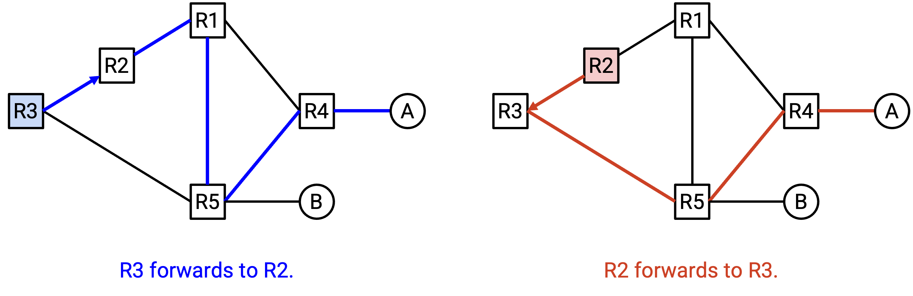
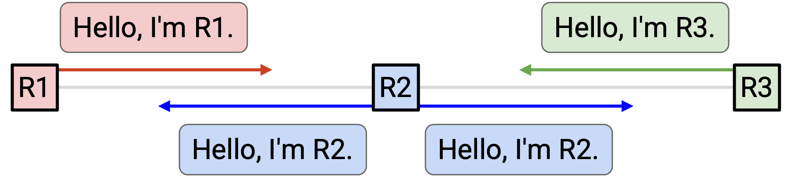
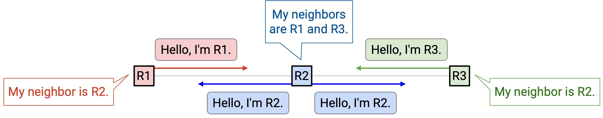
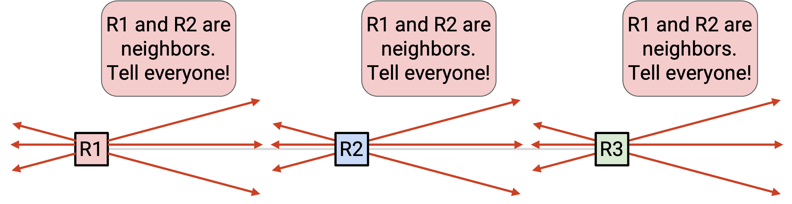
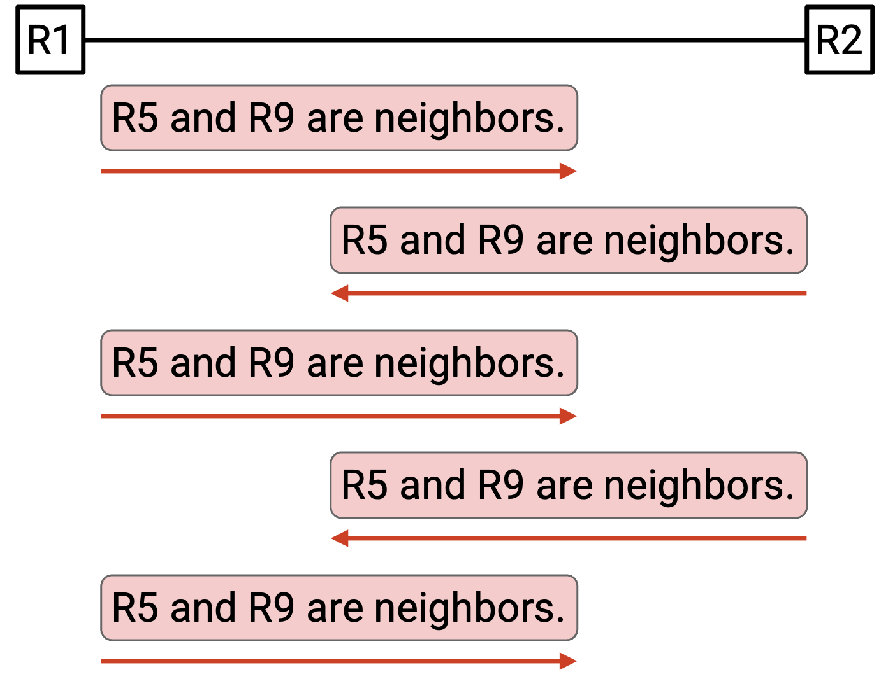
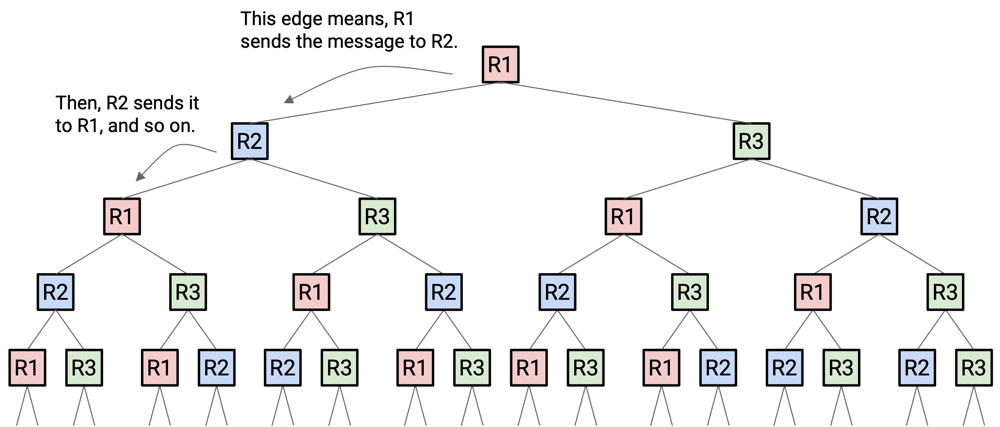
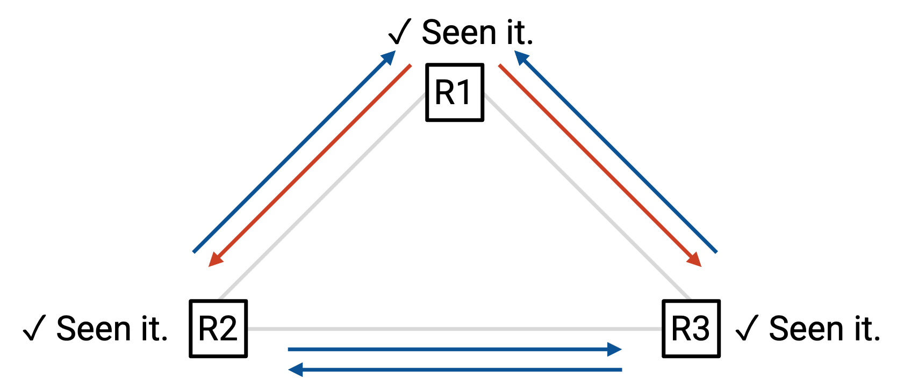
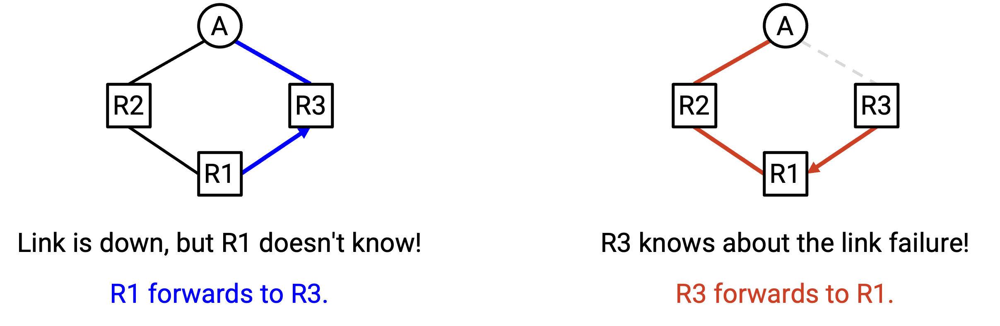

# Link-State Protocols

## Link-State Protocol 简介

回忆一下，根据底层 algorithm 的不同，routing protocol 可以分成不同类别。在上一节中，我们看到了 distance-vector 这一类 protocol。在本节中，我们会讨论 **link-state（链路状态）**，这是另一类重要 protocol。

还记得，protocol 也可以分为 exterior gateway protocol（运行在 network 之间）和 interior gateway protocol（运行在 network 内部）。和 distance-vector 一样，link-state protocol 通常也是 interior gateway protocol。

IS-IS（Intermediate System to Intermediate System）和 OSPF（Open Shortest Path First）是 link-state protocol 的两个重要例子。二者今天都被广泛部署。

## Link-State 概览

Distance-vector 执行的是一种 distributed、cooperative computation（分布式协作计算）。每个 node 根据 neighbor 计算出的结果，计算答案中属于自己的那一部分。所有 node 的计算合在一起，形成完整答案。在计算过程中，每个 node 只需要来自 neighbor 的 local information（node 不知道完整 network graph）。

相比之下，link-state protocol 执行的是一种 local computation（局部计算）。每个 node 都独立地、从头开始计算完整答案，不使用 neighbor 的任何计算结果。不过，为了做到这一点，每个 node 都需要来自 network 各处的 global information。

用一句话概括 link-state protocol：每个 router 学到完整的 network graph，然后在这个 graph 上运行 shortest-path algorithm 来填充 forwarding table。

我们必须实现两个主要步骤。第一，router 需要以某种方式学到完整的 network graph，包括每条 link 的状态（up 或 down）、每条 link 的 cost，以及每个 destination 的位置。

然后，router 需要在这个 graph 上运行某种 algorithm，学习如何把 packet 转发到每个 destination。

我们先思考第二步（shortest path），再思考第一步（学习 graph）。

## 计算 Path

一旦 router 拥有 network 的 global view，它就可以很容易地用某种 shortest-path algorithm 计算穿过 network 的 path。

具体来说，router 应该计算到每个 destination 的 shortest path。然后，对每个 destination，router 记录 shortest path 上的 next hop，就像 distance-vector protocol 中一样。Forwarding 时并不需要 path 的其余部分。

许多 single-source shortest-path algorithm 都可以用于这一步。例如，Bellman-Ford algorithm（串行版本，不带 distance-vector 的那些修改）和 Dijkstra algorithm 都能高效地计算从单个 source 到所有 destination 的 shortest path。我们也可以考虑其他方案，例如 breadth-first search，或者能够并行运行的 algorithm。

这里必须小心 router 之间的不一致。

记住，每个 router 都在独立计算 shortest path，并据此决定 next hop。每个 router 只控制自己的 next hop，无法影响 next hop 接下来会怎么做。

例如，假设 R3 计算出了这条到 A 的 shortest path，并决定把 packet 转发给 R2。然后，R2 计算出了这条到 A 的 shortest path，并决定把 packet 转发给 R3。两个 router 都计算出了 valid shortest path，但它们的决策导致了 routing loop。

为了避免这个问题，我们必须确保所有 router 产生的 forwarding decision 彼此 compatible（兼容）。要让所有 router 产生 compatible decision，需要满足哪些条件？

1. 所有 router 必须对 network topology 达成一致。假设一条 link failed，但只有一个 router 知道。那么不同 router 会在完全不同的 graph 上计算 path，可能产生不一致的结果。

2. 所有 router 都必须在 graph 中寻找 least-cost path。如果某个 router 出于某种原因偏好更昂贵的 path，就会得到不一致的结果。

3. 所有 cost 都必须为正。Negative cost 可能产生 negative-weight cycle。

4. 所有 router 使用相同的 tiebreaking rule。如果我们假设 shortest path 是唯一的，那么前两个条件就足以确保所有人选择同一条 path。这个条件额外确保：如果有多条 path 并列为 shortest，所有人也会选择同一条。

满足这四个条件时，即使 router 使用不同的 shortest-path algorithm，它们仍然会计算出相同 path，并产生 compatible decision。不过在实践中，为了简单，router 通常都使用相同 algorithm。

## 学习 Graph Topology

Router 如何学到完整的 network graph？首先，我们需要知道自己的 neighbor 是谁（包括 router 和 destination）。然后，我们需要把这些信息分发到整个 network。Router 还需要把自己收到的所有信息拼接成一个 graph topology。

为了发现 neighbor，每个 router 都会向所有 neighbor 发送 hello message。

例如，在这个 network 中，R2 向两个 neighbor 发送：「Hello，我是 R2。」现在，R1 知道自己连接到了 R2，R3 也知道自己连接到了 R2。类似地，R1 向 R2 say hello，所以 R2 现在知道 R1。R3 也向 R2 say hello，所以 R2 也知道 R3。

结果是，每个人现在都知道自己的 immediate neighbor 是谁。注意，R1 并不知道 R3，因为 R1 和 R3 不是 neighbor。

我们还想知道 link 是否 down。为了支持这一点，我们会周期性地重新发送 hello message。如果某个 neighbor 停止 say hello（例如错过若干次 hello），我们就假设它消失了。

既然我们已经知道自己的 neighbor，就应该把这个事实 announce 给所有人。为了发出 global announcement，我们把 announcement 发送给所有 neighbor。另外，如果我们收到一个 announcement，也应该把它发送给所有 neighbor。这可以确保每条 message 都传播到整个 network。这个过程称为在 network 中 **flooding（泛洪）** 信息。如果任何信息发生变化（例如某个 neighbor 消失），我们也应该 flood 这条信息。

我们还需要确保 message 不会被 drop。否则，其他 router 可能错过某次 update，并在错误 graph 上计算 path。为了解决这个问题，我们使用和 distance-vector 中相同的技巧：周期性地重新发送 message。只要 link 正常工作，经过足够多次尝试后，我们的 message 就应该能够发出。

## 避免无限 Flooding

我们必须小心如何在 network 中 flood announcement。

R2 学到一些信息，并把它 announce 给 neighbor R3。当 R3 收到这条信息时，它会向 neighbor R2 发出 announcement。当 R2 收到这条信息时，它又会向 neighbor R3 发出 announcement。这两个 router 会陷入互相发送 announcement 的状态，浪费 bandwidth，尽管没有任何新信息。

注意，这不同于为了 reliability 而周期性重新发送 message。为了 reliability，我们可能每 5 秒重新发送一次 message。而在这个无限 loop 中，router 正在以最大速率接收并重新发送重复 announcement（例如每秒数百万次）。

如果 network 中包含 loop，问题会更糟：

时间步 1：R1 broadcast 给 R2 和 R3。

时间步 2：R2 broadcast 给 R1 和 R3。R3 broadcast 给 R1 和 R2。

时间步 3：R1、R1、R2 和 R3 分别向（R2，R3）、（R2，R3）、（R1，R3）和（R1，R2）发出 broadcast。注意，R1 在时间步 2 收到了两条 message，所以它发出两次 broadcast。

时间步 4：R1、R1、R2、R2、R2、R3、R3、R3 分别向（R2，R3）、（R2，R3）、（R1，R3）、（R1，R3）、（R1，R3）、（R1，R2）、（R1，R2）、（R1，R2）发出 broadcast。

时间步 5：R1 发出 6 次 broadcast，R2 发出 5 次 broadcast，R3 发出 5 次 broadcast。

所有新信息在时间步 1 就已经学到了。但大家会不断重新发送同一条信息，重复 announcement 会指数级增长，并最终压垮 network。

为了解决这个问题，我们需要确保 router 不会把同一条信息发送两次。

当我们第一次看到一条 message 时，把这条 message 发送给所有 neighbor，并记下我们已经看过这条 message。（反正我们也必须记下这条 message，因为我们正试图用这些信息构建 network graph。）然后，如果我们之后再次看到同一条 message，就不要第二次发送它。

为了唯一标识一条 message，我们可以引入 timestamp（或其他对每条 message 唯一的 counter）。

现在，如果回到前面的例子：

时间步 1：R1 broadcast 给 R2 和 R3。

时间步 2：R2 broadcast 给 R1 和 R3。R3 broadcast 给 R1 和 R2。

时间步 3：此时，R1、R2 和 R3 之前都已经看过这条 message，所以它们不会再发送。不会再有重复 message 被发送。

注意，经过这个修改后，有时仍然会发送重复 message，但我们已经避免了重复 message 被无限发送。

## Convergence（收敛）

当每个 router 学到完整 network topology，并据此计算自己的 forwarding table 之后，link-state 会 converge 到一个 valid、least-cost 的 routing state。Convergence 依赖每个 node 使用同一个 graph。Convergence 之后，只要 network topology 不变，routing state 就会保持 valid。

一旦 network topology 改变，network 可能需要一段时间才能再次 converge。我们必须等待变化被检测到（例如 link failure）。然后，我们必须等待新信息传播到整个 network，并等待 router 重新计算 forwarding table entry。当 network 正在 converging 时，我们可能处在 invalid routing state 中，因为一些 router 使用旧 graph，而另一些 router 使用更新后的 graph。Routing state 可能出现 dead-end、loop，或者不是 least-cost 的 path。

例如，假设 R3-A link failed。R3 知道这一点，但其他 router 不知道。R3 会把 packet 转发给 R1。然而，R1 仍然会把 packet 转发给 R3。

Link-state protocol 的许多复杂性都藏在细节里。为了尽可能加快 convergence 并避免 invalid routing，我们可以在 protocol 中做一些小的 optimization 和调整。

## Link-State 与 Distance-Vector

与 distance-vector protocol 相比，link-state protocol 有哪些优点和缺点？

在 distance-vector 中，当我们收到 announcement 时，并不一定知道自己正在接受的 path 的全部细节。我们必须信任 neighbor 在 announcement 中声称的内容。相比之下，在 link-state 中，我们知道完整的 graph topology，因此更了解 packet 实际走过的 path。

根据实现的不同，distance-vector 可能 converge 得更慢。如果 network 改变，我们必须等待 neighbor 重新计算并 re-advertise 一条 path，然后才能更新自己的 forwarding table。然后，我们所有 neighbor 又必须等待我们，如此继续。相比之下，在 link-state 中，大家可以快速 flood 新信息，并同时重新计算。

Link-state protocol 适合小型 local network，但无法很好地扩展到全球 Internet。特别是，link-state 要求每个 router 都知道整个 network。在全球 Internet 上，运营者可能不想向竞争者暴露自己的 network topology（例如 router 位于哪里、link 的 bandwidth 多大）。

实践中，大多数 network 会组合部署 distance-vector 和 link-state protocol。
