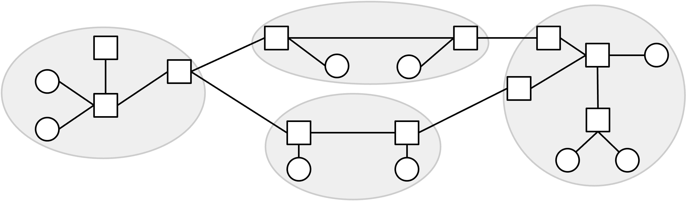
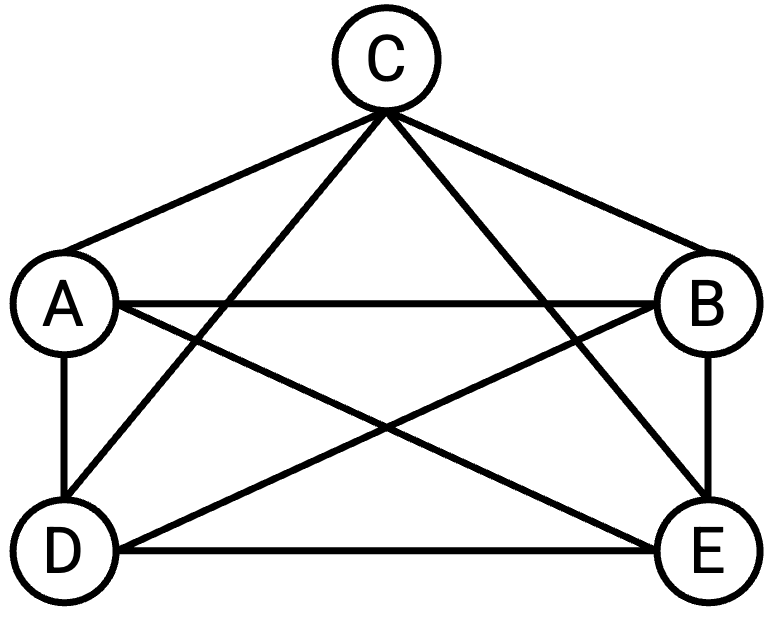
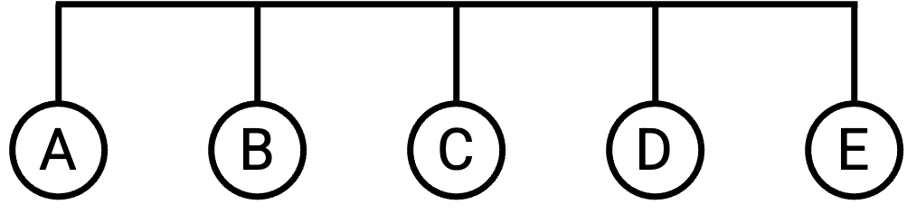
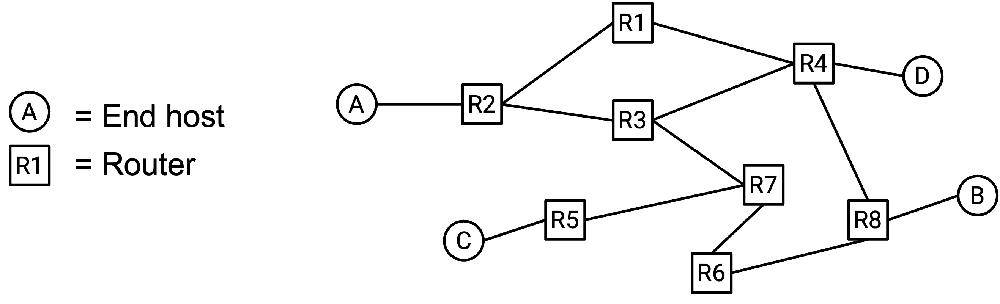
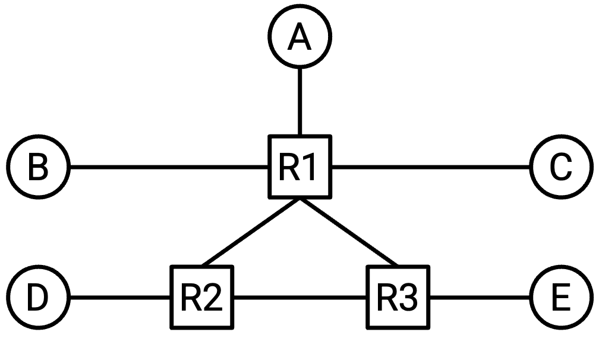
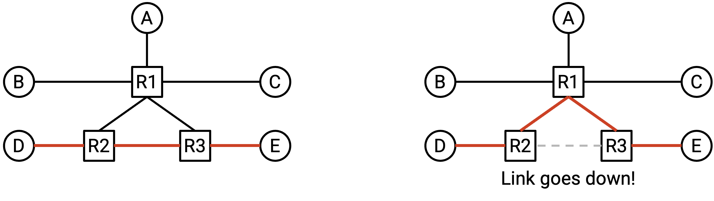
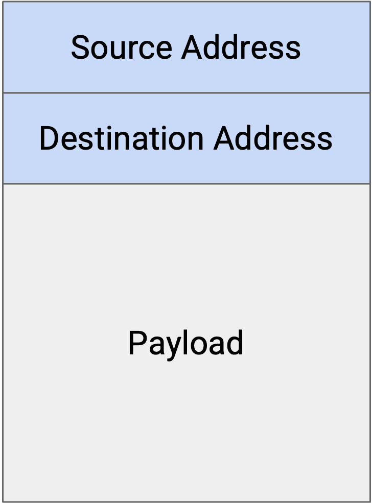
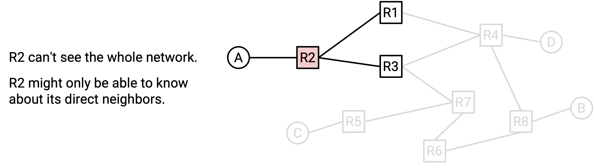

---
title: Model for Intra-Domain Routing
parent: Routing
nav_order: 2
layout: page-with-toc
---

# Intra-Domain Routing 的模型

## 将 Network 建模为 Graph

我们先建立一个简化的 Internet 模型，用来帮助我们形式化地定义 routing 问题。

回顾上一单元，我们可以把 Internet 看作一组机器，它们通过一组 link（链路）连接在一起，其中每条 link 连接 network 上的两台机器。

我们可以把 network topology（网络拓扑）表示成 graph（图）：每个 node（节点）表示一台机器，两个 node 之间的每条 edge（边）表示两台机器之间的一条 link。

从历史上看，link 有时可以连接两台以上的机器；但在现代 network 中，link 基本上总是恰好连接两台机器。

## Full Mesh Network Topology

假设我们有两台机器，A 和 B。如果这两台机器想交换消息，我们可以在它们之间添加一条 link。

但如果我们有五台机器，而不是两台呢？一种可能的方法是在每一对机器之间都建立一条 link，使每台机器都连接到其他每台机器。这有时称为 full mesh topology（全互连拓扑）。

这种方法有哪些缺点？

这种方法的 scale（扩展性）不好。如果我们试图把它扩展到现代 Internet 的规模，就需要在世界上每一对计算机之间都连一根线。当一台新计算机加入 network 时，我们还必须在这台新计算机和世界上其他每台计算机之间建立新的 link。

虽然 full mesh topology 无法扩展到整个 Internet，但在较小规模的场景中仍然有一些好处。特别是，每一对机器之间都有 link，会让 network 拥有大量 bandwidth。每台机器到其他所有机器都有 dedicated link（专用链路），并且每一对机器都可以使用其 dedicated link 上的全部 bandwidth。

一般来说，我们不能保证每台机器都有到其他所有机器的直接 link。换句话说，不能保证底层 graph 是 fully-connected（完全连通）的。

## Single-Link Network Topology

除了 full mesh topology，我们还有其他部署 link 的方式来连接多台机器。例如，我们可以用一条 single link 连接全部五台机器：

（这里，我们暂时打破「一条 link 只连接两台机器」这个假设，考虑一条连接两台以上机器的 link。）

这种方法比 full mesh topology 更容易 scale。例如，如果一台新计算机加入 network，我们不需要在新计算机和已有的五台计算机之间建立五条新 link，只需要把已有的 wire（线缆）延伸到这台新计算机即可。

不过，这种方法给机器提供的 bandwidth 更有限。特别是，network 中只有一条 link，所有五台机器都需要共享这条 link 上的 bandwidth。

为了构建更复杂的 network topology，我们需要引入 router 的概念。

## Routers 和 Hosts

在我们的简化模型中，每台机器都会被归为两类之一。

**End host（端主机）** 是连接到 Internet、用来发送和接收数据的机器。End host 的例子包括你个人电脑上的应用，例如 web browser。Web server 也是 end host，例如接收 Google 搜索请求并返回搜索结果的 Google web server。这些机器会向其他目的地发送 outgoing packet，也可能是 incoming packet 的最终目的地。不过，这些机器通常不会接收并转发 intermediate packet（中间 packet，也就是最终目的地不是自己的 packet）。

相比之下，**router（路由器）** 是连接到 Internet、负责接收 intermediate packet 并把它们继续转发得更接近最终目的地的机器。例如，可以考虑安装在你家中 network 里的 router，或者部署在某个 data center 建筑中的 router。这些机器通常不会自己创建并发送新的 packet，也通常不是 packet 的最终目的地。例如，在日常使用 Internet 时，你可能想把 packet 发给 Google web server 来进行搜索，但你大概不需要直接给家里的 router 或某个 data center 发送消息。这些 router 会帮助你把 packet 转发到 Google，但它们并不是你的 packet 的最终目的地。

根据 network design，router 也可以是合法的目的地；但在本单元中，我们会忽略作为目的地的 router。不过，请注意 router 可能作为 source（源）来发送自己的新 packet。

Router 有时也称为 switch。Router 和 switch 在历史上存在差异，但如今这些术语常常互换使用。在这些讲义中，我们会尽可能使用「router」。

在 Internet 的 graph 模型中，router 表示通常连接到多个 neighbor（邻居）的 intermediate node。End host 则表示通常连接到一个或多个 router 的 node。在实践中，这些假设并不总是成立。

在这些讲义中，只要可能，我们都会把 router 画成方形，把 end host 画成圆形。在实践中，router 有时会用其他符号表示。例如，下面是 network diagram 中常见的 router 符号：

## 带 Router 的 Network Topology

现在，除了 end host，我们还有 router，因此可以构建如下更复杂的 network topology：

这种 topology 让我们结合了前面 full mesh topology 和 single-link topology 的优点。特别是，它使用的 link 数量少于前面的 full mesh topology。同时，它提供的 bandwidth 又高于前面的 single-link topology。

这种 topology 对 failure（故障）也更 robust（稳健）。如果某条 link 失效，packet 可以沿着 network 中的另一条路径前进，并仍然到达目的地。

## Routing 中的 End Host

注意，end host 通常不参与 routing protocol，因为它们不会转发 intermediate packet。相反，end host 往往通过一条 link 连接到一个 router。默认情况下，end host 会把所有 outgoing message 都发送给这个 router，由 router 判断如何把 packet 发往最终目的地。这种把所有内容都发送给 router 的策略有时称为 end host 的 **default route（默认路由）**。

在设计 routing protocol 时，除了把 end host 作为目的地来考虑之外，我们通常会忽略 end host（因为 router 需要弄清楚如何到达不同目的地）。

## Packets

回顾上一单元，当 application 想通过 Internet 发送数据时，application 会创建一个包含数据的 packet。随着 packet 被传递给 lower-layer protocol，额外的 header 会包裹在 packet 外面，并携带 metadata（元数据），帮助 packet 到达目的地。

在 routing 单元中，我们会考虑一个简化模型：每个 packet 都有一个包含 metadata 的 header，以及一个包含应用层数据的 payload（载荷）。暂时我们会忽略嵌套 header 和多层结构。

Routing protocol 并不关心应用层数据。用户想发送的是图片、HTML 网页还是音频文件都不重要；从 routing 的视角看，我们有的是一串 1 和 0，而我们需要一种 protocol 把这些 bit 发送到目的地。

在 header 中，我们关心的主要 metadata 字段是 destination address（目的地址）。它告诉我们 packet 的最终目的地。当 router 收到 packet 时，router 会读取 header 中的 metadata 字段，决定如何把 packet 发往最终目的地。弄清楚应该把 packet 发到哪里，是 routing 中需要解决的核心问题。

## Addressing

我们如何在 packet header 中写下 packet 的目的地？我们需要某种方式为 network 中的每台机器编址。换句话说，我们需要一个 protocol，为 network 中的每台机器分配一个 address（地址）。

本单元稍后会讨论可扩展的 addressing 方法。现在，我们先为每台机器分配一个 unique label（唯一标签，例如可以把三个 router 标为 X、Y 和 Z），并把这些 label 当作每个 router 的 address。这可以让我们把 routing 问题和 addressing 问题分开思考。

到这里，我们可以定义 routing 问题：当 router 收到一个 packet 时，它如何知道应该把 packet 转发到哪里，才能让 packet 最终到达最终目的地？

## Network Topology 会变化

到这里，我们已经定义了 routing 问题，但还有一些实际因素会让 routing 问题变得困难。

如果 Internet 可以被画成一个固定不变的 graph，那么也许我们只要查看这个 graph，并在 graph 上计算路径，就能解决 routing 问题。

然而，network topology 会不断变化。例如，link 可能在不可预测的时间发生 failure。此时，为了到达目的地，packet 必须沿着另一条 route（路由）发送。

也可能会添加新的 link，从而产生更多 routing 时可以考虑的路径。

我们设计的 routing protocol 需要能够应对这些不断变化的 network topology。

## Routing Protocol 是 Distributed 的

如果 network 发生变化，也许我们可以通过更新 graph，然后在新的 graph 上计算路径来解决 routing 问题。

让 routing 变得困难的另一个问题是：router 本身并没有整个 network 的 global、bird's-eye view（全局鸟瞰视图）。例如，如果 network 中其他地方的某条 link 失效，并没有办法让所有 router 自动知道这件事。我们必须以某种方式，作为 routing protocol 的一部分，把新的 network topology 信息传播给各个 router。

这使得 routing protocol 往往是 distributed protocol（分布式协议）。不是由一个中央控制者计算出所有答案，而是每个 router 必须计算出答案中属于自己的部分（可能并不了解完整的 network topology）。所有 router 各自计算出的答案合在一起，必须形成 routing 问题的全局答案，使 packet 能够到达最终目的地。

Routing protocol 的 distributed 特性还意味着，我们必须考虑单个 router 发生 failure 的情况。如果只有一台计算机在解决这个问题，而这台计算机崩溃并忘记了答案，我们只需要让它从头重新计算整个答案即可。然而，在 distributed protocol 中，如果某个 router 崩溃并忘记了自己那部分答案，我们的 protocol 就需要有办法帮助这个 router 从 failure 中恢复，并重新学习自己那部分答案。

## Link 是 Best-Effort 的

回顾上一单元，Layer 3 及以下的 protocol 都是 best-effort（尽力而为）的。换句话说，当 packet 通过 link 发送时，并不保证 packet 一定能到达目的地。Link 可能会丢弃 packet。

在设计 routing protocol 时，我们也需要考虑这个问题。
