# Router Hardware

## Router 做什么？

router 会运行某种 routing protocol，用来填充 forwarding table。

之后，当一个 packet 到达时，router 会查看它的目的 IP，并使用 forwarding table 选择一条 link，把 packet 沿着这条 link 转发出去。记住，forwarding table 可以包含地址范围。

到目前为止，我们一直在图中把 router 画成方框。现实中，router 是一种专门优化过的计算机，用来执行 routing 和 forwarding 任务。本节会看看 router 内部的硬件。

## Router 在哪里？

现实生活中，家庭和办公室会有小型 router，用来把 host 连接到 Internet。那么，所有这些 router 又连接到哪里呢？

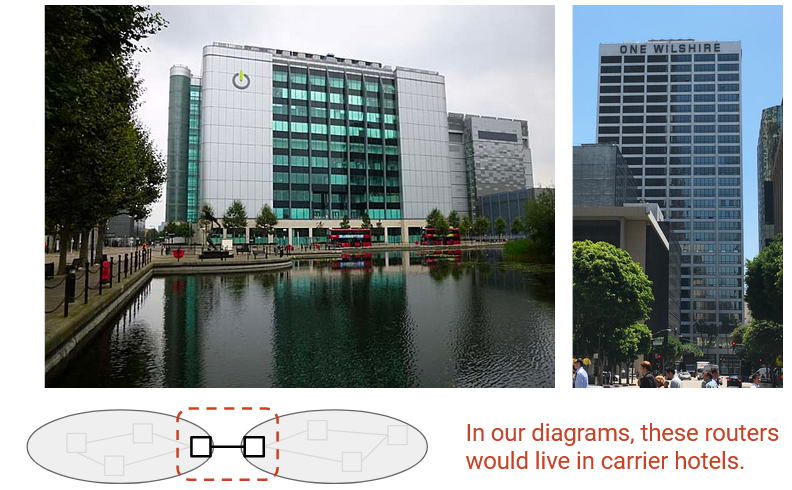

**Colocation facilities** 或 **carrier hotels** 是一些建筑，多个 ISP 会在这里安装 router，并彼此连接。这些建筑专门设计了供电和冷却基础设施，ISP 可以租用空间来安装 router，并把它们连接到同一栋楼里的其他 router。

在 carrier hotel 内部，router 会堆叠在机架中（约 6-7 英尺高，19 英寸宽）。

## Router 的尺寸和容量

router 有各种尺寸，取决于用户需求。家用 router 只需要为少数用户转发流量，forwarding table 中通常只有一个默认条目。工业级 router 可能需要为成千上万的客户转发流量，并维护巨大的 forwarding table。

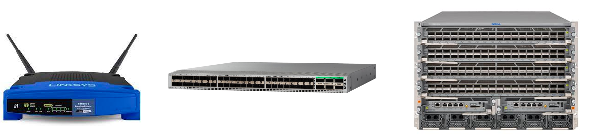

我们可以用不同方式衡量 router 的规模。例如，可以看它的物理尺寸、物理端口数量，以及带宽。

router 的容量可以用物理端口数量乘以每个物理端口的带宽来衡量。物理端口的速度或带宽通常称为它的 **line rate**。

并不是所有物理端口都必须有相同的 line rate。例如，一个现代家用 router 可能有 4 个能以 100 Mbps 发送的物理端口，以及 1 个能以 1 Gbps 发送的物理端口。这个 router 的总容量就是 1.4 Gbps。

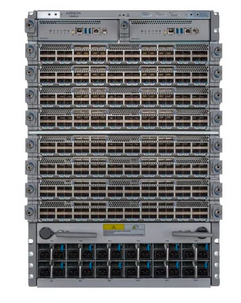

ISP 使用的现代顶级 router，每个物理端口的 line rate 最高可能达到 400 Gbps。

这种 router 包含多个可拆卸的 **line card**，每个 line card 上有一组物理端口。一个现代 router 可能有 8 块 line card，每块 line card 有 36 个物理端口，总共 288 个物理端口。

288 个物理端口，每个端口 400 Gbps 带宽，会让这个 router 的总容量达到 115.2 Tbps。

这种 router 的价格可能超过 100 万美元。把 router 拆分成多块 line card，可以在需要更多容量时安装更多 line card。

未来的下一代 router 会有 800 Gbps 的物理端口。router 的物理空间有限，所以现代改进主要集中在提高每个端口的速度，而不是增加端口数量。（在同样空间里塞入更多端口也很困难，因为供电和冷却都会受限制。）

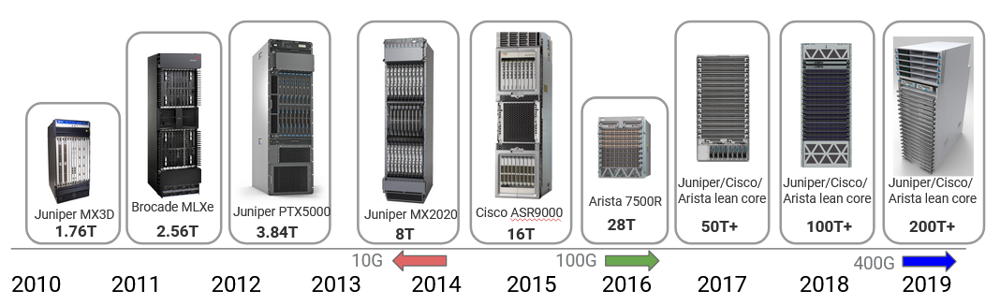

随着用户需求增长，router 容量多年来不断提高（例如视频质量从 720p 提高到 8K = 8000p）。2010 年，顶级 router 的容量是 1.7 Tbps，而过去十年里这个数字提高了约 100 倍。这些提升很大一部分来自 link speed 的提高：从 2010 年的 10 Gbps，到 2016 年左右的 100 Gbps，再到今天的 400 Gbps。由于摩尔定律放缓、以高速发送信号面临物理挑战等限制，这些改进正在变慢。下一步提升到 800 Gbps 只增加了 2 倍（相比早先的 10 倍和 4 倍提升）。

## Data Plane、Control Plane、Management Plane

router 的硬件和软件组件在概念上可以分成三个平面。**data plane** 主要负责转发 packet。每当 packet 到达并需要转发时，data plane 都会被使用。data plane 在本地运行，不需要和其他 router 协调。

**control plane** 主要负责与其他 router 通信，并运行 routing protocol。这些 routing protocol 的结果（例如 forwarding table）随后会被 data plane 使用。每当网络拓扑发生变化时（例如增加或移除 link），control plane 就会被使用。

由于 data plane 和 control plane 运行在不同时间尺度上，并且运行不同的 protocol，router 的硬件和软件会针对不同任务进行优化。实践中，packet 到达的频率远高于网络拓扑变化的频率。因此，data plane 被优化为非常快速地执行很简单的任务（查表和转发）。相比之下，control plane 被优化来执行更复杂的任务（重新计算网络中的路径）。

**management plane** 用来告诉 router 该做什么，以及查看 router 正在做什么。系统和人会通过 management plane 来配置和监控 router。运营者可以在这里配置设备功能。每条 link 应该分配什么 cost？应该运行什么 routing protocol？这些都需要运营者手动决定。

除了配置之外，management plane 还提供监控工具。每条 link 正在承载多少流量？router 的某个物理组件是否已经故障？这些信息可以反馈给运营者。

management plane 是运营者从设备外部访问和操作 router 的主要位置。如果运营者使用某段代码来与 router 交互，我们通常也把这部分视为 management plane。

data plane 和 control plane 实时运行，分别以纳秒级（data）和秒级（control）的量级接收和处理 packet。相比之下，management plane 工作在几十到几百秒的量级。如果运营者修改了配置，router 可能需要花时间执行校验并处理配置，然后才会完全应用更新。

**network management system (NMS)** 是运营者用来与 router 交互的软件。这个软件会计算网络配置（可能借助手动输入），然后把配置应用到 router 上。router 会发布某种 API，供这个系统与 router 通信。

network management system 也允许从 router 中读取 telemetry（统计数据和运行状态）。

network management system 的复杂度取决于运营者想实现什么。

运行一个 router 需要这三个平面。如果只有 data plane 而没有 control plane，我们可以转发 packet，但不知道应该把它们转发到哪里。

## Router 内部有什么？

我们把 router 定义为执行 routing 任务的计算机，但现实中，router 内部有许多更小的计算机（例如 CPU、专用芯片）协同工作来完成 routing 任务。

构成工业级 router 的物理机箱称为 **chassis**。在 chassis 内部，我们会安装许多 **line card**，每块 line card 上有多个物理端口。每个物理端口都可以用作输入或输出。

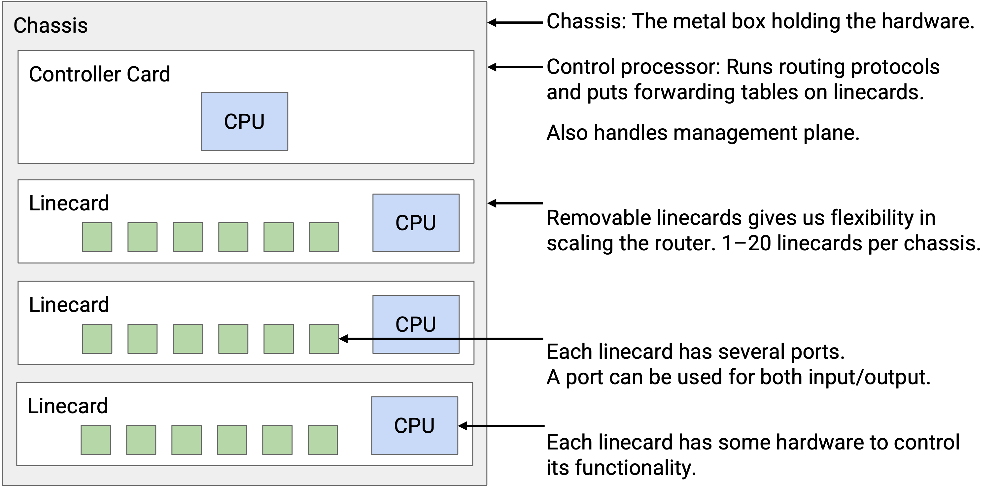

router 中的每个物理端口都必须能连接到其他所有物理端口（包括同一块 line card 上的端口，以及其他 line card 上的端口）。你可能从一个端口收到 packet，但需要从另一块 line card 上的端口转发出去。

把每个端口都物理连线到其他每个端口会非常低效。相反，我们使用一组互连线路，也就是 fabric，把 line card 连接在一起。每块 line card 上也有芯片来辅助连接到 fabric。

除了所有 line card 之外，router 还有一块 controller card，它有自己的 CPU，会和其他 router 通信以执行 routing protocol。在运行某种算法计算路径之后，controller 会把正确的 forwarding table 条目写入 forwarding chip。

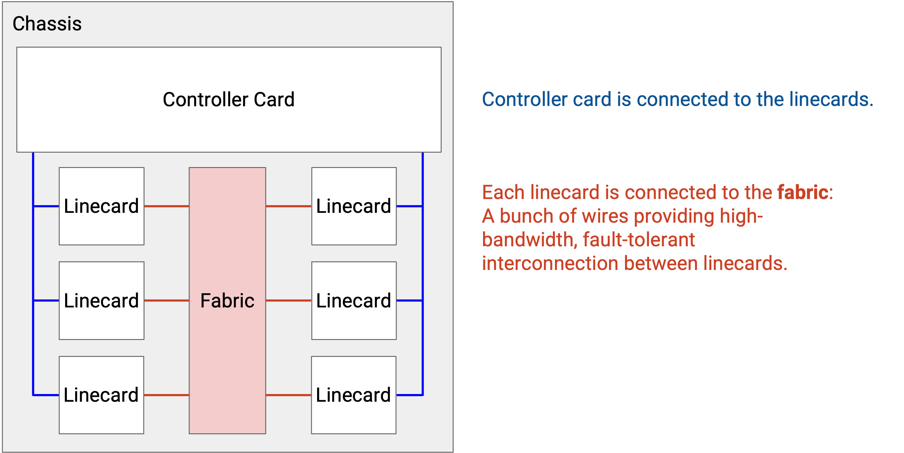

每块 line card 都有自己的本地 CPU，用来控制 line card 功能（例如填充 forwarding table）。line card 也有用于 packet 基本处理的硬件（例如在发送前更新 TTL）。line card 包含一个或多个专门为 forwarding 优化的芯片。

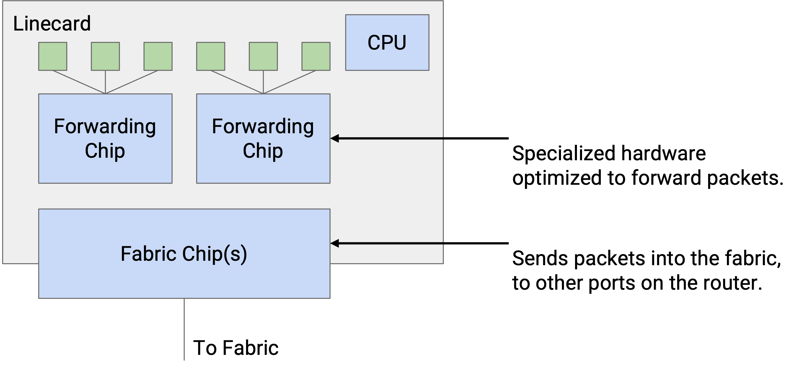

我们也可以按不同平面对 router 组件分类。data plane 由 line card 上的 forwarding chip、连接 line card 的 fabric，以及把 line card 接入 fabric 的 fabric chip 支撑。control plane 和 management plane 由 controller card 支撑。

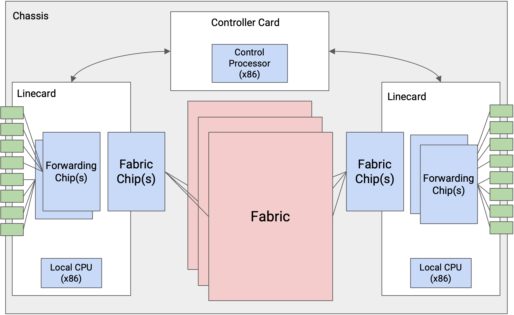

下面是一张工业级 router 的照片。这个 router 有 6 个槽位，其中 4 个装了 line card，另外 2 个装了 controller card。它还有用于冷却的风扇托盘。连接 line card 的 fabric 在背面（图中没有显示）。

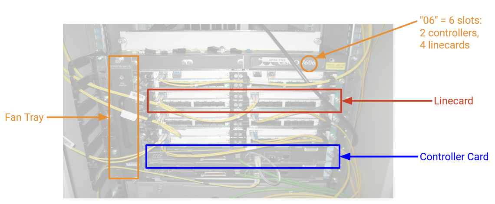

## Packet 的类型

最常见的 packet 是 **user packet**，其中包含来自 end host 的数据。当 router 收到这种 packet 时，forwarding chip 首先读取 header 中的 destination 字段，并查找合适的端口。如果这个端口在另一块 line card 上，packet 会通过 fabric 发送到对应的 line card。一旦 packet 到达正确的 line card，它就会沿着合适的端口发送出去。

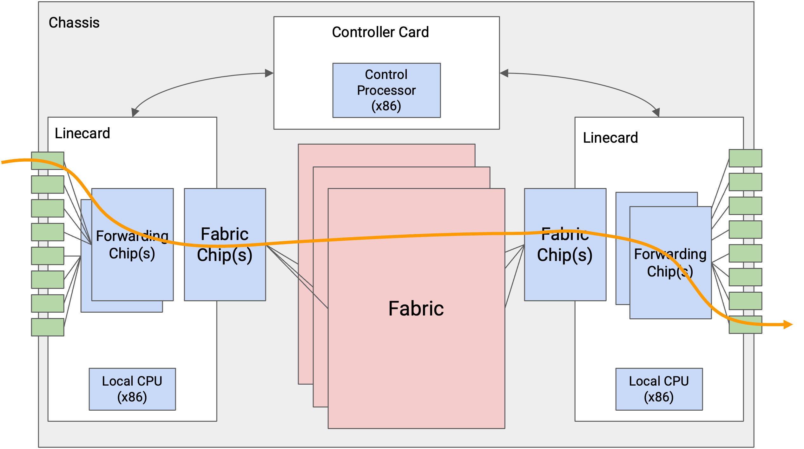

有些 packet 是 **control-plane traffic**，它们的目的地是 router 本身。特别是，当我们运行 routing protocol 时，advertisement 会发送给 router 本身。当 router 收到这种 packet 时，forwarding chip 会把 packet 送到 controller card。controller card 上的 CPU 会相应地处理 packet。

最后一种 traffic 是 **punt traffic**。这些是 user packet，但需要额外的特殊处理。例如，如果我们收到一个 TTL 为 1 的 packet，这个 packet 已经过期，我们不应该继续转发它。我们可能还需要向发送方返回错误消息。当 router 收到 punt packet 时，forwarding chip 会把这个 packet “punt” 给 controller card 做特殊处理。

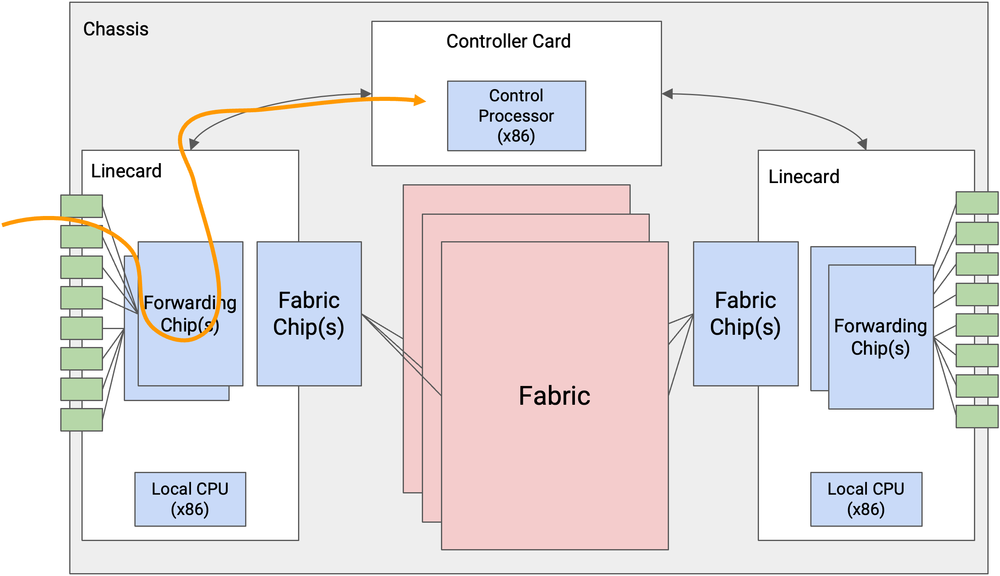

## Router 如何扩展？

为什么我们的 router 要拆成 forwarding chip 和 controller card 这种特定架构？我们不能把所有事情都放在通用 CPU 上运行吗？

问题在于，顶级 router 需要在极大的规模下运行。在现代 400 Gbps 的速度下，假设 packet 大小为 64 字节，每个端口每秒必须处理 7.81 亿个 packet。跨 36 个端口，整个 router 每秒必须处理 560 亿个 packet。（实践中，如果有些 packet 更大，数字可能略低。）

这个规模无法用通用 CPU 上的软件实现。为了感受一下这个规模，如果我们写一个转发 packet 的程序，并把它跑在 CPU 上，能做到每 10 微秒 = 0.00001 秒转发一个 packet 就已经很厉害了。顶级 router 需要大约每 10 纳秒 = 0.00000001 秒处理一个 packet。即使是最优化的软件也无法在这个规模上处理 packet。因此，我们需要直接在硬件中实现 router 功能。

通过把 router 拆分成专门的 data plane line card 和 control plane controller card，我们创建了 fast path 和 slow path。fast path 只涉及 forwarding 硬件，并被优化为以极高速率转发 packet。带有 control CPU 的 slow path 只在必要时使用，大多数 packet 都走 fast path。这些专用组件让 router 高效得多（耗电更少、更便宜、占用物理空间更小）。

## Line Card 的功能

line card 收到 packet 时具体需要做哪些任务？

首先，line card 需要接收信号（例如光信号、电信号），并把这个信号解码成构成 packet 的 1 和 0。这是 line card 的 **PHY** 部分，处理物理层（Layer 1）功能。

得到一串 1 和 0 之后，我们必须读取这些 bit 并解析它们（例如找出哪些 bit 对应 IP header）。我们可能还需要执行其他 link-layer 操作（例如当一条 link 连接超过 2 台机器时）。line card 的 **MAC** 部分处理 link layer 功能（Layer 2）。

现在我们有了一个 IP packet，就必须解析它。例如，我们需要检查这个 packet 是 IPv4 还是 IPv6。然后，我们必须读取目的地址并执行 forwarding 查找（或者发现需要 punt 这个 packet）。

我们可能还需要更新各种 IP header 字段。我们必须减少 TTL。由于我们更新了 header，也需要更新 header 中的 checksum。我们可能还需要更新 options 和 fragment 等其他字段（会在 IP header 一节中更详细讨论）。

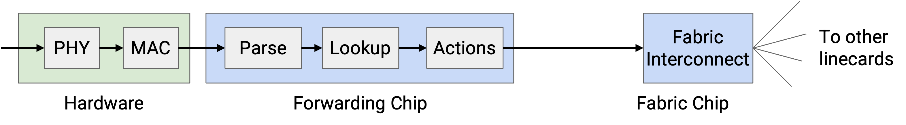

所有这些功能都必须在纳秒量级内完成。即使我们以某种方式把所有处理都放在一个时钟周期中完成，line card 仍然必须以 0.2 GHz 运行。实践中，这些操作都会超过一个时钟周期。此外，我们必须为 line card 上的每个端口都做这些处理（一个 forwarding chip 支撑所有端口）。

为了让这些操作足够快，forwarding chip 会被极度专门化，只执行有限任务（例如读取 packet header、查表）。你不能写一个通用程序然后跑在 forwarding chip 上。如果某个 packet 需要 forwarding chip 不支持的功能，我们总是可以把它 punt 到 controller card 上的通用 CPU。

像递减 TTL 这样的简单操作很容易用硬件实现。像特殊 options 这样的复杂操作通常需要 punt 到 controller card。在现代 Internet 中，我们会尽量避免特殊 options，以最大化 fast path 的使用并避免 punt（如果所有东西都 punt，controller card 会被压垮）。

fabric interconnect chip 也同样高度专门化。这些芯片帮助 packet 通过 fabric 发送到其他 line card。它们往往是整个 router 中最专用、性能最高的芯片。

## Packet 排队

TODO

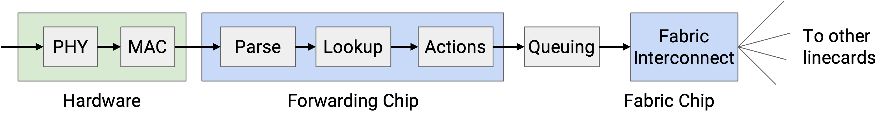

## 高效查找 Forwarding Table

我们现在知道，router 必须以极高的速率在 forwarding table 中执行查找。一个主要挑战是，我们的表项除了单个 IP 地址外，还可能包含 IP 地址范围（192.0.1.0/24）。而且，这些范围可能重叠（一个 destination 可能匹配多个范围）。我们怎样才能让查找非常快？

理想情况下，为了获得最高速度，forwarding table 可以为每个 destination 包含一个条目，没有任何范围。这样，我们只需要取出 packet 中的 destination，并查找精确匹配来得知 next hop。

为了实现这种理想做法，我们可以把每个范围展开成其中的单个 IP 地址。例如，24-bit prefix 192.0.1.0/24 的一个条目会被展开成 256 个条目。

这会浪费空间（记住，这是在硬件中实现的）。此外，如果某条 route 变化，我们还必须更新表中的大量条目。展开 route 行不通，所以我们必须直接处理范围。

回忆一下，forwarding table lookup 使用 longest prefix matching。如果多个范围匹配 destination，我们选择最具体的范围（固定的 prefix bit 最多）。如果没有任何范围匹配，我们选择 default route（*.*，0.0.0.0/32，匹配所有 destination）。如果没有 default route，就丢弃 packet。

我们如何在硬件中高效实现 longest prefix matching？

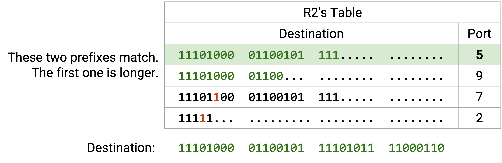

TODO rewrite this to match the diagram

首先，为了可读性，我们把所有范围和 destination 都改写成二进制。然后，我们逐 bit 扫描 destination。前 21 个 bit 中，四个范围都匹配，所以四个范围仍然保留。接着，第 22 个 bit 是 1。第一行在第 22 个 bit 上是 0，所以可以消除这一行（不匹配）。另外三行在前 22 个 bit 上仍然匹配，因此继续保留。

接下来，我们检查第 23 个 bit，它也是 1。第二行和第三行在第 23 个 bit 上是 0，所以消除它们（不匹配）。第四行仍然匹配。

此时，我们可以确认第四行是完整匹配，因为它是一个 23-bit prefix，并且全部 23 个 bit 都匹配。这个行不需要进一步检查。

我们继续逐 bit 检查，消除不匹配的行，并确认已经完整匹配的行。最终，我们会有一行或多行匹配，然后选择最长 prefix 的匹配项。

如果朴素实现，那么对每个 bit，我们都必须把这个 bit 与 forwarding table 中每个条目匹配。渐进运行时间会随着 forwarding table 中条目数量增长。我们能做得更好吗？

## 用 Trie 高效查找

回想数据结构课（例如 UC Berkeley 的 CS 61B），你可能记得 trie 是一种能高效存储 map 的数据结构，其中 key 是字符串（这里是 bit string）。trie 通过一次写出 key 的一个字符（bit）来存储 key-value pair，这让 longest prefix matching 可以高效完成。

例如，这个 trie 存储了从单词到数字的 map。如果你不记得 trie，也没关系。

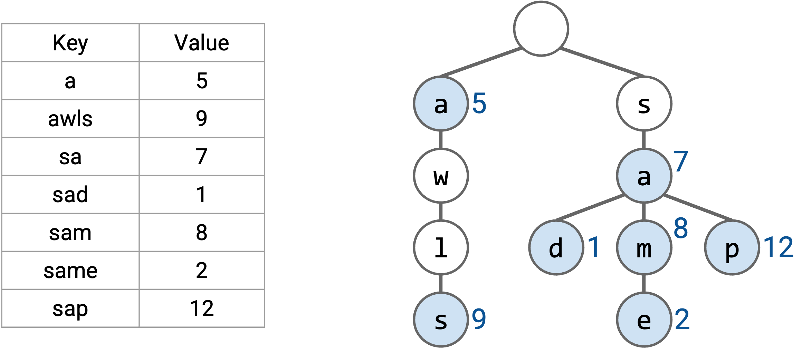

如果我们想找最长 prefix，就像之前一样，一次读取单词的一个字母。这让我们可以沿着树从根节点走到叶子节点。在这条路径上，我们寻找表中的所有 prefix（有颜色的节点），并选择最长的 prefix。

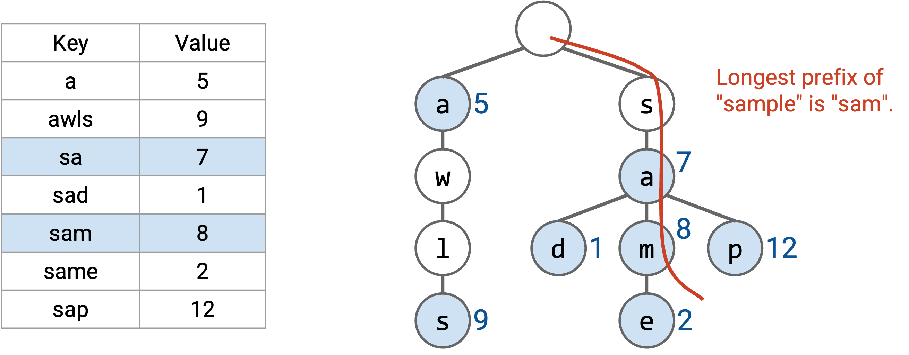

我们可以对 forwarding table 使用类似方法。trie 的每一层表示 IP 地址中的一个数字。第 0 层是根节点（空字符串），第 1 层表示第一个 bit，第 2 层表示第二个 bit，依此类推。

trie 中的每个节点都表示一个 prefix。例如，2-bit prefix 11* 位于树的第二层，3-bit prefix 100 位于树的第三层。这个 trie 包含所有可能的 3-bit prefix。如果某个 prefix 在 forwarding table 中，我们就在对应节点写入 next hop。如果这个 prefix 不在 forwarding table 中，我们就不在节点中写任何内容（图中显示为白色）。

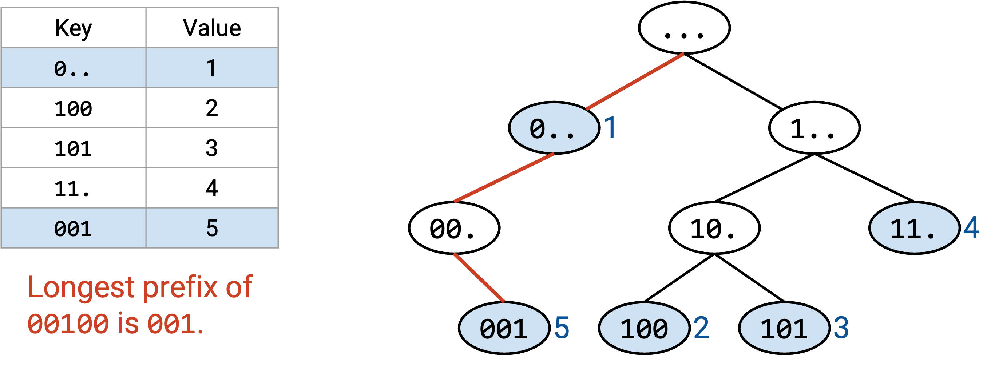

沿树追踪路径可以在常数时间内完成。我们对 destination address 的每个 bit 访问一个节点，而 destination address 总是 32 bit（常数）。即使 forwarding table 有上百万个条目，我们仍然只会挑出 32 个节点。

如果没有重叠范围，每个有效 prefix 都对应一个叶子节点。如果范围重叠，非叶子节点也可能是有效 prefix。

和之前一样，我们使用 destination address 沿树追踪路径。如果路径走出这棵树，我们就提前停止，并在已经访问过的节点中选择最长 prefix。

作为一个小优化，在沿树向下走时，我们可以记录到目前为止见过的 longest prefix match。它总是最近一次匹配，因为 prefix 会随着我们向下移动而变长。如果路径走出树，我们就使用 longest prefix match（最近找到的匹配）。

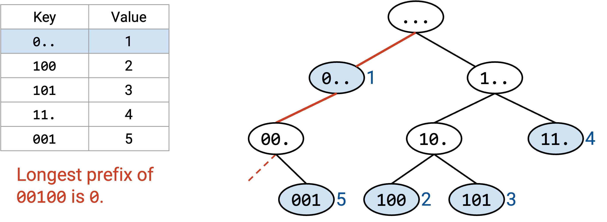

注意，default route 会存储在根节点中（0 长度 prefix）。沿树向下走的算法确保只有在没有其他 prefix 匹配时，我们才会使用 default route。

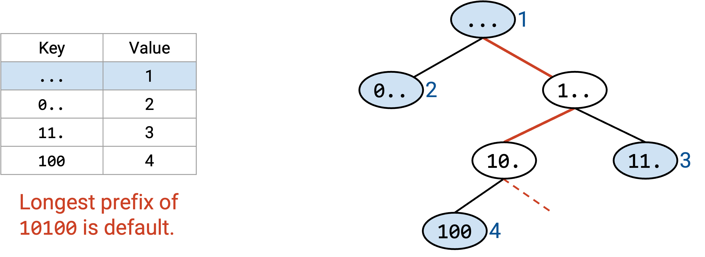

所有 router 都有某种形式的 longest prefix matching 功能，但有些使用的方案比其他方案更高级。例如，我们可以根据真实 Internet 的假设加入启发式方法和优化。有些 destination 可能更热门，因此我们可能希望更高效地查找它们。有些端口可能用于更多范围。现代 Internet 对 prefix 大小有一些约定（例如，到其他网络的 route 中，IPv4 最长 prefix 通常是 24 bit）。我们也可以针对更新 forwarding table 做优化。
