---
title: Routing States
parent: Routing
nav_order: 3
layout: page-with-toc
---

# Routing State

## 不好的 Routing 策略

到目前为止，我们已经把 routing 问题定义为：当 router 收到一个 packet 时，router 如何知道应该把 packet 转发到哪里，才能让它最终到达最终目的地？

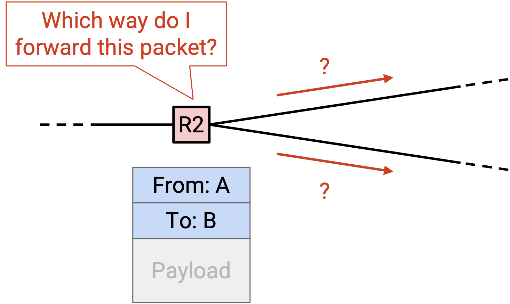

一旦我们找到一个 algorithm（也就是 routing protocol）来解决这个问题，就可以应用这个 algorithm 生成一个答案，我们称之为 **routing state（路由状态）**。你可以把 routing state 理解为每个 router 用来转发所收到 packet 的一组规则。Routing state 长什么样？我们又如何检查某个 routing state 是否 valid（有效），以及是否足够好？

首先，我们可以考虑一些生成 routing state 的糟糕策略。一种可能的 routing 策略是：router 把 packet 转发给随机选择的 neighbor。直观上，我们已经能看出，用这种方式生成的 routing state 很可能不是 valid 的。如果使用这种策略，我们无法确定 packet 一定会到达最终目的地。

另一种可能的糟糕策略是：router 把 packet 的副本转发给自己的每一个 neighbor。直观上，这也许是 valid 的，因为 packet 的副本最终会扩散到整个 network，并且很可能到达目的地。然而，这种策略效率很低，因为它浪费了大量 bandwidth，把 packet 转发给了并不需要参与到达最终目的地的 router。

我们可以凭直觉看出这两种策略都不好，但要分析更聪明的 routing protocol，就需要形式化地定义 routing state 的样子。然后，我们还需要形式化地定义什么让 routing state valid，以及什么让 routing state 更好。

## Forwarding Table

在我们的 network 模型中，每个 router 都有若干 outgoing link，把它连接到相邻的 router 和 host。换句话说，在底层 graph 中，每个 router node 都有若干 neighbor，它们通过 edge 连接到这个 router。

当 router 收到一个 packet，且 packet 的 metadata 中包含最终目的地时，router 需要决定应该把 packet 转发给哪个相邻的 router 或 host。Packet 接下来会被转发到的下一个 intermediate router 称为 **next hop（下一跳）**。

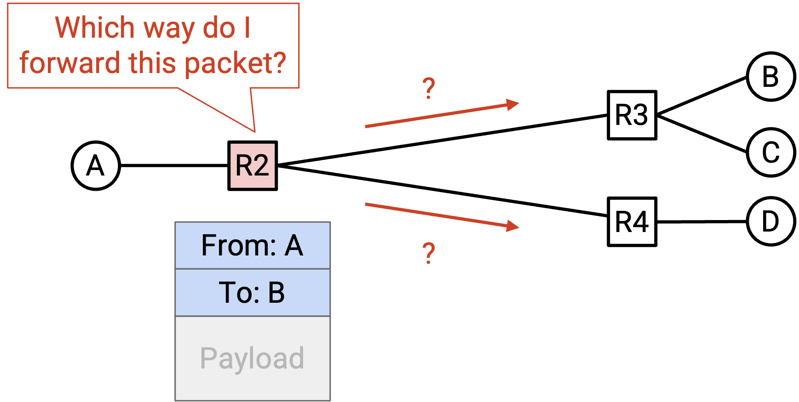

例如，考虑这个 network。如果 R2 收到一个最终目的地为 B 的 packet，那么自然对应的 next hop 是 R3。Next hop 的可能选择包括 R1、R3 和 R4（这三个 router 都与 R2 相邻），而 R3 是能让 packet 更接近 B 的 next hop。

如果 R2 收到的 packet 最终目的地是 A，那么自然对应的 next hop 则是 R1。

对于每个可能的最终目的地，我们都可以写下相应的 next hop，用来把 packet 转发得更接近该目的地。得到的结果称为 **forwarding table（转发表）**。

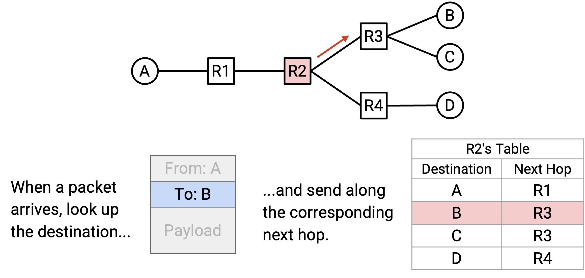

注意，在从 destination 到 next hop 的 mapping（映射）中，同一个 next hop 可以被使用多次。例如，在 R2 的 forwarding table 中，发往 B 的 packet 和发往 C 的 packet 都会被转发给 R3。

通过写下每个 intermediate router 的 forwarding table，我们就得到了 network 的完整 routing state。换句话说，给定一个带有某个最终目的地的 packet，我们就准确知道每个 router 会如何转发这个 packet。

在物理世界中，router 往往不是把 destination 映射到 next hop，而是把 destination 映射到 **physical port（物理端口）**，其中每个 physical port 对应一条 link。在 graph 模型中，这就相当于把每个 destination 映射到一条 edge，而不是映射到一个 neighboring node。在物理世界里，你可以把它理解为一个 router 有若干 outgoing wire，每根 wire 都连接到另一个 router。Router 不是在 forwarding table 中写下 neighboring router，而是写下 packet 应该沿着哪根 wire 发送。

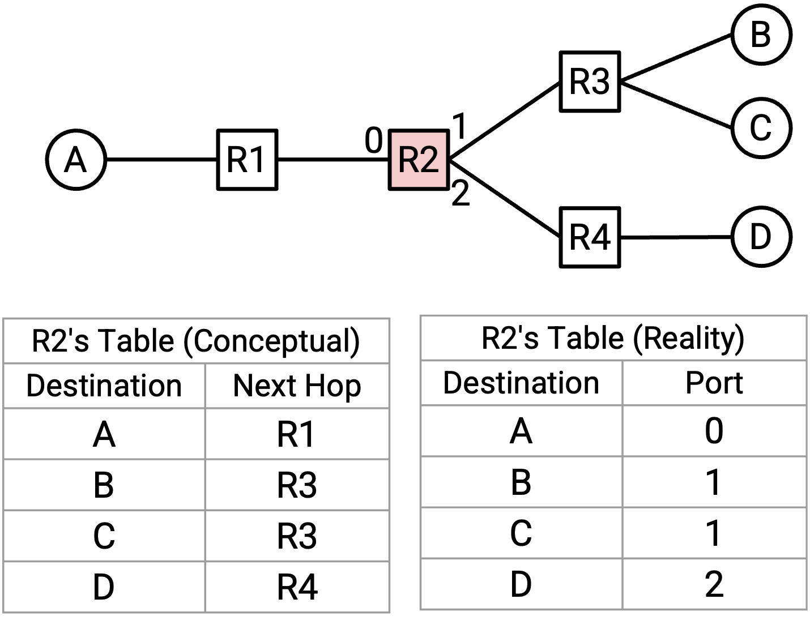

这是一个细微差别，它反映了这样一个事实：router 并不真的关心 neighboring router 的身份。Router 唯一需要做的决定，是把 packet 沿着某根 wire 发出去，不管这根 wire 连接到谁。为了简化，在这些讲义中，我们会把 forwarding table 画成 destination 到 next hop 的映射，而不是 destination 到 physical port 的映射。

## Destination-Based Forwarding

使用 forwarding table 的一个结果是：给定一个 packet，应该把它转发到哪里，只取决于这个 packet 的 destination 字段。换句话说，如果一个 router 收到许多不同的 packet，但它们都有相同的 destination，那么这些 packet 都会被 route 到同一个 next hop（假设 forwarding table 保持不变）。由于每个 destination 只映射到一个 next hop，两个具有相同 destination 的 packet 不可能被转发给不同的 router。这种方法称为 **destination-based forwarding（基于目的地的转发）** 或 **destination-based routing（基于目的地的路由）**。

Destination-based routing 是最常见的 routing 方法，也是现代 Internet 使用的方法。理论上，也可以存在使用额外 metadata 来做 forwarding decision 的其他方法，但它们通常只用于有限的应用场景（例如某个特定 local network 内部）。

在后续单元讨论 data center topology 时，我们可能会考虑某个特定 destination 有多个 next hop 的 destination-based forwarding 方法。在本单元中，我们会假设每个 destination 只映射到一个 next hop。

## Routing 与 Forwarding

现在我们已经引入了 forwarding table 的概念，需要区分创建 forwarding table 的过程和使用 forwarding table 的过程。

**Routing（路由）** 是 router 彼此通信、决定如何填充各自 forwarding table 的过程。

**Forwarding（转发）** 是接收 packet、在表中查找合适的 next hop，并把 packet 发送给合适 neighbor 的过程。

Forwarding 不等同于 routing。Router 在 forwarding packet 时，会使用已有的 forwarding table，并不需要知道这张表是如何生成的。

Forwarding 是一个 local process（局部过程）。当 router 在 forwarding packet 时，它不需要知道完整的 network topology。Router 也不关心 packet 被转发到 next hop 之后会去哪里。Router 只需要知道到达的 packet，以及自己的 forwarding table。

相比之下，routing 是一个 global process（全局过程）。为了填充 forwarding table，我们需要了解 network 的 global topology 中的一些信息。

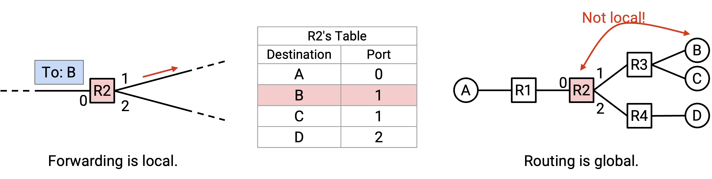

例如，在填写 R2 的 forwarding table 时，我们必须以某种方式知道 destination B 与 R3 相关联，即使 host B 并没有直接连接到 R2。在 routing 过程中，每个 router 也需要知道 non-local destination（非局部目的地）的信息。

## Routing State Validity 是全局的

回顾一下，routing state 由每个 router 的 forwarding table 组成，这些表合在一起告诉我们 packet 将如何穿过 network。给定一个 routing state，我们如何判断这个 routing state 是正确还是错误？

首先，我们需要形式化地定义 **routing state validity（路由状态有效性）**，用来判断一个 routing state 是否 valid（不过这个术语在 UC Berkeley 的 CS 168 之外未必广泛使用）。Validity 的主要要求是：routing state 需要产生 forwarding decision，确保 packet 确实能到达目的地。

注意，validity 必须在 global context（全局上下文）中评估，而不是在 local context（局部上下文）中评估。只看 local routing state，例如单个 router 的 forwarding table，无法告诉我们一个 routing state 是否 valid。例如，在 router R2 的 local forwarding table 中，我们可能看到 destination A 的 next hop 是 router R3，但我们无法据此判断这是否 valid。把 packet 转发给 R3 是否有助于 packet 到达 destination A？仅凭 forwarding table 是看不出来的。

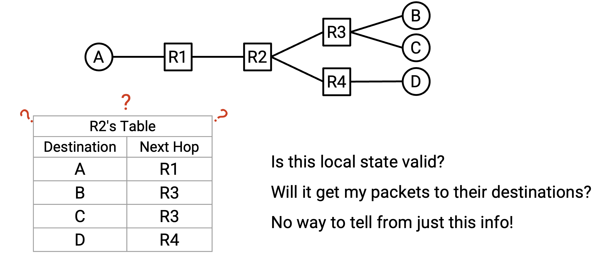

相反，我们需要考虑 global routing state，也就是所有 router 中所有 forwarding table 的集合。

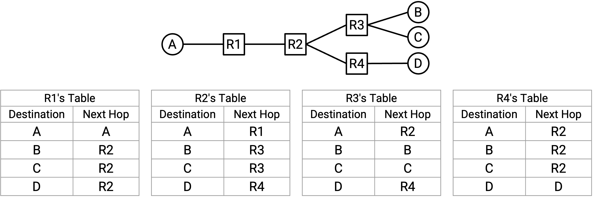

## Routing State Validity 的定义

现在，我们可以定义一个形式化条件，用来检查在给定 routing state 下 packet 是否会到达目的地。

一个 global routing state 是 valid 的，当且仅当对于任意 destination，packet 都不会卡在 dead end（死端）或 loop（环路）中。

如果 packet 到达某个 router，但这个 router 不知道如何把 packet 转发到其 destination，因此 packet 不再被转发，就发生了 **dead end（死端）**。如果 router 的 forwarding table 中没有包含 packet destination 对应的 entry，就可能发生这种情况。

注意，dead end 条件只适用于 intermediate router，而不适用于 end host。当 packet 到达作为 destination 的 end host 时，end host 不需要再继续转发 packet，因此我们不会在 dead end 条件中考虑 end host。

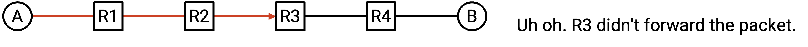

如果 packet 沿着同一组 node 形成的 cycle（环）不断发送，就发生了 **loop（环路）**。注意，因为我们使用的是 destination-based forwarding，其中 next hop 只取决于 destination，所以一旦 packet 进入 loop，就会永远困在 loop 中。无论 packet 第一次、第 10 次还是第 500 次到达某个 router，它都会以完全相同的方式被转发（因为最终 destination 相同）。由于 loop 上的每个 router 都如此，packet 会永远困在 loop 中。

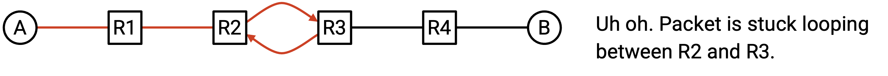

这个条件（没有 dead end、没有 loop）对于一条 route 是 valid 的来说既是必要条件，也是充分条件。我们来检查这个逻辑蕴含的两个方向。

没有 dead end 且没有 loop 是 validity 的必要条件。换句话说，一个 state 只有在没有 dead end 和 loop 时才是 valid 的。

证明：如果存在 dead end，packet 就不会到达 destination。Packet 会到达 dead end，然后不再被转发。

如果存在 loop，packet 也不会到达 destination。Packet 会永远困在 loop 中（原因是前面描述的 destination-based forwarding）。另外，注意最终 destination 不可能是 loop 的一部分，因为 destination 不会转发 packet。因此，困在 loop 中的 packet 不会到达 destination。

现在，我们检查另一个方向。如果没有 loop 且没有 dead end，那么这个 state 是 valid 的。

证明：假设 routing state 中没有 loop 或 dead end。Packet 不会第二次到达同一个 node（因为没有 loop）。同时，packet 不会在到达 destination 之前停止（因为没有 dead end）。因此，packet 必须持续在 network 中前进，并到达不同的 node。Network 中可访问的 unique node（唯一节点）数量是有限的，所以 packet 最终必然到达 destination。因此，routing state 必然是 valid 的。

## Directed Delivery Tree

现在我们已经有了 routing state validity 的形式化定义，可以问：给定一个 global routing state，我们如何检查它是否 valid？

为了简化问题，我们先只考虑单个 destination end host，忽略所有其他 end host。在每个 router 中，我们可以查找这个 destination，得到对应的 next hop，这会告诉我们每个 router 将如何转发发往这个 destination 的 packet。

我们可以把每个 router（针对这个单一 destination）的 next hop 表示为箭头，箭头展示了这个 packet 可能经过的所有路径，最终到达这个单一 destination。

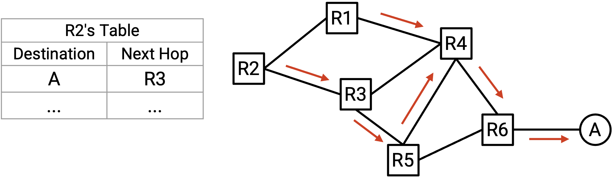

在得到的 graph 中，每个 node 都只有一条 outgoing arrow（出箭头）。这反映了我们的假设：在每个 router 的 forwarding table 中，一个 destination 只对应一个 next hop。

注意，在得到的 graph 中，两条路径一旦汇合，就不会再分开。换句话说，即使有多个 incoming arrow（入箭头，也就是多条路径）到达某个 node，由于只有一条 outgoing arrow，这些路径之后会汇聚成一条单一路径。这反映了我们的 destination-based forwarding 方法，因为每个 router 只使用最终 destination 来决定如何转发 packet。Router 并不关心 packet 一开始是如何到达这个 router 的。

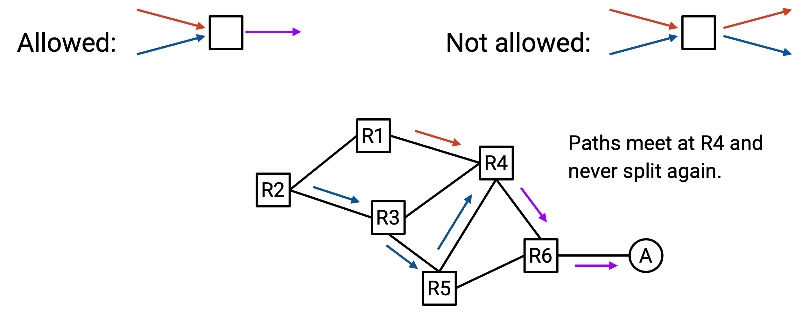

我们画出的这些箭头形成了一组 packet 可以用来到达单一 destination 的路径。这组路径称为 **directed delivery tree（有向递送树）**。

用 graph 的术语说，一个 valid delivery tree 中的箭头必须形成一个以 destination 为 root（根）的 **oriented spanning tree（有向生成树）**。回顾一下，spanning tree 是 graph 中一组接触每个 node 并形成 tree（树）的 edge。我们希望 delivery tree 是一棵 tree，因为不应该有 cycle（packet 不能在 loop 中前进）。我们希望 delivery tree 是 spanning 的（接触每个 node），因为我们希望从任何地方都能到达 destination。Delivery tree 是 oriented 的，因为 edge 带有箭头，告诉我们应该沿哪个方向转发 packet。

Valid delivery tree 中的所有 edge 都应该指向 destination。换句话说，从任意 node 出发，沿着箭头走，都应该最终到达 destination。

## 验证 Routing State Validity

和前面一样，我们先只考虑单个 destination end host，忽略所有其他 end host。

例子：虽然这里有多个 end host，但我们只考虑 end host A。

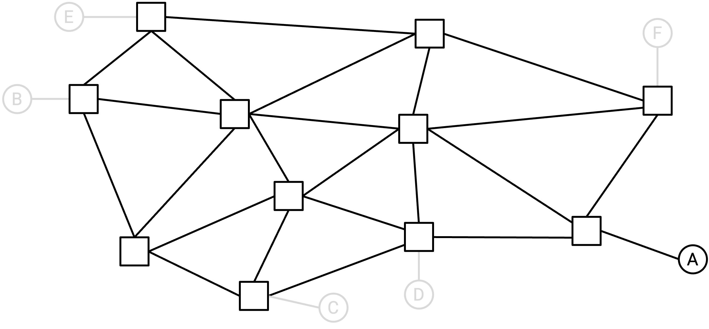

利用每个 router 的 forwarding table，我们会在 network 中画出箭头，形成针对这个单一 destination 的 directed delivery tree。形式上，对于每个 router（graph 中的 node），我们会从该 node 画出一条 outgoing arrow。

例子：利用 forwarding table（图中未展示），我们可以为每个 router 画出一条 outgoing arrow。

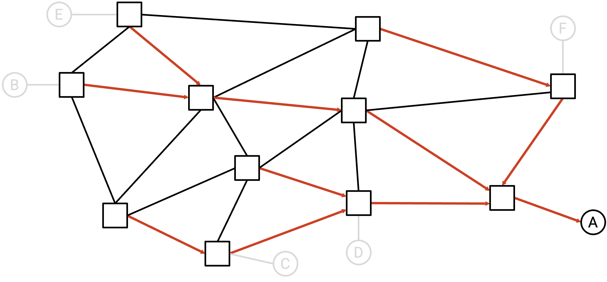

为了简化，此时我们可以删除所有没有箭头的 link。这些没有箭头的 link 永远不会被用于向这个单一 destination 发送 packet，因为它们不在 delivery tree 上。

例子：我们可以删除所有没有箭头的 link。

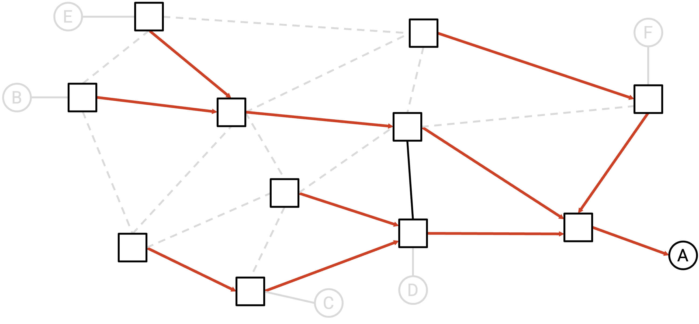

如果剩下的 graph 是一个 valid directed delivery tree（spanning tree，且所有箭头都指向 destination），那么我们可以说 routing state 对这个单一 destination 是 valid 的。

在上面的例子中，残余 graph 确实是一棵在 A 处汇聚的 valid spanning tree，因此我们可以说这个 routing state 对 A 是 valid 的。

下面是一些 invalid routing state 的例子：

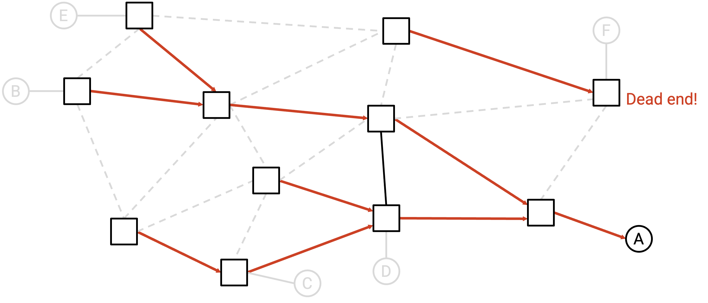

这个 state 是 invalid 的。直观上，这里有一个 dead end router。发往 A 的 packet 可能被发送到这个 router，而这个 router 会丢弃 packet，不再转发。形式上，剩余 graph 不是 spanning tree，因为 edge 并没有全部连通（存在两个 disconnected component，这在 tree 中是不允许的）。

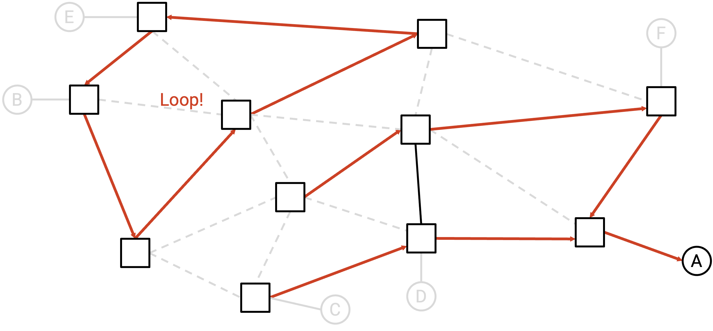

这个 state 也是 invalid 的。直观上，这里有一个 packet 可能困住的 loop。形式上，剩余 graph 不是 spanning tree，因为 edge 是 disconnected 的，并且存在 cycle。

我们可以对每个不同的 end host 重复这个过程（每次隔离出一个不同的 end host）。如果 routing state 对所有 destination 都是 valid 的，那么我们就可以说这个 routing state 是 valid 的，并且总能把 packet 送到正确的 destination。

## Least-Cost Routing

现在我们已经定义了什么让 routing state valid（route 没有 loop 和 dead end），还可以进一步定义什么让 routing state 更好。一个 network 可能有多个 valid routing state，我们希望有某种 metric（度量）来帮助判断一条 route 是否优于另一条。

**Least-cost routing（最低成本路由）** 是衡量 route 好坏的一种常见方法。在 least-cost routing 中，我们为每条 link 分配一个 numeric cost（数值成本），然后寻找让 cost 最小的 route。换句话说，我们希望 route 能让 packet 沿着最低成本路径到达 destination。

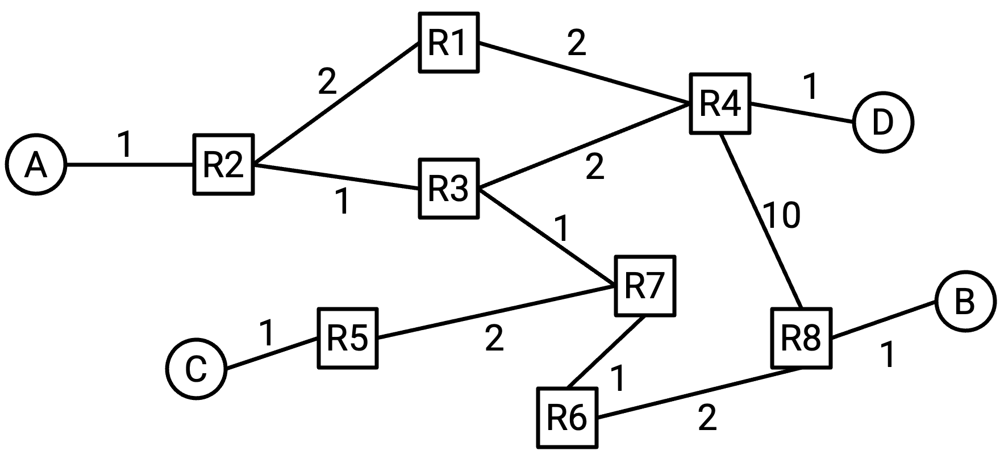

可以考虑分配给 link 的 cost 有很多种。Cost 可以取决于建设 link 的价格、propagation delay（传播延迟）、link 的物理距离、unreliability（不可靠性）、bandwidth 等因素。例如，我们可以根据 link 的质量（bandwidth 和 propagation delay）分配 cost，使最低成本路径偏向质量更高的 link。

允许运营者任意设置 link cost，可以让运营者根据自己的具体需求优化 network。我们分配的 cost 取决于运营者对 network 的目标。如果有一条 400 Gbps、20 ms propagation delay 的 link，以及一条 10 Gbps、5 ms propagation delay 的 link，哪一条 cost 更低？这取决于我们是在优化 bandwidth、propagation delay、某种组合，还是完全不同的其他目标。

如果我们把每条 link 的 cost 都设为 1，那么 least-cost path 就是经过 link 数量最少的路径。我们有时称其为最小化 **hop count（跳数）**。在这些讲义中，如果 graph 的 edge 没有标注 cost，你可以假设所有 edge 的 cost 都是 1。

网络运营者可以决定如何为每条 link 分配 cost。运营者可能手动分配 cost。或者，运营者可以让 network 自动配置 cost，不过对于某些无法自动测量的 metric，这可能不可行（例如 network 并不知道建设 link 的财务成本）。

在设计 routing protocol 时，我们可以抽象掉 cost 是如何分配的。从 routing protocol 的视角看，其他人（例如网络运营者）已经基于他们认为重要的因素分配好了 cost。Algorithm 将 cost 作为输入，并计算 least-cost path，而不关心这些 cost 实际代表什么。

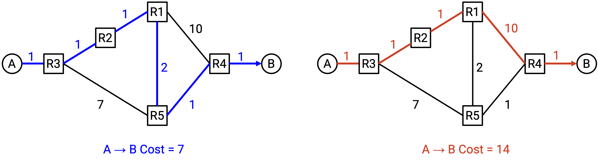

注意，cost 对每个 router 来说是 local 的。Router 知道自己 outgoing link 的 cost，但它无法自动知道所有 link 的 cost。这与我们前面提到的约束一致：router 没有整个 network topology 的全局视图。

为了简化，routing protocol 对 cost 的定义做了一些假设。

我们假设 cost 总是 positive integer（正整数）。这与许多现实中的常见 metric 一致，例如 link 长度或 link 的货币成本。如果我们试图最小化 packet 经过的总物理距离，那么 negative link cost（负链路成本）没有意义。你不能沿着一条 link 前进并减少已经走过的总距离。这个假设会在后面简化我们的 protocol，因为我们不必担心 negative-weight loop（负权重环）之类的 edge case，其中最低成本解会是永远绕着 loop 走。

我们假设 cost 是 symmetric（对称）的。从 A 到 B 的 cost 与从 B 到 A 的 cost 相同。这反映了我们会画出的 diagram：一条 edge 标注一个对称 cost。理论上，可以有 asymmetric link cost（非对称链路成本），但实践中通常不这样做，而且会导致更复杂的 routing protocol。

在这些假设下，我们对「较好的 route」的定义（least-cost）与 valid route 的定义是一致的。特别是，least-cost route 不会包含任何 loop，因为 cost 是正的（经过 loop 只会增加 cost）。

## Static Routing

生成 route 的一种可能方式，是让网络运营者手动填充 forwarding table。这称为 **static routing（静态路由）**。

Static routing 本身并不实用（例如不可扩展、容易出现人为错误），但即使实现了 routing protocol，有些 route 仍然需要由运营者手动创建。你可以把这些 manual route 理解为「trivial」或「base case」route，routing protocol 会从这些 route 出发生成更复杂的 route。

如果我们直接连接到另一台希望 route packet 到达的机器，就可以手动配置一条 route，把 packet 转发给那台机器。这些 route 称为 **direct route（直连路由）** 或 **connected route（已连接路由）**。例如，你家的 router 通过一条 link 连接到你的个人计算机，所以你家的 router 可以在 forwarding table 中添加一条与你的计算机对应的 entry。这条 entry 是通过告知 router 存在这条 connection 添加的，而不是通过运行任何 routing protocol 添加的。

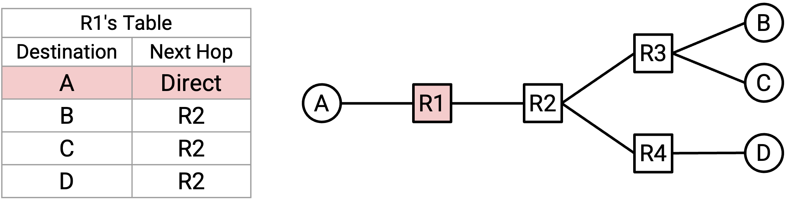

也可以使用 static routing，在 forwarding table 中为某些 destination 硬编码 entry，即使我们并没有直接连接到这些 destination。如果某条 route 永远不会变化，而我们希望无论 routing protocol 做什么，这条 route 都始终留在 forwarding table 中，那么这样做可能很有用。
