# Congestion Control 实现

## 回顾：TCP Window

到目前为止，我们已经设计了一个动态调整、host-based 算法的概念草图：每个 source 独立运行同一个算法，最终得到高效且公平的带宽份额。

首先，使用 slow-start（从低速率开始，指数级增加）来发现初始速率。然后，在每次迭代中，如果检测到 congestion（检测到 loss），就按乘性方式降低 R。如果没有检测到 congestion，就按加性方式增加 R。

在这一节中，我们会看到 TCP 如何实现这个算法。不管好坏，TCP 的 congestion control 机制和 TCP 的可靠性机制交织得非常紧密。（这源于最初的设计：TCP 是通过打补丁来处理 congestion 的。）这一节会展示 TCP 的实现如何同时实现可靠性和 congestion control。

回忆一下，在 TCP 中，sender 维护一个 sliding window，其中包含连续的 in-flight byte/packet。window 的大小由 flow control（由 recipient 端 buffer 空间决定）和 congestion control（由 sender 计算速率）共同决定。

更具体地说，在 flow control 中，recipient 会发送一个 advertised window，表示还能发送多少 byte 而不会让 recipient 的内存溢出。这个 advertised window 的值有时缩写为 **RWND (receiver window)**。

在 congestion control 中，sender 维护一个值，有时缩写为 **CWND (congestion window)**，它表示 sender 在不让 link 过载的情况下可以发送 packet 的速率。这个值会由 congestion control 算法动态设置和调整。

sender 的 window 被计算为 CWND 和 RWND 的最小值。在这节课中，我们假设 RWND 大于 CWND，所以瓶颈是网络，而不是 recipient 的内存。这在实践中通常成立，但并不总是成立。

回忆一下，我们可以把 sliding window 看作 bytestream 中的一个范围。window 左侧是第一个未确认的 byte（window 左侧的所有内容都已经发送并确认）。window 右侧由 window size 决定。只有位于这个 window 内的 packet 才允许处于 in-flight 状态。

当 window 左侧的数据被 ack 时，window 向右滑动，现在可以发送更多数据。

为了检测 loss，我们为 window 中最左侧的 packet 维护一个 timer。如果 timer 过期，而这个 packet 还没有被 ack，我们就重发 window 中最左侧的 packet。另外，为了检测 loss，我们会统计 duplicate ack 的数量；如果看到 3 个 duplicate ack，就重发最左侧的 packet。这种基于 duplicate ack 的方法有时称为 **fast retransmit**。

## Window 和速率

我们如何为了 congestion control 调整速率，又如何计算 congestion window？事实证明，这两个值直接相关，而调整 window 就是在调整速率。window size 和数据发送速率由下面的等式关联：

rate times RTT = window size

直觉上，你可以把 window size 和速率看成同一个量，只是用两种不同的「计量单位」表达。window size 增大意味着我们发送数据更快，反之亦然。

为了理解这个等式为什么成立，考虑第一个 RTT。在第一个 RTT 期间（任何 ack 到达之前），我们可以发送 [window size] 个 packet，因此速率是 window size / RTT。

回忆一下，为了简化，我们的概念性 TCP 设计以 packet 为单位度量数据；但在实践中，TCP 以 byte 为单位思考。在真实实现中，window size 以 byte 为单位度量，不过为了简单起见，我们会从 packet 的角度考虑 window size。

为了在 packet 和 byte 之间转换，回忆一下我们定义了 Maximum Segment Size (MSS)，也就是每个 packet 的 byte 数。这告诉我们：MSS times number of packets = number of bytes。同样，直觉上，你可以把 byte 和 packet 看作同一个量（数据量）的两种不同计量单位。

## Event-Driven Update

在概念模型中，我们的目标是每次「迭代」调整一次 rate/window，但还没有形式化如何度量每次迭代。我们可以粗略地把每次迭代定义为一个 RTT，但 RTT 本身是动态变化的值，我们无法准确测量。

为了用更可预测、更可测量的方式更新 window size，我们可以考虑现有 TCP 实现会响应的各种事件，并在每次这些事件发生时更新 window。这称为 **event-driven update**。

需要更新 window size 的三个 TCP 事件是：new ack、3 个 duplicate ack，以及 timeout。

当我们看到 new ack（针对之前尚未确认的数据）时，这表示我们的数据没有 loss 地通过了网络。在我们的模型中，我们通过检查 loss 来检测 congestion，所以 new ack 表示网络没有 congested。因此，当看到 new ack 时，我们可以增加 window size（可能是在 slow-start 发现阶段，也可能是在 AIMD 调整阶段）。

当我们看到 3 个 duplicate ack 时，会把一个 packet 标记为丢失。这是孤立 loss 的信号，表示轻微 congestion。我们丢失了一个 packet，但后续 packet 仍在被接收。为了响应这个 loss，我们会降低 window size（在 AIMD 调整阶段）。

当遇到 timeout 时，我们会把一个 packet 标记为丢失。我们是通过 timeout 而不是 duplicate ack 检测到 loss，这表示有很多 packet 丢失（严重 congestion）。为了理解原因，考虑 window size 为 100 个 packet 的情况。如果遇到 timeout，这意味着我们没有收到 window 中最左侧 packet 的 ack。但这也意味着，在整个 timer 持续期间，我们没有为 window 中任何其他 packet 收到 3 个 duplicate ack。timeout 意味着几乎没有 packet 被接收，或者完全没有 packet 被接收，某些严重问题已经发生。

如果发现 timeout，就说明发生了意外情况（例如网络变化），我们不应该再信任当前 window size。作为响应，我们应该回到 slow-start 阶段，重新发现一个合适的 window size。这并不是响应 timeout 的唯一方式，但这是 TCP 选择的方式。

## Event-Driven Slow Start

在概念模型中，我们通过选择一个较慢速率，并指数级增加速率（例如每次迭代翻倍），直到遇到第一次 loss，来实现 slow start。现在，我们需要一种 event-driven 方式，让 window 每个 RTT 翻倍一次。

TCP 从一个很小的 window 开始：1 个 packet。回忆一下，我们可以用 maximum segment size (MSS) 把 packet 转换为 byte，然后通过 MSS/RTT 把 byte 转换为速率。

每当我们收到一个 acknowledgement，就把 window size 增加 1 个 packet。直觉上会发生下面的事情：

最开始，window size 是 1 个 packet。我们发送 1 个 packet，经过一个 RTT 后，收到 1 个 ack。这个 ack 让我们把 window 增加到 2 个 packet。

现在我们发送 2 个 packet，经过一个 RTT 后，收到 2 个 ack。这 2 个 ack 让我们把 window 再增加 2 个 packet，新的 window size 是 4 个 packet。

现在我们发送 4 个 packet，经过一个 RTT 后，收到 4 个 ack。这 4 个 ack 让我们把 window 再增加 4 个 packet，新的 window size 是 8 个 packet。

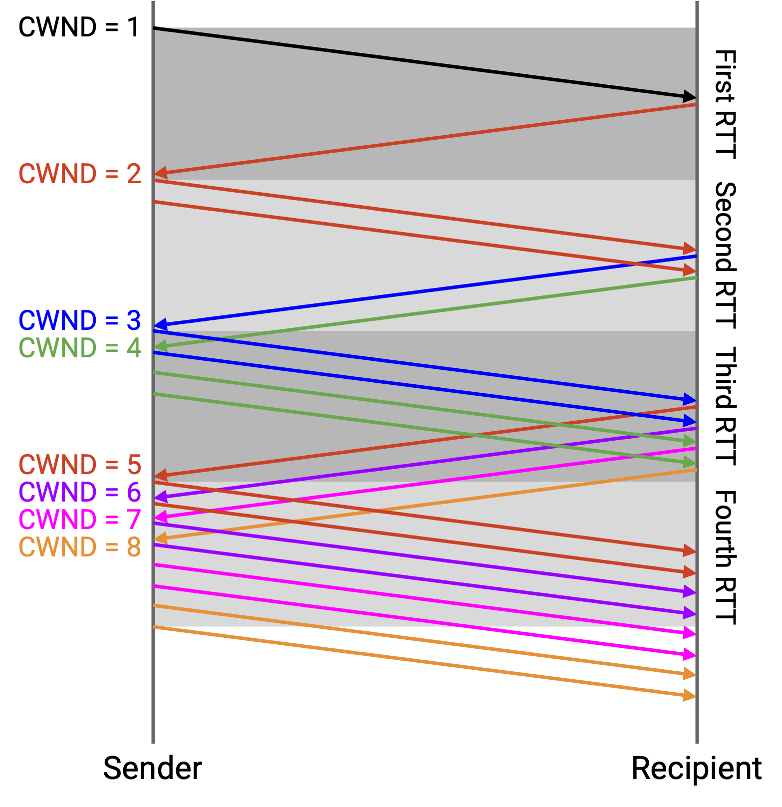

不过，这幅直觉图假设我们同时发送全部 4 个 packet，并同时收到全部 4 个 ack。在实践中，sliding window 行为会让我们每次收到一个 ack 时 window 增加 1，但最终行为（每个 RTT window 翻倍）是一样的。

和以前一样，我们从 window size 为 1 个 packet 开始。我们发送 1 个 packet（A），经过一个 RTT 后，收到 A 的 ack。这个 ack 让我们把 window 增加到 2 个 packet，此时有零个 packet in flight。

接下来，我们可以发送 2 个 packet（B 和 C）。当收到 B 的 ack 时，我们把 window 增加到 3 个 packet。此时仍有 1 个 packet in flight（C），所以我们可以再发送 2 个 packet（D 和 E）。

当收到 C 的 ack 时，我们可以把 window 增加到 4 个 packet。此时仍有 2 个 packet in flight（D 和 E），所以我们可以再发送 2 个 packet（F 和 G）。

一般来说，假设没有 loss 也没有 reordering，每当收到一个 ack，sliding window 允许我们发送一个新的 packet，而增加后的 window 又允许我们再发送一个 packet。因为每个 ack 都导致 2 个 packet 被发送，所以我们得到每个 RTT window 翻倍的行为。例如，在一个 RTT 区间内，如果我们收到 16 个 ack，每个 ack 触发 2 个 packet 被发送，总共发送 32 个 packet。然后，在下一个 RTT 区间，这 32 个 packet 会被 ack，并触发发送 64 个 packet。

最终，在每个 RTT 都让 window 翻倍一段时间后（每收到一个 ack 就让 window 增加 1），我们会遇到 loss。这也意味着，我们已经学到了一个不遇到 loss 时允许发送 packet 的最大「安全」速率。我们会把这个速率记在一个新参数中，称为 **SSTHRESH (slow start threshold)**。具体来说，一旦遇到 packet loss，我们就把 SSTHRESH 设置为当前 window size 的一半。例如，如果 16 个 packet 的 window 不会造成 loss，但 32 个 packet 的 window 会造成 loss，那么我们会把 SSTHRESH 设置为 16。

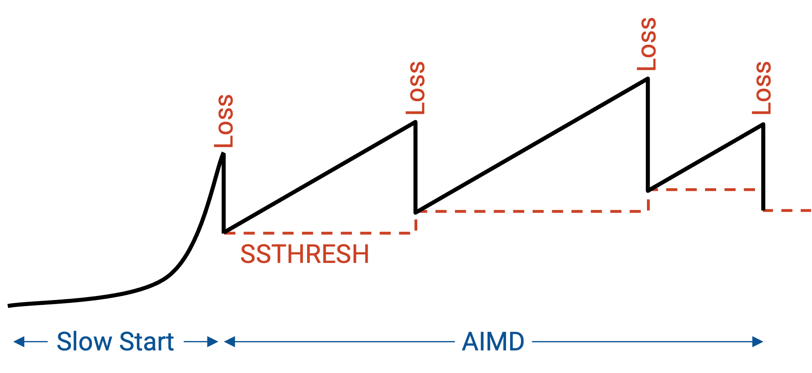

回忆一下，slow start 之后，我们会持续调整 window size（AIMD）。SSTHRESH 让我们记住从 slow start 中学到的安全速率，即使之后速率开始变化。

## 实现 Additive Increase

在概念模型中，slow start 之后，如果没有 loss，我们希望缓慢地（加性地）增加速率。我们需要一种 event-driven 方式，让 window 每个 RTT 增加 1 个 packet。

我们没有精确的 RTT 数值，但知道在一个 RTT 内，我们预期会收到一个 window 数量的 packet 的 ack。例如，当 window size 为 10 时，每个 RTT 会收到 10 个 ack。如果每个 ack 让 window 增加 1/10 个 packet，那么经过一个 RTT，window 应该正好增加 1 个 packet，符合预期。

每当收到一个 acknowledgement，我们会取当前 window size CWND，并把它重新赋值为 CWND + (1/CWND)。这让 window 在每个 ack 上增加一个 packet 的分数。经过一整个 window 数量的 packet（也就是一个 RTT）后，window 增加 1 个 packet。

形式化地说，TCP 用 byte 而不是 packet 来度量 window，所以 byte 视角下的 (1/CWND) 等价于 MSS * (MSS/CWND)。在 (1/CWND) 中，分子是 1 个 packet（一个 RTT 内的总增加量），分母是以 packet 为单位度量的 CWND。既然分母现在以 packet 为单位，分子也必须以 packet 为单位：1 packet = MSS bytes。

但是，1/CWND 或 MSS/CWND 这个分数本身仍然是一个比值（无量纲），表示每个 ack 上要增加的比例。我们想要的总增加量是 1 packet = MSS bytes，所以必须把这个比例再乘以 MSS bytes。

举个例子，假设 CWND 是 3 个 packet = 150 bytes（假设 MSS = 50 bytes）。在 packet 视角中，我们每次会给 window 增加 1/3 个 packet，总增加量是 1 个 packet。

在 byte 视角中，我们可以计算 MSS/CWND = 50/150，得到同样需要每次增加的 1/3 比例，总增加比例是 1。但我们仍然需要乘以 MSS，使总增加量是 MSS，而不是 1。

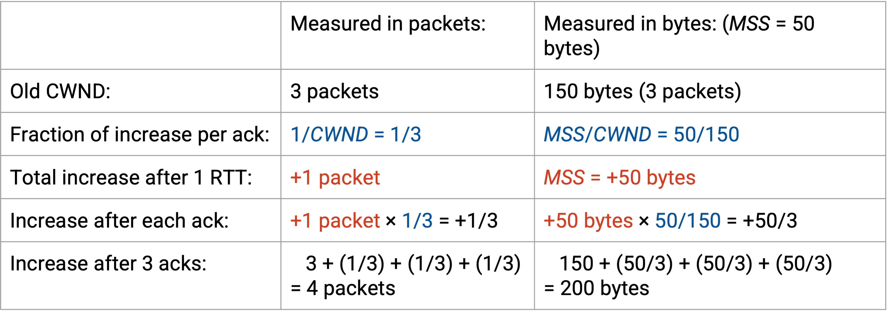

注意，这个增加并不是完美线性的，但提供了足够好的近似。例如，从 CWND = 4 开始，第一次更新是 4 + 1/4 = 4.25，第二次更新是 4.25 + 1/4.25 = 4.49。四次更新后，在这个近似中 window size 会是 4.92（精确模型中我们希望它是 5）。

## 实现 Multiplicative Decrease

如果我们通过 3 个 duplicate ack 检测到 loss，就把 window size 除以 2。

回忆一下，如果 retransmission timer 过期，我们会把 timeout 解释为多个 packet 丢失（我们甚至没有收到 duplicate ack）。我们假设当前 window 可能已经严重偏离合适值，为了谨慎起见，会从头重新发现一个合适速率。

首先，我们记录当前速率太高，而已知最好的安全速率是当前速率的一半（遵循 multiplicative decrease 原则）。为了记录这个安全速率，我们把 SSTHRESH 设置为当前 window 的一半。

然后，我们把 window size 设回 1 个 packet，并再次重复 slow start 过程。

注意，当重新尝试 slow start 时，我们必须小心，不要回到之前导致 timeout 的危险速率。幸运的是，我们把 SSTHRESH 设置在危险速率之下。因此，在后续重新尝试 slow start 时（此时 SSTHRESH 已设置），一旦 window 超过 SSTHRESH，就应该从乘性增加切换到加性增加。第一次 slow start 时，SSTHRESH 未设置（或者说是 infinity）。

总结一下：在 slow-start 中，我们每收到一个 ack 就把 window 增加 1 个 packet（结果是每个 RTT 速率翻倍）。在 AIMD 中，我们每收到一个 ack 就把 window 增加 window size 的一个分数（结果是每发送一个 window 的数据，window 增加 1）。当收到 3 个 duplicate ack 时，我们把 window 减半；timeout 时，把 window 改成 1。

注意，减少时我们从不把 window size 降到小于 1 个 packet。在最坏情况下，我们至少要允许 1 个 packet 处于 in-flight 状态。

## TCP Sawtooth

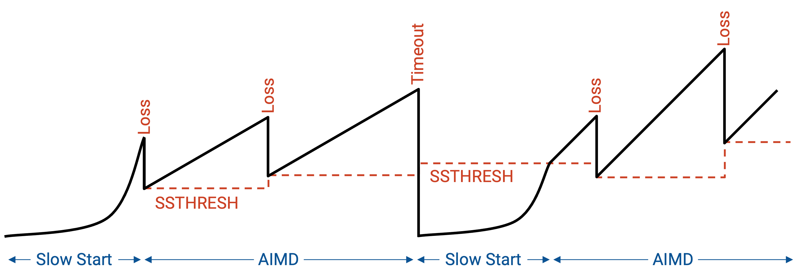

如果把速率随时间的变化画出来，我们会看到初始的指数增长（slow start）。一旦经历 loss，我们把速率减半，并切换到 AIMD 模式。现在，我们线性增加，直到遇到 loss；每次遇到 loss，就把速率减半。

## Fast Recovery：贯穿示例

在 congestion control 实现中，还有最后一个问题要处理。当遇到孤立的 packet loss 时，congestion window 会按预期减半。然而，这有一个意外副作用：sender 在继续发送 packet 之前会停顿一段时间。

为了看到这个问题，考虑一个贯穿示例。我们发送 10 个 packet，编号为 101 到 110。第一个 packet（101）被丢弃。

结果，其他 9 个 packet，也就是 102 到 110，都会被 ack 为 ack(101)，因为下一个期望的 byte 仍然是 101。

在第三个 duplicate ack(101) 之后（由收到 102、103 和 104 生成），sender 重发 101。

最终，重发的 101 的 ack 到达。它说 ack(111)，因为 packet 102 到 110 之前都已经收到；随着 101 被收到，下一个期望的 byte 是 111。

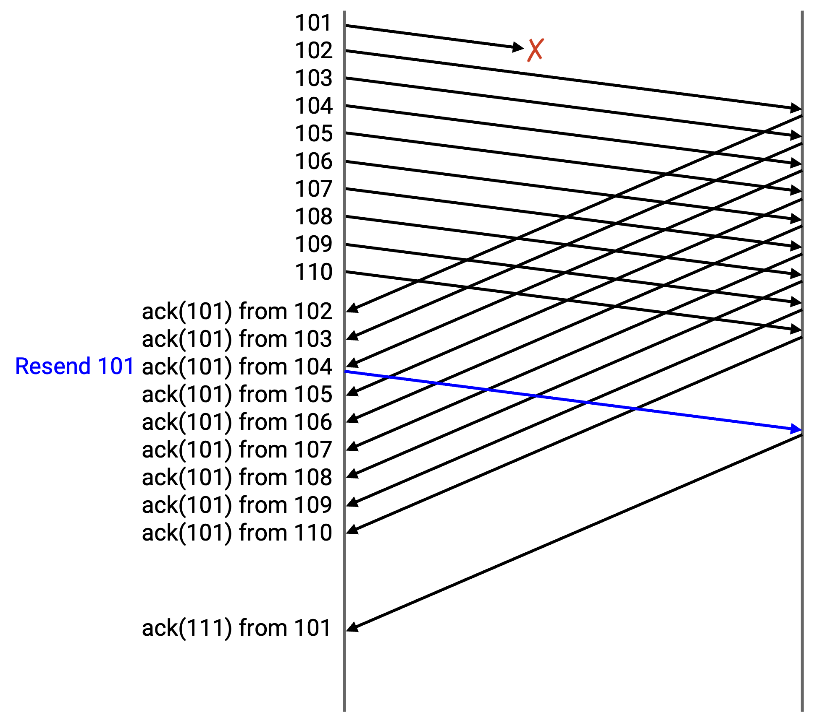

总结一下：在 sender 端，我们发送 101 到 110，而 101 被丢弃。我们从 102 得到 ack(101)，从 103 得到 ack(101)，从 104 得到 ack(101)。此时，我们重发 101。然后，我们从 105 到 110 得到 ack(101)。最后，我们最终从 101 得到 ack(111)。

在 recipient 端，我们收到 102 到 110，并且每次都发回 ack(101)，因为下一个未收到的 byte 仍然是 101。最终，我们收到重发的 101，并发回 ack(111)，因为下一个未收到的 byte 是 111。

在这个贯穿示例中，CWND 是什么样子？记住，window 从第一个未确认 byte 开始，并延伸 CWND 个连续 byte。移动 window 向前的唯一方式是收到第一个未 ack byte。如果我们收到 window 中其他 byte 的 ack，window 保持不变，因为 window 由第一个未 ack byte 决定。

## Fast Recovery：问题

假设 CWND 一开始是 10。packet 101 到 110 被允许处于 in flight 状态。sender 发送 101 到 110，但 101 被丢弃。

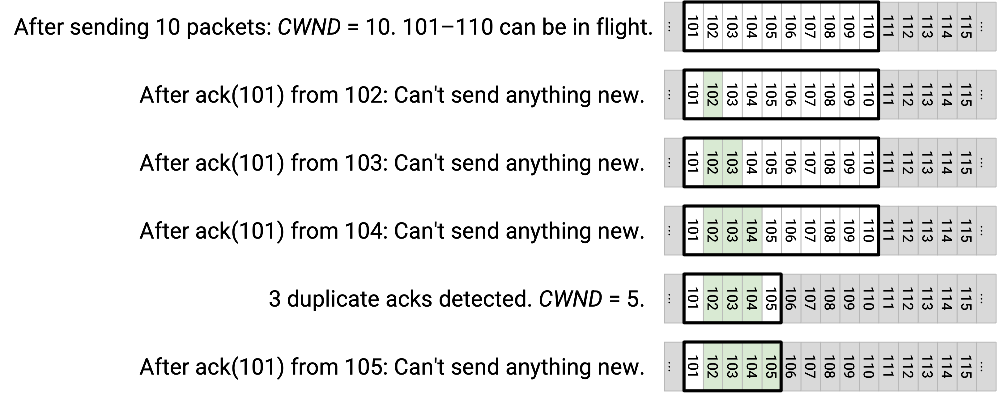

sender 看到 ack(101)，这是对方收到 102 后生成的。此时，第一个未 ack byte 仍然是 101，所以 window 保持不变。仍然只有 101 到 110 这些 packet 被允许处于 in-flight 状态，sender 不能发送任何新内容（例如 111 不能发送）。

接下来，sender 看到 ack(101)，这是对方收到 103 后生成的。同样，第一个未 ack byte 仍然是 101，所以 window 不变。window 仍然从 101 开始并延伸到 110，sender 不能发送任何新内容。

接下来，sender 看到 ack(101)，这是对方收到 104 后生成的。这是第三个 duplicate ack，所以我们必须把 CWND 减小到 5。第一个未 ack byte 仍然是 101，而 CWND 是 5，所以 packet 101 到 105 被允许处于 in flight 状态。sender 仍然不能发送任何新内容。因为看到了第三个 duplicate ack，我们重发 101（window 中最左侧的 packet）。

接下来，sender 看到 ack(101)，这是对方收到 105 后生成的。window 仍然是从 101（第一个未 ack byte）到 105（CWND 个 byte 后），所以我们不能发送任何新内容。

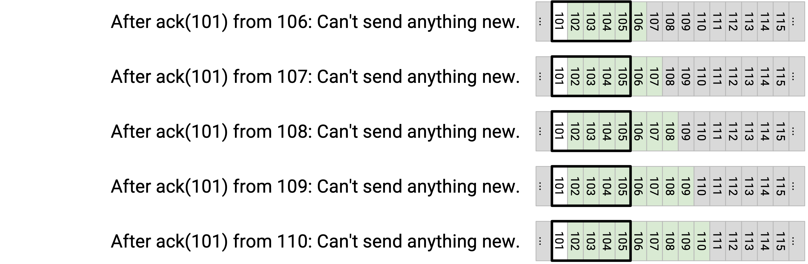

接下来，sender 看到 ack(101)，这是对方收到 106 后生成的。同样，window 不变，我们不能发送任何新内容。

sender 从对方收到 107、108、109、110 的过程中得到 ack(101)、ack(101)、ack(101)、ack(101)。每种情况下，101 仍然是第一个未 ack byte，所以 window 仍然是 101 到 105，sender 不能发送任何新内容。

这里发生了什么？只有一个 packet 被丢弃，但结果是 sender 必须完全停止发送很长时间。

window 由第一个未 ack byte 定义，所以在 101 被重发并 ack 之前，window 拒绝向前移动。即使所有其他 packet（102 到 110）都到达，window 仍然卡在 101，后续 packet（111 之后）无法发送。sender 被卡住了！

最终，sender 从重发的 101 收到 ack(111)。这会导致 window 跳到前面，滑动到新的第一个未 ack packet，也就是 111。CWND 仍然是 5，所以 sender 现在可以发送 111 到 115。

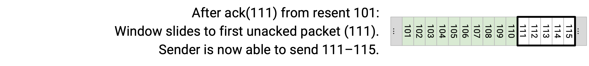

这里又发生了什么？现在我们有了第二个问题。sender 停顿了很久，但一旦 101 被 ack(111) 确认，window 就一路跳到 111-115，sender 突然必须赶着同时发送 111-115。

sender 停顿很久，什么也没发，然后突然赶着同时发送 111-115。现在，sender 还必须再等待一个完整的 round-trip，让 111-115 被 ack，之后才能发送 116 及之后的数据。

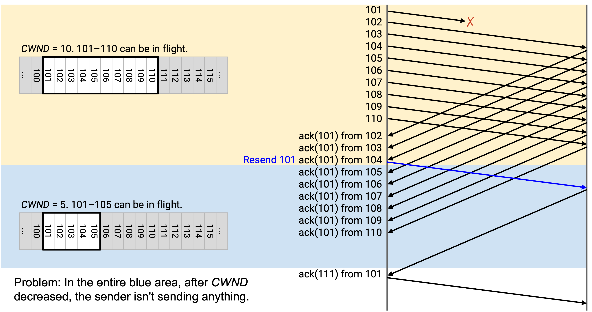

总结一下：孤立的 packet loss 让 window 卡住，导致 sender 停顿且什么也不发送。最终，当那个 packet 被重发并 ack 时，window 向前跳跃，导致 sender 一次性发送一批新 packet。sender 现在必须再等一个 round-trip，让这些新 packet 被 ack，才能恢复正常发送。

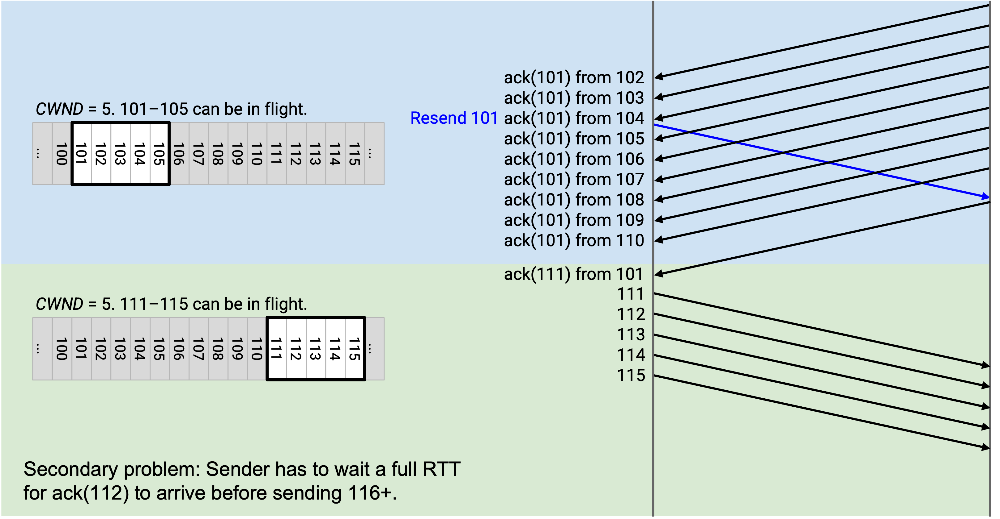

关于这个问题，有几点说明：

如果这个问题仍然有点难理解，可以注意到：它更多来自 TCP sliding window 机制，而不完全是 congestion control 机制。congestion control 会让 window 缩小，但即使 window 不缩小，sender 仍然会被迫停顿，直到 101 被收到并且 window 跳到前面。

当我们凭直觉思考这个问题时，画出 sender 的 window，并标出已经被 ack 的 byte 会很有帮助。例如，在 triple duplicate ack 之后，我们标记 102、103、104 已收到，而 window 允许 101（第一个未 ack byte）到 105 处于 in flight 状态。

不过，这并不是真正的 sender 视角。记住，sender 只看到 cumulative ack，所以它实际上不知道 102、103 和 104 已经收到。sender 可以推断 window 中有 3 个 packet（不是 101）已经收到，但不知道具体是哪 3 个 packet。

最后注意，在我们收到 3 个 duplicate ack(101) 消息后，会重发 101；即使之后又有更多 duplicate ack(101) 消息到来，也不会再次重发 101。这只是 TCP 关于 duplicate ack 重发的规则。

## Fast Recovery：思路

那么，我们如何解决这个问题？理想情况下，我们不希望 sender 停顿，而且即使 101 丢失，也希望 sender 继续发送后续 packet（111 之后）。

注意，虽然 sender 无法推断具体哪些 packet 到达了，但 sender 可以推断后续（非 101）packet 正在被接收。

当我们看到由 102 被收到而生成的 ack(101) 时，其实并不知道 102 已经收到，但知道某个 packet（非 101）已经收到。因此，只剩 9 个 packet in flight。

当我们看到另一个由 103 被收到而生成的 ack(101) 时，同样不知道具体收到的是 103，但知道又有一个 packet（非 101）已经收到。因此，只剩 8 个 packet in flight。

随着我们持续收到 duplicate ack(101) 消息，可以推断 in-flight packet 越来越少：

收到来自 102 的 ack(101) 后：9 个 packet in flight。

收到来自 103 的 ack(101) 后：8 个 packet in flight。

收到来自 104 的 ack(101) 后：7 个 packet in flight。

收到来自 105 的 ack(101) 后：6 个 packet in flight。

收到来自 106 的 ack(101) 后：5 个 packet in flight。

收到来自 107 的 ack(101) 后：4 个 packet in flight。

收到来自 108 的 ack(101) 后：3 个 packet in flight。

收到来自 109 的 ack(101) 后：2 个 packet in flight。

收到来自 110 的 ack(101) 后：1 个 packet in flight。

最终，在我们收到 9 次 ack(101)（由 102 到 110 被收到而产生）后，就知道只剩 1 个 packet in flight，也就是 101。

孤立 loss 之后，我们真正希望 CWND 是 5，这意味着任意时刻希望有 5 个 packet in flight。等到从 107 收到 ack(101) 时，我们可以推断只剩 4 个 packet in flight。（实际上它们是 101、108、109、110，不过 sender 并不知道。）

此时，我们希望能够发送 111，让总数变成 5 个 packet in flight。但 window 不允许我们这么做，因为 window 仍然卡在 101（第一个未 ack byte）到 105（CWND 个 byte 后）。

让 sender 摆脱停顿的关键想法是：给 sender 为每个 duplicate ack 临时授予 credit。

当一个 duplicate ack 到达时，我们可以推断少了一个 packet in flight，尽管不知道具体是哪一个。为了体现这一点，我们人为地把 window 扩展 1 个 packet，允许 sender 多发送一个 packet。

## Fast Recovery：解决方案

现在把「为每个 duplicate ack 人为扩展 window」这个想法应用到前面的例子中。

和之前一样，window 从 101 到 110 开始，我们发送 10 个 packet。

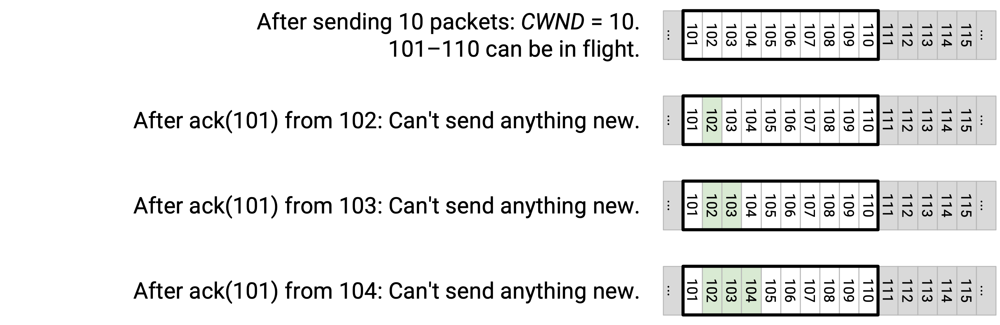

和之前一样，我们从 102 得到 ack(101)，window 保持不变，不能发送任何新内容。

和之前一样，我们从 103 得到 ack(101)，window 保持不变，不能发送任何新内容。

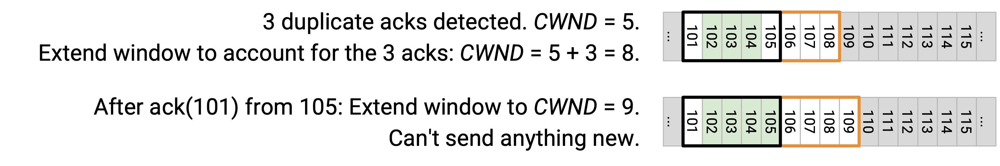

和之前一样，我们从 104 得到 ack(101)，window 保持不变，不能发送任何新内容。

第三个 duplicate ack 意味着我们把 CWND 降低到 5，所以 window 现在是 101 到 105。

不过，我们收到了 3 个 ack，所以人为地把 window 扩展 3，以反映这些 ack。因此，CWND 实际上被设置为 5 + 3 = 8。

接下来，我们从 105 得到 ack(101)。这允许我们再次扩展 window，到 9。现在 window 覆盖 101 到 109，所以我们仍然不能发送新的 packet。

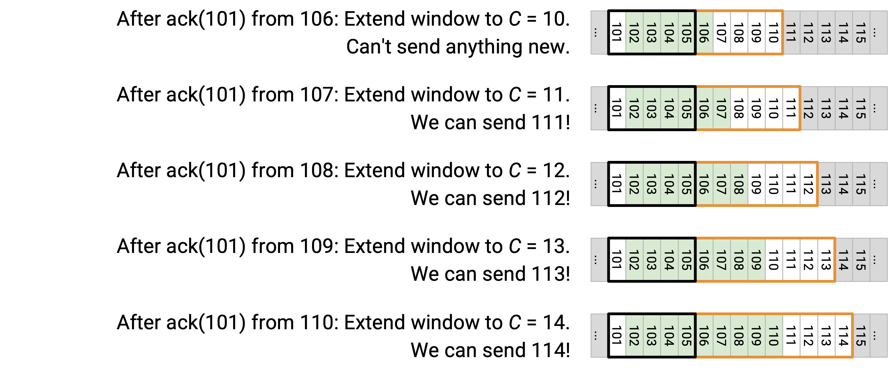

接下来，我们从 106 得到 ack(101)。我们再次把 window 扩展到 10，覆盖 101 到 110，仍然不能发送任何新内容。

接下来，我们从 107 得到 ack(101)。我们再次把 window 扩展到 11，覆盖 101 到 111。现在可以发送 111！

接下来，我们从 108 得到 ack(101)。我们再次把 window 扩展到 12，覆盖 101 到 112。现在可以发送 112！

接下来，我们从 109 得到 ack(101)。我们再次把 window 扩展到 13，覆盖 101 到 113。现在可以发送 113！

接下来，我们从 110 得到 ack(101)。我们再次把 window 扩展到 14，覆盖 101 到 114。现在可以发送 114！

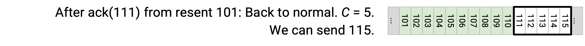

最终，我们从重发的 101 得到 ack(111)。此时，我们可以把 CWND 重置为原本想要的值 5，所以 window 覆盖 111 到 115。这允许我们发送 115！

有了这个修复，我们解决了 sender 停顿的问题。原本，sender 必须等待重发的 101 被 ack，才能发送新的 packet。现在，sender 可以在重发的 101 被 ack 之前继续发送 packet。

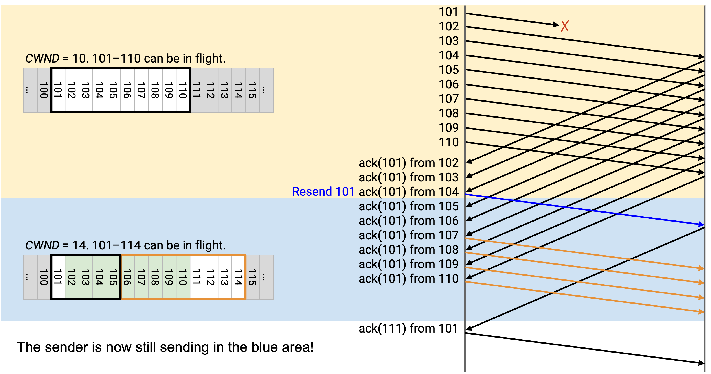

我们也解决了前面的第二个问题：window 向前跳跃并导致我们突发发送一批新 packet（111 到 115）。现在，111 到 114 已经更早发出；当 window 向前跳跃时，我们只需要发送 115。

没有这个修复时，我们必须再停顿一个 round-trip，等待 111 到 115 这批 packet 被 ack。现在，由于我们之前一直保持忙碌并发送了 111 到 114，它们会更早被 ack，我们可以继续发送 116 以及之后的数据，而不必经历整整一个 RTT 的停顿。

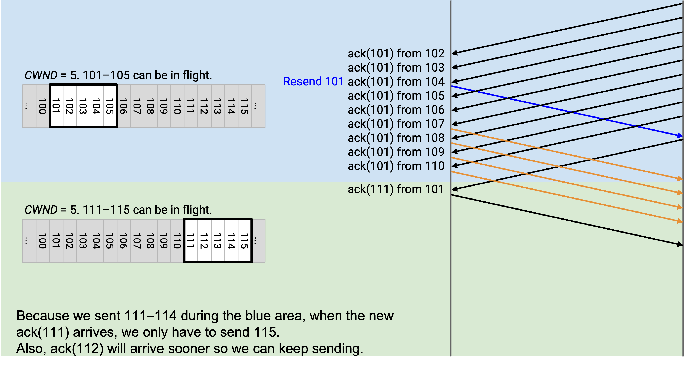

另一种理解这个修复的方法，是关注人为扩展的 window 中的 packet。

当我们得到第三个 duplicate ack 时，CWND 缩小到 5，但我们为 3 个 duplicate ack 人为扩展 3，因此 CWND 是 8。如果看这个扩展后的 window，其中 3 个 packet 已经被 ack（102、103、104，虽然我们不知道具体是它们），另外 5 个 packet 仍然 in-flight。这实现了我们想要的 5 个 in-flight packet 的 window。

接下来，当我们从 105 得到另一个 ack(101) 时，window 扩展到 9。同样，如果看这个 window，其中 4 个 packet 已经被 ack（我们不知道具体是哪几个），另外 5 个 packet 仍然 in-flight，正好得到我们想要的 5 个 in-flight packet。

当我们从 106 得到 ack(101) 时，window 扩展到 10，其中包含 5 个已接收 packet（来自 5 个 duplicate ack），再加上 5 个 in-flight packet（预期 window size）。

在每一步中，在扩展后的 window 里，如果不计算已经被 ack 的 packet，window 中正好有 5 个 packet in-flight。同样，我们不知道 window 中具体哪些 packet 被 ack，但可以用 duplicate ack 统计有多少 packet 被 ack，并利用这个计数保持 5 个 in-flight packet。

当我们从 107 得到 ack(101) 时，window 扩展到 11，其中包含 6 个已接收 packet（来自 6 个 duplicate ack）。window 中另外 5 个 packet 被允许处于 in-flight 状态。

此时，我们最初发送了 10 个 packet，并收到了 6 个 duplicate ack，这告诉我们只有 4 个 packet 仍然 in flight。这允许我们发送 111。人为扩展 window 捕捉了这个推理，因为它把 window 扩展到包含 111。

当我们从 108 得到 ack(101) 时，我们推断现在又少了一个 packet in flight。因此，我们再次人为把 window 扩展到 12，从而允许发送 112。

## Fast Recovery：实现

当我们从 duplicate ack 检测到 packet loss 时，会临时进入 **fast recovery** 模式；在这个模式中，额外的 duplicate ack 会人为扩展 window，以防止停顿。

fast recovery 模式在收到 3 个 duplicate ack 时触发。我们现在不只是像之前那样把 CWND 减半，而是把 CWND 设置为 CWND/2 + 3，其中 window 因为收到的 3 个 duplicate ack 被人为扩展了 3。我们还把 SSTHRESH 设置为 CWND/2，以便之后记住新的安全速率。

在 fast recovery 模式中，每个额外的 duplicate ack 都会让 CWND 增加 1，从而允许 window 被人为扩展。

最终，当我们收到一个新的、非重复的 ack 时，会离开 fast recovery 模式，并把 CWND 设置为 SSTHRESH。注意，在人为扩展 window 的过程中，SSTHRESH 始终帮助我们记住最终真正想要发送的原始减半速率。

## TCP State Machine

现在我们终于可以把所有部分组合起来，实现带有 congestion control 的 TCP。

sender 维护 5 个值：

duplicate ack count 帮助我们比 timeout 更早检测 loss。它初始化为 0。

timer 用于检测 loss。这里只有一个 timer。

RWND 用于 flow control（不要压垮 recipient buffer）。

CWND 用于 congestion control。它初始化为 1 个 packet。

SSTHRESH 帮助 congestion control 算法记住最近的安全速率。它初始化为 infinity。

recipient 维护一个乱序 packet 的 buffer。

sender 响应 3 个事件：新数据的 ack（之前未被 ack）、duplicate ack 和 timeout。

recipient 在收到 packet 后，会回复一个 ack 和一个 RWND 值。

下面看看 sender 如何响应这 3 个事件。

当收到之前未被 ack 的新数据 ack 时：如果处于 slow-start 模式，我们把 CWND 增加 1。这让 CWND 每个 RTT 翻倍。如果处于 fast-recovery 模式，我们把 CWND 设置为 SSTHRESH，从而离开 fast recovery（因为刚刚收到了 new ack）。如果处于 congestion avoidance 模式，我们给 CWND 加上 1/CWND，使 CWND 每个 RTT 增加 1（additive increase）。我们还会重置 timer、重置 duplicate ack count，并在 window 允许时发送新数据。

当收到 duplicate ack 时，我们增加 duplicate ack count。如果计数达到 3，就重发 window 中最左侧的 packet。这有时称为 fast retransmit。我们还通过把 SSTHRESH 设置为 CWND/2（记住最近的安全速率），并把 CWND 设置为 CWND/2 + 3（加 3 来为 duplicate ack 人为扩展 window），进入 fast-recovery 模式。如果计数超过 3，就保持在 fast-recovery 模式，并为之后每个 duplicate ack 把 CWND 人为扩展 1。

当 timer 过期时，我们重发 window 中最左侧的 packet。我们还回到 slow-start 模式，把 SSTHRESH 设置为 CWND/2（记住最近的安全速率），并把 CWND 重置为 1 个 packet。

congestion control state machine 展示了 TCP 可能处于的 3 种模式，以及触发模式之间转换的条件。

如果收到 3 个 duplicate ack，我们进入 fast-recovery 模式。一旦处于这个模式，后续任何 duplicate ack 都会让我们继续留在 fast-recovery 模式（继续人为扩展 window）。离开 fast-recovery 模式有两种方式：timeout 把我们切回 slow-start 模式，或者 new ack 让我们回到 congestion-avoidance 模式。

timeout 会触发 slow-start 模式。后续任何 ack（duplicate 或 new）都会让我们保持在 slow-start。最终，如果 CWND 超过 SSTHRESH（安全速率），我们进入 congestion avoidance 模式。或者，如果检测到 loss，我们把速率减半，并短暂进入 fast-recovery 模式，然后再进入 congestion-avoidance 模式。

在 congestion avoidance 模式中，new ack 会让我们保持在这个模式（additive increase），但 duplicate ack 会把我们送到 fast-recovery 模式，timeout 会把我们送到 slow-start 模式。

## TCP Congestion Control 变体

TCP congestion control 算法有几种变体，它们都实现在 end host 的操作系统中。有趣的是：这些名字和 Berkeley Software Distribution (BSD) 操作系统有关。

在 TCP Tahoe 中，如果收到三个 duplicate ack，我们会把 CWND 重置为 1，而不是把 CWND 减半。

在 TCP Reno 中，如果收到三个 duplicate ack，我们会把 CWND 减半。timeout 时，我们把 CWND 重置为 1。

TCP New Reno 和 Reno 相同，但增加了 fast recovery。这就是我们刚刚实现的内容。

也存在其他变体。在 TCP-SACK 中，我们添加 selective acknowledgement，让 ack 包含更多细节（例如：直到 13 都已收到，18 也已收到）。

这些不同变体如何共存？为什么不需要一个所有人都使用的统一 protocol？记住，congestion control 实现在 end host 上，所以 sender 可以用任何方式调整自己的速率。最终，网络和其他 end host 只会看到 TCP packet 以某个（希望合理的）速率发送，并不关心这个速率是如何计算的。底层 TCP packet format 不会随不同 congestion control 算法而改变。

不过，并不是所有 protocol 都兼容。如果你使用带有 selective acknowledgement 的 TCP-SACK 变体，而我使用 TCP Tahoe，我们就有问题了。你期待 selective ack，但我只提供 cumulative ack。
