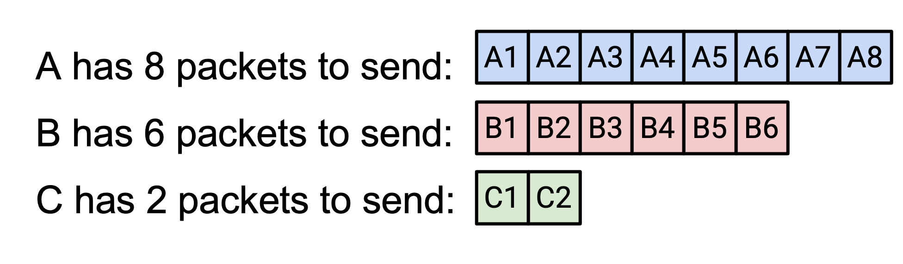
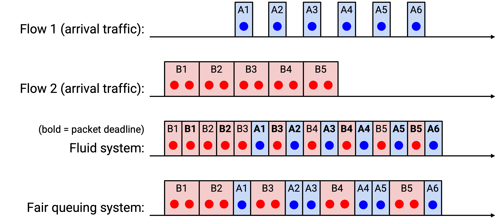

# Router-Assisted Congestion Control

## 使用 Router 做 Congestion Control

前面我们看到 host-based congestion control 算法存在一些问题。其中很多问题都可以借助 router 的帮助来修复！

TCP 会混淆 congestion 和损坏。TCP 会填满队列、速率不平滑，并且在短 flow 上表现很差，这些都源于 host 需要不断调整速率来检测 congestion。如果 router 能告诉 sender congestion 信息，甚至直接告诉 sender 理想速率，那么许多问题都可以解决。

另外，如果 router 强制执行公平共享，那么 host 作弊也会变得困难得多。

从更哲学的角度看，让 router 参与 congestion control 是很自然的设计选择。congestion 发生在 router 上，所以 router 往往比 host 拥有更多 congestion 相关信息。

router-assisted congestion control 可以非常有效，并带来接近最优的性能（高 link 利用率、低 delay），但部署这些 protocol 可能很有挑战。router 现在需要支持额外功能，而这些功能有时会相当复杂。有些 protocol 甚至可能要求每个 router 都同意添加这个功能。

## 强制执行 Fair Queuing

router 如何确保每个 connection 得到自己的公平份额？

到目前为止，router 接收 packet，在需要时把它们排队，然后按 first-in-first-out (FIFO) 顺序发送出去。router 并不关心 packet 来自哪个 connection。

在我们的新模型中，router 需要把 packet 分类到 connection 中。（目前先假设这些 connection 都是 TCP connection。）这意味着 router 必须查看 packet 内部，了解 source 和 destination IP address 以及 port。

为了形式化定义公平性，router 可以为每个 connection 维护一个单独 queue。当 packet 到达时，router 把 packet 加入对应的 queue。然后，router 每次只需要选择一个 queue，从这个 queue 的队首发送一个 packet。只要 router 以某种公平方式选择 queue，它就在 connection 之间强制执行公平性。

如果所有 packet 大小相同，那么 router 可以按 round-robin 选择 queue（先从第一个 queue 发送，然后从第二个 queue 发送，依此类推）。事实证明，即使不是所有 connection 都需要相同带宽，这个方法也可行。有些 connection 排队 packet 的速度可能比其他 connection 更慢。如果把 round-robin 服务应用到不同带宽需求的 connection 上，我们如何计算分配给每个 connection 的带宽？例如，假设我们每秒可以发送 10 个 packet，而 A、B、C 分别每秒发送 8、6、2 个 packet。

如果按 round-robin 发送 packet，每种类型每秒会发送多少 packet？我们可以把这建模为一个资源分配问题，并求解它。

例如，假设 link capacity 是 10。Connection A 请求 8，B 请求 6，C 请求 2。我们应该如何在三个 connection 之间分配容量？如果试图公平分配，每个人都会收到 3.33。但 C 只请求了 2，所以我们给 C 它请求的 2，不额外给。

现在还剩 8，A 和 B 仍然需要分配。如果公平分配，每个会收到 4。这小于它们请求的数量，但我们没有办法满足它们的请求，所以给每个它们公平份额 4。

形式化地定义 max-min fairness：假设 C 是 router 可用的总带宽。每个 connection \(r_i\) 有一个带宽需求，我们必须给每个 connection 分配带宽 \(a_i\)。max-min 带宽分配是 \(a_i = \min(f, r_i)\)，其中 \(f\) 是唯一值（对所有 connection 相同），并且满足 \(\sum a_i = C\)。在这个方程中，min 项确保没有人得到超过自己请求的带宽，而求和约束确保没有带宽被闲置。直觉上，\(f\) 是公平份额，我们把它平等分配给每个人（因此所有 connection 共用一个 \(f\) 值）。

另一种读这个方程的方式是：存在某个神奇的公平份额数字，我们可以把它平等分配给每个人。如果你请求的少于公平份额，你就得到你请求的数量（没有额外）。如果你请求的多于公平份额，你会被限制在公平份额，但其他人也不会得到比你更多。

在前面的例子中，\(f\) 是 4。A 和 B 收到 \(f\)（它们想要更多），C 收到 2（它想要更少）。

如果应用 max-min fairness，这个方程保证：如果你没有得到自己的完整需求，就没有其他人得到比你更多。round-robin 方法是 max-min fair 的（假设 packet size 相等）。

如果不假设 packet size 相等，会怎样？现实中，packet size 可能差异很大（例如 40 bytes vs. 1500 bytes）。理想情况下，我们希望执行 bit-by-bit round robin，也就是轮流从每个 connection 的 queue 中发送一个 bit。这不实际（我们不会一次发送一个 bit），但如果理论上这样做，我们可以为每个 packet 写出它最后一个 bit 被发送出去的时间。我们称这个时间为该 packet 的 deadline。于是，一种公平近似方法就是按 deadline 顺序发送 packet（也就是按它们最后一个 bit 在理想情况下被发送的时间排序）。

有趣的是，关于模拟 fair queuing 的论文影响极大，其中两位合作者是 Scott Shenker（UC Berkeley 教师）和 Srinivasan Keshav（当时是 EECS 博士生）。

下面是两个 connection 上精确 bit-by-bit fair queuing 的例子（如果出现平局，我们选择先到达的 packet）。

## 实践中的 Fair Queuing

fair queuing 好在哪里？它确保 connection 之间的隔离，并防止作弊 connection 获得更多带宽。connection 不需要实现 TCP（或 TCP-friendly 替代方案），也可以选择自己的（可能并不友好的）congestion control 算法。

从根本上说，fair queuing 的好处是它能抵抗作弊和 RTT 变化等外部因素。无论如何，每个人都会得到某条给定 link 的公平份额。不过，我们仍然需要 end host 发现并适应自己的公平份额，例如如果请求过多，就要放慢速度。

fair queuing 坏在哪里？它比 FIFO queuing 复杂得多。计算 deadline 的过程很棘手，我们这里没有展示算法。另外，router 需要维护多个 queue，并对每个 packet 做额外解析工作。

在实践中，我们无法在 router 中实现完美 fair queuing（在高速下运行太复杂），但存在近似算法（例如 Deficit Round Robin）。现代 router 通常实现近似方案，但 queue 数量更少。queue 更少意味着不再是每个 connection 一个 queue，隔离粒度更粗，例如每个客户一个 queue。

fair queuing 不能消除 congestion。它只是管理 congestion 的另一种方式。例如，考虑这条 bottleneck link：它可能给每个 connection 分配 0.5 Gbps，这能防止作弊。但如果上方 connection 以 0.5 Gbps 运行，那么 0.4 Gbps 会在紧接着的下一条 link 上被丢弃。更好的分配是给上方 connection 发送 0.1 Gbps，给下方 connection 发送 0.9 Gbps。

根本问题是，这条 bottleneck link 不知道未来（downstream）link 上会发生什么。修复这个问题的唯一方式是让 sender host 放慢速度（router queuing 帮不上忙）。

fair queuing 给我们 per-connection fairness，但从哲学角度看，我们仍然要问这是不是正确的公平模型。正如之前看到的，per-connection fairness 意味着拥有更多 connection 的人仍然会得到更多带宽。我们是否应该改为按 source-destination pair 强制公平，或者按 source 强制公平？是否应该惩罚那些使用更 congested link 的 connection（占用更多稀缺资源）？

## Router-Assisted Congestion Control

fair queuing 在某条具体 link 上强制执行公平性，但它并没有告诉 sender 任何信息。如果 router 把信息传回 sender，帮助 sender 调整速率，会怎样？

一种解决方案是让 router 直接告诉 sender 应该使用的速率。我们可以在 packet 中添加一个 rate 字段，让 router 把这个 connection 的公平份额填入该字段。当 packet 到达 sender 时，sender 可以读取 header，并把速率设置为 router 告诉它的值。现在，sender 不需要动态调整来发现合适速率。

另一种解决方案是让 router 通知 sender congestion 情况（但不指定精确速率）。这以 IP header 中的 **Explicit Congestion Notification (ECN)** bit 形式部署。如果 packet 经过 congested router，router 会把这个 bit 设置为 1。当 recipient 收到一个 ECN bit 打开的 packet 时，ack 回复中也会设置 ECN bit，因此 sender 就知道发生了 congestion。

router 什么时候设置这个 bit，有很多选择。router 可以很谨慎，经常设置这个 bit，这会降低 delay，但可能导致 link 未被充分使用。或者，router 可以更激进，很少设置这个 bit，这会增加 delay，但能带来较高的 link 利用率。

host 在这个 bit 被设置时如何响应，也有很多选择。例如，host 可以假装这个 packet 被丢弃，并相应调整。

ECN 好在哪里？它解决了混淆损坏和 congestion 的问题。它允许 router 更早警告 host 有 congestion，例如在 queue 填满之前，这可以降低 delay。它实现起来也很轻量。

在实践中，有效的 ECN 需要大多数或所有 router 支持这个 protocol，并在必要时打开这个 bit。在现代 Internet 中，ECN bit 部署在一些 router 上，但不是所有 router 都支持。不过，在一个小型网络中（例如数据中心的本地网络），如果所有 router 都同意启用这个 bit，ECN bit 就会很有效。
