# TCP 实现

## TCP Segment

到目前为止，我们一直在概念层面讨论 TCP，把它看成一个个 packet 被发送。但应用并不会提前给我们做好可以直接送入 Layer 3 网络的 packet。应用依赖的是 bytestream 抽象，发送给我们的是连续的字节流。为了完整实现 TCP，我们需要把之前所有想法（例如 sequence number、window size 等）都从 byte 而不是 packet 的角度重新思考。（不过，你仍然应该能同时从 byte 或 packet 的角度推理这些设计选择。）

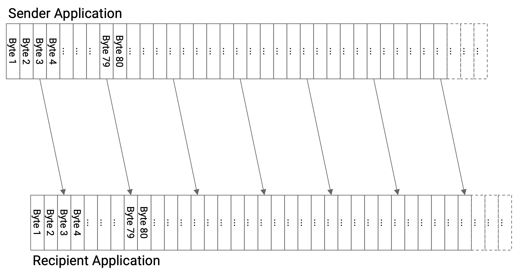

为了从 bytestream 中的 byte 形成 packet，我们引入一个数据单位，称为 **TCP segment**。sender 端的 TCP 实现会从 bytestream 中一个接一个收集 byte，并把这些 byte 放入 TCP segment。当 TCP segment 填满（达到固定的 maximum segment size）时，我们发送这个 TCP segment，然后开始一个新的 TCP segment。

有时，sender 想发送的数据少于 maximum segment size。在这种情况下，我们不希望 TCP segment 永远等待那些不会到来的更多 byte。为了解决这个问题，每次开始填充一个新的空 segment 时，我们都会启动一个 timer。如果 timer 过期，即使 TCP segment 还没有填满，我们也会发送它。

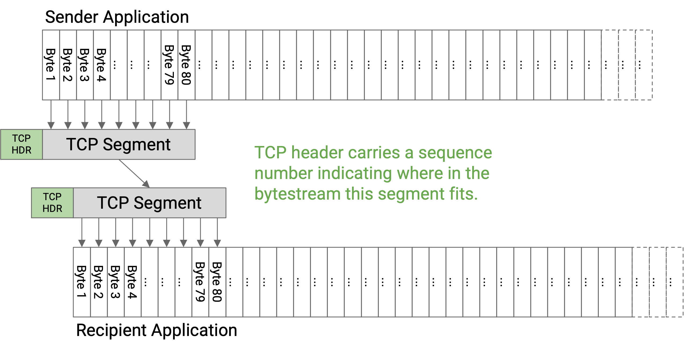

在发送 TCP segment 中的数据之前，sender 的 TCP 实现会添加一个包含相关元数据的 TCP header（例如 sequence number、port number）。然后，segment 和 header 会被向下传给 IP layer，IP layer 会附加 IP header，并把 packet 通过网络发送出去。

带有 TCP header 和 IP header 的 TCP segment 有时称为 **TCP/IP packet**。等价地说，这是一个 payload 由 TCP header 和数据组成的 IP packet。

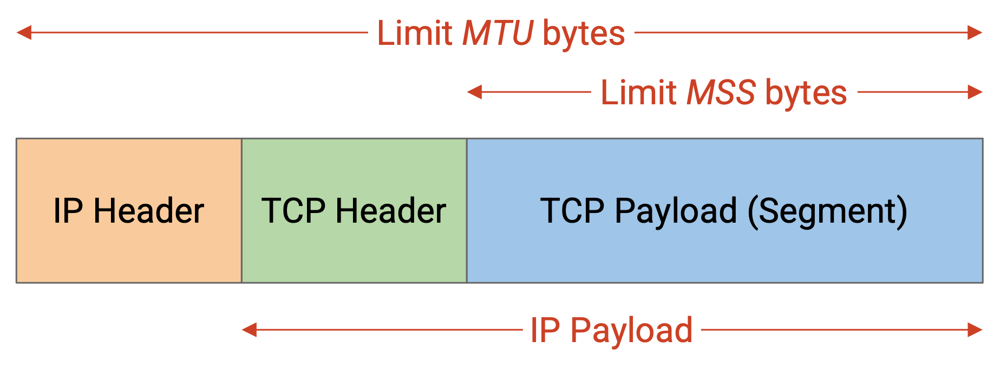

**maximum segment size (MSS)** 应该怎么设置？回忆一下，IP packet 的大小受每条 link 上 maximum transmission unit (MTU) 的限制。不过，IP packet 还必须包含 IP 和 TCP header，所以 TCP maximum segment size 会略小于 IP maximum transmission unit。具体来说：

MSS (TCP segment limit) = MTU (IP packet limit) - IP header size - TCP header size

## Sequence Number

到目前为止，我们一直给每个 packet 标上一个编号，让 recipient 可以按正确顺序接收 packet。

在实践中，我们不是给每个 segment 编号，而是给 bytestream 中的每个 byte 分配一个编号。每个 segment 的 header 会包含一个 **sequence number**，对应这个 segment 中第一个 byte 的编号。recipient 仍然可以使用 sequence number 判断每个 segment 在 bytestream 中的位置，并按正确顺序重新组装 segment。

每条 bytestream 都从一个 **initial sequence number (ISN)** 开始。sender 选择一个 ISN，并把第一个 byte 标为 ISN+1，下一个 byte 标为 ISN+2，再下一个 byte 标为 ISN+3，依此类推。

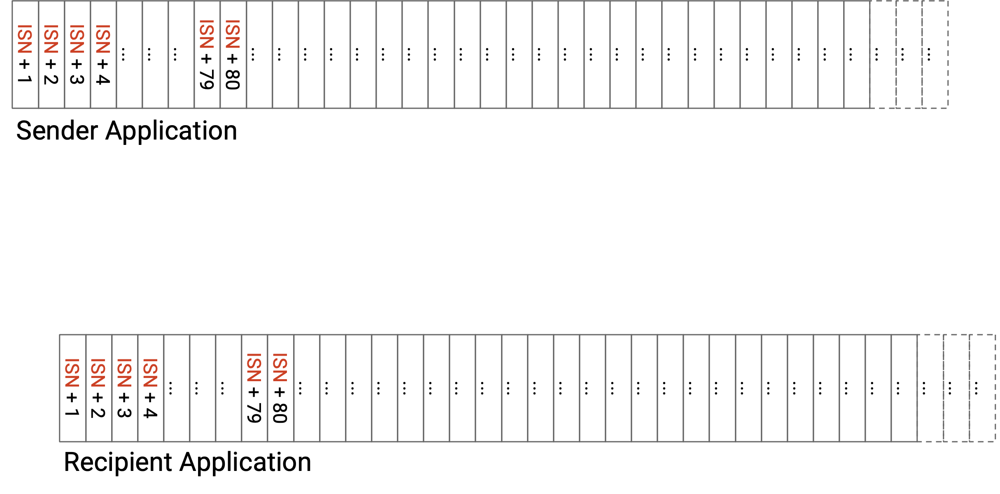

既然我们现在给 byte 而不是 packet 编号，acknowledgement number 现在也以 byte 而不是 packet 为单位。具体来说，acknowledgement number 表示：我已经收到了直到这个编号之前的所有 byte，但不包括这个编号。等价地说，acknowledgement number 表示它期望收到的下一个 byte（但还没有收到）。注意，TCP 使用 cumulative ack 模型（而不是 full-information ack 或 individual byte ack）。

举个例子，假设 ISN 被随机选择为 50。那么最开始几个 byte 的编号是 51、52、53 等。某个具体 TCP segment 可能包含编号 140 到 219 的 byte，包含两端。这个 segment 的 sequence number 是 140（表示 segment 中第一个 byte）。如果 recipient 已经收到了目前为止的所有内容，那么 recipient 可以发送 ack number 220 来确认这个 segment，220 是下一个尚未收到的 byte。

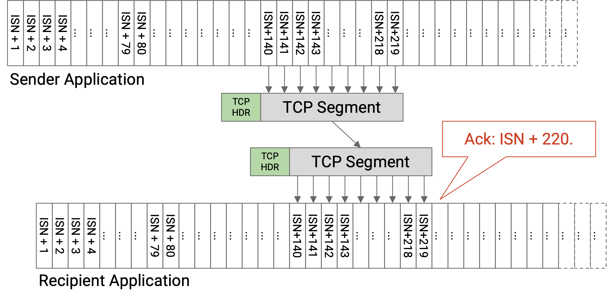

更一般地说，假设我们有一个 packet，其中第一个 byte 的 sequence number 是 X，并且这个 packet 有 B 个 byte。这个 packet 包含 byte X、X+1、X+2、...、X+B-1。如果这个 packet（以及之前的所有数据）都已收到，那么 ack 会确认 X+B（下一个期望的 byte）。如果这个 packet 没有收到，或者这个 packet 收到了但之前某个 packet 没有收到，那么 ack 会确认某个更小的数字（因为 TCP 使用 cumulative ack）。

更一般地说，假设我们有很多 packet，每个 packet 都长 B bytes。ISN 是 X，window size 是 1（stop-and-wait protocol，一次只发送一个 packet 或 ack）。假设没有 packet 被丢弃。那么 sequence 和 ack number 会这样推进：第一个 packet 的 sequence number 是 X。第一个 ack 的 ack number 是 X+B。第二个 packet 的 sequence number 是 X+B。第二个 ack 的 ack number 是 X+2B。第三个 packet 的 sequence number 是 X+2B，依此类推。特别要注意，在没有 loss 的情况下，ack number 对应下一个 packet 的 sequence number。

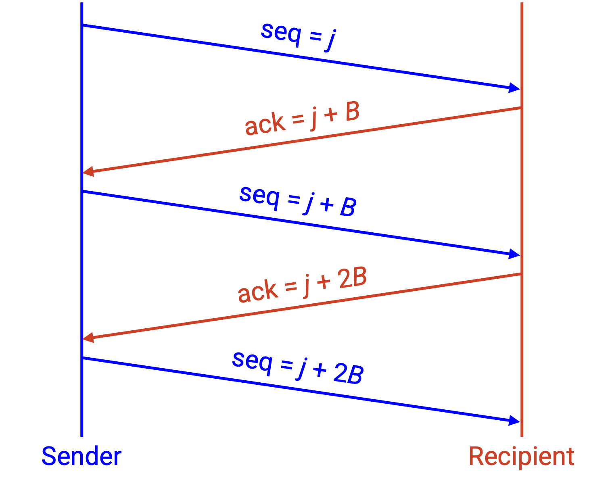

从历史上看，ISN 被随机选择，是因为设计者担心如果所有 bytestream 都从 0 开始编号，会出现模糊的 sequence number。具体来说，假设一个 TCP connection 从 ISN 0 开始发送一些数据，然后 sender 崩溃了。如果 sender 重启并建立一个新的 connection，而 ISN 又从 0 开始，那么 recipient 看到一个 sequence number 为 0 的 packet 时可能会困惑：这个 packet 是崩溃前第一个 connection 发来的，还是崩溃后第二个 connection 发来的？

在实践中，ISN 随机选择是出于安全原因。如果 ISN 的选择方式可预测，攻击者就可以推断 ISN，并发送看起来像是 sender 发来的伪造 packet。当 ISN 随机选择时，攻击者更难推断 ISN 并发送伪造 packet。

## TCP State

在 TCP 中，sender 和 recipient 都需要维护 state。state 维护在实现 TCP 的 end host 上，而不是维护在网络中。

sender 必须记住哪些 byte 已经发送但尚未被确认。sender 还必须跟踪各种 timer，例如什么时候发送未填满的 segment 的 timer，以及什么时候重发 byte 的 timer。

recipient 必须记住那些乱序到达、暂时还不能递交给应用的 byte。

因为 TCP 需要存储 state，所以每条 bytestream 称为一个 **connection** 或 **session**，TCP 是 connection-oriented protocol。不同于 Layer 3 中每个 packet 都可以单独考虑，TCP 要求双方在发送数据之前先建立 connection 并初始化 state。TCP 还需要一种关闭 connection 的机制，以释放两个 end host 上为 state 分配的内存。

## TCP 是 Full Duplex

到目前为止，我们把 TCP 看作从一个 end host（sender）到另一个 end host（recipient）的 bytestream。在实践中，两个 end host 通常都想双向发送消息。

为了支持双向发送消息，TCP connection 是 **full duplex**。在 connection 中，并不是固定指定一个 sender 和一个 recipient；两个 end host 都可以在同一个 connection 中同时发送和接收数据。

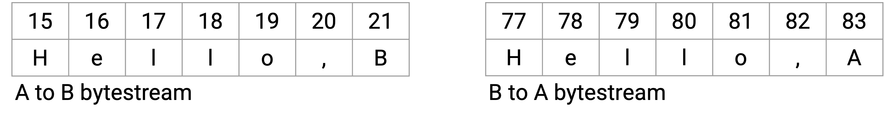

为了支持双向发送数据，每个 TCP connection 有两条 bytestream：一条包含从 A 到 B 的数据，另一条包含从 B 到 A 的数据。每个 packet 可以同时包含数据和 acknowledgement 信息。sequence number 对应 sender 的 bytestream（我正在发送的 byte），acknowledgement number 对应 recipient 的 bytestream（我从你那里收到的 byte）。

## TCP Handshake

回忆一下，TCP 是 connection-oriented，因此 connection 必须被显式创建和销毁。另外，bytestream 从随机选择的 initial sequence number (ISN) 开始，并且每个 TCP connection 都是 full-duplex（两条 bytestream，每个方向一条）。当我们创建一个新的 connection 时，双方需要就两个起始 ISN 达成一致（每个方向一个）。

为了建立 TCP connection，两个 host 会执行 **three-way handshake**，以协商每个方向上的 ISN。

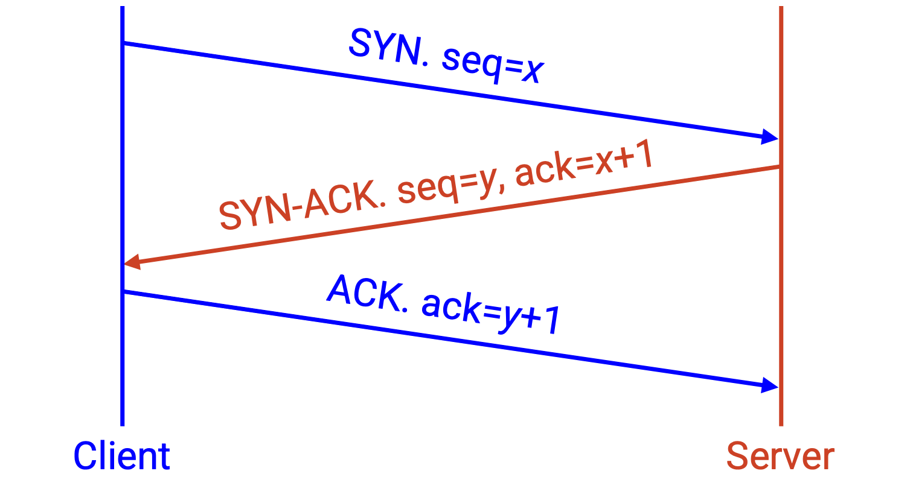

第一个 packet（从 A 到 B）是 **SYN** 消息。这个消息在 sequence number 中包含 A 的 ISN（从 A 到 B 的数据会从这个 ISN 开始计数）。

第二个 packet（从 B 到 A）是 **SYN-ACK** 消息。这个消息在 sequence number 中包含 B 的 ISN（从 B 到 A 的数据会从这个 ISN 开始计数）。这个消息还会在 ack number 中确认 B 已经收到 A 的 ISN。

第三个 packet（再次从 A 到 B）是 **ACK** 消息。这个消息在 ack number 中确认 A 已经收到 B 的 ISN。

这次 handshake 解释了为什么 bytestream 从 ISN+1 开始计数。当我发送一个 ISN 时，ack 是 ISN+1，表示 ISN 已经收到，并且下一个（第一个）期望的 byte 是 ISN+1。

three-way handshake 结束后，B 就可以开始发送数据。

## 结束 Connection

结束 connection 有两种方式。

在正常情况下，当我发送完消息后，可以发送一个特殊的 FIN packet，它表示：我不会再发送任何数据，但如果你还有数据要发，我会继续接收。此时，connection 处于 half-closed 状态。这个 packet 会像其他 packet 一样被 ack。

最终，另一方也会完成数据发送，并发送一个 FIN packet。当这个 FIN packet 被 ack 后，connection 就关闭了。

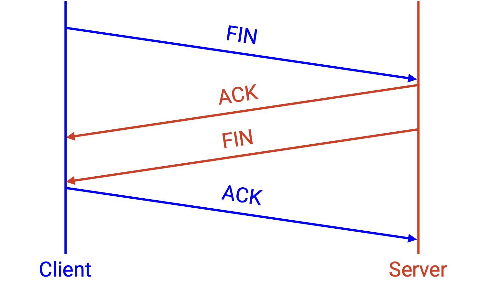

有时，我们必须在没有另一方同意的情况下突然终止 connection。为了单方面结束 connection，我可以发送一个特殊的 RST packet，它表示：我不会再发送或接收任何数据。这个 packet 不必被 ack，而且我在发送这份数据后就可以立即拆除自己的 connection。

RST packet 常用于 host 遇到错误、无法继续发送或接收 packet 的情况。注意，如果发生 RST，并且 end host 崩溃并丢失 state，那么所有 in-flight data 都会丢失。

如果我发送了 RST，而对方继续向我发送数据，那么在我能够发送的情况下，我会继续发送 RST packet 的副本，反复尝试终止 connection。

RST packet 也可以被攻击者用来审查 connection。攻击者可以伪造并注入一个 RST packet，导致整个 connection 终止。

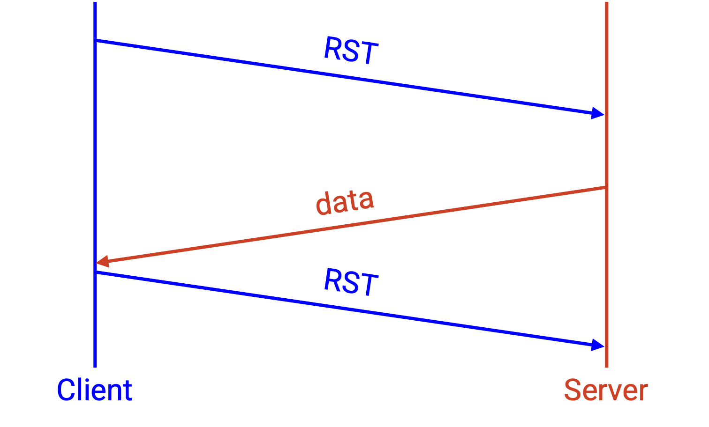

完整的 TCP state diagram 相当复杂，在打开或关闭 connection 的过程中有许多中间 state。中间 state 的例子包括：我已经发送 SYN，正在等待 SYN-ACK；或者，我已经收到 FIN，也发送了自己的 FIN，但正在等待我的 FIN 被 ack。大多数 TCP connection 大部分时间都处于 Established state，也就是 connection 已经开始（但尚未结束），数据正在来回交换。这份笔记不要求你理解完整的 state diagram。

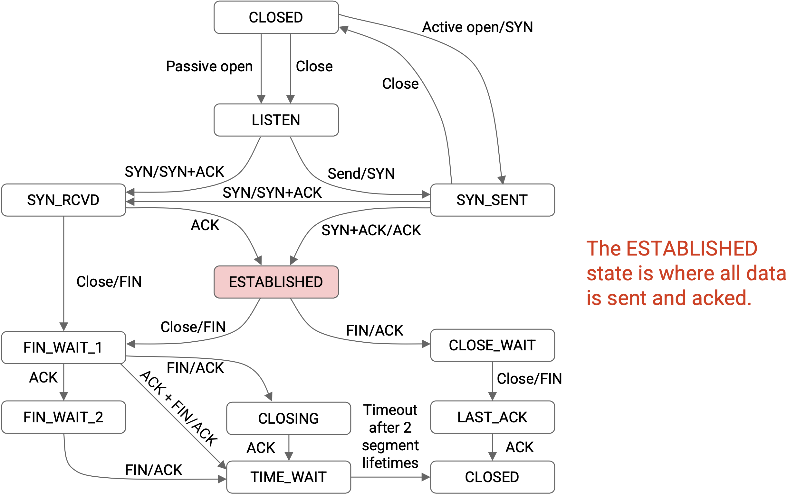

在简化 state diagram 中，我们从 closed state 开始（没有正在进行的 connection）。为了启动 connection，我们发送 SYN。最终，我们收到 SYN-ACK，并用 ACK 回复，进入 established connection。当我们完成数据发送后，我们发送 FIN，并收到 ACK。最终，我们收到 FIN，connection 再次关闭。

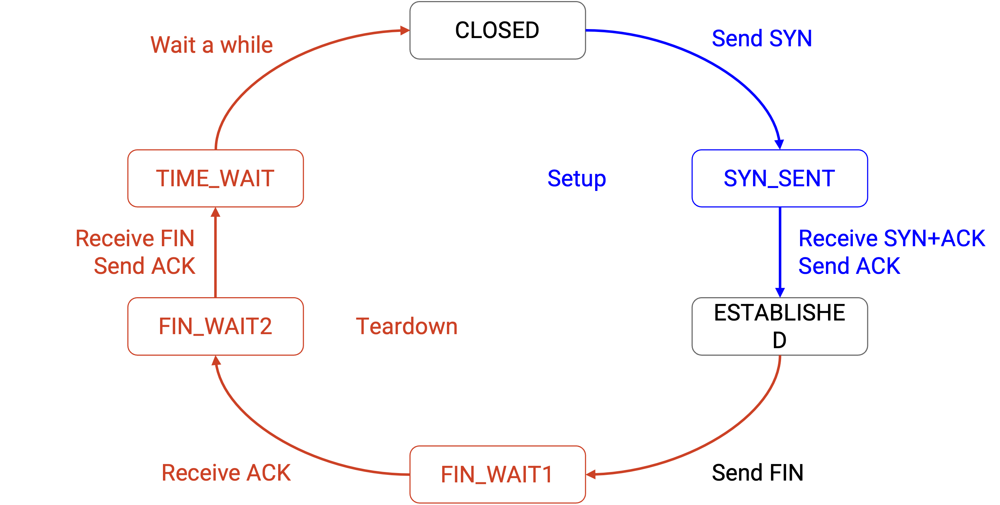

## Piggybacking

因为 TCP 是 full duplex，一个 packet 可以同时确认某些数据并发送新数据。

当 recipient 收到一个 packet 时，如果它没有数据要发送，recipient 有两个选择。recipient 可以立刻发送 ack，但不携带数据。或者，recipient 可以等到自己有数据要发送时，再把 ack 和新数据一起发送。后一种方法称为 **piggybacking**。

在实践中，我们可能不做 piggyback 的一个原因是 TCP 实现在操作系统中，与应用分离。

考虑操作系统，它并不知道应用代码在做什么。当操作系统收到一个 packet 时，它不知道 sender 什么时候会有更多数据要发（甚至不知道 sender 是否还会有更多数据要发），所以它可能会等很久，才有机会把 ack 和某些新数据 piggyback 在一起。

再看另一边的应用，它也不知道操作系统在做什么。应用运行在 bytestream 抽象之上，完全不从 packet 的角度思考，因此也没有办法思考 piggybacking。

piggybacking 还因为操作系统不会同时运行每个程序而变得更复杂。回想计算机体系结构课程（例如 UC Berkeley 的 CS 61C），CPU 会不断在计算机上的不同进程之间切换，具体取决于哪些进程需要关注。如果每次 TCP packet 到达时，CPU 都中断正在做的事情，把这个 packet 交给应用，并给应用一些时间来回应，那会很不合理。相反，当 TCP packet 到达时，操作系统可能会在应用有机会把新数据 piggyback 到 ack 上之前，就已经把 ack 发出去了。

有一种情况下数据总是会 piggyback：handshake 中的 SYN-ACK packet。除了 ack 之外，我们还 piggyback 了自己的 initial sequence number。这没有上面讨论的问题，因为 TCP handshake 完全由操作系统执行。（应用完全不考虑 SYN 或 SYN-ACK packet。）

## Sliding Window

讨论 packet 时，我们把 window 定义为任意时刻可以处于 in flight 状态的 packet 数。现在我们以 byte 为单位实现 TCP，因此把 **sliding window** 定义为任意时刻可以处于 in flight 状态的最大连续 byte 数。

要求 in-flight byte 连续，这一点和之前不同。我们基于 packet 的 window 定义允许不连续的 packet（例如 5、7、8）处于 in-flight 状态。但是，in flight 的 byte 必须连续，不能有缺口。这个要求在 byte stream 中形成了一个 window（byte 范围）。

window 的左侧是第一个未确认的 byte（由 recipient 发来的 ack number 决定）。从这个 byte 开始，接下来的 W 个 byte，直到 window 右侧，都可以处于 in-flight 状态。

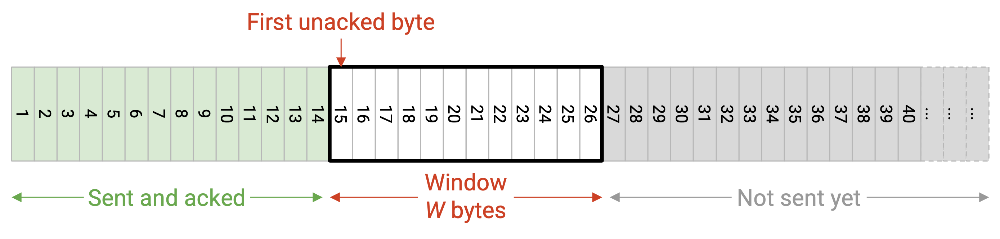

注意，即使这个 window 中间的某些 byte 已经被确认，我们仍然不能发送 window 之外的更多 byte。我们能发送更多 byte 的唯一方式，是 window 向右滑动，也就是 ack number 增大（window 左侧的 byte 被确认）。

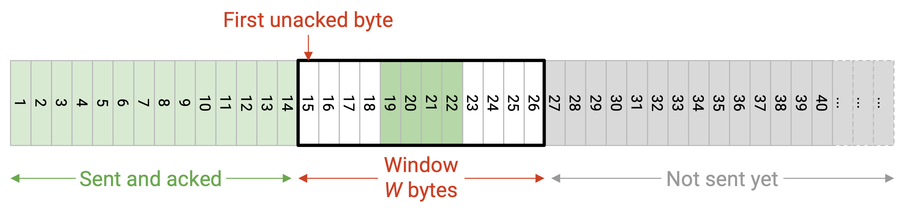

回忆一下，window size（决定 window 右边界）受 flow control 和 congestion control 限制。在 flow control 的情况下，window size 由 recipient advertised window 决定。recipient 会根据接收端可用的 buffer 空间大小决定 advertised window。

## 检测丢失并重发数据

数据重发有两个触发条件。只需要满足其中一个条件（不需要两个都满足），就会触发重发。

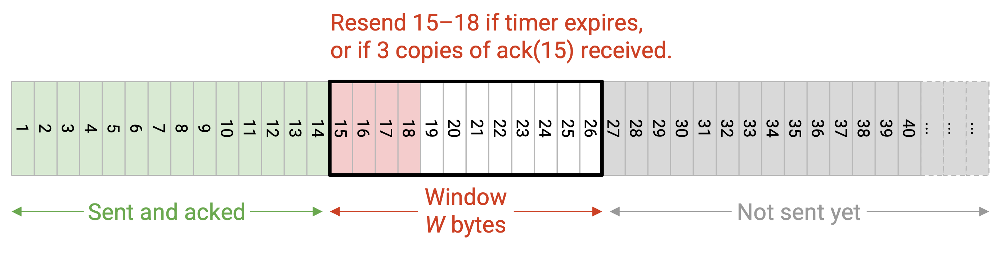

第一个重传触发条件是 timer（数据经过一段时间仍未被确认）。在基于 packet 的 TCP 中，每个 packet 都有一个 timer；如果 timer 过期而该 packet 还没有被 ack，我们就会重发那个 packet。

在基于 byte 的 TCP 中，我们不是为每个 byte 或每个 packet 设置一个 timer，而是只设置一个 timer，对应第一个未确认 byte（window 左侧）。如果 timer 过期，我们会重发最左侧的未确认 segment。回忆一下，timer 长度基于 RTT，而 RTT 是通过测量发送数据到收到 ack 之间的时间来估计的。另外，每当新的 ack 到达（window 发生变化）时，timer 都会被重置。

第二个重传触发条件是：当我们收到后续 packet 的 ack 时，假定某些数据已经丢失。在使用 cumulative ack 的基于 packet 的 TCP 中（TCP 使用的就是这种方式），如果收到 K 个 duplicate ack（K=3 很常见），就会重发某个 packet，因为这表示后续三个 packet 已经被确认。

在基于 byte 的 TCP 中，如果我们收到 K 个 duplicate ack，就会重发最左侧的未确认 segment。

## TCP Header

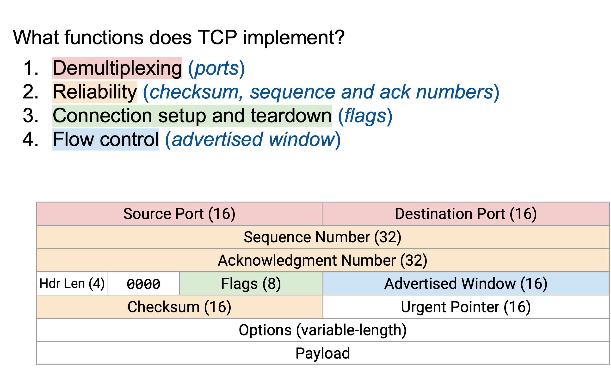

TCP header 有 16-bit source port 和 destination port。

TCP header 有 32-bit sequence number（这个 packet 中第一个 byte 的 byte offset），以及 32-bit acknowledgement number（已经收到的最高连续 sequence number 加一）。

TCP header 对整个数据（不只是 header）计算 checksum，用来检测损坏的数据。

TCP header 包含 advertised window，用来支持 flow control 和 congestion control。

header length 指定 TCP header 中 4-byte word 的数量。假设没有额外 option，这个长度是 5。

flag 是一串可以设置为 1 或 0 的 bit。当某个 bit 被设置为 1 时，对应 flag 被启用。所有人都理解 header 的语义，因此知道哪些 bit 对应哪些 flag。这份笔记里有四个相关 flag。

当 host 正在发送自己的 ISN 时，会打开 SYN（synchronize）flag。这个 flag 通常只在 three-way handshake 的前两个消息中启用。

当 acknowledgement number 相关并用于 ack 数据时，会打开 ACK（acknowledge）flag。如果我想发送数据，但没有收到需要 ack 的数据，我可以关闭这个 flag，告诉对方 host 忽略 ack number。

header length 后面有 6 个 reserved bit，它们总是设置为 0。你可以放心忽略它们。

urgent pointer 可以用来把某些 byte 标记为 urgent，告诉 recipient 尽快把这些数据发送给应用。这是一个历史字段，我们不会进一步讨论。

TCP header 可以在末尾附加额外 option（这会让 header 更长），但这门课会忽略 option。例如，如果你想实现 full-information ack，可以在 header 中加入一个称为 selective acknowledgement (SACK) 的 option。
