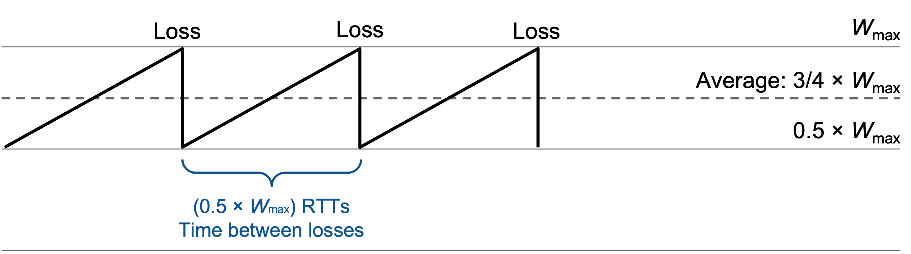
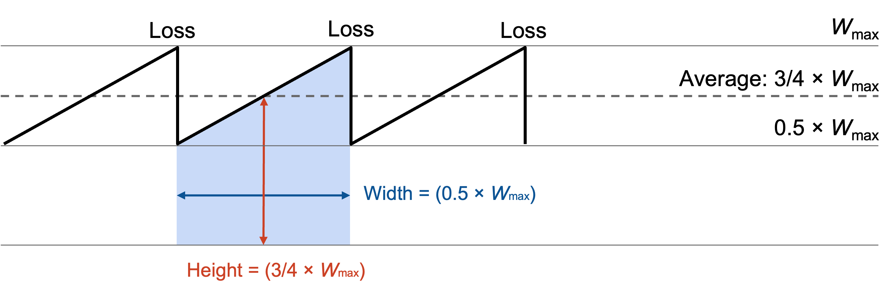
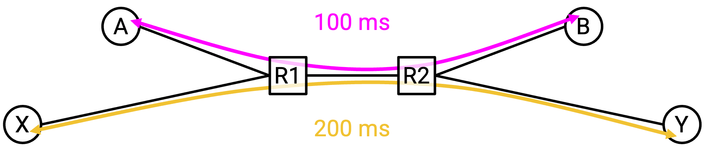

# TCP Throughput 模型

## 建模假设

在前面几节中，我们开发了一个 congestion control 算法。这个算法告诉我们如何响应 congestion 来调整速率，但它并没有真正告诉我们这个速率是多少。

在这一节中，我们会建立一个模型，用来估计某个 TCP connection 沿特定 path 的 throughput。具体来说，我们想要一个简单方程，把 throughput 表示为 path 的 RTT 和 loss rate 的函数。这个方程可以让运营者和客户估计 TCP connection 的速率。

为了简化模型，我们做几个假设：只有一个 TCP connection。忽略 slow-start 阶段。假设 RTT 是某个固定值。

当 window size 达到最大 bottleneck bandwidth \(W_\text{max}\)（某个常数）时，我们假设正好出现一个 packet loss。因为只丢失一个 packet，所以 loss 会通过 duplicate ack 检测到（没有 timeout）。

## 用 Window Size 表示 Throughput

在这个简化模型中，当 window size 达到 \(W_\text{max}\) 时，我们检测到 loss，并且 window size 因此变成 \(\frac{1}{2} W_\text{max}\)。

然后，在每个后续 RTT 中，window size 会增加 1：\(\frac{1}{2} W_\text{max} + 1\)，然后是 \(\frac{1}{2} W_\text{max} + 2\)，再然后是 \(\frac{1}{2} W_\text{max} + 3\)，依此类推。最终，window size 会再次达到 \(W_\text{max}\) 并被减半，这个过程会重复。

从 \(\frac{1}{2} W_\text{max}\) 开始并达到 \(W_\text{max}\)，需要 \(\frac{1}{2} W_\text{max}\) 个 RTT（每次迭代加 1，每次迭代是一个 RTT）。这也告诉我们，每两次 loss 之间有 \(\frac{1}{2} W_\text{max}\) 个 RTT。

在每个 RTT 内，平均 window size 是 \(\frac{3}{4} W_\text{max}\)（正好位于 \(\frac{1}{2} W_\text{max}\) 和 \(W_\text{max}\) 之间）。

这个 window size 以 packet 为单位度量（因为我们每次迭代加 1 个 packet）。每个 packet 可以包含 \(\text{MSS}\) bytes（maximum segment size），所以以 byte 为单位的平均 window size 是 \(\frac{3}{4} W_\text{max} \times \text{MSS}\)。

window size 告诉我们每个 RTT 中可以发送多少数据。因此，为了计算速率，我们用 window size（数据量）除以 RTT（时间），得到平均速率 \(\frac{3}{4} W_\text{max} \times \frac{\text{MSS}}{\text{RTT}}\)。

## 用 Loss Rate 表示 Throughput

到目前为止，我们的 throughput 方程是：\(\frac{3}{4} W_\text{max} \times \frac{\text{MSS}}{\text{RTT}}\)。

但我们的目标是用 RTT 和 loss rate（记为 \(p\)）来表示 throughput。因此，现在需要用 loss rate \(p\) 来表示 \(W_\text{max}\)。

从前面可知，每隔 \(\frac{1}{2} W_\text{max}\) 个 RTT 就会丢失一个 packet。这是一次 drop 之后重新爬升到 \(W_\text{max}\) 并遇到下一次 drop 所花的时间。

所以，为了确定 loss rate，我们只需要弄清楚在 \(\frac{1}{2} W_\text{max}\) 个 RTT 中发送了多少 packet。

从图形上看，发送的 packet 数量就是这个形状的面积（rate times time），等价地说，是曲线下方的面积（曲线表示 rate，而我们想要 rate 的积分）。

我们之前知道，平均 window size 是 \(\frac{3}{4} W_\text{max}\)，所以这是每个 RTT 发送的 packet 数量。因此，在 \(\frac{1}{2} W_\text{max}\) 个 RTT 中，我们预计发送 \((\frac{1}{2} W_\text{max}) \times \frac{3}{4} W_\text{max} = \frac{3}{8} W_\text{max}^2\) 个 packet。

既然知道了两次 loss 之间发送的 packet 数量，就知道 loss rate 等于一个丢失的 packet 除以两次 loss 之间发送的 packet 数。（例如，如果两次 loss 之间发送 100 个 packet，那么 loss rate 大约是 1/100。）

因此，我们的 loss rate 是 \(p = 1 / (\frac{3}{8} W_\text{max}^2) = \frac{8}{3W_\text{max}^2}\)。

现在，我们有了 \(W_\text{max}\) 和 \(p\) 之间的关系，所以只需要做代数变换，把 \(W_\text{max}\) 用 \(p\) 表示出来。

$$\begin{align*}
    p &= \frac{8}{3W_\text{max}^2} \\
    3W_\text{max}^2 p &= 8 \\
    W_\text{max}^2 &= \frac{8}{3p} \\
    W_\text{max} &= \frac{2\sqrt{2}}{\sqrt{3p}}
\end{align*}$$

现在，我们可以再做一些代数变换，把前面的 throughput 方程中的 \(W_\text{max}\) 替换为 \(p\)：

$$\begin{align*}
    \text{throughput} &= \frac{3}{4} W_\text{max} \times \frac{\text{MSS}}{\text{RTT}} \\
    &= \frac{3}{4} \left(\frac{2\sqrt{2}}{\sqrt{3p}}\right) \times \frac{\text{MSS}}{\text{RTT}} \\
    &= \sqrt{\frac{3}{2}} \times \frac{\text{MSS}}{\text{RTT}\sqrt{p}}
\end{align*}$$

## 方程的含义

现在我们有了一个用 RTT 和 loss rate 表示 throughput 的方程。它告诉我们什么？

throughput 与 loss rate 的平方根成反比。直觉上，如果 loss rate 更高，那么 throughput 更低。这说得通，因为丢失更多 packet 意味着 window size 会更频繁地被减半。

throughput 与 RTT 成反比。直觉上，如果 RTT 更低，那么 throughput 更高。这也说得通，因为每次收到 ack 时 window size 都会增加，而更低的 RTT 意味着我们更频繁地收到更多 ack。

如果有多个 RTT 不同的 connection，RTT 和 throughput 之间的这种关系可能会成为问题。

RTT 更低的 connection 会更快收到 ack，这意味着这个 connection 也会更快增加自己的 window size，并更快发送 packet。在这种情况下，结果是低 RTT connection 得到的带宽是高 RTT connection 的两倍。

从根本上说，当 RTT 不同质（不相同）时，TCP 是不公平的。更短的 RTT 会改善传播时间，但它也帮助 TCP 更快提升速率。我们接受这是 TCP 的一个特性，实践中也不会对此做什么。

## Rate-Based Congestion Control

我们的 congestion control protocol 会产生不平滑的 throughput。如图所示，速率会在 W/2 和 W 之间反复摆动。有些应用不喜欢这种不断变化的速率，更希望以稳定速率发送数据（例如流媒体应用）。

对这些应用来说，一个可能的解决方案是 **equation-based** 或 **rate-based congestion control**。它放弃动态调整速率的规则，而是直接遵循方程。为了以平滑速率发送数据，你可以测量 RTT 和 loss rate，把它们代入 throughput 方程，并持续以计算出的速率发送。这个方案也保持公平性（不会占用过多带宽），因为这个方程确保我们消耗的带宽不会超过类似场景下 TCP 会消耗的带宽。（更多细节见 RFC 5348。）

形式化地说，如果替代实现（包括 rate-based congestion control 以及其他方案）能通过在必要时降低速率而与 TCP 良好共存，就被认为是 **TCP-friendly**。TCP-friendly 的替代算法会带来公平的带宽共享，即使一些 host 运行 TCP，而另一些 host 运行替代算法。
