# Cellular

## 为什么学习 Cellular？

无线移动连接已经是现代标准。你的手机可以在你坐车移动时连接到 Internet。

传统 Internet network 无法支持这一点。你也许可以从卧室走到厨房，同时仍然能访问 Internet。在这种情况下，你仍然处在家用 wireless router 的覆盖范围内，而这个 router 再通过有线连接到 Internet 的其他部分。然而，传统 Internet 并不提供跨越大范围距离的无缝连接，例如在车里移动时保持连接。

实现无线移动连接有很多方式，但 cellular 是今天占主导地位的 access technology。今天超过一半的 web traffic 都来自 cellular device。

cellular 只是能提供移动无线连接的众多技术之一。其他技术也存在，例如 satellite 和 free-space optics，不过 cellular network 仍然是今天的主流方式。

未来，自动驾驶汽车、virtual reality 这类需要无线移动技术的高性能应用，可能推动更多创新。随着我们尝试扩展当前 cellular network 来支持未来应用，它们可能会变得过于昂贵。此外，AT&T 和 Verizon 这样的 cellular network operator 并不以快速创新著称。普遍共识是，这个领域在不久的未来很适合被颠覆，也仍然是活跃的研究方向。

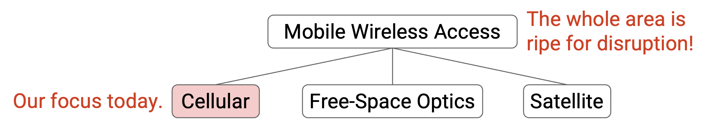

## Cellular Network 简史

cellular technology 源自旧电话系统。cellular network 最初是为了让用户无线打电话，而不是使用有线座机。第一部移动电话在 1983 年售出，价格为 \$4,000（考虑通胀后今天会贵得多）。

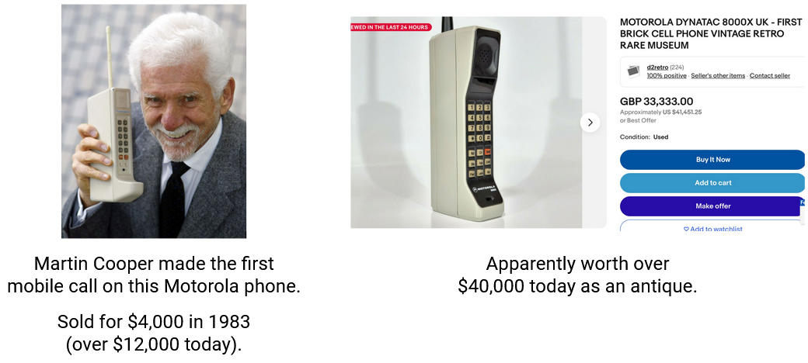

因为 cellular technology 是从电话网络（而不是 Internet）演化而来的，许多设计选择与传统 Internet 不同。多年来，cellular technology（例如智能手机之前用于语音通话的手机）和 Internet 并行发展，各自采用不同的架构选择。

例如，cellular network 使用 resource reservation，而现代 Internet 使用 packet switching。cellular network 往往以单个用户为中心思考，而 Internet 主要以单个 flow 或 packet 为中心思考。cellular network 的商业模式（例如按通话分钟计费）也不同于 Internet，后者通常不会如此细致地跟踪用量。

近年来，cellular network 变得更兼容传统 Internet。今天，你可以把 cellular network 理解为一种特殊的 Layer 2 local network，它可以和传统 TCP/IP Internet 的其他部分交互。

## Cellular 标准

在传统 Internet 中，我们看到标准组织帮助我们标准化 TCP 和 IP 等 protocol。cellular network 也有许多标准组织，它们合作生成标准。

在某些方面，cellular network 标准组织比 Internet 标准组织具有更多现实世界中的政治复杂性。为了实现 interoperability，所有手机制造商和所有 network operator（例如 Verizon 建设 cell tower）都需要就 protocol 达成一致，一直下探到 physical layer。

cellular 世界中的关键标准组织是 3GPP (3rd Generation Partnership Project)。大型设备供应商和电信公司都会参与这个组织。3GPP 提出标准，然后这些标准会转交给 ITU (International Telecom Union)。ITU 是联合国的一部分，每个国家都有一票，因此标准制定也会牵涉一些政治因素。（趣闻：每个国家都有一票，所以美国可能被欧盟国家联合投票压过。）

通常，每 10 年会引入一代新技术。现在你知道 2G、3G、4G 和 5G 中的数字代表什么了：它们是 cellular technology 的代际。5G network 大约在 2020 年定义，operator 仍在部署这项技术。6G 标准的规划将在未来几年（2020 年代后期）开始。

每一代都会尝试在多个维度上改进上一代，包括 peak theoretical data rate、用户体验到的 average data rate、mobility（用户高速移动时保持连接）、connection density（特定区域内的设备数量）等等。通常，每一代在这些维度上都会比上一代好大约 10 倍。

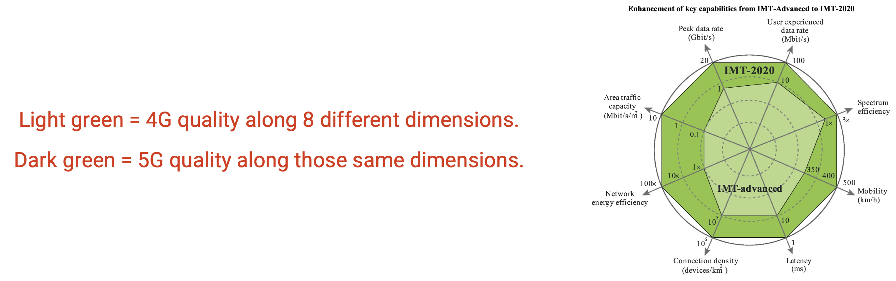

除了性能提升，架构设计也随着代际演进，从电话网络设计逐渐转向 Internet 设计。1G 手机是纯模拟的，面向语音通话。2G/3G 仍然主要是 circuit-switched，重点是 voice traffic（有一点短信，几乎没有 Internet traffic）。从 4G 开始，我们转向 packet-switched architecture，voice 现在只是运行在网络上的众多 application 之一。

cellular specification 有数千页，包含数百份文档，几乎没有人会完整阅读它们。这些标准有一个不方便的特点：每换一代，所有东西都会改名。例如，cellular tower 曾被称为「base station」「nodeB」「evolved NodeB (eNodeB)」和「next-gen Node B (gNB)」，它们都表示同一类东西。在这门课里，我们会发明自己的术语，让名称更直观。如果你阅读 textbook 或 specification，可能会看到不同名称，但我们讨论的思想通常会与 textbook 和 spec 在概念上保持一致。

## 关键挑战：Mobility

让 cellular network 困难起来的关键挑战是 mobility。记住，可以把 mobility 想成你的手机在你沿高速公路移动时播放视频（不过开车时不要看视频）。我们会研究四个基本挑战：

1. Discovery：当我在移动时，怎么知道应该连接哪座 cell tower？

2. Authentication：AT&T 的 tower 可能只想为自己的客户提供连接，而不想服务其他客户。cell tower 如何做到这一点？

3. Seamless communication：如果我离开一座 tower 的覆盖范围，进入另一座 cell tower 的覆盖范围，我的连接应该是无缝的，不应中断。

4. Accountability：如果客户只购买了 6GB 数据，超过额度后，network 应该停止为客户提供连接（或提供更差的连接）。这个需求来自旧 cellular network（按语音通话分钟计费），并且仍然存在，因为 cellular network 中的资源是稀缺的。

## 基础设施组件：Radio Tower

cellular network 由哪些组件组成？首先是 radio tower。

radio tower 有 antenna。tower 内部有 radio transceiver，它会把 digital bit 转换成通过 air interface 发送的 analog signal。

tower 内部还有 radio controller，负责决定如何分配 radio resource。

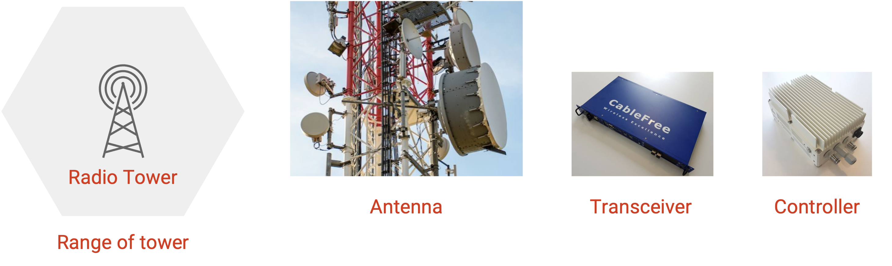

你可以把 controller 想成运行 scheduler 的 CPU。controller 会根据需求和商业模式（例如客户付了多少钱），把不同的 frequency 和 time segment 分配给不同客户。这其实是一个相当困难的调度问题，不过这里不再展开。

下面是 radio controller 分配资源的简化模型。每个彩色矩形表示某个用户（用颜色表示）可以在特定 time 使用特定 frequency。

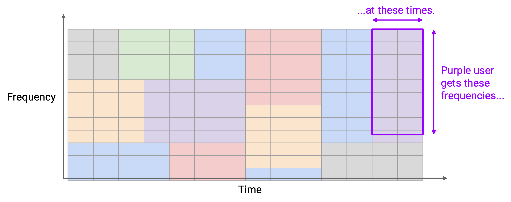

每个垂直切片表示一个 time slot，并展示该切片中 frequency 如何分配给用户。例如，在第一个 time slot 中，蓝色用户获得 3 个 frequency slot，橙色用户获得 5 个 frequency slot，灰色用户获得 4 个 frequency slot。

每个水平切片表示一个 frequency，并展示这个 frequency 如何随时间分配给用户。例如，最上面一行展示一个 frequency 先分配给灰色用户，之后分配给绿色用户，再之后分配给蓝色用户，再之后分配给红色用户，依此类推。

注意，这个模型用 reservation 共享资源，而不是 best-effort。用户只能在 controller 分配给自己的 frequency 和 time 中发送。

传统上，radio controller 安装在 tower 内或 tower 附近。不过现在已经有工作把 controller 移到 cloud 中，以便更容易维护和管理。

每个 operator 都会运行许多 cellular tower，分布在全国各地，这样用户无论在哪里都能连接到一座 tower。结果就是 Radio Access Network (RAN)。

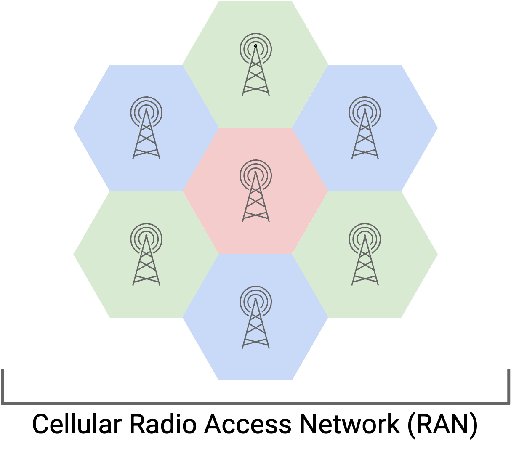

通常，每座 tower 都会获得自己可用的一组 frequency，并且 frequency 的分配会让相邻 tower 使用不同的 frequency range。这样可以确保相邻 tower 不使用相同 frequency，从而避免互相干扰。在图中，每种颜色对应一组 frequency。两座 tower 可能都使用蓝色 frequency set，但只要它们不是相邻的，就不会互相干扰。所有相邻 tower 都使用不重叠的 frequency。注意，frequency 通常会按需求分配，所以旧金山市中心的 cell tower 会比荒郊野外的 cell tower 获得更多 frequency。

## 基础设施组件：Cellular Core

移动用户现在可以把数据发送到 cell tower。cell tower 接下来需要把这些数据发送到 Internet 的其余部分。

每座 cell tower 都有一条到 cellular core 的有线连接。你可以把 cellular core 理解为 cellular network 的后端基础设施（不直接面向用户）。

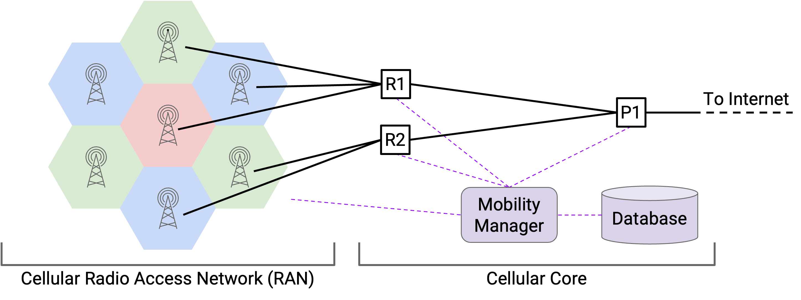

cellular core 包含一些 data-plane component。你可以把它们想成普通 router 和 switch，用来在用户（经由 tower）和网络其余部分之间转发 packet。我们会关注 cellular core 中两种特殊 router。

radio gateway 是 RAN（cell tower）和 cellular core 之间的边界。cell tower 会把数据转发到这些 radio gateway 之一。在 core 的另一端，packet gateway 是 cellular network 和 Internet 其余部分之间的边界。来自用户的数据最终到达 packet gateway，并作为标准 TCP/IP packet 发送到 Internet。

cellular core 还包含一些 control-plane component。传统 Internet 中没有这些组件。用户 traffic 不会到达这些组件。我们会关注两个 control-plane component。

database 存储关于客户的信息，例如：客户拥有哪些设备？客户拥有什么 data plan？客户的设备现在在哪里（例如连接到哪座 tower）？

mobility manager 是一个 controller（可以理解为 CPU），负责管理 network functionality。manager 帮助我们认证用户，例如检查用户是否真的是 Verizon 客户。manager 也帮助我们在用户移动时更新配置。

总结一下基础设施：用户设备把数据发送到 RAN 中的 cell tower。cell tower 把数据转发到 radio gateway（进入 core）。数据最终到达 packet gateway，并被转发到 Internet（离开 core）。core 中还包含 control component（mobility manager、database），用于存储和管理客户信息。

## Cellular Operation 的高层步骤

Step 0：Registration。用户注册 cellular service。例如，你走进 Verizon 门店，购买 data plan 并签合同。operator 现在把你和你的服务计划的信息存入 database。

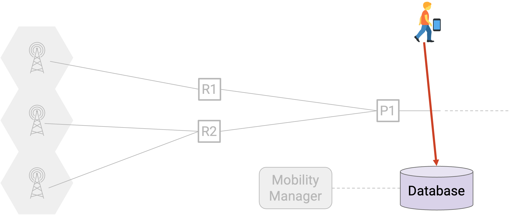
 
Step 1：Discovery。用户在荒郊野外打开手机。手机必须发现附近有哪些 tower 可用，并选择一座 tower 使用。

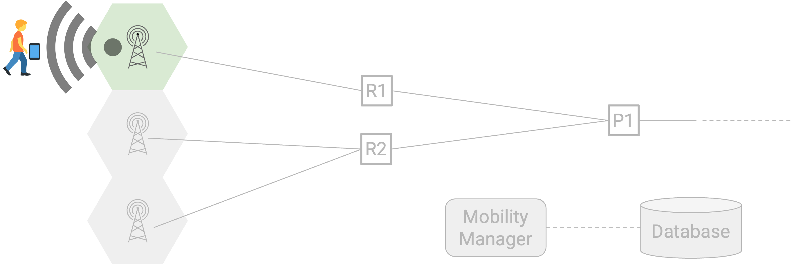

Step 2：Attachment。选择 tower 之后，用户设备告诉 tower 自己想连接。tower 必须询问 mobility manager 是否允许连接，例如检查用户是否超过额度。

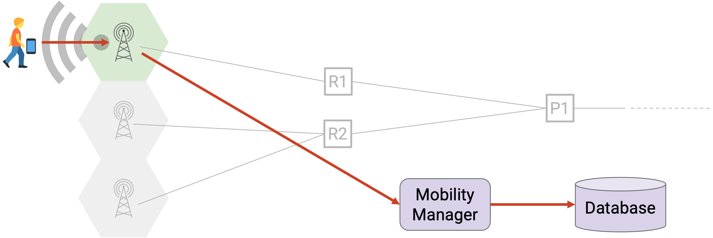

如果 authentication 通过，mobility manager 就会配置 tower 和 router，建立从用户到 Internet 的路径（经由 tower 和 router）。

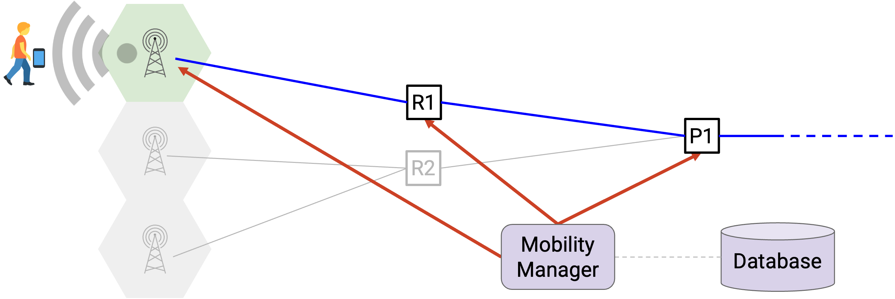

Step 3：Data exchange。用户现在可以沿着配置好的路径发送和接收数据。

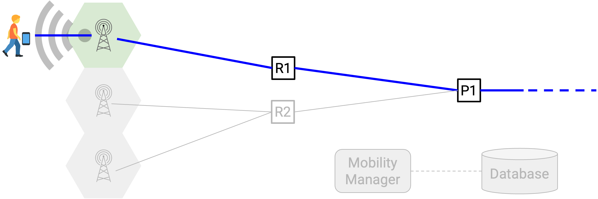

Step 4：Handover。随着用户移动，他们可能离开原先 tower 的覆盖范围，并靠近同一 operator 的 RAN 中的新 tower。旧 tower、新 tower 和用户设备会共同决定用户是否应该切换 tower。

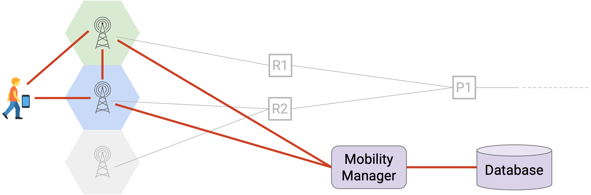

如果所有参与方都同意用户应该切换 tower，它们会通知 mobility manager；mobility manager 会重新配置 tower 和 router，建立从用户到 Internet 的新路径（现在使用新 tower，也可能使用不同的 router）。这个 handoff 必须是 seamless 的，也就是说，用户可能在整个过程中都在发送和接收数据，并且不应该被打断。实现这种 seamless handoff 要求 network 持续照看用户设备。

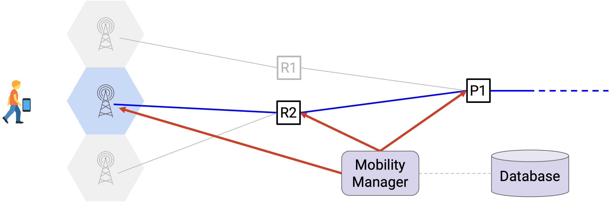

随着用户移动，Step 3 和 Step 4 可以反复发生，并且最适合使用的 router 会不断变化。

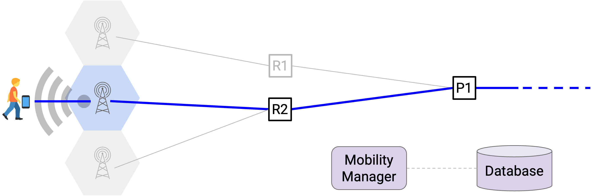

我们还需要实现的最后一个功能是 roaming。如果用户去了德国这样的其他国家，他们自己的 operator（例如美国的 Verizon）可能在德国没有覆盖。不过，Verizon 可能会和 Deutsche Telecom（德国的 operator）签合同，允许 Verizon 客户使用 Deutsche Telecom 的基础设施。这意味着 Deutsche Telecom 可能不仅需要支持自己的用户，也要支持 Verizon 等其他 network 的用户。

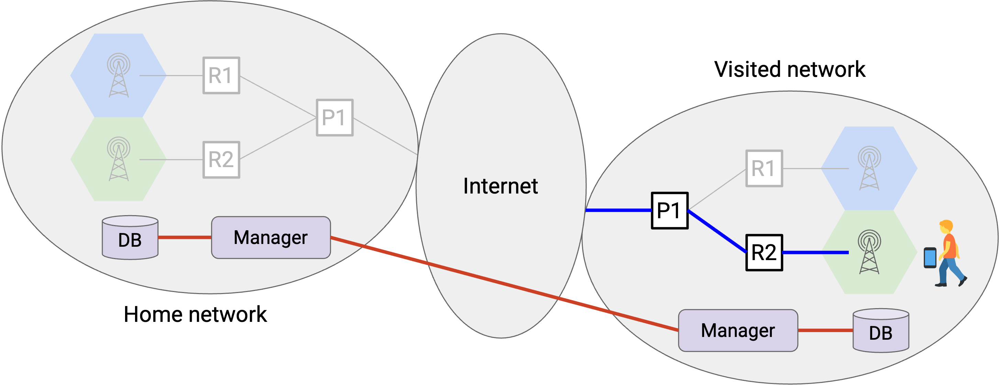

在 visited network 中连接（roaming 时）的步骤通常很相似，只不过 visited network 和 home network 中的 mobility manager 还必须彼此协调，例如 Deutsche Telecom 要向 Verizon 确认用户是否支付了 roaming 费用。

## Step 0：Registration

当你注册 data plan 时，会获得一个 IMSI (International Mobile Subscriber Identity)，它是与你的 subscription 关联的唯一标识符。这个号码安全地存储在 SIM card 的硬件中。

注意：这就是为什么 Verizon 这样的 operator 会给你一张 SIM card，让你插进手机。如果你换手机但保留同一个 plan，只需要把 SIM card 转移到新手机中，新手机就会关联到同一个 IMSI number。或者，如果你换 plan 但使用同一部手机，就把新的 SIM card 放进手机，此时这部手机会关联到新的 IMSI number。

IMSI 的前 3 位是 Mobile Country Code，用来识别国家。接下来的 2 到 3 位是 Mobile Network Code，表示你的 service provider（例如 Verizon、AT&T）。剩余位数是 Mobile Subscriber Identification Number，用来识别该 service provider 内的具体用户。整个 IMSI 不能超过 15 位。

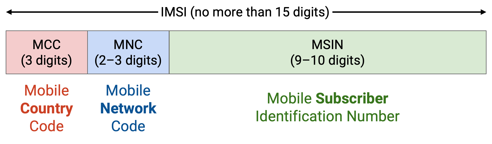

注意，IMSI 与 IP address 不同。如果你购买了一整年的 data plan，你全年都会保留同一个 IMSI。但每次 attach 并连接到 network 时，你可能会获得不同的 IP address。

cellular network 中还使用另外两个 identifier。它们与 IMSI 不同，这里不会详细介绍。IMEI (International Mobile Equipment Identity) 唯一标识一台物理设备。IMEI 编码设备制造商和型号（「这是一台 iPhone 13」），即使你更换 data plan，它也保持不变。或者，如果你有两部手机共用同一个 data plan，那么你会有两个 IMEI number，但只有一个 IMSI。

另一个 identifier 是你的 phone number。同样，它不同于 IMSI 或 IMEI，而且数字代表的含义也不同，例如 area code。电话网络需要把你的 phone number 与某个具体 IMSI 关联起来，从而确定你的 phone plan。

注册并获得 IMSI 后，operator（例如 Verizon）会把你的 IMSI 和 plan 信息存入 database。

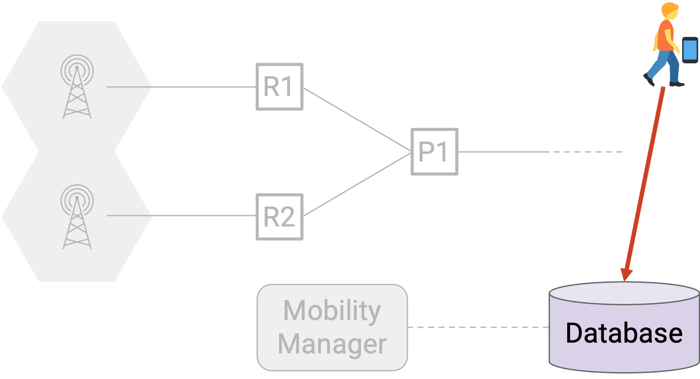

registration 期间，用户设备（SIM card）和 operator（database）也会约定一个 shared secret key。后面执行 attachment 时会用到它。

## Step 1：Discovery

用户设备如何发现哪些 tower 在范围内，并且属于用户的 operator？

每座 tower 都会周期性发送 beacon（hello message），告诉范围内的所有人这座 tower 存在。beacon message 还包含 network operator（例如「hello，我是 Verizon tower」），其中 operator 由 2 到 3 位的 Mobile Network Code 标识。记住，设备的 IMSI（在 SIM card 上）也有 Mobile Network Code，所以设备可以检查：我的 SIM card 说我属于 network 220，而这座 tower 的 beacon 也说它属于 network 220，所以我可以使用这座 tower。

beacon 在一个特定 frequency 上发送，这个 frequency 称为 control channel，这样 beacon 不会干扰数据传输。每个 frequency range 都有自己的关联 control channel。回忆一下，相邻 tower 拥有不重叠的 frequency range，这也意味着它们有不同的 control channel（避免干扰）。

用户设备可能听到许多 beacon。用户会测量到不同 tower 的 signal strength，并选择信号最好的、属于自己 operator 的 tower。

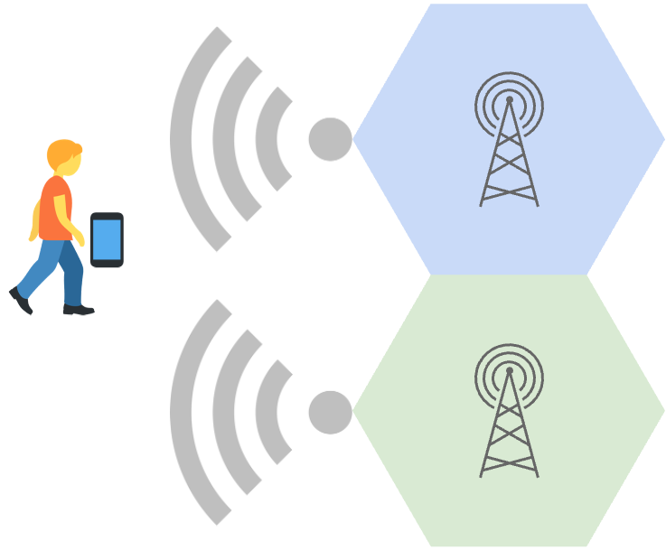

这里有一个必须解决的问题：用户设备如何知道该监听哪个 control channel？设备需要调到 control channel 上才能接收 beacon。这是一个 bootstrapping problem。

这个问题有几种解决方法。设备可以直接扫描并尝试很多 frequency（很慢，但有时是唯一选择）。operator 也可能在 registration 期间给设备一个预配置的 control channel 列表。设备也可以缓存之前使用过的 channel。

注意，在 discovery 之后扫描后续 tower 通常不是必要的。handover 期间，旧 tower 会明确告诉用户在新 tower 上使用哪个 data frequency。这就是为什么 handover（约 0.01 到 0.1 seconds）比 discovery 期间的扫描（约 10 到 100 seconds）快得多。

## Step 2：Attachment

1. 用户发现一座 tower 后，会向这座 tower 发送 attach request。用户会在 request 中包含自己的 IMSI（subscriber ID）。

2. tower 必须把 request 发送给 mobility manager，由它实际处理 request。

3. manager 在 database 中查找 IMSI，了解用户 service plan 的细节。manager 还会使用设备和 manager（在 database 中）都知道的 secret key 来执行 authentication（这里省略 cryptographic detail）。

如果 authentication 成功，我们就知道用户确实是其声称的身份。如果 database lookup 也显示用户有资格获得服务，那么 manager 会批准 attach request。

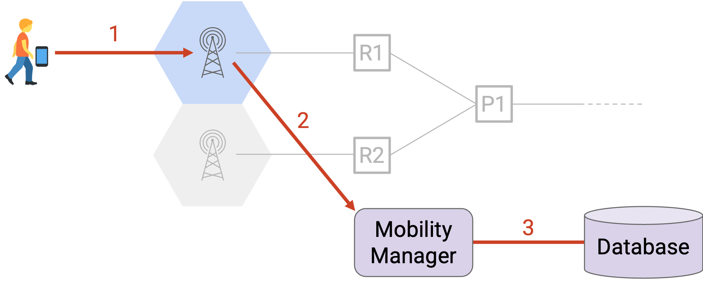

4. attach request 获批后，mobility manager 现在必须配置 data plane，为用户提供 connectivity。首先，manager 给设备分配 IP address。然后，manager 配置 tower，告诉 tower radio controller 应该为这个用户分配多少资源。manager 还会配置 tower 和 router，在设备和 Internet 之间创建路径。最后，manager 初始化 counter 和 shaper，用于跟踪设备的 Internet 使用量。

设置完用户的 connectivity 后，manager 最后会把用户的位置信息记录到 database。具体来说，database 会把用户的 IMSI 映射到其 IP address 和当前使用的路径（哪座 tower、哪些 gateway）。

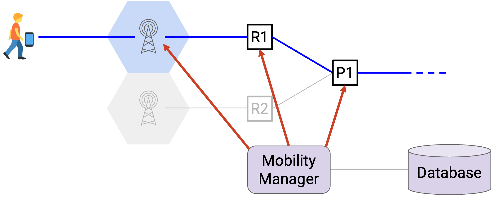

注意，整个 attachment 过程都发生在 control channel 上。我们还没有给用户分配任何 frequency，所以用户必须使用专用的 control channel 通信。

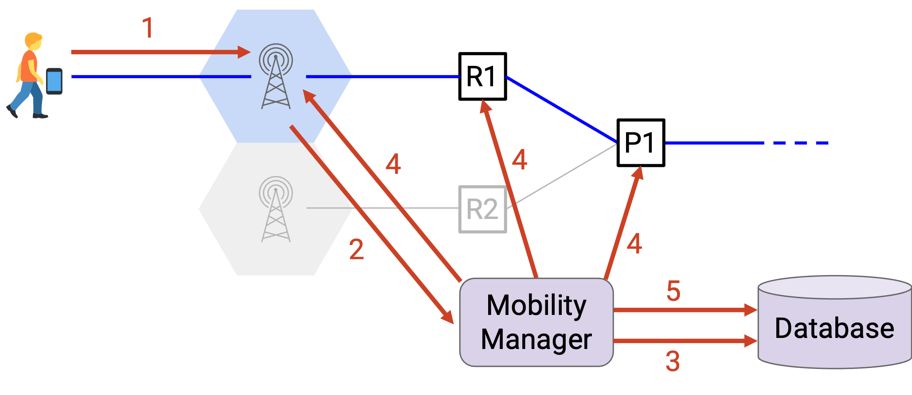

## Step 3：Data Exchange

此时，network 已经配置好，设备可以使用自己的 IP address 发送和接收 message。

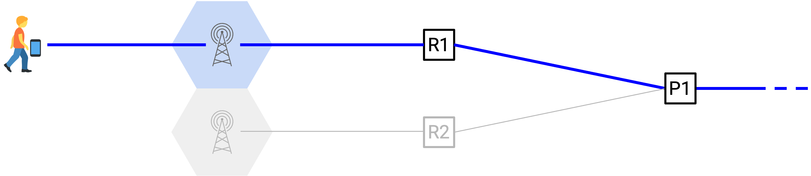

cellular network（tower、radio gateway、packet gateway）如何知道怎样转发 packet？用户一直在移动，所以如果我们运行传统 routing algorithm，例如 distance-vector，route 永远无法 converge。

相反，manager 会使用 tunnel 在设备和 Internet 之间创建路径。记住，packet 的路径是从设备到 tower，再到 radio gateway，再到 packet gateway。

从概念上说，为了实现 tunnel，我们会告诉 tower：如果你收到来自用户的 packet，就把它这样发送（进入蓝色 tunnel）。在有线 link 的另一端，packet 会离开蓝色 tunnel，到达 radio gateway。然后我们告诉 radio gateway：如果你收到一个离开 tunnel 的 packet，就把它这样发送（进入绿色 tunnel）。packet 接着穿过绿色 tunnel，到达 packet gateway，packet gateway 可以把它转发到 Internet。

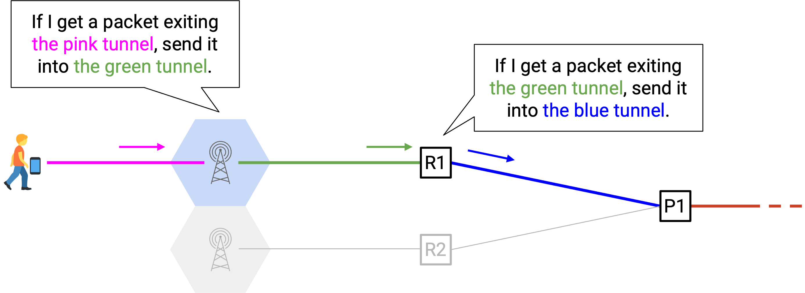

incoming packet 也会通过 tunnel 传输。我们告诉 packet gateway：如果你收到一个发往 User A 的 packet，就把它送入绿色 tunnel（朝 radio gateway）。我们也告诉 radio gateway：如果你收到一个离开绿色 tunnel 的 packet，就把它送入蓝色 tunnel（朝 tower）。

注意，网络组件并没有运行 routing protocol 来寻找路径。相反，manager 在告诉 router 如何转发 packet。每个用户都需要自己的一组 tunnel，所以 network 会存储 per-user state，例如每个已连接用户对应一条 table entry。

我们实际如何实现这些规则？例如，radio gateway 如何知道一个 incoming packet 正在离开蓝色 tunnel？可以使用 encapsulation。进入 tunnel 时，我们可以添加一个新 header，说明这个 packet 正在通过某个 tunnel（例如「这个 packet 正在通过蓝色 tunnel」）。在另一端，当 packet 离开 tunnel 时，gateway 查看这个额外 header，就知道 packet 来自哪个 tunnel。gateway 随后可以用这些信息决定下一步把 packet 转发到哪里。

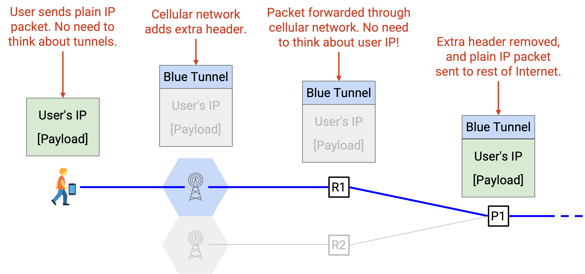

注意，使用 tunnel 和 encapsulation 后，router 从来不会基于用户的 IP 转发。用户一直在移动，所以我们不能用用户 IP 来确定用户位置。相反，我们必须使用这些预配置的 tunnel 来决定 packet 转发路径。

## Step 4：Handover

如果用户从一座 tower 移动到另一座 tower，会发生什么？我们看一个略微简化的 protocol。这里把两座 tower 称为 old 和 new，并从 old tower 移动到 new tower。

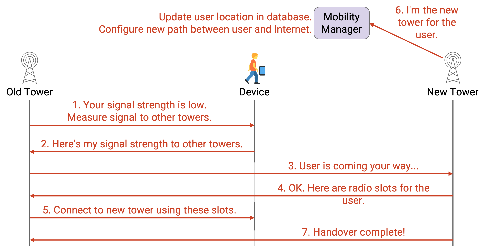

1. 你的设备会不断测量自己到 old tower 的 signal strength，并把这个强度报告给 old tower。某个时刻，old tower 会说：你的 signal strength 太低了。这里有一些附近的 tower（属于同一 operator）以及它们对应的 control channel frequency。你能测量一下到这些附近 tower 的 signal strength 吗？

2. 你的设备测量到这些附近 tower 的 signal strength，并把这些值报告给 old tower。old tower 会根据 operator 想要的任何 policy 选择最佳 new tower。

3. old tower 告诉 new tower：这个用户要过去了。这会让 new tower 为用户分配一些 frequency resource。

4. new tower 告诉 old tower 分配了哪些 frequency resource。

5. old tower 告诉用户：使用这些 frequency 连接到 new tower。

6. new tower 向 mobility manager 报告：我是这个用户的新 tower。manager 更新 database 中的用户新位置。manager 还会更新 tunnel，在用户和 Internet 之间创建新路径（通过新 tower，也可能通过新的 radio gateway 和 packet gateway）。

7. 最后，new tower 告诉 old tower handover 已完成。

为什么 handover 过程这么复杂？记住，我们希望用户在 tower 之间移动时获得无缝通信，不发生中断。这需要用户、old tower、new tower、mobility manager 和 gateway 之间协作。

seamless communication 很难，因为 handover 过程不是 atomic。handover 进行时，用户仍在发送和接收数据。例如，外部 server 回复用户时，可能已经向 old tower 发送了一批 incoming packet。在 handoff 期间，old tower 会继续 buffer 为该用户收到的任何数据。handoff 之后，old tower 可以把这些 buffered data 发送给 new tower，再由 new tower 转发给用户。注意，传统 TCP/IP network 不需要像这样 buffer 数据。这种 buffering 是为了在用户移动时实现 seamless handover 而新增的功能。

注意，handover 过程中的决策始终由 operator 做出。设备不能选择下一座要使用的 tower。这个设计的好处是给 operator 更多控制。例如，如果一座 tower 过载，operator 可以进行 load-balance，把用户送到另一座 tower。或者，如果某些用户优先级高于其他用户，operator 可以把优先级较低的用户送到更差的 tower。这个设计的缺点是稍慢，需要更多 round-trip，也更复杂。

注意，handoff 期间用户的 IP address 保持不变。我们只是更新 tunnel，让发往用户 IP 的 packet 走不同路径。

handover 很复杂，并且需要更新 network 中的 per-user state。如果用户数量增加，或者用户移动得非常快，这个 protocol 会遇到可扩展性挑战。尽管如此，现代 cellular network 在规模化方面运作得相当好，因为这些 protocol 已经投入了大量优化工作。这也是为什么标准规范经常长达数千页。

## Roaming

回忆一下，如果用户访问另一个国家（或任何自己 operator 没有覆盖的地方），可以 roam 并连接到另一个 network。

在 visiting network 中的连接过程（discovery、attachment、handover）通常与在 home network 中连接非常类似。主要区别是，visitor network 中的 mobility manager 必须与 home network 中的 mobility manager 通信。

例如，visitor 需要请求 home 帮助认证用户（检查用户是否支付了 roaming）。此外，visitor 还需要把 tracking data 发回 home network，让 home network 知道用户位置。

visitor 如何知道 home network 在哪里？记住，在 attachment 期间，设备会出示 IMSI，而 IMSI 包含 Mobile Network Code，用来识别用户的 operator。

在用户和 Internet 之间建立 tunnel 有两种不同方法。

在 home routing 方法中，traffic 通过 home network 的 packet gateway 进行 tunnel 传输。这意味着所有 packet 都必须先从 visiting network 回到 home network，再转发到更广泛的 Internet。这样做的好处是，home network 的 packet gateway 可以跟踪用户。一个缺点是，如果你是美国用户，在德国 roaming，并且想访问德国的网站，你的 packet 必须先从德国回到美国 gateway，然后再回到德国。

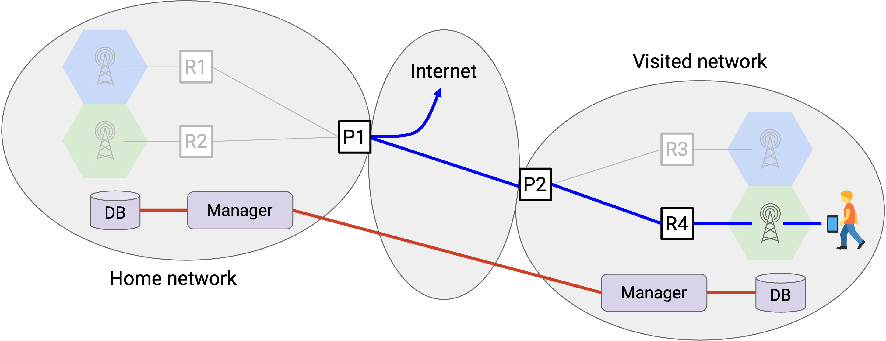

在 local breakout 方法中，traffic 通过 visiting network 的 packet gateway 进行 tunnel 传输。这样可以缩短用户和 Internet 之间的路径，因为 packet 不必先一路回到 home network。然而，这会让用户用量的 accounting 更复杂，因为 roaming network 现在必须完成 accounting，并把数据发回 home network。

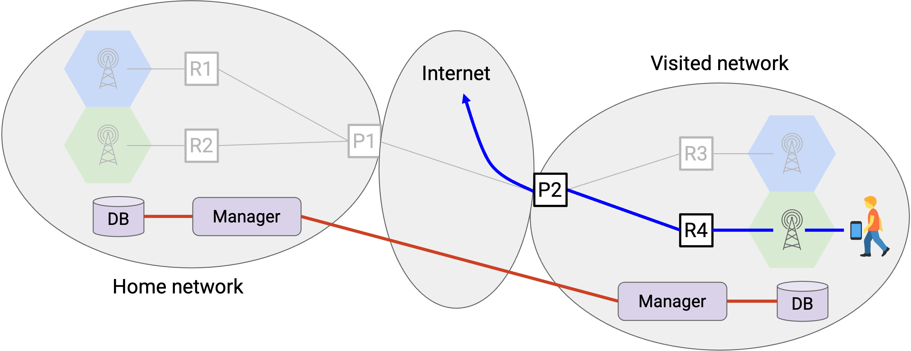

## 其他 Operation

我们已经看到 cellular network 中的一些关键 operation，不过还存在其他 operation。

lawful intercept 是所有 cellular operator 的法律要求。它允许持有搜查令的政府 wiretap 你的连接，并监听你发送的 packet。

stolen phone registry 允许用户报告手机被盗。然后，如果小偷尝试把你的被盗手机连接到 network，operator（manager 和 database）会发现这部手机被盗，并尝试追踪手机。这里，operator 使用 IMEI（硬编码到手机中的 ID number）来识别具体手机（不依赖 IMSI，也就是 subscriber ID）。设备连接时需要报告自己的 IMEI，让 operator 检查手机是否被盗。

这些额外 operation 之所以可行，是因为 operator 拥有 centralized control，并跟踪所有用户及其位置。

## Cellular Network 设计反思

正如前面提到的，与传统 Internet 相比，cellular network 有不同的基本目标和设计选择。例如，我们看到 authentication 和 accounting 是 cellular network 的核心目标，尽管它们不是传统 Internet 的目标。我们也看到 allocation 基于 reservation，并且 network 维护动态变化的 per-user state。

使用 stateful、reservation-based network 增加了 network 的复杂性。随着用户移动，各组件必须不断重新配置 tunnel。

让我们思考一些可能的替代设计。回忆一下，handover 很复杂，是因为我们希望用户在移动时保持相同的 IP address。如果我们改为在每次 handover 时改变用户的 IP address，会怎样？这样，IP address 实际上反映了用户位置，我们又可以使用传统 routing protocol。然而，TCP 和 HTTP 这样的 higher-level protocol 会失效。记住，TCP 依赖两个正在连接的用户保持相同 IP address。

使用相同 IP address 会增加复杂性，但改变 IP address 会破坏 TCP。一个可能的解决方案是使用一种允许 IP address 变化的 transport-level protocol，例如 Google 开发的 QUIC。这样，即使 IP address 在变化，我们也可以使用 IPv6 header 中的 flow label field 给同一个 flow 中的所有 packet 打标签。
