# Wireless Links

## 无线技术简介

无线通信技术实际上早于 Internet 出现。19 世纪 80 年代，Bell 和 Tainter 的 photophone 尝试用光束无线传输数据。19 世纪 90 年代，Marconi 的无线电报尝试用无线电波传输数据。同样在 19 世纪 90 年代，Bose 也进行了毫米波实验；到了今天，毫米波又重新成为活跃的研究方向。

从概念上看，你可能会把无线通信想象成一些看不见的粒子沿着一条想象中的 link 从 A 点飞到 B 点，但这并不准确。现实中的无线通信更像池塘里的涟漪。当你无线发送数据时，你制造出的涟漪会向外传播，并随着距离变弱。如果其他人也在发送数据，这些涟漪可能会发生相长和相消干涉。涟漪也可能在池塘里的船、池塘边缘之类的物体上反射或折射。

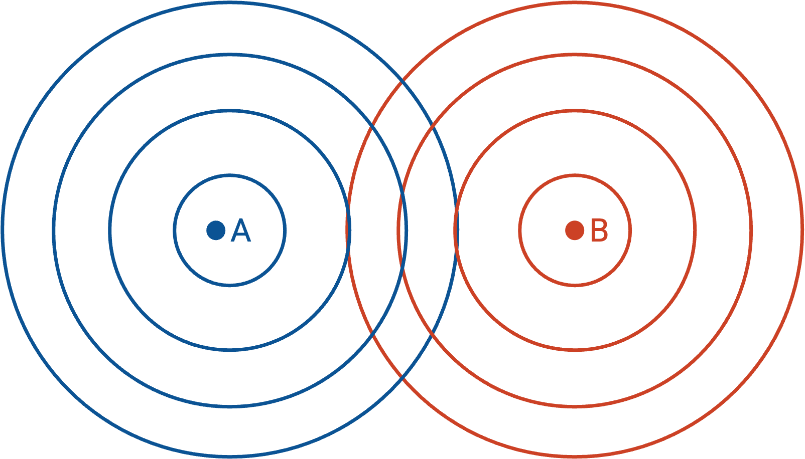

本节会讨论有线通信和无线通信之间的四个关键差异。这些差异主要影响 Layer 1（physical）和 Layer 2（link），不过也有少数例外，我们稍后会看到，例如打破 end-to-end principle，以及为了性能在 Layer 2 实现可靠性。

差异 1：无线本质上是共享介质；有线不是。

差异 2：无线信号会随着距离显著变弱；有线信号不会。

差异 3：无线环境可能快速变化；有线环境通常不会。

差异 4：在无线系统中，packet collision 更难检测。

## 差异：无线是共享介质

差异 1：无线本质上是共享介质；有线不是。

有线 link 默认是私有的，也就是 point-to-point。直观地说，一根线连接两个设备。要创建 multi-point bus，也就是让一根线连接多个设备，需要额外工作。外部信号很难干扰线上的信号，例如我们可以在线外面包一层屏蔽层。在线缆中，我们用电信号传输数据，例如高电压表示 1，低电压表示 0。

无线 link 的性质正好相反。默认情况下，无线 link 是共享的。直观地说，如果你发送一个信号，信号会向所有方向辐射出去。要在两个 host 之间创建私有的 point-to-point link，反而需要额外工作。我们也很难把信号和外部干扰隔离开。无线传输不用电信号，而是用无线电波来编码 bit 并传输数据。

## 在无线 Link 上编码数据

在 Layer 1 中，我们如何把数据编码进电磁波？我们可以直接把一串 1 和 0 画成波形，但得到的波形很可能是低频的，而低频信号弱、难以传输。

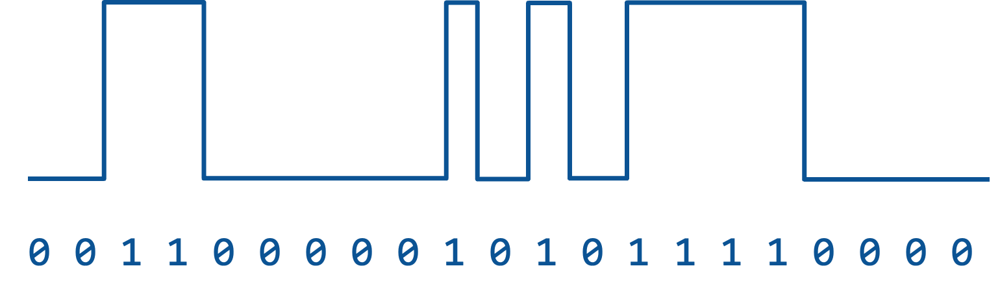

因此，我们必须使用 **modulation（调制）** 来传输数据。首先从 carrier signal（载波信号）开始，它只是一个频率恒定的波，例如正弦波。这个波本身不携带信息，但频率很高，所以更容易传输。然后，我们把数据信号（也称为 modulation signal）叠加到 carrier signal 上。得到的波形既是高频的，容易传输，也包含我们想发送的数据。注意，receiver 需要从调制后的波形中重新提取出 1 和 0。

有多种策略可以把数据信号调制到 carrier signal 上。在 amplitude modulation（AM，幅度调制）中，我们根据输入信号改变 carrier signal 的高度。发送 1 时，让正弦波更高；发送 0 时，让正弦波更矮。在 frequency modulation（FM，频率调制）中，我们根据输入信号改变 carrier signal 的频率，也就是波形宽度。发送 1 时，让正弦波更窄（频率更高）；发送 0 时，让正弦波更胖（频率更低）。还有其他更复杂的调制策略，例如 phase modulation，或者 amplitude 和 phase modulation 的组合。

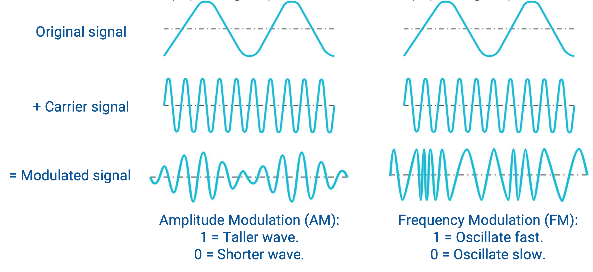

## 噪声与干扰

因为无线是共享介质，我们需要处理 noise 和 interference，它们都可能破坏接收到的信号。即使附近没有其他人在发送数据，noise 也总是存在。（类比一下，就算你周围没人说话，自然环境中也仍然有背景噪声。）这种环境背景噪声称为 noise floor。相比之下，interference 指其他 transmitter 主动发送、并干扰我们信号的信号。

**SINR (Signal to Interference and Noise Ratio)** 是一种衡量 receiver 处无线连接质量的指标。顾名思义，SINR 是信号功率除以干扰和噪声功率之和。

$$\text{SINR} = \frac{P_\text{signal}}{P_\text{interference} + P_\text{noise}}$$

SINR 是一个无量纲量，因为它是两个数的比值。它也可以用 decibel（dB，分贝）表示，这是一种以对数方式衡量比值的方法。在 0 dB 时，比值为 1；SINR 每增加 10 dB，底层比值就变为原来的 10 倍，例如信号强 10 倍，或者噪声/干扰弱 10 倍。

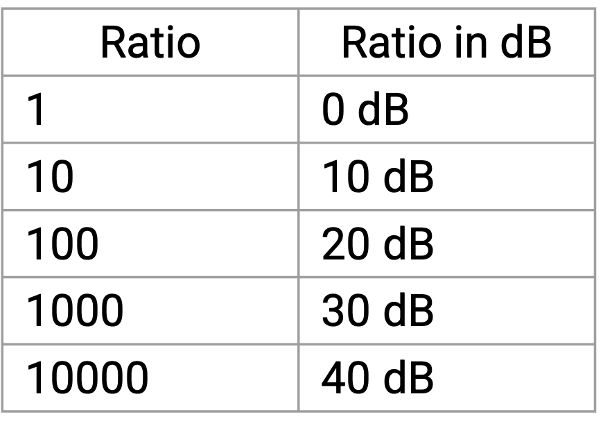

$$\text{SINR}_\text{dB} = 10 \cdot \log_{10}\left(\frac{P_\text{signal}}{P_\text{interference} + P_\text{noise}}\right)$$

这个等式告诉我们什么？它告诉我们，如果噪声更多，就必须用更高功率发送信号。也可以使用 coding gain（可以理解为 error-correcting code），这样即使信号较弱、混在 noise 和 interference 中，我们也能通过足够的冗余让 receiver 重新提取出信号。

Shannon capacity 给出了一个理论上限：在给定 channel 上的 noise 和 interference 情况下，每单位时间最多能沿着这个 channel 发送多少数据。这个公式不仅适用于 wireless link，也适用于其他类型的 link，例如线缆。

$$C = B \cdot \log_2(1 + \text{SINR})$$

在这个等式中，$B$ 是 channel 的 bandwidth。$\text{SINR}$ 是 signal-to-interference-and-noise ratio。$C$ 是沿着这个 channel 每单位时间可发送数据量的理论上限，单位是 bits per second。注意，这里的 bandwidth 指 receiver 能理解的最高频率和最低频率之间的差值。

这个等式告诉我们什么？它告诉我们，bandwidth 增大时，每单位时间可以发送更多数据。它也告诉我们，SINR 增大时，也就是信号更强或者噪声更少时，每单位时间也可以发送更多数据。如果我们需要一个具有特定目标容量的 link，例如 1 Mbps，就可以把 link 的物理特性代入这个等式，看看它是否满足目标容量。

举个例子，考虑传统电话系统。这个系统的 bandwidth 是 3 kHz，也就是说电话能理解 300 Hz 到 3300 Hz 之间的频率。同时，这个系统的 SINR 大约是 20 dB，对应的比值约为 100（0 dB = 1x，10 dB = 10x，20 dB = 100x，30 dB = 1000x，依此类推）。把这些值代入等式，可以得到 $C = 4000 \cdot \log_2(1 + 100) \approx 20000$，这说明电话系统大约能传输 20 kbps（kilobits per second）。

## 差异：衰减

无线信号会随着距离显著变弱。相比之下，有线信号也会随距离略微变弱，但影响小得多。在无线系统中，设计必须考虑信号衰减；而在有线系统中，衰减通常不是关键设计问题。

这在设计无线系统时形成了一个基本 trade-off。我们希望通过让 link 更准确、更快、范围更远来最大化性能；但也希望尽量减少资源使用，例如节省能源（笔记本电量）和少占用频谱（频谱预留可能很昂贵）。遗憾的是，更好的信号通常需要更多功率或更多 frequency bandwidth。

## Free Space Model

一种简单的信号衰减模型是 free-space model（也称为 line-of-sight model）。这个模型假设 transmitter 和 receiver 存在于完全空旷的环境中。信号向所有方向辐射，没有任何障碍物，甚至没有地表。

在这个模型中，信号功率与 transmitter 和 receiver 之间的距离成反比，具体来自 inverse-square law：

$$P_r \propto \frac{P_t}{d^2}$$

在这个等式中，$P_r$ 是 receiver 处的功率，$P_t$ 是 transmitter 处的功率，$d$ 是 transmitter 和 receiver 之间的距离。如果距离翻倍，receiver 处的信号强度会变成 $1/4$。如果距离变为 10 倍，receiver 处的信号强度会变成 $1/100$。

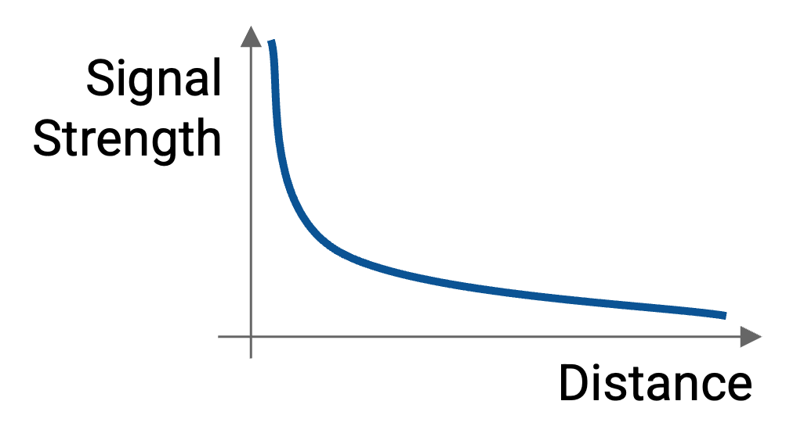

直观地说，inverse-square law 在这里成立，是因为信号向所有方向辐射。在任意时刻，信号已经扩散到 transmitter 周围的一个球面上，并且随着信号继续向外传播，这个球面会变大。半径为 $r$ 的球面面积是 $4\pi r^2$，所以随着信号向外传播，它被摊开到一个按距离平方增长的面积上。例如，当距离翻倍时，得到的球面面积变为 4 倍。因此，信号被摊到 4 倍大的面积上，信号强度就变为 $1/4$。

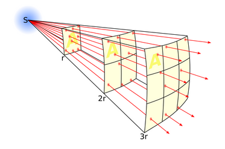

除了距离，我们还需要考虑 transmitter 和 receiver 使用的 antenna。这引出了用于测量跨距离信号强度的 Friis equation：

$$\begin{align*}
    P_r &= P_t \cdot G_t \cdot G_r \cdot \left(\frac{\lambda^2}{4\pi}\right) \left(\frac{1}{4\pi d^2}\right) \\
    &= P_t \cdot G_t \cdot G_r \cdot \left(\frac{\lambda}{4\pi d}\right)^2 \\
\end{align*}$$

在这个等式中，和前面一样，$P_r$ 是 receiver 处的功率，$P_t$ 是 transmitter 处的功率。$G_t$ 是 transmitter 端的 gain，$G_r$ 是 receiver 端的 gain。$\lambda$ 是 wavelength，在这个公式中用来表示 antenna 的面积。$d$ 表示两根 antenna 之间的距离。

这个等式告诉我们什么？要计算 receiver 处的信号强度，我们从 transmitter 处的信号强度 $P_t$ 开始。然后乘以两根 antenna 的 gain：$G_t$ 和 $G_r$。直观地说，更高的 gain 意味着 antenna 更擅长发送或接收信号。

正如前面看到的，距离会按照 inverse-square law 影响信号强度，这解释了 $\frac{1}{4\pi d^2}$ 这一项。

最后，$\frac{\lambda^2}{4\pi}$ 这一项与 receiver antenna 的 aperture（可以理解为面积）有关。直观地说，如果你把光照到一张纸上，光会落到纸上。如果纸更大，就会接住更多光。antenna 的 effective aperture（可以理解为有效面积）可以计算为 $\frac{\lambda^2}{4\pi}$，不过这里不证明。注意，等式中的 $(4\pi)^2$ 实际上来自两个 $4\pi$ 因子，一个来自 inverse-square law，另一个来自 effective aperture equation。

我们还可以把 Friis equation 两边都除以 $P_t$，改写为：

$$\frac{P_r}{P_t} = G_t \cdot G_r \cdot \left(\frac{\lambda}{4\pi d}\right)^2$$

这个等式告诉我们什么？receiver 处的相对信号强度，例如是 transmitter 处信号强度的一半，或者 $1/100$，是 antenna gain、距离平方的倒数，以及 antenna 的 effective aperture（可以理解为面积）的函数。

同一个 Friis equation 还可以进一步改写：对两边取 log，就能用 decibel 表示功率和 gain：

$$P_r^\text{dB} = P_t^\text{dB} + G_t^\text{dB} + G_r^\text{dB} + 20 \log_{10} \left(\frac{\lambda}{4\pi d}\right)$$

free space model 是一个有用的理论模型，可以衡量 receiver 处理想情况下的信号强度。不过在实践中，物理障碍物（例如地表）会让我们无法达到这个理想值。

## Link Budget

如果信号会随距离变弱，我们怎么知道一条 link 是否真的可用？换句话说，我们怎么知道 receiver 是否真的能检测到可理解的信号？

为了衡量一条 link 是否可行，我们可以计算 link budget，它会统计沿着这条 link 的所有 gain 和 loss。

$$P_r^\text{dB} = P_t^\text{dB} + \sum \text{gains} - \sum \text{losses}$$

在这个等式中，$P_r$ 是 receiver 处的信号功率，$P_t$ 是 sender 处的信号功率。所有 gain（例如更强的 antenna gain）都会增加 link budget；所有 loss（例如长距离带来的 path loss）都会消耗 link budget。

把所有 gain 相加、再减去所有 loss，就得到 receiver 处的信号强度。我们可以把这个信号强度与 receiver sensitivity 对比，后者是 receiver 能提取有用信息所需要的信号强度。这个对比告诉我们 link budget。如果总预算为正，这条 link 可行，我们就还有余量；如果总预算为负，这条 link 不可行，就会出问题。

注意，link budget 使用 decibel 计算，而 decibel 是对数尺度。这让我们可以用加减法代替乘除法。例如，1000x 的功率增益表示为增加 30 dB，而功率损失到 1% 表示为减去 20 dB。

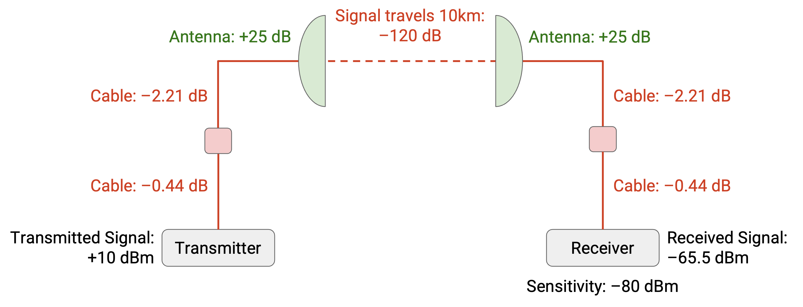

下面是一个计算 link budget 的例子。transmitter 处的信号功率是 10 dB。信号沿着一段线缆、一个避雷器（你不需要知道这是什么）和另一段线缆传播，沿途分别损失 0.44 dB、0.1 dB 和 2.21 dB。然后，信号通过 antenna 广播，获得 25 dB 的增益。接着，信号穿过 10 kilometers 的空间，沿途损失 120 dB。然后，信号被一根 antenna 接收，获得 25 dB 的增益。之后，信号又经过一些线缆，分别损失 0.44 dB、0.1 dB 和 2.21 dB，最后到达 receiver。把所有 gain 相加并减去所有 loss 后，可以计算出 receiver 处的信号强度是 -65.5 dB。

现在，我们可以把这个信号强度与 receiver sensitivity 对比，后者是 -80 dB。这说明 receiver 能接收任何高于 -80 dB 的信号。因为 -65.5 dB 高于 -80 dB，所以 link budget 为正，这条 link 应该可用。

**link margin** 是 receiver 处信号强度与 receiver sensitivity 之间的差值。如果我们收到 30 dB 的信号，而 sensitivity 允许我们检测任何高于 10 dB 的信号，那么 link margin 就是 20 dB。在前面的例子中，link margin 是 14.5 dB。

link margin 反映 link 的质量。如果 link margin 为负，这条 link 就不可用，信号无法被接收。更高的 link margin 是好事，因为它意味着信号更可靠，也更能抵抗 interference 和其他问题。

## 差异：环境会变化

无线环境可能快速变化。设备可能移动。环境本身也可能变化，例如一个物理障碍物移动到了设备之间。其他通信也可能开始干扰我们的通信。

在前面的 free-space model 中，我们把设备之间的距离 $d$ 设为常数。但如果设备在移动呢？此外，我们假设环境中没有障碍物，也没有干扰信号。如果这些因素存在，模型会怎样变化？

在 free-space model 中，假设 antenna 保持不变（相同的 gain 和 aperture），我们会得到一条平滑曲线：随着距离增加，信号强度下降。考虑变化的环境后，距离与信号强度之间的图像会变得抖动得多。

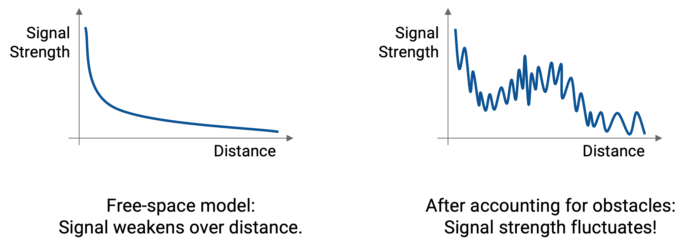

这张图实际上是三张较小图像的和。每一张图展示一种不同的环境特性如何随距离影响信号强度。注意，有些特性会随着距离增加而缓慢变化，而另一些特性会快速、无规律地变化。

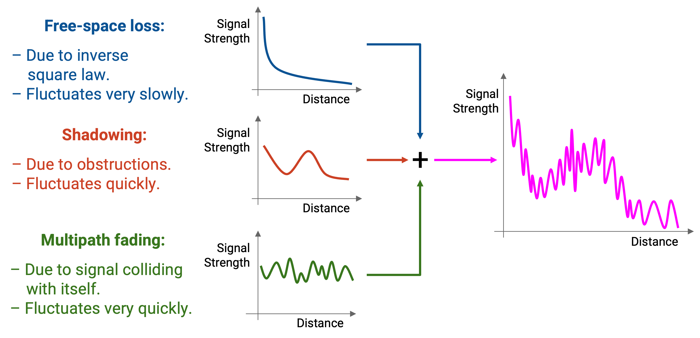

第一种特性是 free-space path loss。我们已经在 free-space model 中见过它：信号强度会随着距离增加，按照 inverse-square loss 缓慢且稳定地下降。

第二种特性是 shadowing。当 transmitter 和 receiver 之间的物理障碍物遮挡信号时，就会发生 shadowing。信号必须通过折射或反射绕过障碍物，最终到达 receiver 的信号会变弱。

取决于障碍物的位置，信号可能随距离增加而变弱，也可能变强。例如，如果我走到一栋楼前面，信号会弱很多；但如果我最终走过这栋楼，信号可能又会变强。

第三种特性是 multipath fading。当波在物理障碍物上反射和折射时，会导致信号的偏移版本到达 receiver。特别是，如果信号沿着不同长度的路径到达 receiver，这些信号可能彼此 out-of-phase，从而产生干扰。

multipath fading 会让信号强度出现非常细粒度的变化。距离只改变一点点，信号强度就可能变强或变弱。

最终，如果想考虑这三种特性如何共同影响不同距离上的信号强度，就必须看三张图的总和。如果 sender 和 receiver 保持静止，信号强度会是这张图上的某个具体点。然而，如果设备在移动，信号强度就会沿着这条曲线移动。此外，如果环境变化、障碍物进入或离开，图本身也会变化。

## 近似 Path Loss

近似 path loss 可能很困难，因为它来自 free-space loss、shadowing 和 multipath fading。在存在障碍物时尤其困难，因为信号会沿多条路径传播，导致 out-of-phase 的信号在 receiver 处互相干扰。

一种相对简单的 path loss 近似模型是 **two-ray model**。在这个模型中，我们假设信号只沿两条路径传播：一条是从 sender 到 receiver 的 line-of-sight 直达路径，另一条是从地面反射到 receiver 的 ground-bounce 路径。记住，这仍然是一个从 transmitter 辐射出去的信号，只是有些波直接到达 receiver，另一些波先从地面反射再到达 receiver。

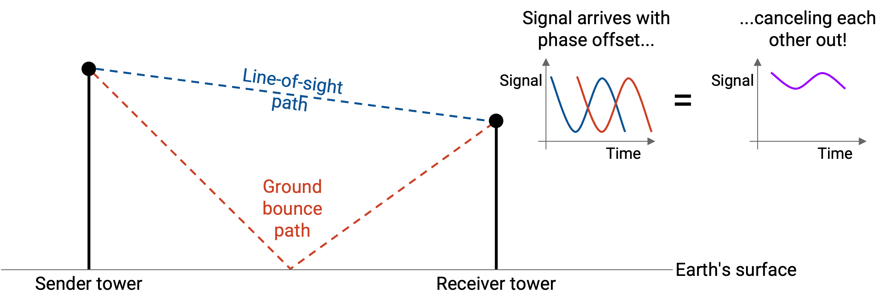

如果 sender 和 receiver 相距足够远，这两条路径上的波会相差 180 度。结果，这两条路径上的波会发生 destructive interference 并互相抵消，显著削弱 receiver 处的信号。这时，信号强度不再与 $1/d^2$ 成正比，而是与 $1/d^4$ 成正比。换句话说，随着距离增加，信号强度下降得更快。

记住，free-space model 假设没有任何障碍物，甚至没有地表，所以我们推导出信号强度与 $1/d^2$ 成正比。在 two-ray model 中，把地表纳入考虑后，信号强度会变成与 $1/d^4$ 成正比。

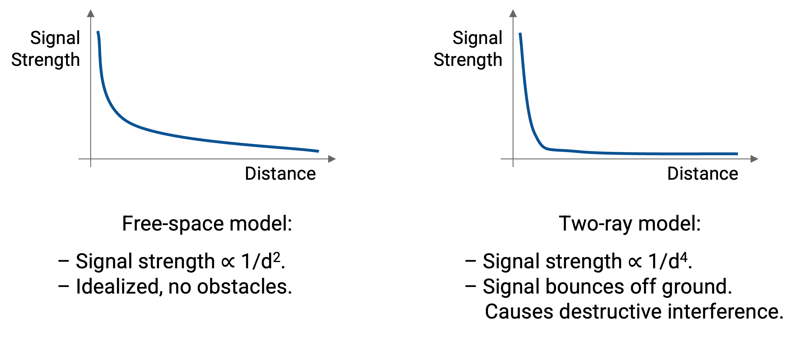

如果除了地表之外还有其他障碍物呢？two-ray model 无法处理这些情况。在更复杂的环境中，可以创建 general ray tracing model，考虑信号被反射、散射和衍射。这些模型需要关于环境的具体信息，例如障碍物在哪里，并且可以用计算机模拟构建。在这些模型中，与无遮挡的 line-of-sight 信号相比，反射后的信号版本通常占主导。

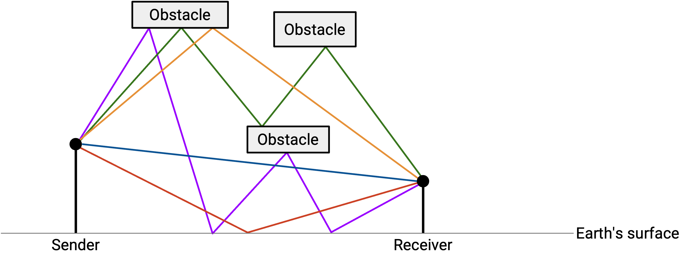

从这些模型出发，可以推导出一个简化的 path loss model，用来关联距离和信号强度：

$$P_r = P_t K d^\gamma$$

在这个等式中，和前面一样，$P_r$ 和 $P_t$ 分别表示 receiver signal power 和 transmitter signal power，$d$ 表示距离。

$K$ 和 $\gamma$ 是根据环境和模型经验确定的常数。例如，如果障碍物的位置很不方便，$K$ 可能很小，导致 receiver signal strength 较弱。

实践中，$\gamma$ 通常在 2 到 8 之间。最好情况下，信号强度与 $1/d^2$ 成正比，类似 free-space model。最坏情况下，信号强度与 $1/d^8$ 成正比，随着距离增加，信号会更快变弱。

## 差异：检测 Collision

有线 collision 往往容易检测。在 point-to-point link 上，collision 可能根本不会发生。我们通常只要感知线缆就能检测 collision。传播延迟可能带来一些问题，但归根到底，线缆上只有一个信号需要我们感知。

相比之下，无线 collision 更难检测，因为 collision 现在具有空间维度。波可能在某个位置发生碰撞，但在另一个位置不发生碰撞。

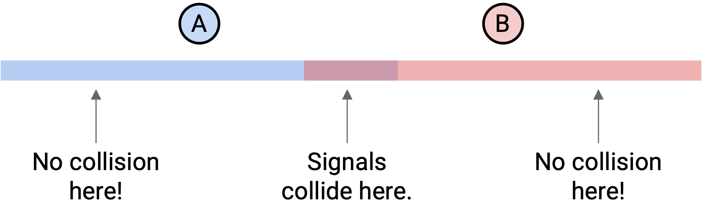

在无线系统中设计 collision detection 和 collision avoidance 要困难得多，但这仍然是必要的，因为多个设备需要在共享介质上传输。回忆一下，multiple access 有很多不同方法，包括固定分配频率，以及协调谁在什么时候发送。哪种方法最好取决于环境。例如，如果你在荒无人烟的地方，可能可以直接允许 collision 发生，然后在发生后再处理。不过本节会关注 CSMA (Carrier Sense Multiple Access) 方法，也就是监听是否有信号，如果别人在说话就不发送。

为了简化，本节忽略障碍物，这意味着信号会向所有方向辐射。我们假设信号在某个距离以内都以完整强度辐射，超过这个距离后就无法检测。此外，在贯穿示例中，我们简化地假设所有设备排成一条线，因此只需要考虑信号向左和向右传播。不过要记住，在真实生活中，信号会向三维空间辐射。

## CSMA 的问题

为了检查是否有其他人在说话，radio 会尝试检测超过某个阈值的能量。如果检测到了，就认为有人正在发送。

如果两对相距较远的设备正在通信，这个策略表现良好。

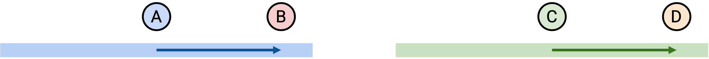

在这个例子中，A 和 B 想通信，C 和 D 也想通信。A 感知不到任何信号，于是开始向 B 发送。注意，A 的信号会向所有方向传播，而不只是朝向 B。稍后，C 感知不到任何信号（因为它在 A 的范围之外），所以 C 可以开始向 D 发送。

如果两对设备彼此都在范围内，这个策略也表现良好。

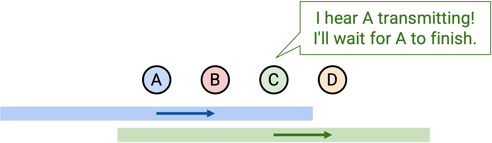

同样，A 和 B 想通信，C 和 D 也想通信。A 感知不到任何信号，于是开始向 B 发送。稍后，C 感知到了一个信号，因为 A 正在说话，而 C 在这个信号范围内。因此，C 会等到 A 结束后，才开始向 D 发送。

有时候，这个策略会带来问题。

假设 A 和 C 都想和 B 通信。A 感知不到任何信号，于是开始向 B 发送。稍后，C 感知不到任何信号，因为它在 A 的范围之外，于是 C 也开始向 B 发送。B 处发生 collision。

这称为 **hidden terminal problem**。在这个例子中，两个 transmitter（A 和 C）彼此不在范围内，所以它们无法感知到对方正在发送。

下面是另一个 CSMA 有问题的情况：

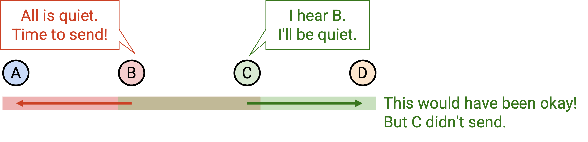

在这个例子中，假设 B 想和 A 通信，C 想和 D 通信。首先，B 感知不到任何信号，于是开始向 A 发送。记住，B 的信号向所有方向传播，也包括传播到 C。现在，C 想和 D 通信，但它感知到了 B 的信号，于是保持安静。

仔细看会发现，B 和 C 实际上可以同时发送。的确，B 和 C 之间的空间里会发生 collision，但 receiver（A 和 D）不会感知到任何 collision。

这称为 **exposed terminal problem**。在这个例子中，两次传输本可以同时发生，但其中一次传输被阻止了，因为 C 错误地检测到 collision。

## 用 MACA 避免 Collision

与其使用 CSMA，**MACA (Multiple Access with Collision Avoidance)** 是一种 multiple access 方法，可以帮助解决 hidden terminal problem。

CSMA 的关键问题是，sender 在 sender 处检测 collision，但真正的问题是 receiver 处的 collision。为了解决这个问题，我们让 receiver 宣告它是否检测到了 collision。

假设 A 想向 B 发送数据。一次成功的数据传输包括 3 个步骤：

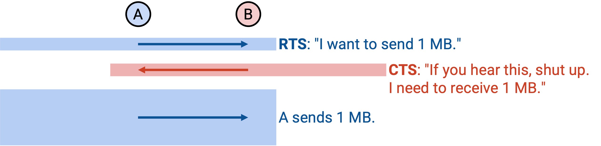

1. A 发送一个带有数据长度的 **Request To Send (RTS)** packet。这相当于 A 在说：「我想向 B 发送 k bits。」

2. B 发送一个带有数据长度的 **Clear To Send (CTS)** packet。这告诉 A 现在可以安全发送，并确认 receiver 处没有 collision。CTS 还会警告 B 范围内的所有人：「我是 B，我将要接收 k bits，所以请在这段时间里不要说话。」

3. A 发送数据，B 接收数据。CTS 的警告确保 receiver 范围内的其他所有人在这段时间保持安静。

这个 protocol 解决了 hidden terminal problem。回忆 hidden terminal problem：A 和 C 都感知到安静并开始发送，导致 B 处发生 collision。使用这个 protocol 时，如果 A 发送 RTS，B 会发送 CTS，警告 B 范围内的所有人（包括 C）保持安静。

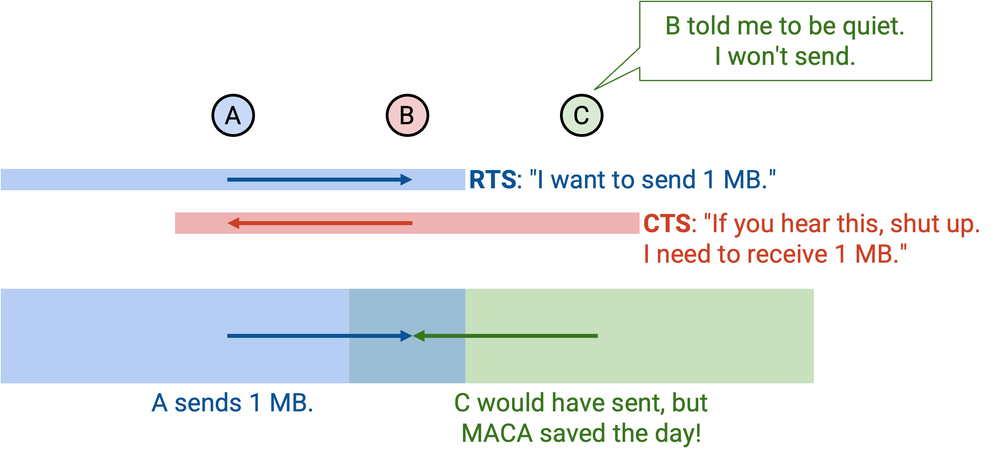

如果你听到 RTS packet，这意味着你在 sender 的范围内。sender 接下来要监听 CTS。因此，你需要保持安静并等待一个 time slot，这段时间足够避免你用自己的数据把 sender 处的 CTS 淹没。换句话说，你需要保持安静，让 sender 能收到 CTS。

RTS 之后，如果你又听到 CTS，就说明你也在 receiver 的范围内，因此在数据传输期间也必须保持安静。如果你没有听到 CTS，就说明你不在 receiver 的范围内，可以自己发送数据。

在某些假设下，这个 protocol 可以解决 exposed terminal problem。回忆 exposed terminal problem：B 向 A 发送，C 向 D 发送。使用 CSMA 时，C 感知到 B 的信号并保持安静，尽管它本可以安全发送。使用这个 protocol 时，如果 B 发送 RTS，C 会推迟一个 time slot（避免干扰 B 收到 CTS）。然后，因为 C 没有听到 CTS，这意味着 C 不在 receiver（A）的范围内，所以 C 可以安全地开始向 D 发送。

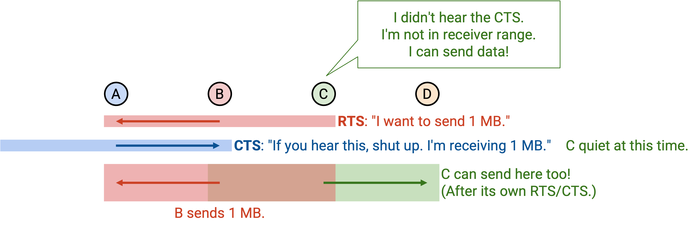

为了让这个机制生效，我们假设 C 必须能听到来自 D 的 CTS。记住，虽然 C 是 sender，但它必须先收到 CTS 才能开始发送。然而，C 实际上也在听 B 的数据，所以它可能无法听到启动发送所需的 CTS。这里的关键问题是：在 CSMA 中，sender 只会发送；但在 MACA 中，sender 在开始发送前还必须接收 CTS，而这个 CTS 在 exposed terminal 场景中可能被淹没。

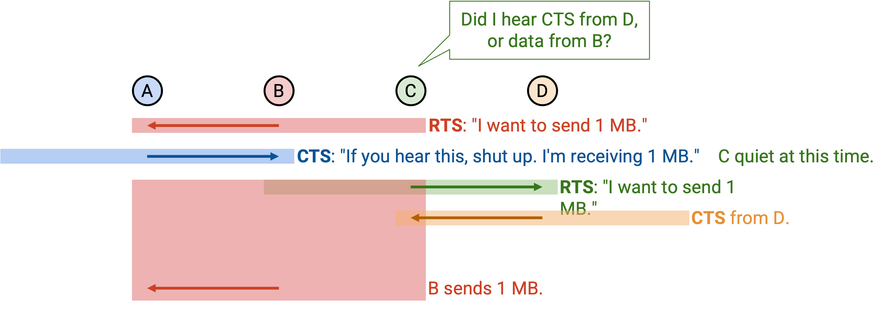

如果我们发送 RTS，但没有听到对应的 CTS，这意味着我们并没有 clear to send。receiver 处发生了 collision，可能是因为 receiver 当前正在接收数据，也可能是 receiver 同时收到了两个请求。发生这种情况时，我们使用 binary exponential backoff（类似 CSMA/CD），等待最多两倍长的时间后再发送另一个 RTS。

在 MACA 中，每个设备维护一个 CW (Contention Window) 值，它告诉我们发生 collision 后应该等待多久再重新请求。如果检测到 collision（没有 CTS），我们会在 0 到 CW 之间随机选择一个数，并等待这么长时间后再重新请求。最小值是 2 个 slot，最大值是 64 个 slot，其中一个 slot 是传输一个 RTS 所需的时间。RTS/CTS 成功后，我们把 contention window 重置回最小值 2。RTS 失败（没有 CTS）后，我们把 contention window 翻倍，并限制它不超过最大值 64。

## MACAW 功能：ACK（用于可靠性）

**MACAW (Multiple Access Collision Avoidance for Wireless)** 在 MACA protocol 之上提供了一些改进。

第一个改进是加入 acknowledgements 来提高可靠性。和之前一样，sender 发送 RTS，receiver 发送 CTS，然后 sender 发送数据。现在，我们在末尾增加一个额外步骤：receiver 发送 ack。

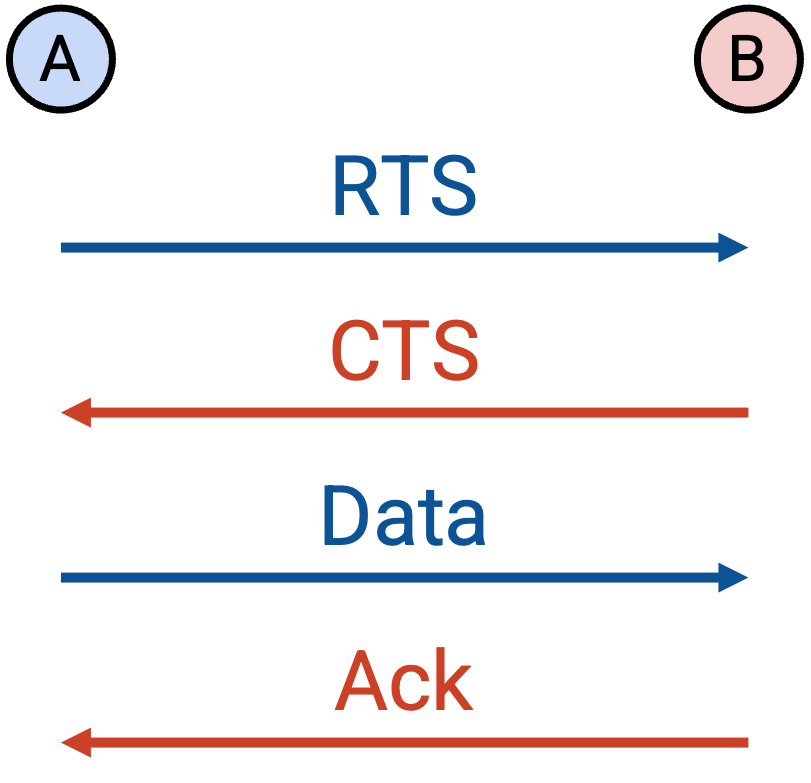

如果数据丢失，就不会有 ack，sender 必须重新尝试，从新的 RTS 开始。如果数据正确发送但 ack 丢失，sender 会用新的 RTS 重试，但 receiver 可以立刻回复 ack，而不是回复 CTS。

为什么要加入 ack？记住，end-to-end principle 说，为了 correctness，可靠性必须由 end host 实现。不过在这个例子中，我们是在网络内部、沿着单条 link 实现可靠性，目的仅仅是提升性能。如果不在 link 上实现可靠性，TCP 仍然会保证 correctness，但丢包会导致 TCP 显著减速（回忆一下，congestion window 会减半）。相比之下，在 link 上实现可靠性，可以让我们更高效地从 packet loss 中恢复。

## MACAW 功能：更好的 Backoff（用于公平性）

当两个发生冲突的 host 都想发送数据时，MACA protocol 是不公平的。特别是，赢家往往会持续获胜，而输家会持续失败。

下面是一个不公平性的例子。假设 A 和 B 的 window 都设置为 2，并且它们同时尝试预留 channel。假设 A 赢了，B 输了。那么 A 的 window 保持为 2，而 B 的 window 翻倍为 4。这意味着 A 很可能更快再次预留 channel，并且很可能再次获胜。这也意味着等 B 再次尝试时，A 已经重新占用了 channel，B 的 window 又翻倍到 8。这个模式会持续下去：A 不断快速重新占用 channel，而 B 不断失败，并等待越来越长的时间后再尝试（然后再次失败）。

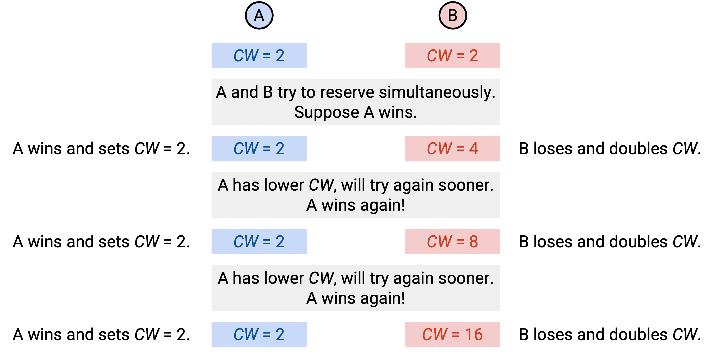

为了解决这个问题，我们不让每个设备拥有自己的 CW，而是让所有人共享同一个 CW。packet header 现在包含 CW 值字段；如果你收到一个 packet，就把 CW 设置为 packet 中的值。由于所有人现在拥有相同的 CW，重试机制就不会偏向某一个设备。每个人都在 0 到 CW 之间随机选择一个值，并等待这么久。（注意：这里略作简化；如果所有设备都在彼此范围内，这个说法成立。）

MACAW 也把 CW 的更新规则改得更温和。和以前一样，最小值是 2，最大值是 64。RTS 失败（没有 CTS）时，我们把 CW 乘以 1.5（而不是翻倍），并同样限制它不超过 64。RTS/CTS/DATA/ACK 成功传输后，我们把 CW 减 1（而不是直接重置到 2）。注意，如果 RTS/CTS 成功但 ACK 失败，CW 不变。这种方法有时称为 Multiplicative Increase, Linear Decrease (MILD)。

## MACAW 功能：DS（用于 Exposed Terminal）

回忆前面的 exposed terminal 示例：B 想和 A 通信。B 发送 RTS，A 发送 CTS，然后 B 开始发送数据。此时，C 没有听到 CTS，这意味着 C 不在 receiver 的范围内，理论上可以安全发送数据。然而，要开始发送，C 必须听到 CTS。这可能无法发生，因为 C 也在听 B 的数据，B 的数据和 D 的 CTS 之间可能发生 collision。

MACAW 的结论是，在 exposed terminal 场景中，B-to-A 和 C-to-D 实际上不能同时发送数据。是的，我们承认失败：事实证明 MACAW 和 CSMA 都没有解决 exposed terminal problem。

这意味着，如果我们在另一个 sender 的范围内，就实际上不能发送数据（即使我们不在另一个 receiver 的范围内）。再说一遍，这是因为我们会听到另一个 sender 的数据，因此听不到自己开始发送所需的 CTS。

为了解决这个问题，我们在数据之前加入一个额外的 Data Sending (DS) packet。这是 sender 对所有人的警告：「我马上要发送 k bits 数据，所以你们在这段时间里需要保持安静。」

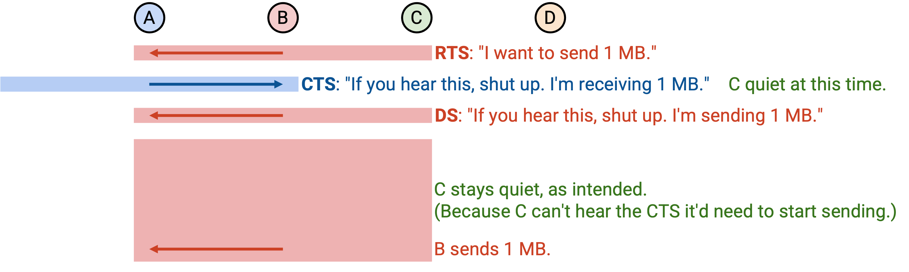

现在 protocol 有 5 个步骤：

1. Sender 发送 RTS，请求发送 k bits 数据。

2. Receiver 发送 CTS，告诉范围内的所有人：保持安静，我正在接收 k bits 数据。

3. Sender 发送 DS，告诉范围内的所有人：保持安静，我正在发送 k bits 数据。（其他人不能发送数据，因为我的数据会淹没你们传输所需接收的 CTS。）

4. Sender 发送数据。

5. Receiver 发送 ack。

注意，RTS 和 DS 不是冗余的。RTS 是一个可能不会获准的请求，例如可能没有 CTS。DS 则确认请求已经获准，并强制 sender 范围内的所有人保持安静。

## MACAW 功能：DS（用于同步）

DS 还有第二个重要用途。我们再次考察 exposed terminal，同时记住 MACAW 已经承认失败，并强制两次传输分开发生。

假设没有 DS packet。那么和之前一样，B 发送 RTS，A 发送 CTS，然后 B 开始发送数据。C 听到了 RTS，并推迟一个 time slot（避免打断 B）。然而，C 没有听到 CTS。此时，C 注定会发送无效的 RTS，并且永远听不到 CTS（因为它被 B 的数据淹没了）。C 会不断重试并发送无效的 RTS request，但它完全不知道 B 什么时候会停止发送数据。

相比之下，B 确切知道自己什么时候会停止发送数据。这让 B 在下一轮 contention 中拥有巨大优势。当 B 完成发送后，它可以立刻发出另一个请求，并且很可能获胜、继续发送数据。另一方面，C 不知道 B 什么时候停止发送，所以只能随机猜测什么时候再发出请求。大概率情况下，C 会猜一个时间，在 B 仍然发送数据时重新请求，于是 C 会失败，请求不会获准（collision）。

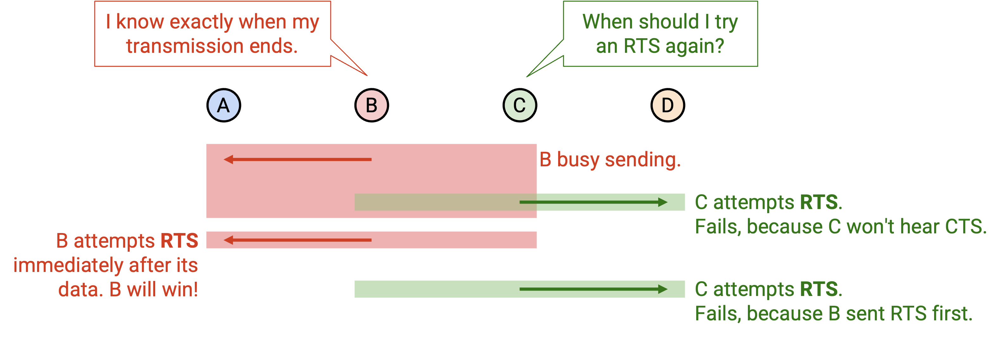

这种缺少同步会导致不公平。如果我赢了，我很可能再次赢，因为我确切知道下一轮 contention 什么时候发生（就是我发送完成的时候）。如果你输了，你很可能再次输，因为你不知道下一轮 contention 什么时候发生（你不知道我什么时候结束）。contention 时间通常只是很短的一段，因为大部分时间都花在发送数据上。我确切知道那段时间，而你不知道，所以我会持续获胜。

DS packet 解决了这个问题，因为它允许 sender 告诉所有人下一轮 contention 何时发生。现在，B 用 DS packet 告诉所有人：我要开始发送 k bits。C 不仅知道不要发送无效的 RTS request，也知道 B 什么时候会完成发送。这让 C 在下一轮 contention 中有更公平的获胜机会。

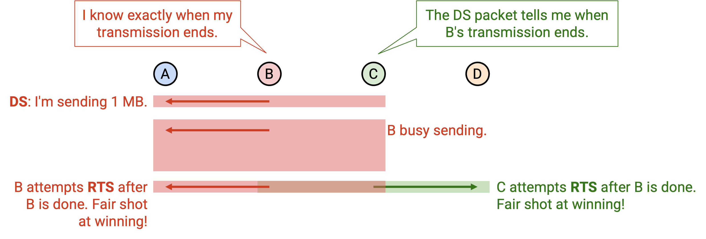

## MACAW 功能：RRTS（用于同步）

还有一种情况下，同步对于保证公平性也很关键。假设 A 想向 B 发送，D 想向 C 发送。

A 向 B 发送（A 发送 RTS，B 发送 CTS，A 发送 DS 并发送数据）。C 听到 CTS，必须在数据发送期间保持安静。现在，D 完全不知道发生了什么，注定倒霉。D 会发送 RTS，但因为 C 正在保持安静，所以 D 听不到 CTS。D 会在随机时间不断重试，并且不断失败，因为它完全不知道 A 什么时候会停止发送数据。

相比之下，A 确切知道自己什么时候会停止发送数据。和之前一样，这让 A 在下一轮 contention 中拥有巨大优势。A 可以立刻重新请求并获胜。另一方面，D 不知道什么时候该重新请求。D 唯一能赢的方式，是非常幸运地在 A 刚发完、还没重新请求之前立刻发送请求。

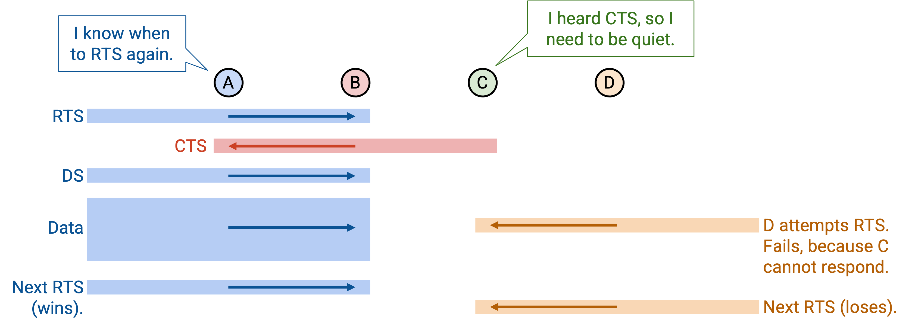

注意，DS packet 在这里帮不上忙，因为两个 sender A 和 D 彼此不在范围内。A 会发送 DS packet 并宣告自己什么时候发送数据，但 D 听不到，所以 D 仍然注定失败。

为了解决这个问题，我们让 receiver 代表 sender 参与 contention。D 不知道什么时候重新请求，但 C 知道，所以让 C 来发起请求。

当 D 发送 RTS 时，C 知道 D 想通信，但 C 必须保持安静直到下一轮 contention。注意，C 知道下一轮 contention 什么时候发生，因为它会听到来自 B 的 ack。当下一轮 contention 发生时，C 发送一个新的 packet，称为 Request-for-RTS (RRTS)。这会立刻提醒 D 下一轮已经开始，并允许 D 立刻发送 RTS。这样，D 在 contention round 中就有更公平的获胜机会。

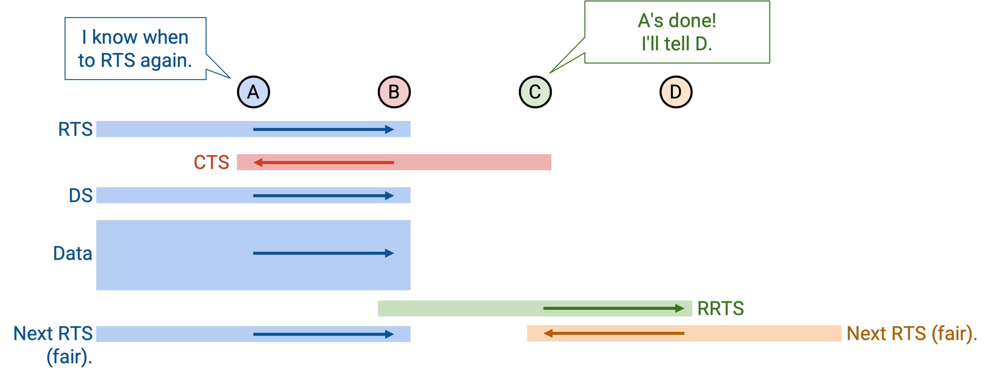

如果你听到 RRTS，这意味着你范围内有人正在尝试请求，因此你应该保持安静 2 个 time slot，让它们完成 RTS/CTS exchange。

在这个例子中，如果 C 发出 RRTS，B 会听到并保持安静 2 个 time slot，这允许 D 发送 RTS、C 发送 CTS。CTS 告诉 B 保持安静，并允许 D-to-C 传输发生。

更一般地说，如果你听到 RTS，但因为别人要求你保持安静而不允许回复，那么你应该发送 RRTS。

DS 和 RRTS 有助于同步，并确保更公平的 contention round，但它们不能解决所有问题。考虑 A 向 B 发送，C 向 D 发送。假设 C 开始向 D 发送。此时，如果 A 发送 RTS，B 听不到它，因为这个 RTS 被 C 的传输淹没了。A 的 RTS 只有在 C 两次传输之间的短暂空隙中才可能到达 B。在这里，A 注定失败，因为它完全不知道 C 什么时候会停止发送，而 C 确切知道自己什么时候发送。注意，RRTS 在这里也救不了我们，因为只有当你听到 RTS 时才会发送 RRTS，但 B 甚至从未听到 RTS。B 永远不知道 A 想通信，所以 B 永远不会代表 A 发送 RRTS request。原始 MACAW 论文没有解决这个问题。
